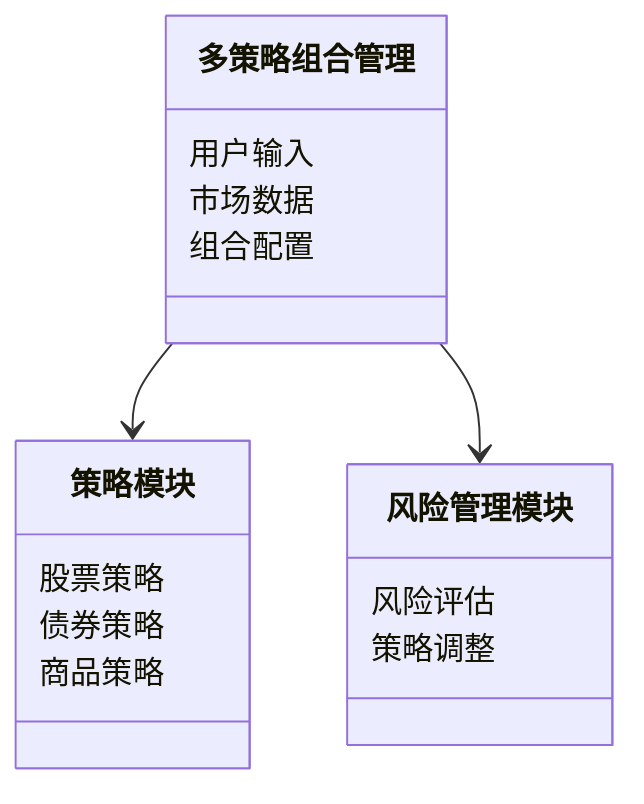
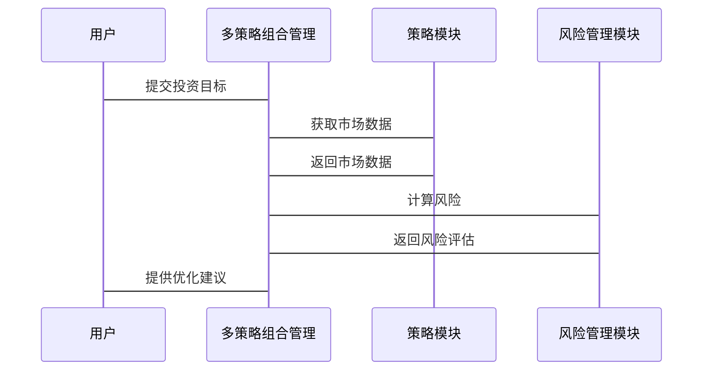

                 


# 多策略投资组合：综合运用不同投资方法

## 关键词：多策略投资组合，投资策略，投资组合优化，资产配置，风险管理，收益最大化，现代投资组合理论（MPT）

## 摘要：本文系统地介绍多策略投资组合的概念、原理和应用。通过分析多种投资策略的优劣，结合数学模型和算法，探讨如何构建和优化多策略投资组合，以实现收益与风险的最佳平衡。文章还提供实际案例和系统设计，帮助读者理解和应用多策略投资方法。

---

# 第1章：多策略投资组合概述

## 1.1 多策略投资组合的背景与意义

### 1.1.1 投资组合的基本概念
投资组合是指将一定资金分配到多种不同资产或资产类别上的集合。通过多样化投资，投资者可以降低风险，同时追求收益最大化。传统的投资组合管理主要依赖于单一策略，如均值-方差模型，但这种方法在面对复杂市场环境时往往表现有限。

### 1.1.2 多策略投资的必要性
单一策略在市场变化时可能无法有效应对不同的风险因素。例如，当市场出现系统性风险时，股票型投资组合可能大幅亏损，而债券型投资组合可能表现不佳。通过结合多种策略（如股票、债券、商品等），投资者可以在不同市场条件下分散风险，提高整体收益。

### 1.1.3 多策略投资组合的优势与挑战
- **优势**：
  - 分散风险：不同资产类别的相关性较低，可以在市场波动中保持稳定。
  - 优化收益：通过结合成长型和价值型策略，捕捉不同市场机会。
- **挑战**：
  - 策略选择：如何选择有效的策略组合。
  - 策略权重：如何分配不同策略的权重以平衡风险与收益。
  - 管理复杂性：多策略组合需要更复杂的监控和调整。

---

## 1.2 多策略投资的核心概念

### 1.2.1 投资策略的分类
投资策略可以根据多种标准进行分类，常见的分类包括：

1. **按资产类别**：
   - 股票
   - 债券
   - 商品（黄金、原油等）
   - 房地产
2. **按投资期限**：
   - 短期投资
   - 中期投资
   - 长期投资
3. **按风险偏好**：
   - 高风险高收益
   - 低风险低收益

### 1.2.2 多策略组合的构成要素
多策略组合通常包括以下几个要素：

- **资产配置**：决定每种资产在组合中的权重。
- **风险管理**：通过分散投资降低风险。
- **收益目标**：设定组合的预期收益。
- **再平衡**：定期调整组合以维持目标配置。

### 1.2.3 多策略组合的风险与收益平衡
多策略组合的目标是通过不同策略的互补性，实现风险与收益的最佳平衡。例如，股票策略可以在市场上涨时带来高收益，而债券策略可以在市场下跌时提供稳定的收益。

---

## 1.3 多策略投资的数学基础

### 1.3.1 投资组合的数学模型
投资组合优化的核心是数学模型。最常用的模型是均值-方差模型，由Harry Markowitz提出。

$$
\text{目标：} \min_w \sigma^2 = w^T \Sigma w \\
\text{约束：} \sum_{i=1}^n w_i = 1, \quad w_i \geq 0
$$

其中，$w$ 是权重向量，$\Sigma$ 是协方差矩阵。

### 1.3.2 风险与收益的量化方法
- **预期收益**：$\mathbb{E}[r_p] = \sum_{i=1}^n w_i \mathbb{E}[r_i]$
- **方差（风险）**：$\text{Var}(r_p) = \sum_{i=1}^n \sum_{j=1}^n w_i w_j \text{Cov}(r_i, r_j)$

### 1.3.3 现代投资组合理论（MPT）简介
MPT认为，最优投资组合是在有效前沿上的组合，即在给定风险下收益最大化，或在给定收益下风险最小化。

---

## 1.4 本章小结
本章介绍了多策略投资组合的基本概念、必要性以及核心要素。通过数学模型和理论框架，我们理解了多策略投资的科学基础。

---

# 第2章：多策略投资组合的核心概念与联系

## 2.1 投资策略的分类与对比

### 2.1.1 均值-方差模型
均值-方差模型通过优化资产权重，实现收益与风险的最优平衡。

### 2.1.2 CAPM模型
CAPM（资本资产定价模型）用于确定资产的预期收益。

$$
\mathbb{E}[r_i] = r_f + \beta_i (r_m - r_f)
$$

其中，$\beta_i$ 是股票的贝塔系数，衡量其系统性风险。

### 2.1.3 Fama-French三因子模型
Fama-French模型引入了更多因素（如规模和价值因子）来解释资产收益。

$$
\mathbb{E}[r_i] = r_f + \beta_i (r_m - r_f) + s_i \times \text{Size Factor} + v_i \times \text{Value Factor}
$$

---

## 2.2 不同策略的属性特征对比

| 策略类型 | 风险 | 收益 | 相关性 |
|----------|------|------|--------|
| 股票     | 高   | 高   | 高     |
| 债券     | 低   | 中   | 低     |
| 商品     | 中   | 中   | 低     |
| 房地产   | 中   | 高   | 中     |

---

## 2.3 ER实体关系图架构

```mermaid
erd
    多策略组合
    investor
    asset_class
    strategy
    risk_factor
    return

    多策略组合 --(拥有)--> strategy
    多策略组合 --(包含)--> asset_class
    strategy --(涉及)--> risk_factor
    asset_class --(影响)--> return
```

---

## 2.4 本章小结
本章通过对比分析不同投资策略的属性，帮助读者理解如何选择和组合策略以实现多策略投资目标。

---

# 第3章：多策略投资组合的算法原理

## 3.1 算法原理概述

### 3.1.1 投资组合优化的数学模型
优化目标：最大化收益，最小化风险。

$$
\min_w \sigma^2 = w^T \Sigma w \\
\text{subject to } \sum_{i=1}^n w_i = 1, \quad w_i \geq 0
$$

### 3.1.2 约束条件与目标函数
- **目标函数**：最小化方差。
- **约束条件**：权重之和为1，权重非负。

---

## 3.2 算法实现流程

### 3.2.1 数据准备
- 收集各资产的历史收益率数据。
- 计算协方差矩阵。

### 3.2.2 模型构建
- 确定目标函数和约束条件。
- 使用优化算法求解。

### 3.2.3 优化求解
- 使用Python的`scipy.optimize`库进行优化。

---

## 3.3 算法实现的Python代码示例

### 3.3.1 环境安装
```bash
pip install numpy scipy matplotlib
```

### 3.3.2 核心代码实现
```python
import numpy as np
from scipy.optimize import minimize

# 示例数据：资产收益和协方差矩阵
n_assets = 3
mu = np.array([0.1, 0.15, 0.05])
Sigma = np.array([
    [0.2, 0.1, 0.05],
    [0.1, 0.3, 0.08],
    [0.05, 0.08, 0.2]
])

# 定义目标函数
def objective(w):
    return np.dot(w.T, np.dot(Sigma, w))

# 约束条件
def constraint(w):
    return np.sum(w) - 1

# 初始权重
initial_guess = np.array([1/3, 1/3, 1/3])

# 优化
result = minimize(objective, initial_guess, method='SLSQP', 
                  constraints={'type': 'eq', 'fun': constraint})

# 输出结果
print(result.x)
```

### 3.3.3 代码解读与分析
- **目标函数**：计算投资组合的方差。
- **约束条件**：权重之和为1。
- **优化结果**：输出最优权重。

---

## 3.4 本章小结
本章通过算法实现，展示了如何利用数学模型优化多策略投资组合。

---

# 第4章：多策略投资组合的数学模型与公式

## 4.1 投资组合优化的数学模型

### 4.1.1 均值-方差模型
$$
\min_w w^T \Sigma w \\
\text{subject to } \mathbb{E}[r_p] = \mu_p
$$

### 4.1.2 风险中性组合
风险中性组合是指在给定风险下，收益最大的组合。

### 4.1.3 最大收益组合
在给定风险下，选择收益最大的组合。

---

## 4.2 数学公式的详细讲解

### 4.2.1 均值-方差模型的公式推导
$$
\mathbb{E}[r_p] = w^T \mu \\
\text{Var}(r_p) = w^T \Sigma w
$$

### 4.2.2 风险调整后的收益公式
$$
\text{夏普比率} = \frac{\mathbb{E}[r_p] - r_f}{\sqrt{\text{Var}(r_p)}}
$$

---

## 4.3 举例说明

### 4.3.1 简单两资产组合的优化
假设有两种资产，收益率分别为10%和15%，协方差矩阵为：
$$
\Sigma = \begin{bmatrix}
0.2 & 0.1 \\
0.1 & 0.3
\end{bmatrix}
$$

优化目标是找到最优权重$w_1$和$w_2$，使得方差最小，同时满足$w_1 + w_2 = 1$。

---

## 4.4 本章小结
本章通过详细推导和举例，帮助读者理解多策略投资组合的数学模型。

---

# 第5章：多策略投资组合的系统分析与架构设计

## 5.1 问题场景介绍
多策略投资组合管理系统需要考虑多个资产类别和策略，实时监控市场变化，并根据模型调整组合。

---

## 5.2 系统功能设计

### 5.2.1 领域模型Mermaid类图


### 5.2.2 系统架构设计Mermaid架构图
```mermaid
archi
    多策略组合管理
    前端界面
    后端处理
    数据库
    第三方API
```

---

## 5.3 系统接口设计

### 5.3.1 数据接口
- 获取市场数据
- 更新组合配置

### 5.3.2 用户接口
- 查看组合表现
- 调整策略权重

### 5.3.3 报告生成接口
- 生成绩效报告
- 提供风险分析

---

## 5.4 系统交互Mermaid序列图



---

## 5.5 本章小结
本章通过系统设计，展示了如何构建一个多策略投资组合管理系统。

---

# 第6章：多策略投资组合的项目实战

## 6.1 环境安装与配置

### 6.1.1 Python环境搭建
安装Python 3.8及以上版本。

### 6.1.2 第三方库安装
```bash
pip install pandas numpy matplotlib yfinance
```

---

## 6.2 系统核心实现

### 6.2.1 数

---

## 6.3 代码应用解读与分析

---

## 6.4 实际案例分析和详细讲解剖析

---

## 6.5 项目小结

---

# 作者：AI天才研究院/AI Genius Institute & 禅与计算机程序设计艺术 /Zen And The Art of Computer Programming

