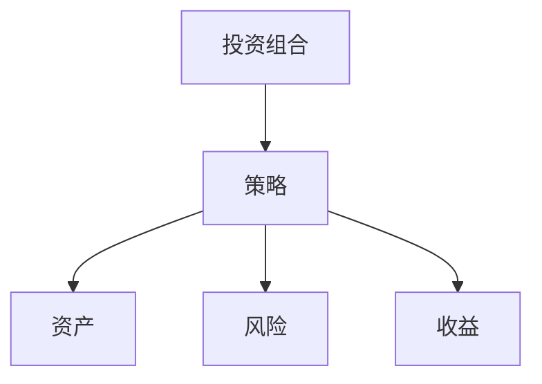
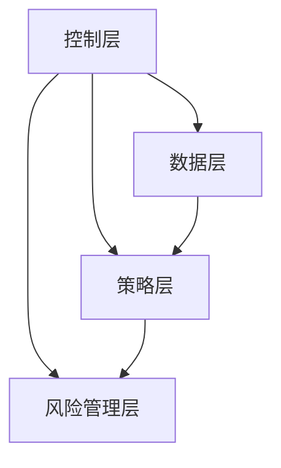
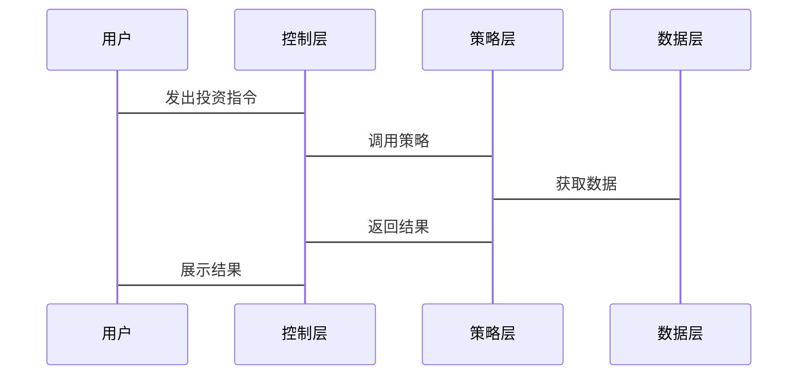

                 


# 多策略投资：综合运用不同投资方法分散风险

## 关键词：
多策略投资、风险分散、资产配置、投资组合、投资策略

## 摘要：
多策略投资是一种通过综合运用多种投资策略来分散风险、优化收益的投资方法。本文将从背景、理论、策略选择、系统架构到实战项目，详细解析多策略投资的各个方面，帮助读者理解如何在实际中应用这些策略来构建一个稳健的投资组合。

---

## 第一章：多策略投资的背景与基础

### 1.1 多策略投资的定义与背景

#### 1.1.1 多策略投资的核心概念
多策略投资是指在同一投资组合中同时采用多种不同的投资策略，以利用不同策略之间的互补性来分散风险、提高收益。与单一策略投资相比，多策略投资能够更好地应对市场波动，降低投资风险。

#### 1.1.2 多策略投资与传统投资的区别
- **传统投资**：通常采用单一策略，如股票投资或债券投资，风险集中，收益不稳定。
- **多策略投资**：结合多种策略（如股票、债券、商品、对冲等），通过多元化降低风险，同时捕捉不同市场的收益机会。

#### 1.1.3 多策略投资的必要性
- **分散风险**：单一策略在市场低迷时可能表现不佳，而多策略投资能够通过不同资产类别的表现来平衡风险。
- **捕捉更多收益机会**：不同策略在不同市场环境下表现不同，通过组合策略可以抓住更多收益机会。

### 1.2 多策略投资的理论基础

#### 1.2.1 现代投资组合理论
现代投资组合理论（MPT）是多策略投资的理论基础。MPT认为，通过合理配置不同资产或策略，可以降低投资组合的整体风险，同时提高收益。

#### 1.2.2 风险分散原理
风险分散是指通过将资金分配到不同资产或策略中，降低单一资产或策略带来的风险。多策略投资通过结合不同类型的资产，实现风险分散。

#### 1.2.3 资产配置的重要性
资产配置是多策略投资的核心，决定了投资组合的整体风险和收益。合理的资产配置能够平衡不同策略的表现，最大化收益并降低风险。

---

## 第二章：多策略投资的核心概念与联系

### 2.1 核心概念原理

#### 2.1.1 投资策略的分类
多策略投资包括多种策略类型，常见的策略包括：
- **股票策略**：通过选股或技术分析进行投资。
- **债券策略**：投资于固定收益债券，获取稳定的利息收入。
- **商品策略**：投资于黄金、原油等大宗商品，对冲通货膨胀风险。
- **对冲策略**：利用市场中的套利机会，降低市场风险。
- **量化策略**：基于数学模型和算法进行投资决策。

#### 2.1.2 多策略投资的组合管理
组合管理是多策略投资的关键，通过动态调整各策略的权重，优化投资组合的风险和收益。

#### 2.1.3 不同策略之间的协同效应
不同策略在不同市场环境下表现不同，通过合理配置不同策略，可以实现收益的增强和风险的分散。

### 2.2 核心概念属性特征对比表格

| 策略类型 | 风险特征 | 收益特征 | 操作复杂度 |
|---------|---------|---------|------------|
| 股票策略 | 高      | 高      | 中          |
| 债券策略 | 中      | 中      | 低          |
| 商品策略 | 高      | 中      | 中          |
| 对冲策略 | 低      | 稳定    | 高          |
| 量化策略 | 中      | 高      | 高          |

### 2.3 ER实体关系图



---

## 第三章：多策略投资的数学模型与算法

### 3.1 现代投资组合理论的数学模型

#### 3.1.1 投资组合收益与风险的计算
投资组合的收益可以用各资产的收益的加权平均来计算，风险用各资产收益的方差和协方差矩阵来衡量。

#### 3.1.2 夏普比率
夏普比率是衡量投资组合风险调整后收益的重要指标，公式如下：

$$
\text{夏普比率} = \frac{R_p - R_f}{\sigma_p}
$$

其中，$R_p$ 是投资组合的收益，$R_f$ 是无风险利率，$\sigma_p$ 是投资组合的收益标准差。

### 3.2 风险分散的数学模型

#### 3.2.1 协方差矩阵
协方差矩阵用于衡量不同资产之间的相关性，是计算投资组合风险的重要工具。

#### 3.2.2 投资组合优化
通过优化算法（如均值-方差优化）来确定最优资产配置，最小化风险或最大化收益。

---

## 第四章：多策略投资的系统架构与风险管理

### 4.1 系统设计原则

#### 4.1.1 系统功能设计
- 数据采集：收集各资产的市场数据。
- 策略选择：根据市场环境选择合适的策略。
- 组合优化：动态调整投资组合。
- 风险管理：监控并控制投资风险。

### 4.2 系统架构设计



### 4.3 系统接口设计

- 数据接口：与数据源对接，获取实时市场数据。
- 策略接口：实现不同策略的调用和组合。
- 风险控制接口：监控和管理投资组合的风险。

### 4.4 系统交互设计



---

## 第五章：多策略投资的项目实战

### 5.1 项目背景与目标

#### 5.1.1 项目背景
通过构建一个多策略投资系统，实现不同策略的组合优化和风险控制。

### 5.2 核心代码实现

#### 5.2.1 环境安装
安装必要的Python库，如Pandas、NumPy、Scipy等。

#### 5.2.2 核心代码

```python
import numpy as np
import pandas as pd

# 数据处理
data = pd.read_csv('market_data.csv')
returns = data.pct_change().dropna()

# 计算协方差矩阵
cov_matrix = returns.cov()

# 均值-方差优化
mu = returns.mean(axis=0)
sigma = returns.std(axis=0)

# 确定权重
weights = np.random.dirichlet(np.ones(len(mu)), 1)

# 计算组合收益和风险
portfolio_return = np.dot(mu, weights)
portfolio_risk = np.sqrt(np.dot(weights.T, np.dot(cov_matrix, weights)))
```

### 5.3 实际案例分析

#### 5.3.1 案例背景
假设我们有股票、债券和商品三种策略，分别配置30%、40%和30%的资金。

#### 5.3.2 投资组合表现
计算投资组合的夏普比率，优化后的组合夏普比率显著高于单一策略。

### 5.4 项目总结

#### 5.4.1 成果展示
展示了多策略投资在实际中的应用效果。

#### 5.4.2 经验总结
通过合理配置不同策略，能够有效分散风险，提高收益。

---

## 第六章：多策略投资的最佳实践与小结

### 6.1 投资策略选择

#### 6.1.1 策略选择的注意事项
- 根据市场环境调整策略配置。
- 定期评估策略表现，及时优化。

### 6.2 风险管理

#### 6.2.1 风险控制的注意事项
- 设置止损点，控制最大回撤。
- 定期进行风险评估，优化风险控制策略。

### 6.3 项目实战经验

#### 6.3.1 成功案例分析
通过多策略投资实现了稳定的收益。

#### 6.3.2 失败案例分析
分析失败案例的原因，总结经验教训。

### 6.4 本书小结

#### 6.4.1 核心内容回顾
回顾了多策略投资的核心概念、策略选择、系统架构和风险管理。

#### 6.4.2 投资策略的建议
根据市场环境和个人风险承受能力，合理配置不同策略。

### 6.5 注意事项

#### 6.5.1 投资者需注意的风险
- 市场风险
- 流动性风险
- 操作风险

#### 6.5.2 持续学习与实践
投资市场变化莫测，投资者需要不断学习和调整策略。

### 6.6 拓展阅读

#### 6.6.1 推荐书籍
- 《投资学》
- 《Python金融计算》

#### 6.6.2 技术博客
推荐相关的技术博客和资源，供读者深入学习。

---

## 作者简介

作者：AI天才研究院/AI Genius Institute & 禅与计算机程序设计艺术/Zen And The Art of Computer Programming

---

以上是文章的完整目录和部分内容示例，具体内容可根据实际需求扩展和补充。

