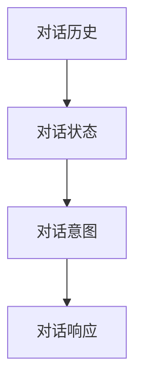
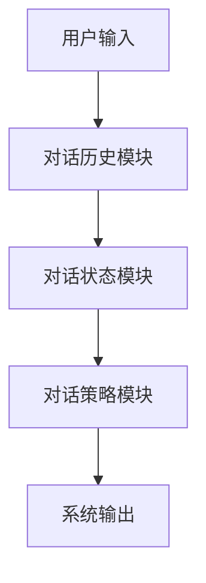

                 


# 多轮对话AI Agent：提升LLM的长期交互能力

## 关键词：多轮对话，AI Agent，LLM，长期交互，自然语言处理，记忆机制，对话状态管理

## 摘要：本文详细探讨了多轮对话AI Agent的构建与优化，分析了其在提升大语言模型长期交互能力中的作用，通过算法原理、系统架构设计和项目实战，展示了如何实现高效的多轮对话系统。

---

## 第一部分：多轮对话AI Agent的背景与概念

### 第1章：多轮对话的背景与问题分析

#### 1.1 多轮对话的背景
- **1.1.1 当前AI对话系统的挑战**  
  当前的对话系统在处理复杂任务时，常常因缺乏上下文记忆和持续对话能力而受限。
  
- **1.1.2 多轮对话的重要性**  
  多轮对话能够提升用户体验，使AI更自然地进行交互，适用于客服、教育等领域。

- **1.1.3 多轮对话的定义与特点**  
  多轮对话是指在多个轮次中，系统与用户进行持续交互的过程，具有连续性、依赖性和动态性。

#### 1.2 问题背景与描述
- **1.2.1 单轮对话的局限性**  
  单轮对话无法处理复杂问题，无法保持对话的连贯性。

- **1.2.2 多轮对话的优势**  
  多轮对话能够保持上下文，提供更智能的服务，提升用户体验。

- **1.2.3 问题的边界与外延**  
  多轮对话涉及自然语言处理、机器学习等多个领域，应用广泛。

#### 1.3 问题解决与核心概念
- **1.3.1 多轮对话AI Agent的目标**  
  实现高效、智能的多轮对话，提升交互能力。

- **1.3.2 核心概念的结构与组成**  
  包括记忆机制、对话状态管理等核心组件。

- **1.3.3 多轮对话的关键要素**  
  包括上下文记忆、对话策略等。

---

## 第二部分：多轮对话AI Agent的核心概念与联系

### 第2章：多轮对话AI Agent的核心原理

#### 2.1 多轮对话AI Agent的概念原理
- **2.1.1 对话记忆机制**  
  通过记忆网络或注意力机制记录对话历史。

- **2.1.2 对话状态管理**  
  使用RNN或记忆网络维护当前对话状态。

- **2.1.3 对话策略制定**  
  基于对话状态生成合适的回复。

#### 2.2 核心概念的属性对比
- **2.2.1 对比表格展示**  
  | 概念 | 描述 |
  |------|------|
  | 记忆机制 | 记录对话历史 |
  | 对话状态 | 维护当前状态 |

#### 2.3 实体关系图


---

## 第三部分：算法原理与数学模型

### 第3章：多轮对话AI Agent的算法原理

#### 3.1 记忆机制算法
- **3.1.1 基于Transformer的注意力机制**  
  使用注意力机制关注重要信息，公式如下：
  $$
  \text{Attention}(Q, K, V) = \text{softmax}\left(\frac{QK^T}{\sqrt{d_k}}\right)V
  $$

- **3.1.2 记忆网络模型**  
  记忆网络通过外部存储器记录信息，公式如下：
  $$
  s_t = \sigma(W_s e_t + U_m m_{t-1})
  $$

- **3.1.3 梅尔卡多记忆网络**  
  结合记忆单元的读写操作，公式如下：
  $$
  m_t = m_{t-1} + \sum_{i=1}^n w_i^{(t)} e_i
  $$

#### 3.2 对话状态管理算法
- **3.2.1 基于RNN的序列模型**  
  使用循环神经网络处理序列数据，公式如下：
  $$
  s_t = \sigma(W s_{t-1} + U x_t)
  $$

- **3.2.2 基于记忆网络的状态更新**  
  利用记忆网络更新对话状态，公式如下：
  $$
  s_t = \sigma(W s_{t-1} + U m_t)
  $$

- **3.2.3 基于强化学习的状态管理**  
  使用强化学习优化对话策略，公式如下：
  $$
  R = \sum_{t} r_t
  $$

---

## 第四部分：系统分析与架构设计

### 第4章：多轮对话AI Agent的系统设计

#### 4.1 系统功能设计
- 对话历史记录
- 对话状态管理
- 对话策略执行

#### 4.2 系统架构设计


#### 4.3 接口设计与交互流程
- 用户输入处理
- 对话历史存储
- 对话状态更新
- 对话策略执行

#### 4.4 实际案例分析
- 案例1：客服咨询
- 案例2：教育辅导

---

## 第五部分：项目实战

### 第5章：多轮对话AI Agent的实现

#### 5.1 环境安装
- Python 3.8+
- PyTorch 1.9+
- Transformers库

#### 5.2 核心代码实现
```python
import torch
from transformers import AutoTokenizer, AutoModelForSeq2SeqLM

class DialogAgent:
    def __init__(self, model_name):
        self.tokenizer = AutoTokenizer.from_pretrained(model_name)
        self.model = AutoModelForSeq2SeqLM.from_pretrained(model_name)
        
    def respond(self, input_text, history):
        # 处理对话历史
        history_str = " ".join(["{}:{}".format(u, r) for u, r in history])
        input_str = f"{history_str} {input_text}"
        inputs = self.tokenizer.encode(input_str, return_tensors='pt', max_length=512, truncation=True)
        outputs = self.model.generate(inputs, max_length=100, do_sample=True)
        response = self.tokenizer.decode(outputs[0], skip_special_tokens=True)
        return response
```

#### 5.3 案例分析与解读
- 实际案例：用户咨询产品信息
- 代码实现：调用预训练模型生成回复

#### 5.4 项目小结
- 项目总结
- 实现细节
- 可优化点

---

## 第六部分：总结与展望

### 第6章：总结与最佳实践

#### 6.1 总结
- 多轮对话AI Agent的重要性
- 关键技术的总结

#### 6.2 最佳实践
- 系统设计建议
- 开发注意事项
- 拓展阅读推荐

#### 6.3 未来展望
- 技术发展趋势
- 新的研究方向

---

## 作者：AI天才研究院 & 禅与计算机程序设计艺术

---

本文通过系统性地分析多轮对话AI Agent的构建与优化，详细探讨了其在提升大语言模型长期交互能力中的关键作用。通过算法原理、系统架构设计和项目实战，为读者提供了一套完整的解决方案，帮助他们在实际应用中提升对话系统的智能化水平。

