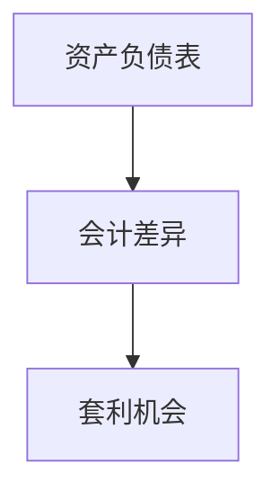
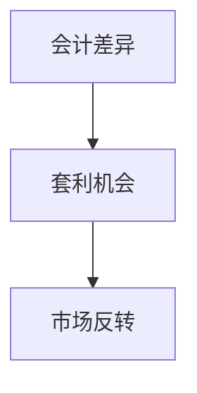
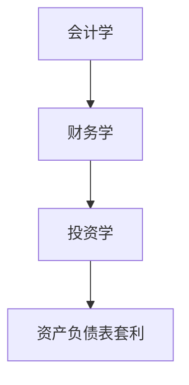
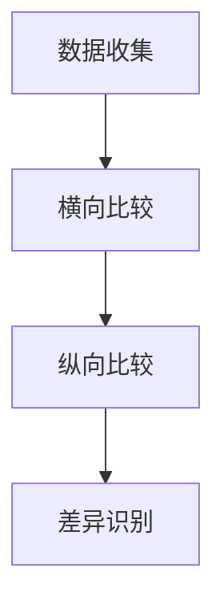
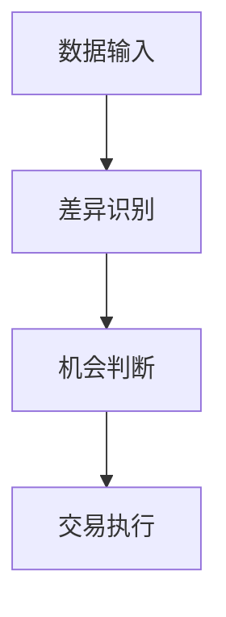
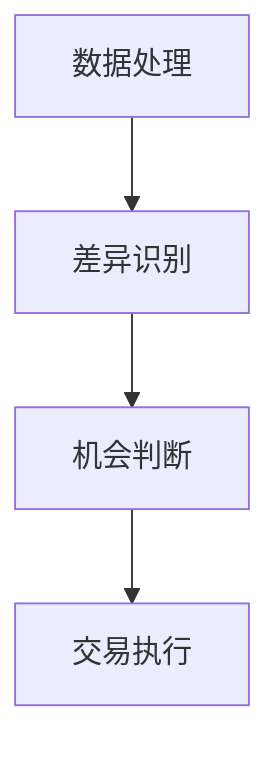
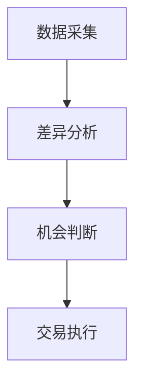
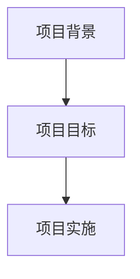
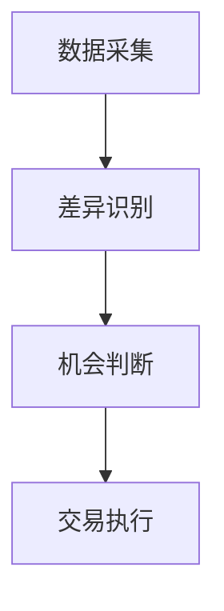
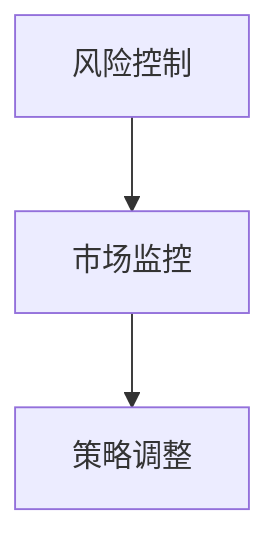

                 

# 大卫·德雷曼的资产负债表套利：利用会计差异创造价值

---

## 关键词：
- 资产负债表套利
- 会计差异
- 大卫·德雷曼
- 财务分析
- 投资策略

---

## 摘要：
大卫·德雷曼的资产负债表套利是一种通过识别和利用会计差异来创造投资价值的策略。本文从理论基础、算法原理、系统架构、项目实战等多角度详细解析了资产负债表套利的核心思想和实际应用。文章首先介绍了资产负债表套利的背景与概念，分析了大卫·德雷曼的套利方法及其在现代投资中的应用。随后，详细探讨了会计差异的识别与分析，以及如何通过数学模型和算法实现套利机会的捕捉。最后，结合实际案例，系统性地展示了资产负债表套利的项目实施过程和最佳实践，为投资者提供了深刻的指导和启示。

---

## 第1章: 资产负债表套利的背景与概念

### 1.1 资产负债表套利的背景
资产负债表是企业财务健康状况的核心体现，而会计差异则是企业在财务报表中常见的调整项。大卫·德雷曼通过深入研究资产负债表中的会计差异，发现了套利机会，从而实现了超额收益。

#### 图1-1: 资产负债表套利的背景示意图

### 1.2 大卫·德雷曼的套利方法
大卫·德雷曼通过横向和纵向比较企业财务报表中的会计数据，识别出会计差异，进而发现套利机会。这种方法的核心在于利用市场对会计信息的非理性定价。

#### 表1-1: 会计差异的分类
| 类别         | 描述                       |
|--------------|----------------------------|
| 横向差异     | 同行业公司间的会计差异     |
| 纵向差异     | 同一公司不同期间的会计差异 |

### 1.3 会计差异与套利机会
会计差异的存在使得某些股票的市场价格与其内在价值出现偏差，套利者通过识别这些差异，能够在市场反转时获利。

#### 图1-2: 会计差异与套利机会的关系

---

## 第2章: 资产负债表套利的核心概念与原理

### 2.1 资产负债表套利的理论基础
资产负债表套利的理论基础主要包括会计学、财务学和投资学的基本原理。通过分析企业资产负债表中的各项数据，套利者能够识别出市场定价错误的机会。

#### 图2-1: 资产负债表套利的理论框架

### 2.2 会计差异的识别与分析
会计差异的识别需要结合企业的财务报表和行业标准进行横向和纵向比较。通过比较分析，套利者能够发现市场定价中的不合理之处。

#### 图2-2: 会计差异的识别流程

### 2.3 资产负债表套利的数学模型
资产负债表套利的数学模型基于会计差异的量化分析，通过公式推导，套利者能够计算出市场定价的偏差程度。

#### 表2-1: 套利模型的数学公式
$$ \text{套利价值} = \text{内在价值} - \text{市场价格} $$

---

## 第3章: 资产负债表套利的算法原理

### 3.1 算法框架
资产负债表套利的算法框架包括数据输入、差异识别、套利机会判断和交易执行四个步骤。

#### 图3-1: 算法流程图

### 3.2 数学模型
套利机会的判断基于数学模型的计算，通过公式推导，套利者能够量化市场定价的偏差。

#### 表3-1: 套利机会的数学公式
$$ \text{套利潜力} = \frac{\text{会计差异}}{\text{市场价格}} $$

### 3.3 算法实现
套利算法的实现需要结合编程语言和数据处理工具，通过代码实现差异识别和机会判断。

#### 图3-2: 算法实现流程

---

## 第4章: 资产负债表套利的系统架构与设计

### 4.1 系统架构
资产负债表套利的系统架构包括数据采集模块、差异分析模块、套利机会判断模块和交易执行模块。

#### 图4-1: 系统架构图

### 4.2 系统功能设计
系统功能设计需要考虑数据采集、差异分析、机会判断和交易执行四个模块的功能实现。

#### 图4-2: 系统功能图

### 4.3 系统接口设计
系统接口设计需要考虑模块之间的数据交互和功能调用。

#### 图4-3: 系统接口图

---

## 第5章: 资产负债表套利的项目实战

### 5.1 项目背景与目标
项目背景是通过实际案例分析，验证资产负债表套利的可行性。项目目标是识别套利机会并实现超额收益。

#### 图5-1: 项目背景示意图

### 5.2 项目实施过程
项目实施过程包括数据采集、差异识别、机会判断和交易执行四个步骤。

#### 图5-2: 项目实施流程图

### 5.3 项目成果与分析
项目成果包括套利机会的识别和超额收益的实现。通过案例分析，验证了资产负债表套利的可行性。

#### 表5-1: 项目成果
| 成果         | 描述                       |
|--------------|----------------------------|
| 套利机会识别 | 成功识别出市场定价错误的机会 |
| 超额收益实现 | 实现了超额收益               |

---

## 第6章: 资产负债表套利的最佳实践与注意事项

### 6.1 最佳实践
套利者在实际操作中需要注意风险控制和市场变化，及时调整套利策略。

#### 图6-1: 最佳实践示意图

### 6.2 注意事项
套利者需要注意法律风险和市场波动，避免因操作不当而造成损失。

#### 表6-1: 注意事项
| 事项         | 描述                       |
|--------------|----------------------------|
| 法律风险      | 遵守相关法律法规             |
| 市场波动      | 注意市场波动对套利的影响     |

---

## 作者：AI天才研究院/AI Genius Institute & 禅与计算机程序设计艺术 /Zen And The Art of Computer Programming

---

通过以上目录和内容的详细解析，您可以根据需要进一步扩展和补充各个部分的具体内容。

