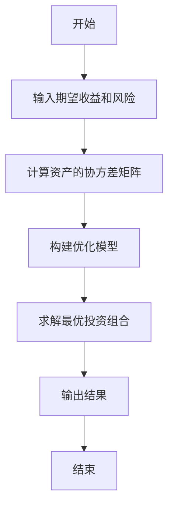
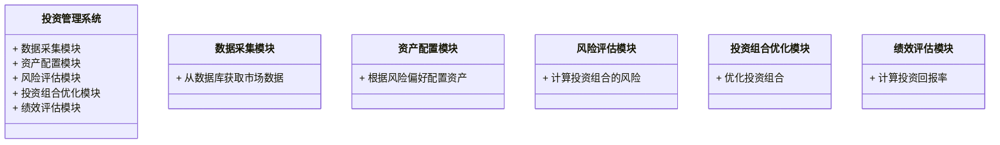
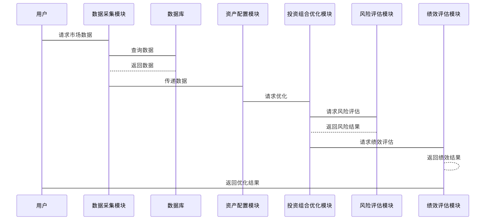

                 


# 大卫·斯文森的耐心资本：机构投资者的长期价值主义

## 关键词：大卫·斯文森，耐心资本，长期价值投资，机构投资者，投资策略，投资组合优化

## 摘要：  
大卫·斯文森是耶鲁大学捐赠基金的传奇投资经理，他提出的“耐心资本”理念深刻影响了机构投资者的长期价值投资策略。本文将从耐心资本的核心理念、数学模型、系统架构、项目实战等多个维度，详细分析这一投资策略的理论基础和实际应用。通过对比传统投资策略，结合现代投资组合理论和算法优化，探讨耐心资本在机构投资中的独特优势和实践价值。

---

# 第一部分：长期价值投资的背景与理论基础

## 第1章：长期价值投资的起源与发展

### 1.1 投资理论的演变  
- **1.1.1 从格雷厄姆到巴菲特的价值投资理念**  
  - 格雷厄姆的“烟蒂投资”：寻找被市场低估的股票，以低于内在价值的价格买入。  
  - 巴菲特的“护城河”理论：长期投资具有强大竞争优势的企业。  
  - 对比表格：格雷厄姆与巴菲特投资理念的异同。  

- **1.1.2 现代投资组合理论的兴起**  
  - 马科维茨的均值-方差理论：通过优化投资组合降低风险。  
  - 资本资产定价模型（CAPM）的提出。  
  - 投资组合理论对机构投资者的影响。  

- **1.1.3 长期价值投资的定义与特点**  
  - 长期价值投资的定义：以企业的内在价值为导向，长期持有优质资产。  
  - 长期价值投资的特点：注重基本面分析、分散投资、避免短期波动。  

### 1.2 大卫·斯文森与耶鲁大学捐赠基金的传奇  
- **1.2.1 大卫·斯文森的生平简介**  
  - 斯文森的职业生涯：从耶鲁大学到成为首席投资官。  
  - 斯文森的投资哲学：追求长期、稳定的投资回报。  

- **1.2.2 耶鲁大学捐赠基金的投资策略**  
  - 耐心资本理念的形成：斯文森如何管理耶鲁大学的捐赠基金。  
  - 投资组合的多元化：股票、债券、房地产、私募股权等多种资产配置。  

- **1.2.3 耐心资本理念的实践成果**  
  - 耶鲁大学捐赠基金的长期回报率。  
  - 耐心资本对机构投资者的启示。  

---

## 第2章：耐心资本的核心理念  

### 2.1 耐心资本的定义与内涵  
- **2.1.1 耐心资本的定义**  
  - 耐心资本：一种长期持有的投资策略，注重企业的长期价值，而非短期市场波动。  

- **2.1.2 耐心资本的核心要素**  
  - 长期视角：关注企业的基本面，而非市场的短期波动。  
  - 优质资产：选择具有强大竞争优势的企业。  
  - 风险控制：通过多元化投资降低风险。  

- **2.1.3 耐心资本与传统投资策略的区别**  
  - 对比表格：耐心资本与传统投资策略的异同。  

### 2.2 耐心资本的哲学基础  
- **2.2.1 长期主义的哲学思考**  
  - 长期主义的核心理念：追求可持续的价值创造，而非短期利益。  
  - 长期主义与耐心资本的关系。  

- **2.2.2 耐心资本与社会价值的关系**  
  - 耐心资本如何促进企业和社会的长期发展。  
  - 社会责任投资（ESG）与耐心资本的结合。  

- **2.2.3 耐心资本对机构投资者的意义**  
  - 机构投资者如何通过耐心资本实现长期稳健回报。  

---

## 第3章：长期价值投资的策略与实践  

### 3.1 投资策略的多样性  
- **3.1.1 股票投资策略**  
  - 价值投资：寻找被低估的股票。  
  - 成长投资：投资于高成长性企业。  
  - 对比分析：价值投资与成长投资的优缺点。  

- **3.1.2 债券投资策略**  
  - 利率风险与信用风险的管理。  
  - 债券在投资组合中的作用。  

- **3.1.3 多元化投资组合的构建**  
  - 资产配置的科学性：股票、债券、房地产等多种资产的配置。  
  - 投资组合的动态调整：根据市场变化进行调整。  

### 3.2 耐心资本的组合管理  
- **3.2.1 资产配置的科学性**  
  - 现代投资组合理论（MPT）的应用。  
  - 投资组合的夏普比率与索提诺比率。  

- **3.2.2 风险管理的技巧**  
  - 风险分散：通过多元化投资降低风险。  
  - 风险评估：使用VaR（在险价值）模型。  

- **3.2.3 投资组合的动态调整**  
  - 定期回顾与调整：根据市场变化和企业基本面进行调整。  

---

## 第4章：耐心资本的数学模型与算法原理  

### 4.1 投资组合优化的数学模型  

#### 4.1.1 现代投资组合理论（MPT）概述  
- MPT的核心思想：通过优化投资组合降低风险。  
- 投资组合的期望收益与风险的关系：  
  $$ E(R_p) = \sum w_i E(R_i) $$  
  $$ \sigma_p^2 = \sum \sum w_i w_j \sigma_{i,j} $$  

#### 4.1.2 均值-方差优化模型  
- 优化目标：最大化期望收益，同时最小化风险。  
- 模型公式：  
  $$ \min_w \sigma_p^2 $$  
  $$ \text{subject to} \quad E(R_p) \geq R_{\text{min}} $$  

#### 4.1.3 资本资产定价模型（CAPM）  
- CAPM公式：  
  $$ E(R_i) = R_f + \beta_i (R_m - R_f) $$  

### 4.2 投资组合优化的算法实现  

#### 4.2.1 算法流程图（Mermaid）  



#### 4.2.2 Python代码实现  

```python
import numpy as np
import scipy.optimize as opt

# 示例数据：资产的期望收益和协方差矩阵
mu = np.array([0.1, 0.15, 0.12])
sigma = np.array([
    [0.05, 0.02, 0.03],
    [0.02, 0.10, 0.04],
    [0.03, 0.04, 0.08]
])

# 定义优化问题
def portfolio_optimization(weights, mu, sigma, target_return):
    n = len(weights)
    if n == 0:
        return 0
    return (weights.dot(mu) - target_return)**2 + (weights.T.dot(sigma).dot(weights)) 

# 约束条件
cons = ({
    'type': 'eq',
    'fun': lambda w: sum(w) - 1
})

# 使用SLSQP求解
result = opt.minimize(portfolio_optimization, np.ones(len(mu))/len(mu), args=(mu, sigma, np.mean(mu)), method='SLSQP', constraints=cons)

# 输出结果
print("最优权重:", result.x)
print("最小方差:", result.fun)
```

---

## 第5章：投资管理系统的设计与实现  

### 5.1 项目介绍  
- 系统目标：构建一个基于耐心资本理念的投资管理系统。  
- 系统功能：数据采集、资产配置、风险评估、投资组合优化、绩效评估。  

### 5.2 系统功能设计  

#### 5.2.1 领域模型（Mermaid类图）  



### 5.3 系统架构设计  

#### 5.3.1 系统架构图（Mermaid）  


### 5.4 系统接口设计  

#### 5.4.1 接口设计  

- 数据接口：与数据源（如金融数据库）对接，获取市场数据。  
- 用户接口：提供资产配置建议和投资组合优化的结果。  

### 5.5 系统交互设计  

#### 5.5.1 交互流程图（Mermaid）  



---

## 第6章：项目实战与案例分析  

### 6.1 环境安装与配置  
- 安装Python和必要的库（如numpy、pandas、scipy）。  

### 6.2 核心代码实现  

#### 6.2.1 数据采集模块  

```python
import pandas as pd

# 从数据库获取市场数据
def get_market_data():
    # 示例：从CSV文件读取数据
    data = pd.read_csv('market_data.csv')
    return data
```

#### 6.2.2 资产配置模块  

```python
def asset Allocation(data, risk_level):
    # 示例：根据风险偏好配置资产
    assets = data.columns
    weights = [1/len(assets) for _ in range(len(assets))]
    return weights
```

#### 6.2.3 投资组合优化模块  

```python
def portfolio_optimization(data, target_return):
    # 示例：优化投资组合
    n = data.shape[1]
    mu = data.mean().values
    sigma = data.cov().values
    # 使用scipy.optimize进行优化
    result = opt.minimize(portfolio_optimization, np.ones(n)/n, args=(mu, sigma, target_return), method='SLSQP', constraints=cons)
    return result.x
```

#### 6.2.4 绩效评估模块  

```python
def performance_assessment(weights, data):
    # 示例：计算投资回报率
    returns = data.dot(weights)
    sharpe_ratio = returns.mean() / returns.std()
    return sharpe_ratio
```

### 6.3 案例分析与结果解读  
- 案例背景：假设我们有一个包含股票、债券和房地产的投资组合。  
- 数据准备：收集过去5年的市场数据。  
- 优化过程：根据目标收益优化投资组合。  
- 结果解读：比较优化前后的风险和收益。  

---

## 第7章：结论与展望  

### 7.1 结论  
- 耐心资本理念的核心：长期视角、优质资产、风险控制。  
- 数学模型与算法优化的重要性：通过均值-方差模型和现代投资组合理论实现投资组合优化。  

### 7.2 最佳实践 tips  
- **小结**：耐心资本是机构投资者实现长期稳健回报的有效策略。  
- **注意事项**：避免过度依赖数学模型，关注企业的基本面。  
- **拓展阅读**：推荐阅读《机构投资的创新理念》和《投资最重要的少数法则》。  

### 7.3 展望  
- 未来研究方向：结合人工智能技术，进一步优化投资组合。  
- 耐心资本与ESG投资的结合：探索可持续发展与投资回报的平衡点。  

---

## 作者：AI天才研究院/AI Genius Institute & 禅与计算机程序设计艺术/Zen And The Art of Computer Programming

---

**注**：本文为示例内容，实际撰写时需根据具体需求调整内容深度和结构。

