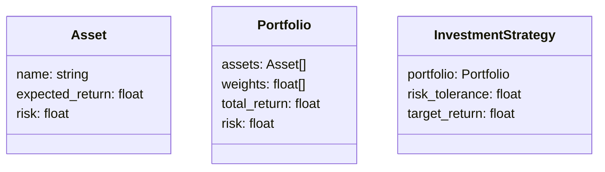

                 


# 大卫斯文森的机构投资策略

> 关键词：大卫·斯文森，机构投资，资产配置，风险管理，投资组合优化，现代投资组合理论（MPT）

> 摘要：本文深入探讨了大卫·斯文森的机构投资策略，结合其在耶鲁大学捐赠基金的管理经验，分析了其独特的资产配置、风险管理及投资组合优化方法。通过理论与实践相结合的方式，详细解读了斯文森策略的核心思想及其在现代投资管理中的应用。本文适合投资专业人士及机构投资者阅读，帮助读者理解并应用斯文森的投资理念。

---

## 第一部分: 大卫·斯文森的机构投资策略背景与核心理念

### 第1章: 大卫·斯文森与机构投资概述

#### 1.1 大卫·斯文森的背景介绍
##### 1.1.1 大卫·斯文森的生平与职业历程
大卫·斯文森（David Swensen）是美国著名的投资专家，曾任耶鲁大学首席投资官，负责管理耶鲁大学的捐赠基金。他以长期稳定的超额收益和创新的机构投资策略闻名。斯文森的职业生涯始于上世纪80年代，他在耶鲁大学的领导下，将捐赠基金的规模从1981年的1.3亿美元增长至2020年的超过300亿美元。

##### 1.1.2 斯文森在耶鲁大学的影响力
斯文森在耶鲁大学的领导下，捐赠基金的投资策略以长期视角为核心，注重资产配置和多元化投资。他打破了传统的投资模式，将资金分配到包括股票、债券、房地产、私募股权等多种资产类别中，实现了长期稳定的收益。

##### 1.1.3 机构投资的基本概念与特点
机构投资是指机构投资者（如大学捐赠基金、保险公司、养老基金等）进行的长期、系统化的投资行为。其特点包括：资金规模大、投资期限长、注重风险控制、追求稳定回报等。

#### 1.2 机构投资的核心理念
##### 1.2.1 机构投资的定义与目标
机构投资的目标是在长期时间内实现资产的保值与增值，通过科学的资产配置和风险管理，最大化收益并控制风险。

##### 1.2.2 机构投资与个人投资的区别
机构投资注重长期性和系统性，而个人投资更注重短期性和灵活性。机构投资者通常有严格的投资策略和风险控制体系，而个人投资者可能更依赖市场情绪和短期决策。

##### 1.2.3 斯文森投资理念的核心要素
斯文森的投资理念的核心要素包括：长期视角、资产配置、多元化投资、风险管理以及持续优化的投资组合。

---

## 第2章: 斯文森的资产配置策略

### 2.1 资产配置的基本原理
#### 2.1.1 资产配置的定义与作用
资产配置是指将资金分配到不同的资产类别（如股票、债券、房地产等）中，以实现风险分散和收益最大化。资产配置的作用包括降低风险、提高收益、适应市场变化等。

#### 2.1.2 资产配置的分类与特点
资产配置可以分为战略资产配置和战术资产配置。战略资产配置是基于长期投资目标的配置，而战术资产配置则是根据市场环境进行短期调整。斯文森更倾向于战略资产配置，强调长期视角。

#### 2.1.3 资产配置与风险收益的关系
资产配置直接影响投资组合的风险和收益。通过合理分配资产类别，可以有效降低投资组合的整体风险，同时提高收益。

### 2.2 斯文森的资产配置框架
#### 2.2.1 资产配置的长期视角
斯文森强调长期投资，认为市场短期波动是不可预测的，而长期趋势是可以通过研究和分析把握的。因此，资产配置应基于长期的经济周期和资产类别表现。

#### 2.2.2 不同资产类别在配置中的角色
斯文森将资产分为多个类别，包括股票、债券、房地产、私募股权等，并根据各类资产的预期收益和风险进行配置。不同资产类别在投资组合中的角色不同，股票通常提供更高的收益，债券提供稳定的利息收入，房地产则提供租金收入和资本增值。

#### 2.2.3 资产配置的动态调整
尽管强调长期视角，但斯文森也会根据市场环境和经济周期的变化进行动态调整。例如，当债券收益率下降时，可能增加股票配置；当股市估值过高时，可能增加债券或现金配置。

---

## 第3章: 风险管理与投资组合优化

### 3.1 风险管理的核心概念
#### 3.1.1 风险的定义与分类
风险是指投资组合未来收益的不确定性。风险可以分为市场风险、流动性风险、信用风险等。

#### 3.1.2 风险与收益的平衡
在投资中，收益与风险是密切相关的。高收益通常伴随着高风险，而低风险通常伴随着低收益。机构投资者需要在风险和收益之间找到平衡点。

#### 3.1.3 风险管理在投资中的重要性
风险管理是机构投资的核心，通过有效的风险管理，可以降低投资组合的损失，确保投资目标的实现。

### 3.2 现代投资组合理论（MPT）的应用
#### 3.2.1 MPT的基本原理
现代投资组合理论（MPT）是由哈里·马科维茨提出的，认为通过合理配置资产，可以实现投资组合的最优风险-收益平衡。MPT强调分散化投资，通过将资金分配到不同资产类别中，降低整体风险。

#### 3.2.2 资产组合优化的数学模型
MPT的核心是通过优化数学模型，找到最优的资产配置比例。以下是MPT的数学模型：

$$
\text{目标函数：} \quad \min_w \sigma^2(w) \quad \text{在约束条件下：} \quad w^T \mathbf{1} = 1
$$

其中，\( \sigma^2(w) \) 是投资组合的方差，\( w \) 是资产权重向量，\( \mathbf{1} \) 是单位向量。

#### 3.2.3 斯文森对MPT的创新与应用
斯文森在MPT的基础上，结合机构投资的特点，提出了更适合长期机构投资者的资产配置方法。例如，他强调长期视角和多元化投资，将资金分配到不同的资产类别中，以降低整体风险。

---

## 第4章: 机构投资的实践与挑战

### 4.1 机构投资的实践框架
#### 4.1.1 投资决策的流程与步骤
机构投资的决策流程通常包括：制定投资目标、进行市场分析、确定资产配置、选择投资标的、实施投资计划、监控和调整投资组合等。

#### 4.1.2 投资团队的分工与协作
机构投资通常需要一个专业的投资团队，包括投资经理、风险控制人员、研究人员等。团队成员需要分工协作，确保投资目标的实现。

#### 4.1.3 投资策略的制定与执行
投资策略的制定需要结合市场环境、投资目标和风险承受能力，投资策略的执行需要严格按照制定的计划进行，并定期监控和调整。

### 4.2 机构投资的主要挑战
#### 4.2.1 市场波动与不确定性
市场波动是机构投资面临的最大挑战之一。机构投资者需要在市场波动中保持冷静，避免情绪化决策。

#### 4.2.2 利率环境的变化影响
利率的变化会影响债券价格和收益，从而影响投资组合的整体表现。机构投资者需要根据利率环境的变化调整资产配置。

#### 4.2.3 投资目标与实际表现的差异
尽管机构投资者努力实现投资目标，但实际表现可能与预期存在差异。这需要机构投资者具备灵活的调整能力，并不断优化投资策略。

---

## 第5章: 斯文森投资策略的数学模型与算法

### 5.1 投资组合优化的数学模型
#### 5.1.1 均值-方差优化模型
均值-方差优化模型是MPT的核心，通过最小化投资组合的方差，实现风险收益的最优平衡。以下是均值-方差优化的数学表达式：

$$
\min_w \sigma^2(w) \quad \text{在约束条件下：} \quad w^T \mathbf{1} = 1
$$

其中，\( \sigma^2(w) \) 是投资组合的方差，\( w \) 是资产权重向量，\( \mathbf{1} \) 是单位向量。

#### 5.1.2 资产配置的约束条件
在实际投资中，资产配置需要满足一系列约束条件，例如资金比例限制、流动性要求等。这些约束条件可以通过优化模型中的约束条件进行设置。

#### 5.1.3 资产组合优化的Python实现
以下是均值-方差优化的Python代码示例：

```python
import numpy as np
import pandas as pd
from scipy.optimize import minimize

# 示例数据：资产的预期收益和协方差矩阵
mu = np.array([0.1, 0.15, 0.08])
sigma = np.array([[0.16, 0.05, 0], 
                  [0.05, 0.20, 0.05], 
                  [0, 0.05, 0.16]])

# 定义优化目标函数
def portfolio_risk(weights):
    return np.dot(weights.T, np.dot(sigma, weights))

# 定义约束条件
def weight_sum(weights):
    return sum(weights) - 1.0

# 初始权重
initial_guess = [1/3, 1/3, 1/3]

# 使用最小二乘法求解
result = minimize(portfolio_risk, initial_guess, constraints={'type': 'eq', 'fun': weight_sum})

# 输出最优权重和最小方差
print("最优权重:", result.x)
print("最小方差:", result.fun)
```

---

## 第6章: 系统分析与架构设计

### 6.1 问题场景介绍
机构投资管理系统需要实现投资组合优化、风险管理和投资决策支持等功能。

### 6.2 系统功能设计
#### 6.2.1 领域模型
以下是领域模型的Mermaid类图：



### 6.3 系统架构设计
以下是系统架构的Mermaid架构图：

```mermaid
container 整体架构 {
    组件 投资组合优化模块
    组件 风险管理模块
    组件 投资决策模块
}
```

---

## 第7章: 项目实战

### 7.1 环境安装与配置
需要安装Python、Pandas、NumPy等库。

### 7.2 核心实现源代码
以下是投资组合优化的Python代码示例：

```python
import numpy as np
import pandas as pd
from scipy.optimize import minimize

# 示例数据
mu = np.array([0.1, 0.15, 0.08])
sigma = np.array([[0.16, 0.05, 0], 
                  [0.05, 0.20, 0.05], 
                  [0, 0.05, 0.16]])

# 定义优化目标函数
def portfolio_risk(weights):
    return np.dot(weights.T, np.dot(sigma, weights))

# 定义约束条件
def weight_sum(weights):
    return sum(weights) - 1.0

# 初始权重
initial_guess = [1/3, 1/3, 1/3]

# 使用最小二乘法求解
result = minimize(portfolio_risk, initial_guess, constraints={'type': 'eq', 'fun': weight_sum})

# 输出最优权重和最小方差
print("最优权重:", result.x)
print("最小方差:", result.fun)
```

### 7.3 实际案例分析
以下是投资组合优化的实际案例分析：

假设我们有三个资产，预期收益分别为10%、15%和8%，协方差矩阵如上所示。通过均值-方差优化，我们可以找到最优的资产配置比例，以最小化投资组合的方差。

### 7.4 项目小结
通过实际案例分析，我们可以看到，斯文森的资产配置策略在实际投资中具有重要的指导意义。

---

## 第8章: 最佳实践与小结

### 8.1 最佳实践
机构投资者在应用斯文森的策略时，需要注意以下几点：

1. 长期视角：投资需要耐心，避免短期波动的干扰。
2. 风险控制：合理配置资产，分散风险。
3. 动态调整：根据市场环境和经济周期变化，及时调整资产配置。

### 8.2 小结
斯文森的机构投资策略以其长期视角、资产配置和风险管理为核心，为机构投资者提供了科学的投资方法。通过本文的分析，我们可以更好地理解并应用斯文森的投资理念。

### 8.3 注意事项
在实际投资中，需要注意市场环境的变化和资产类别的选择，避免盲目跟风。

### 8.4 拓展阅读
推荐阅读大卫·斯文森的《机构投资的创新实践》及相关投资理论书籍。

---

## 作者：AI天才研究院/AI Genius Institute & 禅与计算机程序设计艺术 /Zen And The Art of Computer Programming

