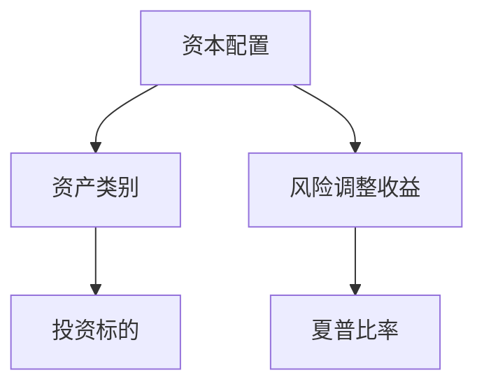
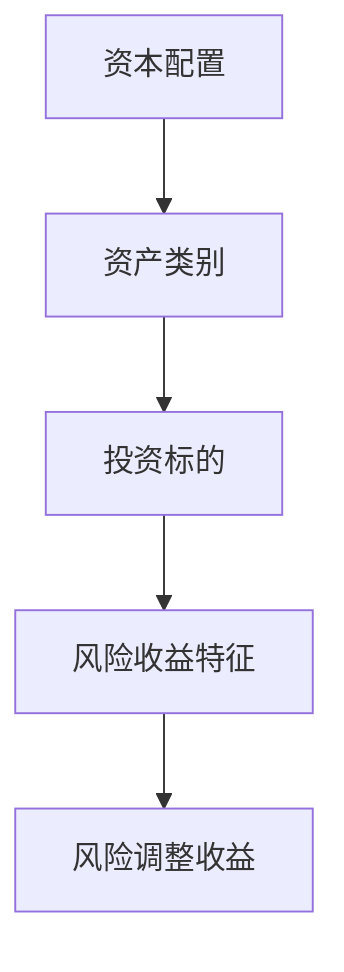
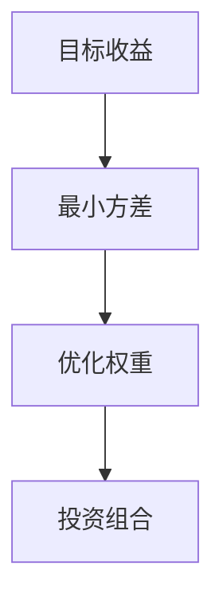
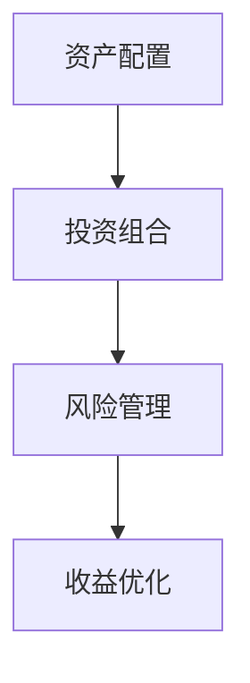

                 


# 大卫斯文森的长期资本配置

## 关键词
长期资本配置, 大卫斯文森, 资本配置策略, 投资组合优化, 机构投资

## 摘要
本书系统阐述了大卫斯文森的长期资本配置理念与实践，从基本概念、算法原理到系统设计和项目实战，全面解析了长期资本配置的核心思想与应用方法。通过详细的数学推导、代码实现和实际案例，帮助读者深入理解长期资本配置的策略与技巧。

---

# 第1章：长期资本配置的背景与概念

## 1.1 长期资本配置的背景

### 1.1.1 资本配置的定义与重要性
资本配置是指将资金分配到不同的资产类别或投资标的中，以实现风险与收益的最优平衡。长期资本配置强调在较长的时间跨度内维持稳定的资产分配策略，以应对市场波动和经济周期变化。

### 1.1.2 长期资本配置的必要性
在金融市场中，长期资本配置能够帮助投资者规避短期波动风险，实现资产的长期增值。大卫·斯文森通过长期资本配置策略，使耶鲁大学的捐赠基金实现了卓越的投资回报。

### 1.1.3 大卫·斯文森的长期资本配置方法论
大卫·斯文森提出了一套以资产类别为基础的长期资本配置方法，强调对不同资产类别（如股票、债券、私募股权等）的风险收益特征进行深入分析，并结合宏观经济环境进行动态调整。

### 1.1.4 长期资本配置的边界与外延
长期资本配置的边界包括资产类别选择、风险承受能力和投资期限。外延则涉及动态再平衡、风险管理以及与机构投资目标的结合。

## 1.2 长期资本配置的核心概念

### 1.2.1 核心概念的属性特征对比
| 概念 | 描述 | 特性 |
|------|------|------|
| 资本配置 | 资金分配到不同资产 | 长期性、动态性、系统性 |
| 资产类别 | 不同类型的投资标的 | 风险收益特征各异 |
| 风险调整收益 | 考虑风险后的收益 | 需要通过夏普比率等指标衡量 |

### 1.2.2 实体关系图的 Mermaid 流程图


---

# 第2章：长期资本配置的核心概念与联系

## 2.1 核心概念的原理

### 2.1.1 长期资本配置的原理概述
长期资本配置的原理在于通过科学的资产分配，在风险可控的前提下，最大化投资收益。大卫·斯文森的方法论强调对资产类别进行深入研究，并结合宏观经济趋势进行动态调整。

### 2.1.2 核心概念的属性特征对比
| 概念 | 描述 | 特性 |
|------|------|------|
| 资产类别 | 不同类型的投资标的 | 风险收益特征各异 |
| 风险调整收益 | 考虑风险后的收益 | 需要通过夏普比率等指标衡量 |
| 动态调整 | 根据市场变化调整配置 | 需要定期再平衡 |

### 2.1.3 实体关系图的 Mermaid 流程图


---

# 第3章：长期资本配置的算法原理

## 3.1 算法原理讲解

### 3.1.1 现代投资组合理论（MPT）

#### 3.1.1.1 现代投资组合理论的定义
现代投资组合理论（MPT）由哈里·马科维茨提出，强调通过分散投资降低风险，实现收益最大化。

#### 3.1.1.2 MPT 的数学模型
$$ E[r_p] = \sum w_i E[r_i] $$
$$ \sigma_p^2 = \sum \sum w_i w_j \sigma_{ij} $$

其中，$E[r_p]$ 是投资组合的预期收益，$w_i$ 是资产 $i$ 的权重，$E[r_i]$ 是资产 $i$ 的预期收益，$\sigma_{ij}$ 是资产 $i$ 和 $j$ 的协方差。

### 3.1.2 资本资产定价模型（CAPM）

#### 3.1.2.1 CAPM 的定义
CAPM 用于计算资产的预期收益，公式如下：
$$ E[r_i] = r_f + \beta_i (E[r_m] - r_f) $$

其中，$r_f$ 是无风险利率，$\beta_i$ 是资产 $i$ 的贝塔系数，$E[r_m]$ 是市场预期收益。

### 3.1.3 均值-方差优化的 Mermaid 流程图


### 3.1.4 Python 代码实现
```python
import numpy as np
import matplotlib.pyplot as plt

# 示例：两资产投资组合的均值-方差优化
mu = np.array([0.1, 0.2])
sigma = np.array([[0.15, 0.1], [0.1, 0.2]])

weights = np.linspace(0, 1, 100)
port_mu = weights * mu[0] + (1 - weights) * mu[1]
port_sigma = np.sqrt(weights**2 * sigma[0, 0] + (1 - weights)**2 * sigma[1, 1] + 2 * weights * (1 - weights) * sigma[0, 1])

plt.plot(port_sigma, port_mu)
plt.xlabel('标准差')
plt.ylabel('预期收益')
plt.title('投资组合的均值-方差曲线')
plt.show()
```

---

# 第4章：数学模型与公式详解

## 4.1 数学模型的详细讲解

### 4.1.1 均值-方差优化的数学推导
均值-方差优化的目标是最小化投资组合的风险（方差），在给定收益下，或者最大化收益，在给定风险下。

#### 最优化问题
$$ \min_w \sum_{i=1}^n \sum_{j=1}^n w_i w_j \sigma_{ij} $$
$$ \text{subject to } \sum_{i=1}^n w_i = 1 $$

### 4.1.2 风险调整后的收益计算
风险调整后的收益可以通过夏普比率来衡量：
$$ \text{夏普比率} = \frac{E[r_p] - r_f}{\sigma_p} $$

### 4.1.3 实际案例分析
假设我们有两个资产，A 和 B，其预期收益分别为 10% 和 15%，标准差分别为 15% 和 20%，相关系数为 0.5。我们需要计算最优投资组合的权重。

---

# 第5章：系统分析与架构设计

## 5.1 系统分析

### 5.1.1 问题场景介绍
我们需要设计一个长期资本配置系统，能够根据市场数据和投资目标，自动计算并优化投资组合。

### 5.1.2 领域模型 M

#### 领域模型


---

# 第6章：项目实战

## 6.1 项目实战

### 6.1.1 环境安装
需要安装 Python、NumPy、Pandas 和 Matplotlib 等库。

### 6.1.2 核心代码实现
```python
import numpy as np

# 示例：计算最优投资组合权重
def optimize_portfolio(mu, sigma, target_return):
    n = len(mu)
    cov_matrix = sigma
    inv_cov = np.linalg.inv(cov_matrix)
    ones = np.ones(n)
    weight = inv_cov @ ones / (ones.T @ inv_cov @ ones)
    return weight

mu = np.array([0.1, 0.2])
sigma = np.array([[0.15, 0.1], [0.1, 0.2]])
weights = optimize_portfolio(mu, sigma, 0.15)
print(weights)
```

### 6.1.3 案例分析
通过上述代码，我们可以计算出在预期收益为 15% 的情况下，最优的投资组合权重。

---

# 第7章：总结与扩展

## 7.1 总结
大卫·斯文森的长期资本配置方法通过科学的资产分配和动态调整，实现了长期稳定的收益。本书详细介绍了其核心思想和实际应用。

## 7.2 最佳实践 tips
- 定期进行投资组合的再平衡
- 保持对宏观经济趋势的关注
- 理解并掌握相关的数学模型和算法

## 7.3 小结
长期资本配置是一项复杂的系统工程，需要结合理论与实践，不断优化和调整。

## 7.4 注意事项
- 风险管理是核心
- 需要持续学习和更新

## 7.5 拓展阅读
推荐阅读《机构投资的职业行为》和《投资之道》等书籍，深入理解长期资本配置的实践技巧。

---

# 作者：AI天才研究院/AI Genius Institute & 禅与计算机程序设计艺术 /Zen And The Art of Computer Programming

