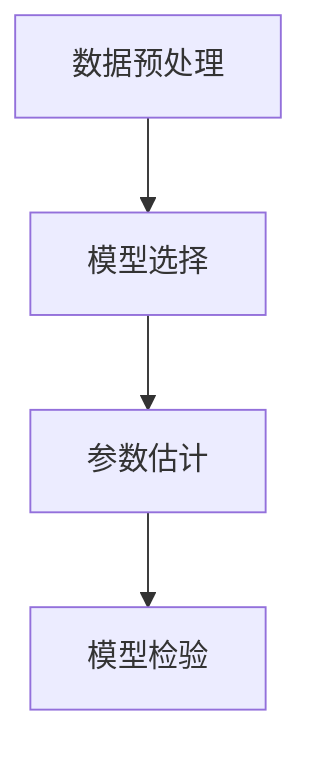
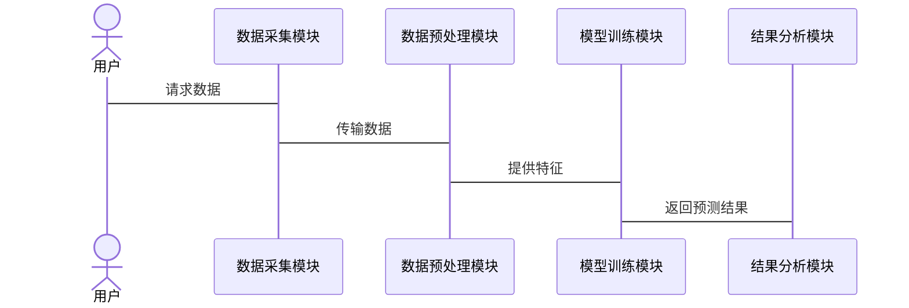

                 


# 大宗商品价格周期与投资机会

> 关键词：大宗商品价格周期，投资机会，价格预测，算法模型，风险管理

> 摘要：本文深入探讨了大宗商品价格周期的形成机制、影响因素及其与投资机会的关系。通过分析宏观经济、供需关系、地缘政治等多方面因素，结合时间序列分析、回归分析、ARIMA和GARCH模型，构建了大宗商品价格预测的系统架构。通过实际案例展示了如何利用这些模型进行投资决策，并总结了风险管理策略，为投资者提供了理论支持和实践指导。

---

# 第1章: 大宗商品的基本概念与市场概述

## 1.1 大宗商品的基本概念
### 1.1.1 大宗商品的定义与分类
- 大宗商品的定义：大宗商品是指在交易中经常被买卖的基本经济 goods，包括能源、金属、农产品等。
- 分类：能源类（原油、天然气）、金属类（黄金、铜）、农产品类（小麦、大豆）。

### 1.1.2 大宗商品在经济中的作用
- 大宗商品是全球贸易的重要组成部分。
- 影响国家经济政策和企业发展。

### 1.1.3 大宗商品市场的基本结构
- 期货市场、现货市场和场外市场。

## 1.2 大宗商品价格波动的特征
### 1.2.1 周期性波动的特点
- 经济周期对价格的影响。
- 供需失衡导致的周期性波动。

### 1.2.2 随机性波动的特点
- 市场情绪的影响。
- 不可预测的突发事件。

### 1.2.3 长期趋势的影响
- 技术进步和资源枯竭导致的长期趋势。

## 1.3 大宗商品市场的参与者
### 1.3.1 生产者与消费者
- 生产者：矿商、农民。
- 消费者：工业企业和个人。

### 1.3.2 投资者与投机者
- 投资者：通过期货市场进行长期投资。
- 投投机者：利用价格波动进行短期交易。

### 1.3.3 金融机构与经纪商
- 提供交易服务和资金支持。

## 1.4 本章小结
- 介绍了大宗商品的基本概念、分类和市场结构。
- 分析了价格波动的特征和市场参与者的角色。

---

# 第2章: 大宗商品价格周期的驱动因素

## 2.1 宏观经济因素
### 2.1.1 经济周期与大宗商品需求
- 经济增长阶段对大宗商品需求的影响。

### 2.1.2 通货膨胀与价格波动
- 通货膨胀对价格的影响。

### 2.1.3 利率政策的影响
- 利率变化对投资行为的影响。

## 2.2 供需关系分析
### 2.2.1 供给端的因素
- 生产成本、技术进步、资源枯竭。

### 2.2.2 需求端的因素
- 经济发展、消费习惯、政策支持。

### 2.2.3 供需平衡与价格波动
- 供给与需求的动态平衡。

## 2.3 地缘政治与突发事件
### 2.3.1 地缘政治风险的影响
- 战争、政治动荡对供给的影响。

### 2.3.2 突发事件的市场反应
- 自然灾害、疫情等对市场的影响。

### 2.3.3 价格波动
- 突发事件引发的价格剧烈波动。

## 2.4 市场情绪与技术分析
### 2.4.1 市场情绪对价格的影响
- 投资者情绪波动引发的价格变化。

### 2.4.2 技术分析方法
- 移动平均线、RSI指标的应用。

## 2.5 本章小结
- 分析了宏观经济、供需关系、地缘政治和技术分析对价格周期的影响。

---

# 第3章: 大宗商品价格波动的核心机制

## 3.1 时间序列分析
### 3.1.1 时间序列分析的基本概念
- 时间序列数据的特点。

### 3.1.2 时间序列分解
- 趋势、季节性、周期性、随机性。

## 3.2 统计分析方法
### 3.2.1 回归分析
- 确定变量之间的关系。

### 3.2.2 方差分析
- 检验变量对价格的影响。

## 3.3 价格波动的数学模型
### 3.3.1 随机游走模型
- $$P_{t} = P_{t-1} + \epsilon_{t}$$

### 3.3.2 自回归模型
- $$P_{t} = \alpha P_{t-1} + \beta + \epsilon_{t}$$

## 3.4 本章小结
- 介绍了时间序列分析和统计方法，建立了价格波动的数学模型。

---

# 第4章: 大宗商品价格预测的算法原理

## 4.1 ARIMA模型
### 4.1.1 ARIMA模型的原理
- $$ARIMA(p, d, q)$$

### 4.1.2 ARIMA模型的实现步骤
- 数据预处理、模型选择、参数估计、模型检验。

## 4.2 GARCH模型
### 4.2.1 GARCH模型的原理
- $$GARCH(p, q)$$

### 4.2.2 GARCH模型的应用
- 估计波动性、风险管理。

## 4.3 算法实现
### 4.3.1 Python代码实现ARIMA模型
```python
import statsmodels.api as sm
model = sm.tsa.ARIMA(data, order=(p, d, q))
```

### 4.3.2 算法流程图


## 4.4 本章小结
- 介绍了ARIMA和GARCH模型的原理和实现步骤。

---

# 第5章: 大宗商品价格预测的系统设计与实现

## 5.1 系统功能设计
### 5.1.1 数据采集模块
- 数据来源：API接口、数据库。

### 5.1.2 数据预处理模块
- 清洗数据、特征提取。

### 5.1.3 模型训练模块
- 选择模型、训练参数。

### 5.1.4 结果分析模块
- 预测结果、误差分析。

## 5.2 系统架构设计
### 5.2.1 系统架构图


### 5.2.2 模块交互图


## 5.3 本章小结
- 构建了大宗商品价格预测的系统架构，并详细设计了各模块的功能。

---

# 第6章: 大宗商品投资机会的项目实战

## 6.1 项目背景
### 6.1.1 项目目标
- 预测原油价格，制定投资策略。

## 6.2 数据收集与处理
### 6.2.1 数据来源
- 历史价格数据、经济指标。

### 6.2.2 数据清洗
- 处理缺失值、异常值。

## 6.3 模型训练与评估
### 6.3.1 训练ARIMA模型
- 使用历史数据训练模型。

### 6.3.2 模型评估
- 均方误差、平均绝对误差。

## 6.4 投资策略制定
### 6.4.1 基于模型的预测
- 使用预测结果制定买卖策略。

### 6.4.2 风险管理
- 设置止损点、止盈点。

## 6.5 本章小结
- 通过实际案例展示了如何利用模型进行投资决策。

---

# 第7章: 大宗商品投资策略与风险管理

## 7.1 投资策略
### 7.1.1 技术分析策略
- 使用K线图、均线等技术指标。

### 7.1.2 基本面分析策略
- 分析宏观经济指标、供需状况。

## 7.2 风险管理
### 7.2.1 风险来源
- 市场风险、流动性风险、信用风险。

### 7.2.2 风险控制措施
- 分散投资、设置止损。

## 7.3 最佳实践
### 7.3.1 投资组合优化
- 组合投资以降低风险。

### 7.3.2 技术与策略结合
- 结合数学模型和市场分析。

## 7.4 本章小结
- 总结了投资策略和风险管理的要点，提供了最佳实践建议。

---

# 作者

作者：AI天才研究院/AI Genius Institute & 禅与计算机程序设计艺术 /Zen And The Art of Computer Programming

