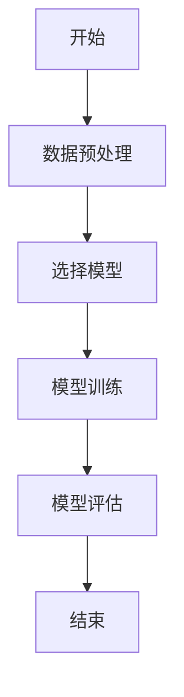
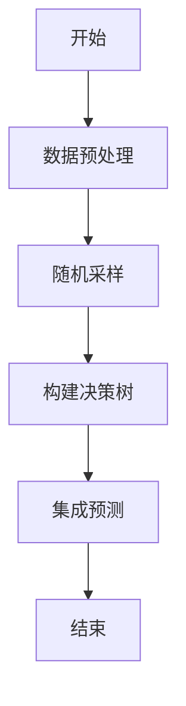
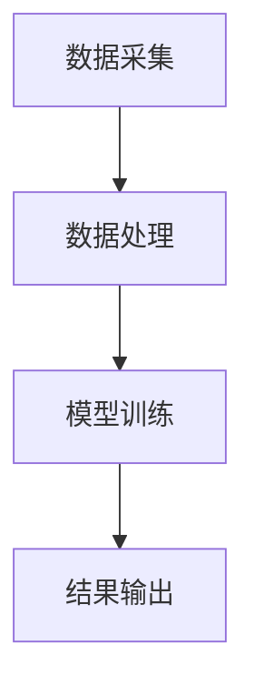
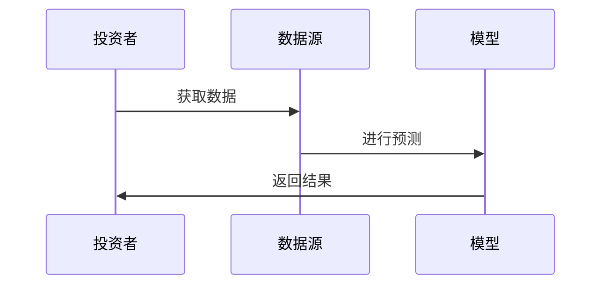

                 


# 大数据驱动的投资决策模型构建

## 关键词
- 大数据
- 投资决策
- 机器学习
- 数据挖掘
- 量化交易
- 决策模型
- 系统架构

## 摘要
本书旨在探讨如何利用大数据技术构建高效的投资决策模型，涵盖数据处理、模型选择、系统设计和实战应用等关键步骤。通过详细分析大数据在投资决策中的作用，介绍常见的机器学习算法，以及如何设计和实现一个完整的投资决策系统，为读者提供从理论到实践的全面指导。书中不仅提供丰富的背景知识和概念分析，还通过实际案例和代码示例，帮助读者掌握大数据驱动的投资决策模型构建方法。

---

# 第一部分：大数据驱动的投资决策模型概述

## 第1章：大数据与投资决策的背景

### 1.1 传统投资决策的局限性
- 数据来源单一，缺乏多样性
- 依赖经验判断，主观性较强
- 计算能力有限，难以处理海量数据

### 1.2 大数据技术的兴起与应用
- 数据量的爆炸式增长
- 数据挖掘和机器学习技术的进步
- 大数据在金融领域的广泛应用

### 1.3 大数据驱动投资决策的必要性
- 提高决策效率和准确性
- 捕捉市场微观结构变化
- 实现量化交易和风险控制

## 第2章：投资决策模型的基本概念

### 2.1 投资决策模型的定义
- 用于预测市场走势和优化投资组合的工具

### 2.2 模型的核心要素与组成
- 数据来源
- 数据处理方法
- 分析算法
- 输出结果

### 2.3 模型的分类与应用场景
- 分类模型：预测股票涨跌
- 回归模型：估计资产回报率
- 聚类模型：识别市场趋势

## 第3章：大数据在投资决策中的作用

### 3.1 数据量与数据源的多样性
- 结构化数据：市场交易数据、财务报表
- 非结构化数据：新闻、社交媒体情绪

### 3.2 数据分析技术对投资决策的支持
- 数据清洗与特征提取
- 数据可视化与探索性分析

### 3.3 大数据驱动的投资策略优势
- 高频交易
- 量化投资
- 风险管理

---

# 第二部分：投资决策模型的核心概念与联系

## 第4章：投资决策模型的核心要素

### 4.1 数据驱动的决策过程
- 数据收集与处理
- 数据分析与特征提取
- 模型训练与优化

### 4.2 模型的评价与选择
- 模型评价指标：准确率、召回率、F1分数
- 不同模型的优缺点对比
- 模型选择的策略

### 4.3 数据与模型的关联性分析
- 数据质量对模型性能的影响
- 模型复杂度与数据量的关系
- 数据预处理对模型效果的提升

### 4.4 核心概念与联系的ER图
```mermaid
erDiagram
    actor 投资者 {
        <属性> 资金规模
        <属性> 风险偏好
    }
    actor 数据源 {
        <属性> 市场数据
        <属性> 公司基本面
    }
    actor 模型 {
        <属性> 模型类型
        <属性> 模型参数
    }
    投资者 --> 数据源 : 数据获取
    数据源 --> 模型 : 模型训练
    模型 --> 投资者 : 决策支持
```

---

# 第三部分：投资决策模型的算法原理

## 第5章：常见投资决策算法解析

### 5.1 线性回归模型
#### 5.1.1 线性回归的基本原理
- 线性关系：自变量与因变量之间呈线性关系

#### 5.1.2 线性回归的数学公式
$$ y = \beta_0 + \beta_1x + \epsilon $$

#### 5.1.3 算法流程图


#### 5.1.4 线性回归的优缺点
- 优点：简单易懂，计算速度快
- 缺点：假设线性关系，可能不适用于复杂场景

### 5.2 随机森林模型
#### 5.2.1 随机森林的基本原理
- 基于决策树的集成学习方法
- 通过随机采样构建多棵决策树，减少过拟合

#### 5.2.2 随机森林的数学公式
$$ y = \sum_{i=1}^{n} \text{Tree}_i(x) $$

#### 5.2.3 算法流程图


---

## 第6章：数学模型与算法实现

### 6.1 线性回归模型的数学推导
- 最小二乘法：最小化预测值与真实值之间的平方差之和
$$ \min \sum_{i=1}^{n} (y_i - \hat{y}_i)^2 $$

### 6.2 随机森林模型的实现细节
- 使用Python的scikit-learn库
- 代码示例：
```python
from sklearn.ensemble import RandomForestRegressor
model = RandomForestRegressor(n_estimators=100, random_state=42)
model.fit(X_train, y_train)
```

---

# 第四部分：系统分析与架构设计

## 第7章：投资决策系统的架构设计

### 7.1 系统功能设计
- 数据采集模块：实时采集市场数据
- 数据处理模块：清洗和特征提取
- 模型训练模块：选择和优化算法
- 结果输出模块：生成投资建议

### 7.2 系统架构设计


### 7.3 接口设计
- RESTful API：提供数据接口和模型接口

### 7.4 交互设计


---

# 第五部分：项目实战与优化

## 第8章：构建股票价格预测模型

### 8.1 环境配置
- 安装必要的库：pandas、numpy、scikit-learn

### 8.2 代码实现
```python
import pandas as pd
from sklearn.model_selection import train_test_split
from sklearn.linear_model import LinearRegression

# 数据加载
data = pd.read_csv('stock_data.csv')
# 数据分割
X = data[['open', 'high', 'low', 'volume']]
y = data['close']
X_train, X_test, y_train, y_test = train_test_split(X, y, test_size=0.2, random_state=42)
# 模型训练
model = LinearRegression()
model.fit(X_train, y_train)
# 模型评估
score = model.score(X_test, y_test)
print(f'模型得分：{score}')
```

### 8.3 实战分析
- 数据预处理：处理缺失值和异常值
- 模型选择：比较不同算法的性能
- 结果分析：验证模型的准确性和稳定性

## 第9章：模型优化与部署

### 9.1 模型优化
- 调参：使用网格搜索优化模型参数
- 集成学习：结合多种算法提高性能

### 9.2 模型部署
- 使用Flask构建API接口
- 部署到云平台（如AWS、阿里云）

---

# 第六部分：总结与展望

## 第10章：总结与展望

### 10.1 最佳实践
- 数据清洗的重要性
- 模型选择的策略
- 系统设计的合理性

### 10.2 小结
- 通过本书的学习，读者能够掌握大数据驱动的投资决策模型构建方法

### 10.3 注意事项
- 数据质量和模型选择直接影响结果
- 需要持续监控和优化模型

### 10.4 拓展阅读
- 《机器学习实战》
- 《量化投资：大数据驱动的投资策略》

---

作者：AI天才研究院 & 禅与计算机程序设计艺术

---

这本书通过系统地介绍大数据驱动的投资决策模型构建过程，从理论到实践，帮助读者掌握如何利用大数据技术提升投资决策的效率和准确性。通过丰富的案例和代码示例，读者可以深入理解模型的构建过程，并将其应用于实际投资场景中。

