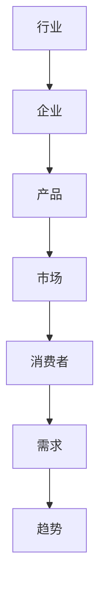
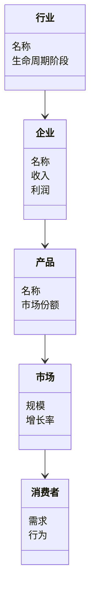
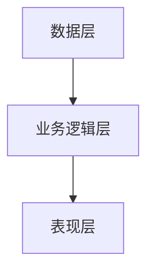

                 


# 如何像彼得林奇一样分析行业趋势

> 关键词：彼得·林奇，行业趋势分析，基本面分析，投资策略，技术分析

> 摘要：本文通过分析彼得·林奇的投资理念和行业趋势分析方法，结合技术领域的特点，详细讲解如何将彼得·林奇的分析方法应用于行业趋势分析。从基础理论到具体实践，从算法模型到系统架构，系统地介绍如何像彼得·林奇一样分析行业趋势，结合实际案例，深入剖析行业趋势分析的核心要素和关键步骤，帮助读者掌握这一分析方法。

---

## 第一部分：引言

### 1.1 彼得·林奇与行业趋势分析

#### 1.1.1 彼得·林奇的背景与投资理念
彼得·林奇是全球最著名的基金经理之一，以管理富达麦哲伦基金而闻名。他的投资理念强调基本面分析和长期投资，注重对行业趋势的深入研究。他相信，通过分析行业趋势，可以找到那些具有持续增长潜力的公司。

#### 1.1.2 为什么彼得·林奇的行业趋势分析方法值得学习
彼得·林奇的成功在于他对行业趋势的深刻理解。他的分析方法不仅适用于金融投资，也可以应用到技术领域。通过分析行业趋势，我们可以更好地把握技术发展的方向，找到具有潜力的技术领域和公司。

#### 1.1.3 本文的目标与读者群体
本文的目标是将彼得·林奇的行业趋势分析方法转化为技术领域的具体分析框架，帮助读者掌握这一方法。读者可以是技术人员、投资者、行业分析师等，特别是那些希望从技术角度分析行业趋势的人群。

---

## 第二部分：行业趋势分析的背景与基础

### 2.1 行业趋势分析的背景介绍

#### 2.1.1 经济周期与行业趋势的关系
行业趋势受经济周期的影响。在不同的经济周期阶段，行业的发展趋势也会有所不同。例如，在衰退期，防御性行业（如公用事业）可能表现较好，而在增长期，科技行业可能更具潜力。

#### 2.1.2 技术进步对行业趋势的影响
技术进步是推动行业趋势变化的重要因素。例如，人工智能、大数据、区块链等技术的发展，正在改变许多行业的格局。通过对技术趋势的分析，可以预测行业的未来发展方向。

#### 2.1.3 宏观经济政策对行业趋势的影响
政府的宏观经济政策（如税收政策、行业补贴、贸易政策等）也会对行业趋势产生重要影响。例如，政府对可再生能源的补贴政策可能会推动相关行业的发展。

---

### 2.2 行业趋势分析的核心概念

#### 2.2.1 行业生命周期理论
行业生命周期分为四个阶段：导入期、成长期、成熟期和衰退期。不同阶段的行业趋势不同，投资策略也应相应调整。

#### 2.2.2 行业竞争结构分析
行业竞争结构包括供应商、购买者、竞争对手等。通过分析行业竞争结构，可以判断行业的竞争激烈程度和公司的竞争优势。

#### 2.2.3 行业关键成功因素（KSF）
关键成功因素是指在行业中取得成功所需的关键要素。例如，在科技行业，技术创新和研发投入是关键成功因素。

---

### 2.3 行业趋势分析的边界与外延

#### 2.3.1 行业趋势分析的边界
行业趋势分析需要明确行业的边界。例如，在分析科技行业时，需要明确是整个科技行业，还是仅限于人工智能领域。

#### 2.3.2 行业趋势分析的外延
行业趋势分析不仅包括行业整体趋势，还包括行业内细分领域的发展趋势。例如，在人工智能领域，可以进一步分析自然语言处理和计算机视觉的趋势。

#### 2.3.3 行业趋势分析与其他分析方法的联系
行业趋势分析与企业竞争分析、市场分析等密切相关。例如，通过行业趋势分析，可以判断行业的未来发展方向，进而分析企业的竞争优势。

---

## 第三部分：彼得·林奇行业趋势分析框架

### 3.1 彼得·林奇分析框架的核心原理

#### 3.1.1 基于基本面分析的核心逻辑
彼得·林奇强调基本面分析，即通过对行业和公司的基本面数据进行分析，判断其发展前景。例如，他会分析行业的销售收入、利润增长率、市场占有率等指标。

#### 3.1.2 从微观到宏观的分析路径
彼得·林奇的分析方法是从微观到宏观的。他会先分析具体公司的基本面，再结合行业和宏观经济的分析，最终得出行业的整体趋势。

#### 3.1.3 以投资者视角的独特见解
彼得·林奇以投资者的视角进行分析，关注行业的增长潜力和投资价值。他会寻找那些具有持续增长潜力且估值合理的行业和公司。

---

### 3.2 行业趋势分析的核心要素对比

#### 3.2.1 行业生命周期与企业生命周期对比
行业生命周期与企业生命周期密切相关。例如，在行业衰退期，企业可能面临更大的竞争压力，而在行业成长期，企业可能有更大的增长空间。

#### 3.2.2 行业竞争结构与企业竞争优势对比
行业竞争结构影响企业的竞争优势。例如，在行业集中度高的领域，龙头企业具有更强的竞争优势。

#### 3.2.3 行业趋势与企业战略的对比
行业趋势影响企业的战略选择。例如，在行业增长期，企业可能选择扩大市场份额；在行业衰退期，企业可能选择成本优化或转型。

---

### 3.3 行业趋势分析的ER实体关系图



---

## 第四部分：行业趋势分析的算法与数学模型

### 4.1 行业趋势分析的算法原理

#### 4.1.1 线性回归模型
线性回归模型用于预测行业趋势的变化。例如，可以使用线性回归模型预测某个行业的销售收入增长率。

$$
y = \beta_0 + \beta_1x + \epsilon
$$

其中，$y$ 是预测值，$x$ 是自变量，$\beta_0$ 是截距，$\beta_1$ 是斜率，$\epsilon$ 是误差项。

#### 4.1.2 时间序列分析模型
时间序列分析模型用于分析行业趋势的时间变化。例如，可以使用ARIMA模型预测行业的未来发展趋势。

$$
ARIMA(p, d, q)
$$

其中，$p$ 是自回归阶数，$d$ 是差分阶数，$q$ 是移动平均阶数。

#### 4.1.3 马尔可夫链模型
马尔可夫链模型用于分析行业趋势的转移概率。例如，可以使用马尔可夫链模型分析行业所处的生命周期阶段。

$$
P_{n+1} = P_n \cdot T
$$

其中，$P_n$ 是当前状态的概率向量，$T$ 是转移概率矩阵。

---

### 4.2 算法原理的通俗举例

#### 4.2.1 线性回归的简单例子
假设某行业的销售收入与广告投入呈线性关系：
$$
\text{销售收入} = 50 + 10 \times \text{广告投入}
$$

#### 4.2.2 时间序列分析的简单例子
预测某行业未来3年的增长率：
$$
GDP_{t+1} = 0.8 \times GDP_t + \epsilon_t
$$

---

## 第五部分：行业趋势分析的系统架构设计

### 5.1 问题场景介绍

#### 5.1.1 项目介绍
本项目旨在设计一个行业趋势分析系统，基于彼得·林奇的分析方法，结合技术领域的特点，提供行业趋势分析的解决方案。

#### 5.1.2 系统功能设计
系统功能包括数据收集、数据清洗、数据分析、趋势预测和结果展示。

#### 5.1.3 领域模型设计
领域模型包括行业、企业、产品、市场和消费者等实体。



#### 5.1.4 系统架构设计
系统架构包括数据层、业务逻辑层和表现层。



---

## 第六部分：项目实战

### 6.1 环境安装与依赖管理

#### 6.1.1 环境安装
需要安装Python、Pandas、Matplotlib等工具。

#### 6.1.2 依赖管理
使用Pip安装所需的依赖包。

### 6.2 核心实现源代码

#### 6.2.1 数据收集与清洗
使用Pandas读取数据并进行清洗。

```python
import pandas as pd

# 数据收集
data = pd.read_csv('industry_trend.csv')

# 数据清洗
data.dropna(inplace=True)
data = data[~data['行业'].isnull()]
```

#### 6.2.2 趋势预测与可视化
使用线性回归模型进行预测并可视化。

```python
import matplotlib.pyplot as plt
from sklearn.linear_model import LinearRegression

# 模型训练
model = LinearRegression()
model.fit(data[['年份']], data['销售收入'])

# 预测
预测值 = model.predict(data[['年份']])

# 可视化
plt.scatter(data['年份'], data['销售收入'], color='blue', label='实际值')
plt.plot(data['年份'], 预测值, color='red', label='预测值')
plt.xlabel('年份')
plt.ylabel('销售收入')
plt.legend()
plt.show()
```

---

## 第七部分：注意事项与最佳实践

### 7.1 注意事项

#### 7.1.1 数据的准确性
行业趋势分析依赖于数据的准确性。如果数据不准确，分析结果可能不可靠。

#### 7.1.2 模型的适用性
不同的行业可能需要不同的分析模型。选择合适的模型是关键。

#### 7.1.3 市场的不确定性
行业趋势分析具有一定的不确定性，特别是在技术领域，技术进步可能带来突发性的变化。

---

### 7.2 最佳实践 Tips

#### 7.2.1 持续学习
行业趋势分析需要不断学习和更新知识，特别是在技术领域，新技术的出现可能改变行业趋势。

#### 7.2.2 保持敏感
对行业动态保持敏感，及时捕捉行业趋势的变化。

#### 7.2.3 结合定性与定量分析
行业趋势分析需要结合定性分析和定量分析，才能得出更准确的结论。

---

## 结论

通过本文的介绍，读者可以系统地了解如何像彼得·林奇一样分析行业趋势。从基础理论到具体实践，从算法模型到系统架构，我们详细讲解了行业趋势分析的核心要素和关键步骤。希望读者能够通过本文的指导，掌握这一分析方法，并在实际工作中取得成功。

---

**作者：AI天才研究院/AI Genius Institute & 禅与计算机程序设计艺术 /Zen And The Art of Computer Programming**

