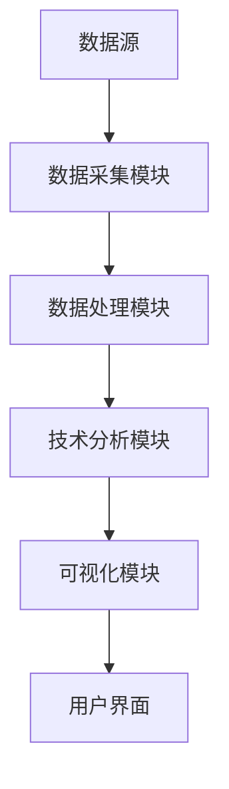

                 


# 如何利用技术分析辅助特价股票选择

> 关键词：技术分析，股票选择，移动平均线，相对强弱指数，RSI，特价股票，股票投资

> 摘要：本文将详细介绍如何利用技术分析工具和指标，如移动平均线和相对强弱指数（RSI），来辅助选择特价股票。通过分析价格走势和市场行为，投资者可以更好地识别潜在的低价股票并预测其上涨趋势。本文还提供实际案例和系统设计，帮助读者掌握技术分析的核心方法。

---

## 第1章: 技术分析的定义与背景

### 1.1 技术分析的定义

#### 1.1.1 技术分析的核心概念
技术分析是一种通过分析历史价格和成交量数据，预测未来价格走势的方法。其核心假设包括：价格反映所有信息、价格走势具有规律性以及趋势具有延续性。

#### 1.1.2 技术分析的历史演变
技术分析起源于20世纪初，早期以道氏理论和艾略特波浪理论为基础。随着计算机技术的发展，引入了更多数学模型和算法，如移动平均线（MA）和相对强弱指数（RSI）。

#### 1.1.3 技术分析在股票投资中的作用
技术分析帮助投资者识别趋势、判断买卖时机并评估风险。在特价股票选择中，技术分析用于筛选价格低估的股票，预测其上涨潜力。

### 1.2 技术分析与股票选择的关联

#### 1.2.1 技术分析在股票投资中的地位
技术分析是投资决策的重要工具，通过分析市场行为和价格走势，提供买卖时机的判断依据。

#### 1.2.2 技术分析与基本面分析的区别与联系
技术分析侧重市场行为，基本面分析关注公司财务状况。两者结合使用，可以提高投资决策的准确性。

#### 1.2.3 技术分析在特价股票选择中的应用价值
技术分析帮助识别低价股票，预测上涨趋势，通过指标如MA和RSI筛选潜在投资标的。

### 1.3 本章小结
总结技术分析的核心概念、历史演变及其在股票投资中的重要性，为后续章节奠定基础。

---

## 第2章: 移动平均线（MA）与相对强弱指数（RSI）

### 2.1 移动平均线（MA）

#### 2.1.1 MA的定义与计算公式
$$ MA_n = \frac{1}{n} \sum_{i=1}^{n} P_i $$
其中，\( P_i \) 为第 \( i \) 个交易日的价格，\( n \) 为计算周期。

#### 2.1.2 MA的类型与特点对比
| 类型 | 特点 | 适用场景 |
|------|------|----------|
| 短期MA | 灵敏度高，适合短期交易 | 短期趋势判断 |
| 长期MA | 稳定性好，适合长期投资 | 长期趋势判断 |
| 中期MA | 平衡灵敏度与稳定性 | 中期趋势判断 |

#### 2.1.3 MA在股票选择中的应用实例
通过图表展示某股票的MA线，解释如何利用MA线判断买入和卖出时机。

### 2.2 相对强弱指数（RSI）

#### 2.2.1 RSI的定义与计算公式
$$ RSI = \frac{100}{1 + \frac{A}{B}} $$
其中，\( A \) 为上涨幅度，\( B \) 为下跌幅度，周期通常为14天。

#### 2.2.2 RSI的指标区间与解读
| 区间 | 解读 |
|------|------|
| 0-30 | 超卖，可能反弹 |
| 30-70 | 中性，无明显趋势 |
| 70-100 | 超买，可能回调 |

#### 2.2.3 RSI在股票选择中的实战案例
通过图表展示某股票的RSI指标，解释如何利用RSI判断超买超卖状态。

### 2.3 MA与RSI的对比分析

#### 2.3.1 MA与RSI的指标特点对比
| 指标 | 特点 | 适用场景 |
|------|------|----------|
| MA   | 稳定，反映趋势 | 判断趋势方向 |
| RSI  | 灵敏，反映超买超卖 | 判断买卖信号 |

#### 2.3.2 MA与RSI的适用场景对比
MA适用于趋势判断，RSI适用于买卖信号识别，两者结合使用可以提高准确性。

#### 2.3.3 MA与RSI的综合应用策略
在实际投资中，可以通过结合MA和RSI指标来制定买卖决策。例如，当股价突破MA线且RSI处于超卖状态时，可能是买入信号。

### 2.4 本章小结
总结MA和RSI的核心概念、计算方法和实际应用，强调两者结合使用的重要性。

---

## 第3章: MACD指标与布林带（Bollinger Bands）

### 3.1 MACD指标

#### 3.1.1 MACD的定义与计算公式
MACD由两条线组成：MACD线（短期EMA与长期EMA的差值）和信号线（MACD线的EMA）。

$$ MACD = EMA_{12} - EMA_{26} $$
$$ 信号线 = EMA_{9}(MACD) $$

#### 3.1.2 MACD的指标区间与解读
| 区间 | 解读 |
|------|------|
| MACD线与信号线交叉 | 信号线从下往上交叉，可能为买入信号；从上往下交叉，可能为卖出信号。 |
| MACD线与Bollinger Bands结合 | 当MACD线在0线上方，且股价接近Bollinger Bands下限，可能为买入信号。 |

#### 3.1.3 MACD在股票选择中的应用实例
通过图表展示某股票的MACD指标，解释如何利用MACD判断买卖时机。

### 3.2 布林带（Bollinger Bands）

#### 3.2.1 布林带的定义与计算公式
布林带由三条线组成：中轨（MA）、上轨（MA + n倍标准差）和下轨（MA - n倍标准差）。

$$ 上轨 = MA + n \times \sigma $$
$$ 下轨 = MA - n \times \sigma $$
其中，\( \sigma \) 为标准差，\( n \) 通常为2。

#### 3.2.2 布林带的指标区间与解读
| 区间 | 解读 |
|------|------|
| 股价接近上轨 | 可能为超买，考虑卖出 |
| 股价接近下轨 | 可能为超卖，考虑买入 |

#### 3.2.3 布林带在股票选择中的实战案例
通过图表展示某股票的布林带指标，解释如何利用布林带判断买卖时机。

### 3.3 MACD与布林带的综合应用策略

#### 3.3.1 MACD与布林带的指标特点对比
| 指标 | 特点 | 适用场景 |
|------|------|----------|
| MACD | 判断趋势与买卖信号 | 趋势判断与买卖决策 |
| Bollinger Bands | 判断超买超卖与波动性 | 波动性分析与买卖决策 |

#### 3.3.2 MACD与Bollinger Bands的综合应用
结合MACD和Bollinger Bands可以提高买卖决策的准确性。例如，当股价接近Bollinger Bands下轨，且MACD线在0线上方，可能是买入信号。

### 3.4 本章小结
总结MACD和布林带的核心概念、计算方法和实际应用，强调两者结合使用的重要性。

---

## 第4章: 技术分析的系统架构与算法实现

### 4.1 系统架构设计

#### 4.1.1 系统功能模块
| 模块 | 功能描述 |
|------|----------|
| 数据采集 | 从数据源获取股票价格和成交量数据 |
| 数据处理 | 清洗、转换和存储数据 |
| 技术分析 | 计算技术指标并生成信号 |
| 可视化 | 绘制图表以展示分析结果 |

#### 4.1.2 系统架构图


### 4.2 技术分析算法实现

#### 4.2.1 移动平均线（MA）算法
```python
def calculate_ma(prices, window):
    ma = []
    for i in range(len(prices)):
        if i >= window:
            ma.append(sum(prices[i-window:i+1]) / window)
        else:
            ma.append(None)
    return ma
```

#### 4.2.2 相对强弱指数（RSI）算法
```python
def calculate_rsi(prices, window=14):
    delta = [prices[i] - prices[i-1] for i in range(1, len(prices))]
    up = [delta[i] if delta[i] > 0 else 0 for i in range(len(delta))]
    down = [abs(delta[i]) if delta[i] < 0 else 0 for i in range(len(delta))]
    rsi = []
    for i in range(len(up)):
        if i < window-1:
            rsi.append(None)
            continue
        avg_up = sum(up[i-window+1:i+1]) / window
        avg_down = sum(down[i-window+1:i+1]) / window
        rsi.append(100 / (1 + avg_up / avg_down))
    return rsi
```

### 4.3 系统实现与测试

#### 4.3.1 系统实现
使用Python和Pandas库进行数据处理，利用Matplotlib或Plotly进行可视化。

#### 4.3.2 系统测试
通过历史数据测试算法的准确性，调整参数以优化性能。

### 4.4 本章小结
总结技术分析系统的架构设计和算法实现，强调系统化方法的重要性。

---

## 第5章: 项目实战与案例分析

### 5.1 项目背景与目标
通过技术分析工具，筛选潜在的特价股票并制定投资策略。

### 5.2 数据采集与处理
从金融数据源获取股票价格数据，清洗和转换数据以适应分析需求。

### 5.3 技术分析与信号生成
使用MA、RSI、MACD和布林带等指标生成买卖信号。

### 5.4 投资策略与回测
制定投资策略并进行回测，评估策略的有效性和风险。

### 5.5 案例分析
通过具体案例分析，展示技术分析在特价股票选择中的实际应用。

### 5.6 本章小结
总结项目实战的经验，强调技术分析的实际应用价值。

---

## 第6章: 最佳实践与注意事项

### 6.1 最佳实践

#### 6.1.1 合理选择技术指标
根据投资目标和市场环境选择合适的指标，避免过度使用复杂指标。

#### 6.1.2 结合基本面分析
技术分析与基本面分析结合，提高投资决策的准确性。

#### 6.1.3 设置止损和止盈
合理设置止损和止盈，控制风险，保护投资本金。

### 6.2 小结

#### 6.2.1 技术分析的核心要点
技术分析是工具，需结合市场环境和自身经验使用。

#### 6.2.2 风险管理的重要性
无论技术分析多么精准，风险管理是投资成功的关键。

### 6.3 注意事项

#### 6.3.1 避免过度依赖单一指标
单一指标可能无法全面反映市场情况，需综合多种指标进行分析。

#### 6.3.2 注意市场周期性
技术分析需考虑市场周期性，避免在市场趋势发生重大变化时盲目操作。

#### 6.3.3 保持持续学习
市场环境不断变化，需持续学习和更新技术分析方法。

---

## 作者

作者：AI天才研究院/AI Genius Institute & 禅与计算机程序设计艺术 /Zen And The Art of Computer Programming

