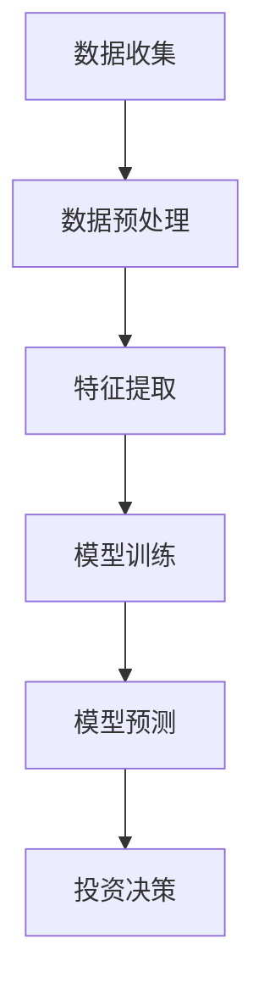
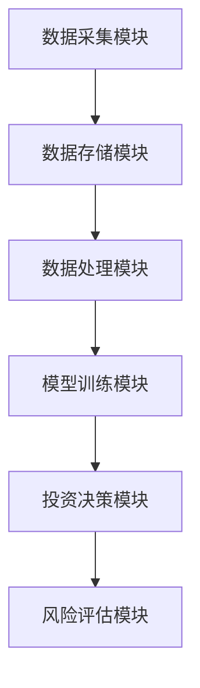

                 


# 如何利用特价股票投资应对全球经济去碳化趋势

> 关键词：特价股票，经济去碳化，投资策略，机器学习，绿色能源，碳中和

> 摘要：全球经济正加速向低碳化转型，投资者需要掌握新的策略以应对这一趋势。本文详细探讨了如何利用特价股票投资来应对经济去碳化的过程，从背景分析、核心概念、算法模型到实际案例，层层解析，为投资者提供实用的指导。

---

# 第一部分: 全球经济去碳化趋势与特价股票投资背景

## 第1章: 全球经济去碳化趋势概述

### 1.1 经济去碳化的背景与驱动因素

#### 1.1.1 全球气候变化与碳中和目标

全球气候变化已成为21世纪最严峻的挑战之一。科学界普遍认为，人类活动导致的温室气体排放是全球变暖的主要原因。为了应对这一危机，国际社会提出了碳中和目标，即在一定时间内实现二氧化碳等温室气体的净零排放。2015年《巴黎协定》的签署标志着全球碳中和行动进入新阶段，各国纷纷制定碳中和时间表，例如欧盟计划在2050年实现碳中和，中国则承诺在2060年实现碳中和。

#### 1.1.2 经济去碳化的定义与内涵

经济去碳化是指在经济活动中减少温室气体排放的过程。这一过程不仅仅是减少化石能源的使用，还包括推动能源结构转型、发展清洁能源、优化产业结构、提高能效等多个方面。经济去碳化的核心目标是实现经济增长与碳排放脱钩，即在保持经济增长的同时减少碳排放。

#### 1.1.3 主要国家与国际组织的去碳化政策

各国政府和国际组织为了实现碳中和目标，纷纷出台相关政策。例如，欧盟通过了《绿色新政》（Green Deal），提出了到2050年实现碳中和的目标，并计划通过“绿色金融”机制支持低碳经济。中国政府提出了“双碳”目标，即到2030年实现碳达峰，到2060年实现碳中和。此外，国际货币基金组织（IMF）和世界银行等国际金融机构也加大了对绿色金融的支持力度，推动全球经济发展向低碳方向转型。

### 1.2 特价股票的定义与市场机制

#### 1.2.1 特价股票的基本概念

特价股票是指在股票市场上价格相对较低的股票。这些股票通常来自市值较小的公司，具有较高的增长潜力，但也伴随着较高的风险。特价股票的价格波动较大，投资者可以通过挖掘市场机会实现较高的收益。特价股票的市场机制主要包括供需关系、市场情绪、公司基本面等因素的影响。

#### 1.2.2 特价股票的市场特点

特价股票市场具有以下特点：
1. **高波动性**：特价股票的价格波动较大，短期内可能出现大幅上涨或下跌。
2. **高风险**：由于市场波动大，投资者可能面临较高的风险。
3. **高潜力**：部分特价股票来自具有高增长潜力的公司，可能实现快速增值。
4. **流动性较低**：部分特价股票的交易量较小，可能导致流动性不足。

#### 1.2.3 特价股票与传统股票的区别

| 特性 | 特价股票 | 传统股票 |
|------|----------|-----------|
| 价格 | 较低     | 较高       |
| 风险 | 较高     | 较低       |
| 潜力 | 较高     | 较稳定     |
| 市场 | 小盘股   | 大盘股     |

从上述对比可以看出，特价股票和传统股票在价格、风险、潜力和市场规模等方面存在显著差异。投资者在选择投资标的时，需要根据自身的风险承受能力和投资目标进行合理配置。

### 1.3 全球经济去碳化与特价股票投资的关系

#### 1.3.1 去碳化趋势对经济和市场的影响

经济去碳化将深刻影响全球经济结构和市场格局。随着各国政府和企业加大对绿色能源、低碳技术和环保产业的支持力度，这些领域的公司将迎来快速发展机遇。与此同时，传统高碳排放行业（如化石能源、钢铁、水泥等）将面临政策限制和市场压力，其股票价格可能受到较大影响。

#### 1.3.2 特价股票在去碳化经济中的角色

在经济去碳化的过程中，绿色能源、电动汽车、节能环保等领域的公司具有较大的增长潜力。这些公司可能发行特价股票，为投资者提供了介入这些高增长行业的低成本机会。此外，经济去碳化还可能推动技术创新，从而提升这些公司的市场竞争力。

#### 1.3.3 投资者如何利用特价股票应对去碳化趋势

投资者可以通过以下方式利用特价股票应对经济去碳化趋势：
1. **关注绿色产业**：投资于绿色能源、低碳技术和环保领域的公司。
2. **分散投资风险**：通过投资多种特价股票分散风险，避免过度集中。
3. **长期持有**：利用特价股票的高增长潜力，长期持有优质标的。
4. **密切关注政策**：关注各国政府和国际组织的碳中和政策，及时调整投资策略。

---

## 第2章: 特价股票投资的核心概念与策略

### 2.1 特价股票投资的基本原理

#### 2.1.1 投资者行为分析

投资者在进行特价股票投资时，需要综合考虑以下几个方面：
1. **市场情绪**：市场情绪会影响股票价格，投资者需要避免盲目跟风。
2. **公司基本面**：关注公司的财务状况、盈利能力、管理层素质等因素。
3. **行业前景**：选择具有较好发展前景的行业进行投资。
4. **政策环境**：关注政策变化，尤其是与绿色经济相关的政策。

#### 2.1.2 市场供需与价格波动

股票价格的波动受到市场供需关系的影响。在特价股票市场中，由于市场流动性较低，价格波动较大。投资者需要密切关注市场动态，避免在市场低谷时盲目介入。

#### 2.1.3 风险与收益的平衡

投资特价股票需要在风险和收益之间找到平衡点。由于特价股票的高风险，投资者需要具备较强的风险承受能力。同时，投资者需要通过合理的投资组合配置，降低整体投资风险。

### 2.2 去碳化趋势下的投资机会

#### 2.2.1 绿色能源与可持续发展产业

绿色能源包括太阳能、风能、生物质能等可再生能源。随着全球能源结构转型，绿色能源产业将进入快速发展阶段。投资者可以通过投资绿色能源领域的公司，分享行业增长的收益。

#### 2.2.2 碳交易与碳金融市场的潜力

碳交易市场是经济去碳化的重要组成部分。碳交易市场允许企业通过购买碳配额或碳信用来满足减排目标。碳金融市场的发展将为投资者提供新的投资机会，例如投资碳基金、碳债券等金融产品。

#### 2.2.3 特价股票在绿色投资中的优势

特价股票在绿色投资中具有以下优势：
1. **低成本**：相对于传统股票，特价股票的购买成本较低。
2. **高潜力**：绿色产业的快速发展可能带来股票价格的大幅上涨。
3. **政策支持**：政府和国际组织对绿色产业的政策支持为投资提供了保障。

---

## 第3章: 特价股票投资的算法与模型

### 3.1 特价股票投资算法的基本原理

#### 3.1.1 数据收集与特征提取

在进行特价股票投资时，需要收集大量的市场数据，包括股票价格、成交量、市场指数、行业新闻等。通过分析这些数据，可以提取有用的特征，例如价格趋势、成交量变化、行业景气度等。

#### 3.1.2 价格预测模型的构建

价格预测模型是投资决策的重要工具。常见的模型包括线性回归模型、时间序列模型、机器学习模型等。通过这些模型，可以预测股票价格的变化趋势，为投资决策提供依据。

#### 3.1.3 风险评估与优化策略

在进行投资决策时，需要对投资组合的风险进行评估。常见的风险评估方法包括VaR（Value at Risk）、CVaR（Conditional Value at Risk）等。通过优化投资组合，可以降低整体风险，提高收益。

### 3.2 基于机器学习的股票价格预测

#### 3.2.1 算法流程图（mermaid）



#### 3.2.2 Python代码实现

```python
import numpy as np
import pandas as pd
from sklearn.model import LinearRegression

# 数据预处理
data = pd.read_csv('stock_data.csv')
data = data.dropna()

# 特征提取
features = data[['volume', 'open', 'high', 'low']]
target = data['close']

# 模型训练
model = LinearRegression()
model.fit(features, target)

# 模型预测
predicted_price = model.predict(features)
```

#### 3.2.3 模型训练与验证

在进行模型训练时，需要将数据集分为训练集和验证集。通过交叉验证等方法，可以评估模型的性能，避免过拟合。常见的评估指标包括均方误差（MSE）、平均绝对误差（MAE）等。

### 3.3 数学模型与公式

#### 3.3.1 线性回归模型

线性回归模型是常用的股票价格预测模型之一。其基本形式为：

$$ y = \beta_0 + \beta_1x + \epsilon $$

其中，$y$ 是股票价格，$x$ 是自变量（如成交量），$\beta_0$ 和 $\beta_1$ 是模型参数，$\epsilon$ 是误差项。

#### 3.3.2 时间序列模型

时间序列模型常用于股票价格的短期预测。常见的模型包括ARIMA（自回归积分滑动平均模型）和GARCH（广义自回归条件异方差模型）。

---

## 第4章: 系统分析与架构设计

### 4.1 系统功能设计

在进行特价股票投资时，需要构建一个支持投资决策的系统。系统功能包括数据采集、模型训练、投资决策、风险评估等。

#### 4.1.1 数据采集模块

数据采集模块负责收集市场数据，包括股票价格、成交量、市场指数等。数据来源可以包括公开的市场数据、新闻报道等。

#### 4.1.2 模型训练模块

模型训练模块负责对收集的数据进行特征提取和模型训练。常用的模型包括线性回归模型、机器学习模型等。

#### 4.1.3 投资决策模块

投资决策模块基于模型预测结果，为投资者提供投资建议。例如，当模型预测某只股票价格将上涨时，系统可以建议投资者买入该股票。

#### 4.1.4 风险评估模块

风险评估模块负责评估投资组合的风险，帮助投资者降低整体投资风险。

### 4.2 系统架构设计

#### 4.2.1 系统架构图（mermaid）



---

## 第5章: 项目实战

### 5.1 环境安装与配置

在进行项目实战之前，需要安装必要的工具和库。例如，Python编程语言、数据处理库（如Pandas）、机器学习库（如Scikit-learn）等。

### 5.2 核心代码实现

以下是项目的核心代码实现：

```python
import numpy as np
import pandas as pd
from sklearn.model import LinearRegression

# 数据预处理
data = pd.read_csv('stock_data.csv')
data = data.dropna()

# 特征提取
features = data[['volume', 'open', 'high', 'low']]
target = data['close']

# 模型训练
model = LinearRegression()
model.fit(features, target)

# 模型预测
predicted_price = model.predict(features)
```

### 5.3 实际案例分析

以某家绿色能源公司为例，假设我们收集了该公司的股票数据，并进行了模型训练和预测。通过模型预测，我们可以得出该股票的未来价格走势，从而做出投资决策。

### 5.4 项目总结

通过项目实战，我们验证了模型的有效性，并掌握了特价股票投资的基本方法。投资者可以根据实际需求，对模型进行优化和调整，以提高投资收益。

---

## 第6章: 最佳实践与注意事项

### 6.1 投资策略

在进行特价股票投资时，投资者需要注意以下几点：
1. **分散投资**：避免将所有资金投入到一只股票中，分散投资可以降低风险。
2. **长期持有**：特价股票具有较高的增长潜力，但需要长期持有才能实现收益。
3. **关注政策**：密切关注政府和国际组织的政策变化，及时调整投资策略。

### 6.2 风险管理

投资者需要具备较强的风险管理能力，尤其是在市场波动较大的情况下。可以通过设置止损点、分散投资等方式来降低风险。

### 6.3 技术应用

随着人工智能和大数据技术的发展，投资者可以利用这些技术手段提高投资决策的科学性和准确性。例如，通过机器学习模型进行股票价格预测，通过大数据分析挖掘市场机会。

---

## 第7章: 小结

经济去碳化是全球经济发展的重要趋势，投资者需要适应这一趋势，利用特价股票投资实现财富增值。通过本文的分析，我们掌握了特价股票投资的基本方法和策略，为应对全球经济去碳化趋势提供了有力支持。

---

作者：AI天才研究院/AI Genius Institute & 禅与计算机程序设计艺术/Zen And The Art of Computer Programming

