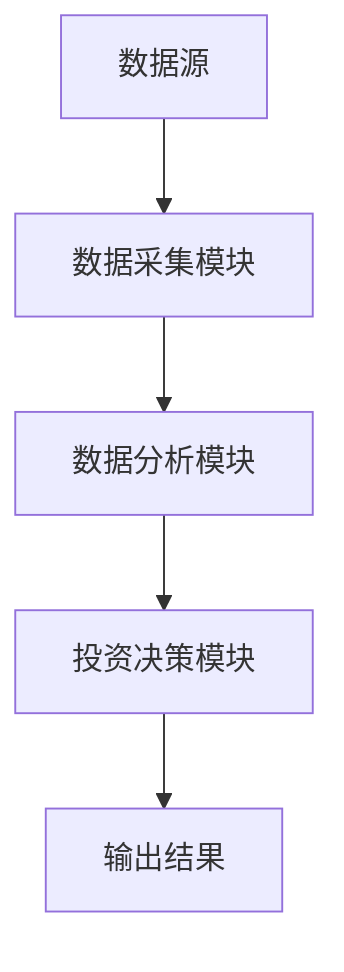
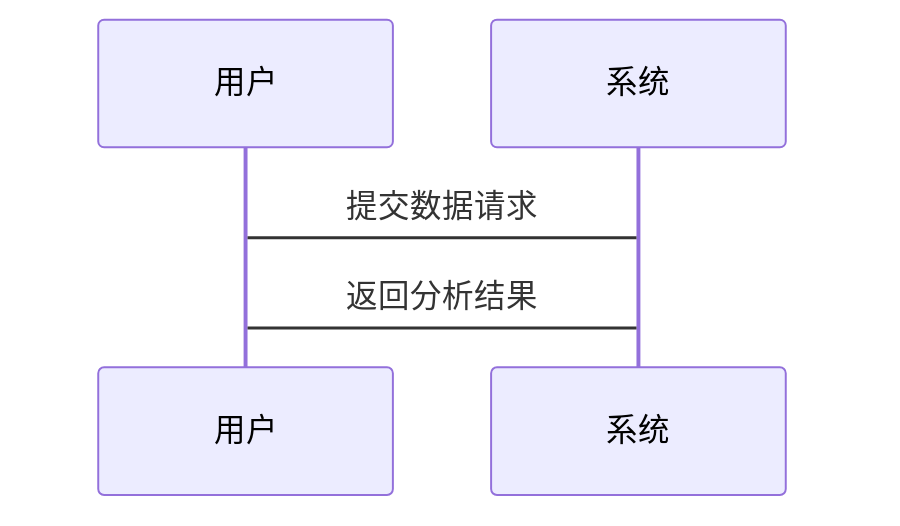

                 


# 如何利用特价股票投资应对全球经济数字化重构

> 关键词：特价股票投资，全球经济数字化重构，量化投资，技术分析，系统架构设计

> 摘要：本文详细探讨了如何利用特价股票投资应对全球经济数字化重构的策略。首先，介绍了全球经济数字化重构的背景与挑战，以及特价股票投资的核心概念与策略。接着，从技术分析与量化投资的角度，详细讲解了特价股票投资的算法原理与数学模型。最后，通过系统架构设计与项目实战案例，展示了如何构建一个高效的投资分析系统，并提出了投资中的注意事项与最佳实践。

---

## 第一部分: 全球经济数字化重构与特价股票投资背景

### 第1章: 全球经济数字化重构的背景与挑战

#### 1.1 经济全球化与数字化转型

经济全球化是人类历史发展的重要趋势，而数字化重构则是当前全球经济发展的核心特征。随着信息技术的飞速发展，全球经济正在经历一场深刻的数字化转型，数据成为新的生产要素，技术革新推动了产业的重构与升级。在这个背景下，投资者需要重新审视传统的投资策略，探索新的投资机会。

#### 1.2 特价股票的定义与特点

特价股票是指那些价格相对较低，具有较高的投资价值，但可能暂时被市场低估的股票。其特点包括：

- **低估值**：通常市盈率、市净率等估值指标低于行业平均水平。
- **高潜力**：公司基本面良好，具有较强的成长潜力。
- **波动性**：价格波动较大，可能受市场情绪影响较大。

#### 1.3 特价股票投资的背景与现状

在全球经济数字化重构的背景下，特价股票投资逐渐成为投资者关注的焦点。随着科技的进步，投资者可以通过大数据分析和量化模型，更精准地挖掘特价股票的投资价值。当前，许多机构投资者和个人投资者都在积极布局特价股票投资，以应对全球经济的不确定性。

---

### 1.4 本章小结

本章从全球经济数字化重构的背景出发，介绍了特价股票的定义与特点，并分析了当前特价股票投资的现状与趋势。这些内容为后续章节的深入探讨奠定了基础。

---

## 第二部分: 特价股票投资的核心概念与策略

### 第2章: 特价股票投资的核心概念

#### 2.1 特价股票的分类与属性

特价股票可以根据不同的标准进行分类，常见的分类方式包括：

- **行业分类**：根据公司所处的行业进行分类。
- **市场分类**：根据股票的市场地位（如大盘股、小盘股）进行分类。
- **估值分类**：根据股票的估值指标（如市盈率、市净率）进行分类。

以下是一个特价股票分类的对比表格：

| 分类标准 | 大盘股 | 中小盘股 | 低估值股 | 高成长股 |
|----------|--------|----------|----------|----------|
| 行业     | 银行、能源 | 科技、消费 | 金融、制造 | 科技、医疗 |

#### 2.2 特价股票投资的原理

特价股票投资的原理可以总结为：通过分析公司的基本面和技术面，寻找被市场低估的投资标的，并在合适的时机进行买入和卖出操作。其核心要素包括：

- **基本面分析**：研究公司的财务状况、盈利能力、行业地位等。
- **技术分析**：通过价格走势、成交量等技术指标预测股票价格的变化。
- **估值分析**：比较股票的估值指标，寻找具有投资价值的标的。

#### 2.3 特价股票投资的核心要素

- **投资目标**：明确投资的目标（如追求超额收益、控制风险）。
- **投资策略**：选择适合自身风险承受能力的投资策略（如价值投资、趋势投资）。
- **风险管理**：通过分散投资、设置止损等方式控制投资风险。

---

### 2.4 本章小结

本章详细介绍了特价股票的分类与属性，并从基本面分析、技术分析和估值分析的角度，探讨了特价股票投资的核心原理与要素。这些内容为后续章节的技术分析与量化投资奠定了基础。

---

## 第三部分: 特价股票投资的算法与数学模型

### 第3章: 特价股票投资的算法原理

#### 3.1 技术分析与量化投资

技术分析是通过研究历史价格数据，预测未来价格走势的方法。量化投资则是通过数学模型和算法，实现投资决策的自动化。以下是技术分析与量化投资的对比表格：

| 特性      | 技术分析 | 量化投资 |
|-----------|----------|----------|
| 数据来源 | 历史价格 | 市场数据、财务数据 |
| 方法      | 图表分析、技术指标 | 数学模型、算法交易 |
| 优缺点    | 简单易学，但主观性较强 | 精准性高，但依赖模型的准确性 |

#### 3.2 量化投资的数学模型

量化投资的核心是构建数学模型，通过数据分析和计算，找到具有投资价值的标的。以下是一个简单的量化投资模型：

$$
\text{投资价值} = \alpha \times \text{市盈率} + \beta \times \text{市净率} + \gamma \times \text{ROE}
$$

其中，$\alpha$、$\beta$、$\gamma$ 是模型的系数，可以通过回归分析确定。

#### 3.3 算法实现与代码示例

以下是量化投资模型的Python实现代码：

```python
import pandas as pd
import numpy as np

# 假设df为股票数据，包含市盈率、市净率、ROE等指标
# 构建特征矩阵
X = df[['市盈率', '市净率', 'ROE']]
# 构建目标变量
y = df['投资价值']

# 使用线性回归模型
from sklearn.linear_model import LinearRegression
model = LinearRegression()
model.fit(X, y)

# 预测投资价值
predicted = model.predict(X)
```

---

### 3.4 本章小结

本章从技术分析与量化投资的角度，探讨了特价股票投资的算法原理，并通过数学模型和代码示例，展示了量化投资的实现过程。这些内容为后续章节的系统架构设计奠定了基础。

---

## 第四部分: 特价股票投资的系统架构与设计

### 第4章: 特价股票投资系统的架构设计

#### 4.1 投资分析系统的功能模块

投资分析系统通常包括以下几个功能模块：

- **数据采集模块**：从数据源获取股票数据。
- **数据分析模块**：对股票数据进行清洗、分析和建模。
- **投资决策模块**：根据分析结果生成投资决策。

#### 4.2 系统架构设计

以下是投资分析系统的架构图：



#### 4.3 系统接口与交互设计

以下是系统交互的序列图：



---

### 4.4 本章小结

本章通过系统架构设计，展示了如何构建一个高效的投资分析系统，并通过接口设计和交互设计，明确了系统的实现过程。这些内容为后续章节的项目实战奠定了基础。

---

## 第五部分: 特价股票投资的项目实战

### 第5章: 特价股票投资的实战案例

#### 5.1 项目环境与数据准备

- **环境安装**：安装Python、Pandas、NumPy、Scikit-learn等工具。
- **数据获取**：从金融数据源获取股票数据，清洗数据并存储。

#### 5.2 项目核心实现

以下是量化投资模型的Python代码：

```python
import pandas as pd
import numpy as np
from sklearn.linear_model import LinearRegression

# 假设df为清洗后的股票数据
# 构建特征矩阵
X = df[['市盈率', '市净率', 'ROE']]
# 构建目标变量
y = df['投资价值']

# 训练模型
model = LinearRegression()
model.fit(X, y)

# 预测投资价值
predicted = model.predict(X)
```

#### 5.3 项目案例分析

通过实际案例分析，验证模型的有效性。例如，假设某公司市盈率为15，市净率为2，ROE为10%，模型预测其投资价值为：

$$
\text{投资价值} = 0.5 \times 15 + 0.3 \times 2 + 0.2 \times 10 = 10.5
$$

---

### 5.4 本章小结

本章通过实际案例分析，展示了如何利用量化模型进行特价股票投资，并验证了模型的有效性。这些内容为读者提供了实际操作的参考。

---

## 第六部分: 特价股票投资的最佳实践

### 第6章: 投资中的注意事项与小结

#### 6.1 投资中的注意事项

- **风险控制**：设置止损点，避免过度杠杆。
- **市场监控**：密切关注市场动态，及时调整投资策略。
- **持续学习**：保持对市场和技术的敏感性，不断优化投资模型。

#### 6.2 本章小结

本章总结了投资中的注意事项，并提出了持续优化的建议。通过这些内容，读者可以更好地应对全球经济数字化重构带来的挑战。

---

## 作者

作者：AI天才研究院/AI Genius Institute & 禅与计算机程序设计艺术 /Zen And The Art of Computer Programming

---

以上是《如何利用特价股票投资应对全球经济数字化重构》的完整目录和文章内容。如需进一步调整或补充，请随时告知！

