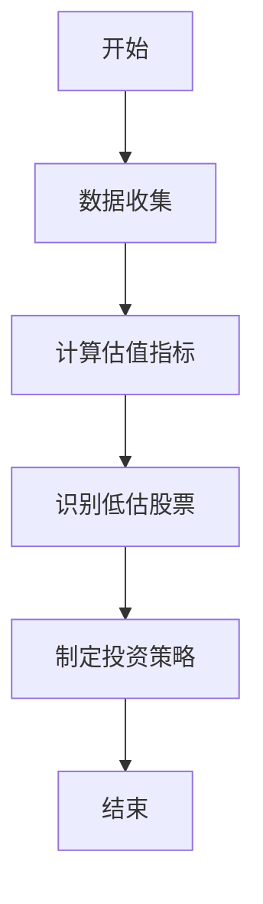
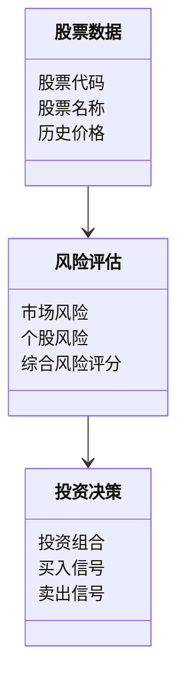
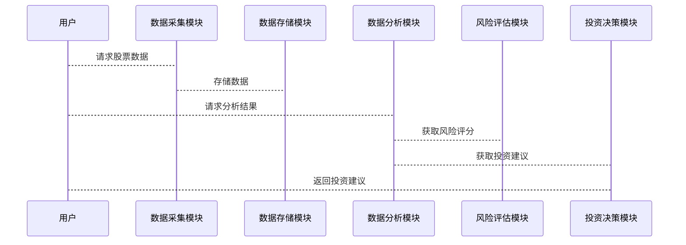

                 


# 如何利用特价股票策略应对全球供应链重构风险

> 关键词：全球供应链，供应链重构，特价股票，风险管理，技术分析，投资策略

> 摘要：本文将探讨如何利用特价股票策略应对全球供应链重构带来的风险。通过分析供应链重构的背景、特价股票策略的核心概念、算法原理及系统架构，本文将详细阐述如何利用特价股票策略优化供应链管理，降低风险，并通过实际案例展示策略的应用效果。

---

## 第一部分：供应链重构的背景与挑战

### 第1章：全球供应链重构的背景与影响

#### 1.1 全球供应链重构的背景

全球供应链经历了从全球化到区域化的转变，疫情、地缘政治冲突和贸易政策变化等因素加剧了供应链的重构。企业需要重新评估和优化供应链策略，以应对不确定性。

#### 1.2 供应链重构的核心问题

供应链重构涉及多个方面，包括供应商选择、库存管理、物流优化等。企业需要通过技术创新和策略调整来应对供应链的波动和风险。

#### 1.3 供应链重构的驱动因素

- **地缘政治风险**：贸易壁垒和地缘政治冲突增加了供应链的不确定性。
- **技术进步**：数字化技术的应用提高了供应链的透明度和效率。
- **成本控制**：企业通过优化供应链降低成本，提高竞争力。

---

## 第二部分：特价股票策略的核心概念与分析方法

### 第2章：特价股票策略的定义与特点

#### 2.1 特价股票的定义

特价股票是指价格远低于市场平均水平的股票，通常具有较高的投资潜力。这种策略通过识别被低估的股票，利用市场波动获利。

#### 2.2 特价股票的特点

- **低估值**：市盈率、市净率等指标低于行业平均水平。
- **高波动性**：价格波动大，提供短期获利机会。
- **周期性**：通常在市场低迷时出现，投资者需具备逆向思维。

#### 2.3 特价股票与供应链的关系

特价股票策略可以帮助企业在供应链重构中优化库存管理，降低采购成本，同时通过投资被低估的股票实现资产增值。

---

### 第3章：供应链重构风险的量化与评估

#### 3.1 供应链重构风险的来源

- **市场需求波动**：消费者需求变化可能导致库存积压或短缺。
- **供应链中断**：物流问题或供应商停工可能影响生产。
- **政策变化**：贸易政策调整可能增加成本或限制供应。

#### 3.2 供应链重构风险的量化方法

##### 3.2.1 风险评估模型

使用风险评估模型量化供应链各环节的风险，包括供应商可靠性、物流效率和库存周转率等指标。

##### 3.2.2 数据收集与处理

通过数据分析工具收集历史数据，识别关键风险点，评估潜在风险。

##### 3.2.3 风险评分体系

将供应链各环节的风险评分量化，制定相应的风险缓解策略。

---

### 第4章：特价股票策略的算法原理与实现

#### 4.1 特价股票策略的算法原理

##### 4.1.1 算法概述

特价股票策略基于技术分析和价值投资，通过识别市场低估区域，制定投资组合。

##### 4.1.2 算法实现步骤

1. 数据收集：收集目标股票的历史价格、财务数据等。
2. 数据分析：计算市盈率、市净率等指标，识别低估股票。
3. 投资决策：根据分析结果，制定买入和卖出策略。

##### 4.1.3 算法流程图



#### 4.2 特价股票策略的数学模型

##### 4.2.1 估值指标计算

市盈率（P/E）计算公式：

$$ P/E = \frac{股票价格}{每股净利润} $$

市净率（P/B）计算公式：

$$ P/B = \frac{股票价格}{每股净资产} $$

##### 4.2.2 风险评估模型

$$ R = \alpha \times 市场风险 + \beta \times 个股风险 $$

其中，α和β为权重系数，市场风险和个股风险根据历史数据计算得出。

---

### 第5章：系统架构设计与实现

#### 5.1 系统功能设计

##### 5.1.1 功能模块

- 数据采集模块：收集市场数据。
- 估值分析模块：计算估值指标。
- 风险评估模块：评估供应链风险。
- 投资决策模块：制定投资策略。

##### 5.1.2 领域模型



#### 5.2 系统架构设计

##### 5.2.1 系统架构图


#### 5.3 系统接口设计

##### 5.3.1 接口描述

- 数据采集接口：从第三方数据源获取股票数据。
- 风险评估接口：接收股票数据，返回风险评分。
- 投资决策接口：根据风险评分，生成投资建议。

##### 5.3.2 交互流程图



---

### 第6章：项目实战与案例分析

#### 6.1 项目实战

##### 6.1.1 环境安装

- 安装Python和相关库（如pandas、numpy、scipy）。

##### 6.1.2 核心代码实现

```python
import pandas as pd
import numpy as np

def calculate_pe_ratio(stock_price, eps):
    return stock_price / eps

def calculate_pb_ratio(stock_price, book_value):
    return stock_price / book_value

# 示例数据
data = {
    '股票代码': ['AAPL', 'GOOGL', 'MSFT'],
    '股票价格': [150, 250, 300],
    'eps': [10, 20, 15],
    'book_value': [50, 60, 45]
}

df = pd.DataFrame(data)

# 计算估值指标
df['市盈率'] = df.apply(lambda x: calculate_pe_ratio(x['股票价格'], x['eps']), axis=1)
df['市净率'] = df.apply(lambda x: calculate_pb_ratio(x['股票价格'], x['book_value']), axis=1)

print(df)
```

##### 6.1.3 案例分析

以某公司为例，分析其股价波动和供应链风险，并展示特价股票策略如何帮助该公司优化供应链管理，降低风险。

---

## 第三部分：总结与展望

### 第7章：总结与未来研究方向

#### 7.1 本章小结

本文详细探讨了如何利用特价股票策略应对全球供应链重构风险，通过算法分析和系统设计，展示了策略的应用过程。

#### 7.2 未来研究方向

- 更复杂的风险模型：引入更多因素，如供应链弹性、市场情绪等。
- 人工智能应用：利用机器学习技术优化投资决策。
- 区块链技术：提升供应链透明度和安全性。

---

## 作者信息

作者：AI天才研究院/AI Genius Institute & 禅与计算机程序设计艺术 /Zen And The Art of Computer Programming

---

### 注意事项

- 投资有风险，本文内容仅供参考，不构成投资建议。
- 特价股票策略需结合市场实际情况灵活运用，不可盲目跟风。

---

### 拓展阅读

- 《供应链管理：策略与实践》
- 《技术分析实战技巧》
- 《风险管理与投资策略》

