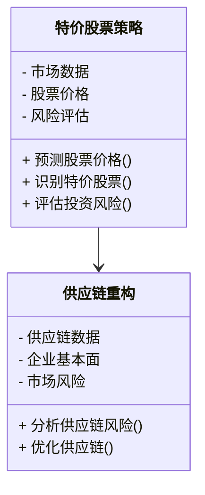
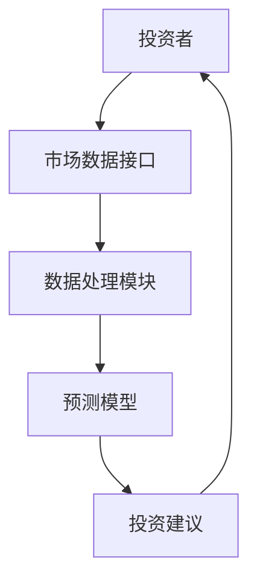
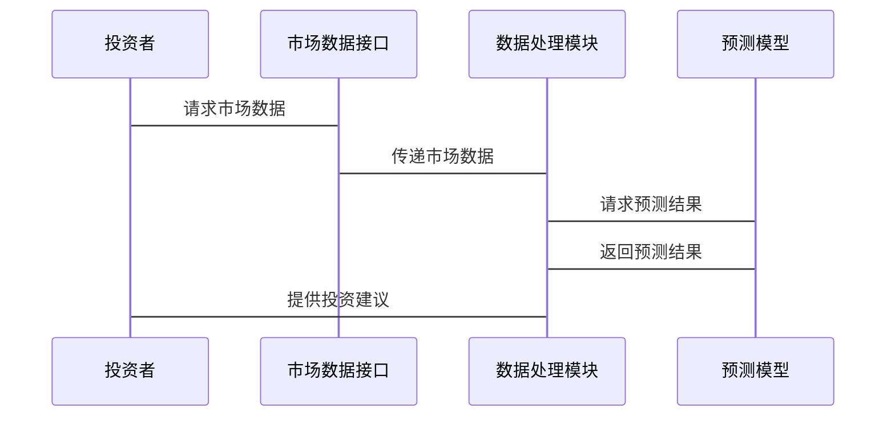

                 


# 如何利用特价股票策略应对全球数字化供应链重构风险

## 关键词：数字化供应链重构、特价股票策略、投资风险管理、供应链风险管理、市场波动分析

## 摘要：  
在全球数字化转型的背景下，供应链的重构已成为企业应对全球化挑战的重要策略。然而，供应链重构过程中伴随着诸多风险，如成本上升、供应链中断等。本文通过分析数字化供应链重构的背景与挑战，探讨特价股票策略在应对供应链重构风险中的应用。本文从核心概念、算法原理、系统架构等多维度展开，结合实际案例，详细阐述如何利用特价股票策略降低供应链重构带来的风险。文章最后总结了最佳实践和未来研究方向。

---

# 第一部分: 数字化供应链重构与特价股票策略的背景

## 第1章: 数字化供应链重构的背景与挑战

### 1.1 数字化供应链重构的背景

#### 1.1.1 数字化供应链的定义与特点  
数字化供应链是指通过信息技术（如物联网、大数据、人工智能等）将供应链的各个环节（供应商、制造商、分销商、零售商、消费者）连接起来，实现数据的实时共享与协同。其特点包括：  
- **数据驱动**：通过数据实时监控供应链各环节。  
- **智能化**：利用AI和机器学习优化供应链决策。  
- **灵活性**：能够快速响应市场变化。  

#### 1.1.2 供应链重构的驱动因素  
- **全球化竞争**：企业为了降低成本，将供应链分散到全球各地。  
- **技术进步**：数字化技术推动了供应链的智能化转型。  
- **疫情与地缘政治风险**：疫情暴露了传统供应链的脆弱性，促使企业重构供应链。  

#### 1.1.3 全球化与区域化对供应链的影响  
全球化使企业依赖全球化的供应链，但区域化（如“近岸外包”）正在成为新的趋势。这种转变对供应链的稳定性和成本管理提出了新的挑战。

---

### 1.2 数字化供应链重构的风险

#### 1.2.1 供应链中断的潜在风险  
- **自然灾害**：如地震、洪水等可能导致供应链中断。  
- **地缘政治风险**：如贸易摩擦、战争等影响供应链稳定性。  
- **疫情**：如COVID-19疫情导致的供应链中断。  

#### 1.2.2 供应链成本上升的影响  
供应链重构可能导致物流成本、库存成本上升，进而影响企业的盈利能力。

#### 1.2.3 供应链灵活性与效率的平衡  
供应链重构需要在灵活性和效率之间找到平衡，避免因过度优化而导致的脆弱性。

---

### 1.3 特价股票策略的背景

#### 1.3.1 特价股票的定义与特点  
特价股票是指在特定市场条件下，股票价格低于其内在价值的股票。其特点包括：  
- **低估值**：股票价格低于市场平均水平或行业平均水平。  
- **高波动性**：股票价格波动较大，存在短期投资机会。  
- **风险较高**：特价股票通常伴随着较高的市场风险。  

#### 1.3.2 市场波动与投资者机会  
市场波动为投资者提供了低价买入股票的机会，尤其是在供应链重构带来的市场不确定性中，特价股票可能成为投资者的潜在收益点。

#### 1.3.3 投资者如何利用特价股票应对风险  
- **分散投资**：通过投资多种特价股票分散风险。  
- **长期持有**：等待市场回升时卖出，获取收益。  
- **风险管理**：设置止损点，避免重大损失。  

---

### 1.4 本章小结  
本章介绍了数字化供应链重构的背景与挑战，分析了供应链重构的风险，并探讨了特价股票策略在应对这些风险中的潜在作用。接下来，我们将深入分析数字化供应链重构与特价股票策略之间的联系。

---

## 第2章: 数字化供应链重构与特价股票策略的联系

### 2.1 数字化供应链重构对企业的影响

#### 2.1.1 企业供应链优化的必要性  
- 数字化供应链重构可以帮助企业降低运营成本、提高效率。  
- 通过数据驱动的决策，优化供应链管理。  

#### 2.1.2 供应链重构对企业成本的影响  
- **初始成本**：重构供应链需要投入大量资金。  
- **长期成本节约**：通过优化供应链，企业可以长期降低成本。  

#### 2.1.3 供应链重构对企业投资决策的影响  
- 供应链重构可能影响企业的投资决策，例如选择新的供应商或生产地。  

---

### 2.2 特价股票策略在供应链重构中的应用

#### 2.2.1 特价股票策略如何降低供应链风险  
- **市场波动对股票的影响**：供应链重构可能导致相关企业股票价格下跌，投资者可以通过低价买入特价股票，等待市场回升时获利。  
- **投资机会**：供应链重构可能暴露一些被低估的企业，投资者可以利用特价股票策略进行抄底。  

#### 2.2.2 供应链重构如何影响股票价格  
- **短期冲击**：供应链中断可能导致相关企业股票价格下跌。  
- **长期利好**：供应链优化可能提升企业的竞争力，进而推高股价。  

#### 2.2.3 投资者如何通过特价股票策略获利  
- **识别被低估企业**：在供应链重构过程中，一些企业可能因市场波动而被低估，投资者可以关注这些企业的股票。  
- **长期持有**：投资者可以通过长期持有特价股票，等待企业价值回归。  

---

### 2.3 本章小结  
本章分析了数字化供应链重构对企业的影响，探讨了特价股票策略在应对供应链重构风险中的应用。通过市场波动和企业价值的变化，投资者可以通过特价股票策略获利。接下来，我们将深入分析特价股票策略的核心概念与原理。

---

## 第3章: 特价股票策略的核心概念与原理

### 3.1 特价股票策略的定义与分类

#### 3.1.1 特价股票的定义  
特价股票是指价格低于其内在价值的股票，通常因市场波动或企业基本面暂时不佳而被低估。

#### 3.1.2 特价股票的分类  
- **周期性股票**：如制造业、能源行业的股票，通常在市场低迷时被低估。  
- **成长型股票**：价格暂时被低估但具有高增长潜力的企业股票。  
- **价值型股票**：价格显著低于行业平均水平的股票。  

---

### 3.2 特价股票策略的核心原理

#### 3.2.1 市场波动与股票价格的关系  
市场波动可能导致股票价格短期偏离其内在价值，为投资者提供了低价买入的机会。

#### 3.2.2 投资者如何识别特价股票机会  
- **估值指标**：如市盈率（P/E）、市净率（P/B）等，可以帮助投资者识别被低估的股票。  
- **市场情绪分析**：通过分析市场情绪，判断是否存在非理性下跌，从而识别特价股票。  

#### 3.2.3 特价股票策略的风险与收益分析  
- **风险**：市场波动可能导致股票价格进一步下跌，投资者可能面临损失。  
- **收益**：如果市场回升，特价股票的价格可能回归其内在价值，投资者可以获得收益。  

---

### 3.3 特价股票策略与供应链重构的结合

#### 3.3.1 供应链重构如何影响股票价格  
供应链重构可能导致企业成本上升或供应链中断，从而影响股票价格。投资者需要关注这些因素，判断是否存在特价股票机会。

#### 3.3.2 特价股票策略如何应对供应链风险  
- **分散投资**：通过投资不同行业的特价股票，降低供应链重构带来的风险。  
- **长期持有**：等待市场回升时卖出，避免短期波动带来的损失。  

---

### 3.4 本章小结  
本章详细介绍了特价股票策略的核心概念与原理，并探讨了其与供应链重构的结合。通过分析市场波动和企业基本面，投资者可以识别特价股票机会，应对供应链重构带来的风险。接下来，我们将深入分析特价股票策略的数学模型与算法。

---

## 第4章: 特价股票策略的数学模型与算法

### 4.1 特价股票策略的数学模型

#### 4.1.1 市场波动模型  
市场波动可以通过时间序列分析模型（如ARIMA模型）进行预测。  

#### 4.1.2 股票价格预测模型  
股票价格预测可以通过回归分析或机器学习算法（如随机森林）进行。  

#### 4.1.3 风险评估模型  
风险评估可以通过VaR（Value at Risk）模型进行。  

---

### 4.2 特价股票策略的算法原理

#### 4.2.1 时间序列分析算法  
时间序列分析用于预测股票价格的变化趋势。  

```python
# 时间序列分析示例代码
from statsmodels.tsa.arima.model import ARIMA
import pandas as pd

# 加载数据
data = pd.read_csv('stock_price.csv')

# 建立ARIMA模型
model = ARIMA(data['price'], order=(1, 1, 1))
model_fit = model.fit()

# 预测未来价格
forecast = model_fit.forecast(steps=10)
print(forecast)
```

#### 4.2.2 机器学习算法  
机器学习算法（如随机森林）可以用于股票价格预测。  

```python
# 随机森林示例代码
from sklearn.ensemble import RandomForestRegressor
import pandas as pd

# 加载数据
data = pd.read_csv('stock_features.csv')

# 特征工程
features = data.drop('price', axis=1)
target = data['price']

# 训练模型
model = RandomForestRegressor(n_estimators=100)
model.fit(features, target)

# 预测价格
预测_price = model.predict(features_test)
print(预测_price)
```

---

### 4.3 本章小结  
本章通过数学模型与算法，详细分析了特价股票策略的实现方法。通过时间序列分析和机器学习算法，投资者可以更准确地预测股票价格变化，识别特价股票机会。接下来，我们将探讨如何将这些策略应用于实际的系统设计中。

---

## 第5章: 系统分析与架构设计方案

### 5.1 问题场景介绍  
供应链重构可能导致企业股票价格波动，投资者需要一个系统化的解决方案来应对这一挑战。

### 5.2 系统功能设计

#### 5.2.1 领域模型类图  


### 5.3 系统架构设计

#### 5.3.1 系统架构图  


### 5.4 系统接口设计  
系统接口设计包括：  
- **输入接口**：接收市场数据和供应链数据。  
- **输出接口**：提供投资建议和风险评估结果。  

### 5.5 系统交互流程图  


---

### 5.6 本章小结  
本章通过系统分析与架构设计，展示了如何将特价股票策略应用于供应链重构的风险管理中。通过构建一个系统化的解决方案，投资者可以更有效地应对市场波动和供应链风险。接下来，我们将通过实际案例进一步验证这一策略的有效性。

---

## 第6章: 项目实战与案例分析

### 6.1 项目实战

#### 6.1.1 环境安装  
- **工具安装**：安装Python、Jupyter Notebook、Pandas、Scikit-learn等工具。  

#### 6.1.2 核心代码实现  
```python
# 示例代码：预测股票价格
from statsmodels.tsa.arima.model import ARIMA
import pandas as pd

# 加载数据
data = pd.read_csv('stock_price.csv')

# 建立ARIMA模型
model = ARIMA(data['price'], order=(1, 1, 1))
model_fit = model.fit()

# 预测未来价格
forecast = model_fit.forecast(steps=10)
print(forecast)
```

#### 6.1.3 代码解读与分析  
- **数据加载**：读取股票价格数据。  
- **模型建立**：使用ARIMA模型进行预测。  
- **预测结果**：输出未来10天的股票价格预测。  

---

### 6.2 案例分析

#### 6.2.1 案例背景  
某企业因供应链重构导致股票价格下跌，投资者利用特价股票策略进行投资。

#### 6.2.2 数据分析  
- **市场数据**：分析市场波动对股票价格的影响。  
- **企业基本面**：评估企业的财务状况和供应链稳定性。  

#### 6.2.3 投资决策  
- **识别特价股票**：发现该企业股票价格被低估。  
- **制定投资计划**：买入该股票，等待市场回升时卖出。  

---

### 6.3 项目小结  
通过实际案例分析，我们验证了特价股票策略在供应链重构风险管理中的有效性。投资者可以通过系统化的分析和预测，识别特价股票机会，降低投资风险。

---

## 第7章: 风险管理与优化

### 7.1 风险识别与评估

#### 7.1.1 供应链重构中的风险  
- **市场风险**：股票价格波动可能导致投资损失。  
- **流动性风险**：特价股票可能流动性差，难以快速变现。  

#### 7.1.2 特价股票策略中的风险  
- **市场风险**：市场波动可能导致股票价格进一步下跌。  
- **操作风险**：投资决策失误可能导致重大损失。  

---

### 7.2 风险管理策略

#### 7.2.1 风险控制措施  
- **分散投资**：通过投资多种特价股票分散风险。  
- **设置止损点**：在股票价格下跌到一定水平时，立即卖出以避免进一步损失。  

#### 7.2.2 风险优化策略  
- **动态调整投资组合**：根据市场变化及时调整投资策略。  
- **加强市场监控**：实时监控市场动态，及时发现潜在风险。  

---

### 7.3 本章小结  
本章通过分析供应链重构和特价股票策略中的风险，提出了有效的风险管理策略。投资者需要通过分散投资、设置止损点等措施，降低投资风险。

---

## 第8章: 未来展望与总结

### 8.1 未来展望

#### 8.1.1 技术发展趋势  
- **人工智能**：AI技术将进一步提升股票价格预测的准确性。  
- **大数据分析**：通过大数据分析，投资者可以更精准地识别特价股票机会。  

#### 8.1.2 行业发展趋势  
- **供应链数字化**：数字化供应链将成为企业的核心竞争力。  
- **可持续发展**：绿色供应链和可持续发展将成为未来供应链重构的重要方向。  

---

### 8.2 总结与建议

#### 8.2.1 总结  
本文通过分析数字化供应链重构的背景与挑战，探讨了特价股票策略在应对供应链重构风险中的应用。通过数学模型、算法设计和系统架构，我们展示了如何将特价股票策略应用于实际投资中。

#### 8.2.2 建议  
- **持续学习**：投资者需要持续关注市场动态和技术进步，提升自己的投资能力。  
- **系统化投资**：通过系统化的分析和预测，降低投资风险，提高投资收益。  

---

## 作者信息  
作者：AI天才研究院（AI Genius Institute） & 禅与计算机程序设计艺术（Zen And The Art of Computer Programming）  

--- 

**摘要**：本文通过分析数字化供应链重构的背景与挑战，探讨了特价股票策略在应对供应链重构风险中的应用。通过数学模型、算法设计和系统架构，我们展示了如何将特价股票策略应用于实际投资中。本文为投资者提供了系统化的解决方案，帮助他们在供应链重构的风险中寻找投资机会。

