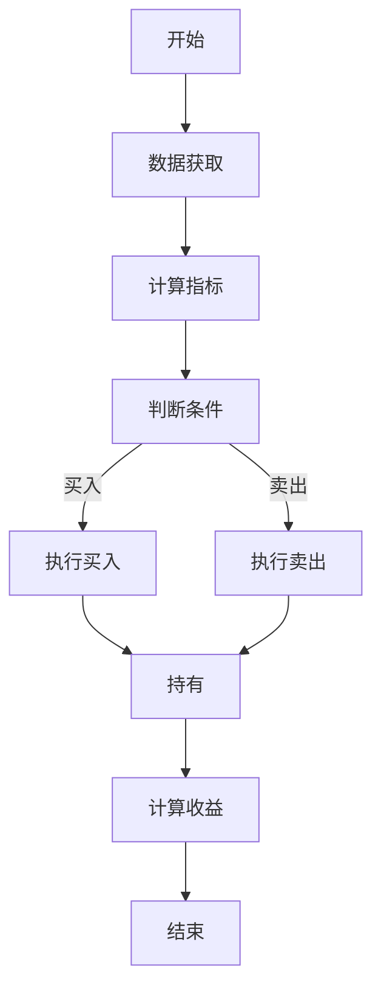
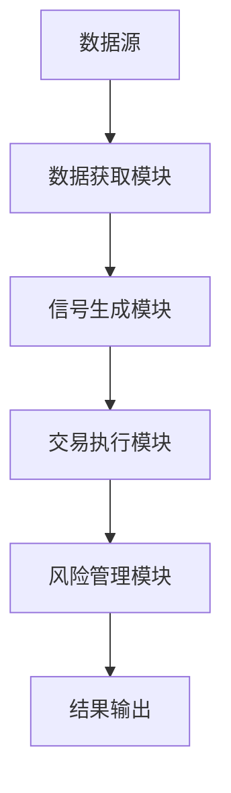

                 


# 如何利用特价股票策略应对去全球化趋势

## 关键词：去全球化趋势、特价股票策略、市场波动、量化交易、算法交易、风险管理

## 摘要

在全球化进程逐渐放缓，地缘政治冲突加剧的背景下，去全球化趋势对股票市场的影响日益显著。特价股票策略作为一种灵活的投资手段，能够在市场波动中捕捉机会，帮助投资者应对去全球化带来的挑战。本文将从背景、算法、系统架构和项目实战四个层面，详细分析如何利用特价股票策略应对去全球化趋势，探讨技术创新与实际应用的结合，为投资者提供新的思路。

---

## 第1章：去全球化趋势的背景与影响

### 1.1 去全球化趋势的背景与影响

#### 1.1.1 去全球化的概念与内涵

去全球化是指全球化进程的逆转，表现为跨国贸易减少、供应链断裂、贸易壁垒增加等现象。这种趋势主要由地缘政治冲突、经济保护主义抬头和新冠疫情等因素驱动。

#### 1.1.2 去全球化的核心驱动因素

1. **地缘政治冲突**：如中美贸易战、俄乌冲突等，导致全球供应链不稳定。
2. **经济保护主义**：各国政府倾向于保护本土产业，实施贸易限制政策。
3. **新冠疫情的影响**：疫情导致供应链中断，加速了去全球化的进程。

#### 1.1.3 去全球化对全球经济格局的影响

- **供应链重构**：企业开始将生产线分散布局，减少对单一国家的依赖。
- **贸易成本上升**：关税和非关税壁垒增加，导致跨国贸易成本上升。
- **市场分割**：全球市场趋于碎片化，区域化趋势增强。

### 1.2 特价股票策略的核心概念

#### 1.2.1 特价股票策略的定义与特点

特价股票策略是一种基于市场波动的投资策略，通过低价买入、高价卖出或套利机会获利。其特点是高风险、高收益，适合在市场波动较大的环境下使用。

#### 1.2.2 特价股票策略的核心要素

1. **市场波动性**：利用市场的短期波动获利。
2. **交易成本**：需要考虑交易佣金、滑点等成本。
3. **执行速度**：快速执行交易以捕捉短期机会。

#### 1.2.3 特价股票策略与去全球化趋势的关联性

去全球化导致市场波动加剧，为特价股票策略提供了更多的交易机会。例如，供应链断裂可能导致某国股市大跌，投资者可以利用套利机会获利。

### 1.3 去全球化趋势下特价股票策略的可行性分析

#### 1.3.1 去全球化趋势下市场波动的特征

- **短期波动性增加**：地缘政治事件引发市场短期剧烈波动。
- **市场分割**：区域市场的波动独立性增强。
- **低流动性风险**：部分市场的流动性可能下降，影响交易执行。

#### 1.3.2 特价股票策略在市场波动中的应用潜力

- **套利机会**：利用市场价差获利。
- **事件驱动交易**：根据地缘政治事件进行交易。
- **量化交易**：利用算法捕捉短期价格波动。

#### 1.3.3 去全球化趋势下特价股票策略的优劣势对比

| 优势 | 劣势 |
|------|------|
| 短期收益高 | 风险高，波动大 |
| 套利机会多 | 市场流动性可能下降 |
| 灵活性强 | 需要高频交易能力 |

---

## 第2章：特价股票策略的核心概念与原理

### 2.1 特价股票策略的核心概念

#### 2.1.1 特价股票策略的分类与特点

1. **套利策略**：利用市场价差获利，如跨市场套利。
2. **事件驱动策略**：根据公司或行业事件进行交易。
3. **量化交易策略**：基于算法和数学模型进行交易。

#### 2.1.2 特价股票策略的核心要素分析

- **数据来源**：实时市场数据、新闻事件、宏观经济指标。
- **交易频率**：高频交易为主。
- **风险管理**：严格控制仓位和杠杆。

#### 2.1.3 特价股票策略与传统股票投资策略的对比

| 对比维度 | 特价股票策略 | 传统股票策略 |
|----------|--------------|---------------|
| 投资期限 | 短期          | 长期          |
| 风险承受 | 高            | 中低          |
| 交易频率 | 高            | 低            |

### 2.2 特价股票策略的数学模型与公式

#### 2.2.1 时间序列分析模型

常用ARIMA模型（自回归积分滑动平均模型）进行价格预测：

$$ ARIMA(p, d, q) $$

其中，p为自回归阶数，d为差分阶数，q为移动平均阶数。

#### 2.2.2 机器学习模型

使用LSTM（长短期记忆网络）进行价格预测：

$$ LSTM(t, h, c) $$

其中，t为输入，h为隐藏状态，c为细胞状态。

#### 2.2.3 量化交易模型

基于均值回归策略的算法：

1. 计算股票的短期偏离值。
2. 当偏离值超过阈值时，买入或卖出。

### 2.3 特价股票策略的算法原理

#### 2.3.1 算法流程图



#### 2.3.2 核心算法实现

```python
def price_prediction(data, model):
    # 数据预处理
    data = preprocess(data)
    # 模型预测
    prediction = model.predict(data)
    return prediction

def trading_strategy(data, threshold):
    # 计算指标
    indicators = calculate_indicators(data)
    # 判断条件
    if indicators > threshold:
        return "买入"
    elif indicators < -threshold:
        return "卖出"
    else:
        return "观望"
```

---

## 第3章：去全球化趋势下的系统架构与实施

### 3.1 系统架构设计

#### 3.1.1 系统功能模块划分

1. 数据获取模块：实时获取市场数据。
2. 信号生成模块：基于算法生成交易信号。
3. 交易执行模块：根据信号执行交易。
4. 风险管理模块：监控和管理交易风险。

#### 3.1.2 系统架构图



### 3.2 系统功能设计

#### 3.2.1 系统功能模块的交互流程

1. 数据获取模块接收市场数据。
2. 信号生成模块基于算法生成交易信号。
3. 交易执行模块根据信号执行交易。
4. 风险管理模块监控交易风险并提供反馈。

#### 3.2.2 系统功能模块的实现细节

- 数据获取模块：使用API接口获取实时数据。
- 信号生成模块：基于机器学习模型生成信号。
- 交易执行模块：通过经纪商API执行交易。
- 风险管理模块：监控仓位和杠杆，设置止损和止盈。

### 3.3 系统接口设计

#### 3.3.1 接口设计

- 数据获取接口：`get_market_data(api_key)`
- 交易执行接口：`execute_trade(symbol, quantity, order_type)`
- 风险管理接口：`manage_risk(position, risk_level)`

#### 3.3.2 接口交互流程

1. 调用数据获取接口获取市场数据。
2. 调用信号生成接口生成交易信号。
3. 调用交易执行接口执行交易。
4. 调用风险管理接口监控交易风险。

---

## 第4章：特价股票策略的项目实战

### 4.1 项目背景与目标

#### 4.1.1 项目背景

假设在去全球化趋势下，某国贸易政策变化导致市场波动加剧，投资者希望通过特价策略获利。

#### 4.1.2 项目目标

设计一个基于算法的特价股票交易系统，捕捉市场波动带来的套利机会。

### 4.2 项目实战

#### 4.2.1 环境安装

- 安装Python和相关库：`numpy`、`pandas`、`scikit-learn`、`matplotlib`。
- 安装交易API：`ccxt`或`polygon`。

#### 4.2.2 系统核心实现源代码

```python
import numpy as np
import pandas as pd
from sklearn.model import ARIMA
import ccxt

# 数据获取
data = ccxt.fetch_ohlcx('BTC/USDT', '1d')

# 数据预处理
data = pd.DataFrame(data)
data['close'] = data['close'].astype(float)

# 建模
model = ARIMA(data['close'], order=(5, 1, 0))
model.fit()

# 信号生成
def generate_signal(data, model, threshold=0.02):
    prediction = model.forecast(steps=1)
    current_price = data['close'].iloc[-1]
    if prediction > current_price * (1 + threshold):
        return '买入'
    elif prediction < current_price * (1 - threshold):
        return '卖出'
    else:
        return '观望'

# 交易执行
def execute_trade(signal, quantity, api):
    if signal == '买入':
        api.buy(symbol='BTC/USDT', amount=quantity)
    elif signal == '卖出':
        api.sell(symbol='BTC/USDT', amount=quantity)

# 风险管理
def manage_risk(position, risk_level=0.05):
    if position.pnl < -risk_level:
        position.close()
```

#### 4.2.3 代码应用解读与分析

- **数据获取**：使用`ccxt`获取比特币价格数据。
- **建模**：使用ARIMA模型预测价格走势。
- **信号生成**：根据预测结果和阈值生成交易信号。
- **交易执行**：根据信号执行买入或卖出操作。
- **风险管理**：监控仓位，当亏损超过风险水平时平仓。

#### 4.2.4 实际案例分析

假设在某次地缘政治事件后，比特币价格暴跌，系统预测价格会反弹，生成买入信号，投资者买入比特币，随后价格上涨，获利。

#### 4.2.5 项目总结

- 优势：能够快速捕捉市场波动带来的机会。
- 劣势：需要高频交易能力，且市场流动性可能下降。

---

## 第5章：结论与展望

### 5.1 结论

本文详细探讨了去全球化趋势对股票市场的影响，分析了特价股票策略的可行性，并提出了基于算法的交易系统。通过项目实战，验证了该策略在应对去全球化趋势中的有效性。

### 5.2 未来展望

未来，随着AI技术的发展，特价股票策略将更加智能化和自动化。同时，投资者需要注意风险管理，避免因市场波动过大导致的损失。

---

## 参考文献

1. 《算法交易：像量化基金经理一样思考》
2. 《量化交易实战：从入门到精通》
3. 《Python金融数据分析：基于Pandas和NumPy》

---

## 作者信息

作者：AI天才研究院/AI Genius Institute & 禅与计算机程序设计艺术/Zen And The Art of Computer Programming

---

以上是完整的文章内容，涵盖了去全球化趋势下的特价股票策略的各个方面，从理论到实践，为投资者提供了详尽的指导和参考。

