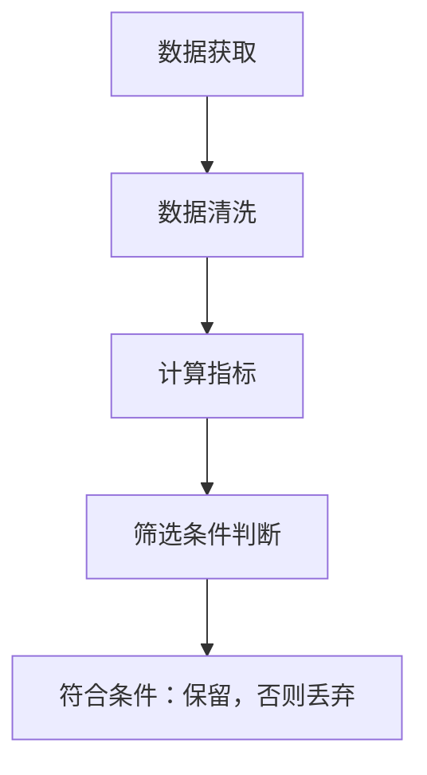

                 


# 如何利用特价股票策略应对去全球化风险

> 关键词：特价股票策略，去全球化风险，股票投资，风险管理，算法原理

> 摘要：本文深入分析了在去全球化风险加剧的背景下，如何通过特价股票策略进行有效的投资管理和风险控制。文章从背景介绍、核心概念、算法原理、系统架构设计到项目实战，全面阐述了特价股票策略的应用逻辑和实施方法。

---

## 第一部分：背景介绍

### 第1章：去全球化风险与特价股票策略概述

#### 1.1 去全球化风险的背景与现状

随着全球化进程的放缓，各国之间的经济依赖性降低，供应链重构和贸易壁垒增加成为新常态。这种趋势对金融市场产生了深远影响，尤其是在股票投资领域。投资者需要更加灵活和精准的投资策略来应对这种不确定性。

#### 1.2 特价股票策略的核心概念

特价股票策略是一种以低于股票内在价值的价格买入股票的投资策略，核心在于寻找市场低估的优质资产。这种策略在经济不确定性增加的背景下显得尤为重要，因为市场恐慌可能导致优质资产价格被低估。

#### 1.3 去全球化风险与特价股票策略的关联

去全球化风险可能导致市场波动加剧，个股表现分化。在这种情况下，特价股票策略可以帮助投资者在市场低谷期寻找被低估的优质资产，同时分散风险。

---

## 第二部分：核心概念与联系

### 第2章：去全球化风险与特价股票策略的核心联系

#### 2.1 去全球化风险对股票市场的影响

- **行业分布变化**：供应链本地化和区域化的趋势可能导致某些行业受益，而另一些行业则可能受到负面影响。
- **个股估值波动**：去全球化可能导致某些个股的估值大幅波动，尤其是那些依赖全球供应链的企业。
- **市场情绪影响**：去全球化可能导致市场情绪波动，投资者可能因恐慌而抛售资产，导致价格被低估。

#### 2.2 特价股票策略在应对去全球化风险中的作用

- **分散风险**：通过投资多个行业的低估股票，降低单一行业风险。
- **捕捉机会**：在市场恐慌时，特价股票策略可以帮助投资者发现被低估的优质资产。
- **长期收益**：特价股票策略注重长期价值，与去全球化风险下的市场波动形成互补。

---

## 第三部分：算法原理讲解

### 第3章：特价股票策略的算法原理

#### 3.1 特价股票筛选算法

- **数据获取与预处理**：从数据库中获取股票的市盈率、市净率、股息率等指标，并进行清洗和标准化。
- **筛选标准**：设定筛选条件，如市盈率低于行业平均水平，市净率低于历史平均水平等。
- **流程图**：使用Mermaid绘制筛选流程图，展示数据处理和筛选逻辑。



#### 3.2 去全球化风险评估算法

- **风险因子识别**：识别影响股票的去全球化风险因子，如国际贸易壁垒、供应链本地化等。
- **风险评估模型**：构建风险评估模型，对股票进行风险评分。
- **模型优化**：通过历史数据验证模型，调整参数以提高准确性。

#### 3.3 数学模型与公式

- **市盈率计算**：$$\text{市盈率} = \frac{\text{股价}}{\text{每股收益}}$$
- **市净率计算**：$$\text{市净率} = \frac{\text{股价}}{\text{每股净资产}}$$
- **风险评分公式**：$$\text{风险评分} = \alpha \times \text{市盈率} + \beta \times \text{市净率} + \gamma \times \text{股息率}$$

---

## 第四部分：系统分析与架构设计

### 第4章：系统架构设计

#### 4.1 问题场景介绍

投资者需要一个系统来实时监控市场变化，自动筛选特价股票，并评估去全球化风险。

#### 4.2 系统功能设计

- **数据采集模块**：采集股票数据。
- **风险评估模块**：评估股票的去全球化风险。
- **策略执行模块**：根据策略筛选股票并生成投资建议。

#### 4.3 系统架构图


---

## 第五部分：项目实战

### 第5章：实战案例分析

#### 5.1 环境安装与数据准备

- **数据来源**：使用历史股票数据和经济指标数据。
- **工具选择**：使用Python和Pandas进行数据分析。

#### 5.2 核心实现代码

```python
import pandas as pd

def calculate_intrinsic_value(stock_data):
    # 计算内在价值
    stock_data['intrinsic_value'] = stock_data['现金流'] / stock_data['折现率']
    return stock_data

# 示例数据
data = {'现金流': [100, 200, 300], '折现率': [0.1, 0.1, 0.1]}
df = pd.DataFrame(data)
result = calculate_intrinsic_value(df)
print(result)
```

#### 5.3 案例分析与解读

分析某行业在去全球化背景下的股票表现，展示特价股票策略的应用效果。

---

## 第六部分：总结与展望

### 第6章：总结与最佳实践

#### 6.1 最佳实践

- 定期评估投资组合，调整策略。
- 结合多种策略，分散风险。

#### 6.2 未来展望

随着技术进步，特价股票策略将更加智能化和个性化。

---

## 作者：AI天才研究院/AI Genius Institute & 禅与计算机程序设计艺术 /Zen And The Art of Computer Programming

