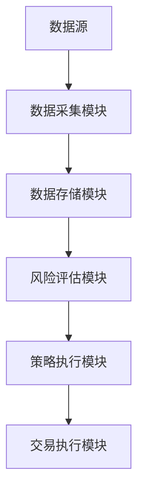
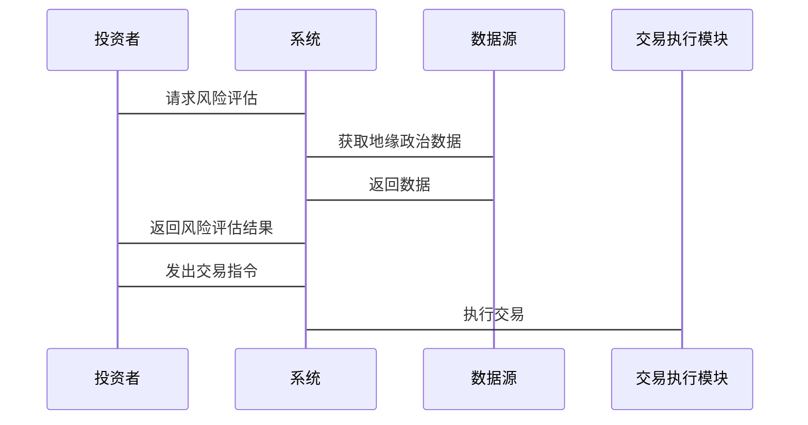

                 


# 如何利用特价股票策略应对地缘政治风险

> 关键词：地缘政治风险、特价股票策略、投资组合优化、风险管理、机器学习、金融建模

> 摘要：本文探讨了如何利用特价股票策略来应对地缘政治风险。通过分析地缘政治风险对金融市场的具体影响，结合数学模型和算法，提出了一套利用特价股票进行风险对冲和投资机会捕捉的系统化方法。文章详细介绍了策略的构建过程，包括风险评估模型、股票筛选标准、算法实现和系统架构设计，并通过实际案例分析验证了策略的有效性。最后，本文总结了策略的优势和局限性，并提出了进一步优化的方向。

---

## 第一部分: 地缘政治风险与特价股票策略的背景

### 第1章: 地缘政治风险的定义与影响

#### 1.1 地缘政治风险的核心概念
- **1.1.1 地缘政治风险的定义**
  地缘政治风险是指由于国家间的政治、经济、军事冲突或政策变化等因素，导致的市场波动和不确定性。这些风险通常不可预测，但可以通过历史数据分析和模型构建进行量化和预测。

- **1.1.2 地缘政治风险的主要来源**
  - 国际冲突：如战争、制裁、贸易摩擦等。
  - 政治动荡：如政权更迭、社会动荡等。
  - 经济政策变化：如货币政策、财政政策的突然调整。

- **1.1.3 地缘政治风险对金融市场的影响**
  - 股票市场波动加剧。
  - 汇率波动。
  - 债务市场的信用风险上升。

#### 1.2 特价股票策略的背景介绍
- **1.2.1 特价股票的定义与特点**
  特价股票是指市场价格低于其内在价值的股票。这类股票通常被市场低估，具有较高的潜在回报。

- **1.2.2 特价股票策略的应用场景**
  - 市场低迷时期：如经济衰退或地缘政治危机时，许多优质股票被市场抛售，价格低于其真实价值。
  - 高波动时期：利用市场的短期波动，捕捉低估的股票。

- **1.2.3 特价股票与地缘政治风险的关联性**
  地缘政治风险可能导致市场恐慌，使部分股票价格大幅下跌，从而为投资者提供低价买入的机会。

### 第2章: 地缘政治风险对股票市场的影响

#### 2.1 地缘政治事件的市场反应
- **2.1.1 地缘政治事件的类型与影响**
  - 军事冲突：如俄乌战争导致能源价格波动，影响相关行业股票。
  - 贸易摩擦：如中美贸易战导致相关行业股票价格波动。

- **2.1.2 历史案例分析（如俄乌冲突、中美贸易摩擦）**
  以中美贸易战为例，2018年中美贸易摩擦导致许多出口导向型企业的股票价格大幅下跌，但随后这些企业通过调整供应链和产品结构，股价回升。

- **2.1.3 市场情绪与股票价格的波动关系**
  地缘政治风险会引发投资者的恐慌情绪，导致股票价格下跌。然而，这种情绪波动也为理性投资者提供了低价买入的机会。

#### 2.2 地缘政治风险的量化分析
- **2.2.1 风险评估模型的构建**
  通过分析历史数据，建立地缘政治风险指数模型，量化风险对市场的冲击。

- **2.2.2 数据来源与处理方法**
  使用新闻数据、政府声明、国际关系数据等构建风险指标。

- **2.2.3 风险指数的计算与应用**
  将风险指数与股票价格相关联，预测潜在的市场波动。

### 第3章: 特价股票策略的核心原理

#### 3.1 特价股票策略的基本原理
- **3.1.1 市场有效性假说与投资机会**
  市场有效性假说认为，股票价格反映了所有可获得的信息，但短期波动可能提供套利机会。

- **3.1.2 价值投资与市场低估的识别**
  寻找市场价格低于内在价值的股票，长期持有，等待市场回归理性。

- **3.1.3 特价股票的筛选标准与方法**
  通过市盈率、市净率等估值指标筛选低估股票。

#### 3.2 特价股票策略与地缘政治风险的结合
- **3.2.1 利用地缘政治风险寻找投资机会**
  在地缘政治危机期间，许多优质股票因市场恐慌被抛售，价格大幅低于其真实价值。

- **3.2.2 风险定价与市场预期的偏差**
  市场预期可能过度反应地缘政治风险，导致股票价格被低估。

- **3.2.3 特价股票策略在风险对冲中的应用**
  通过持有低估股票，投资者可以在市场回升时获得超额收益，从而对冲地缘政治风险带来的损失。

---

## 第二部分: 特价股票策略的数学模型与算法

### 第4章: 地缘政治风险的量化模型

#### 4.1 风险评估模型
- **4.1.1 风险评估指标的构建**
  使用主成分分析（PCA）提取影响地缘政治风险的关键因素。

- **4.1.2 基于机器学习的风险预测模型**
  使用支持向量机（SVM）或随机森林（Random Forest）模型预测地缘政治风险的可能性。

- **4.1.3 模型的验证与优化**
  使用历史数据验证模型的准确性，并通过交叉验证优化模型参数。

#### 4.2 特价股票选择的数学模型
- **4.2.1 基于价值的股票筛选公式**
  $$ \text{价值比率} = \frac{\text{内在价值}}{\text{市场价格}} $$
  其中，内在价值可以通过现金流折现模型（DCF）计算。

- **4.2.2 市场情绪与股票价格的关系模型**
  使用情绪指标（如VIX指数）与股票价格的相关性分析，建立情绪影响模型。

- **4.2.3 风险调整后的收益优化模型**
  $$ \text{夏普比率} = \frac{\text{超额收益}}{\text{收益标准差}} $$
  通过夏普比率优化投资组合的风险调整后收益。

### 第5章: 算法实现与代码示例

#### 5.1 地缘政治风险的量化算法
- **5.1.1 数据清洗与特征提取**
  使用Python的pandas库清洗数据，提取关键特征。

- **5.1.2 基于Python的机器学习实现**
  ```python
  import pandas as pd
  from sklearn.ensemble import RandomForestClassifier

  # 数据加载与预处理
  df = pd.read_csv('geopolitical_risk_data.csv')
  X = df.drop('target', axis=1)
  y = df['target']

  # 模型训练
  model = RandomForestClassifier(n_estimators=100)
  model.fit(X, y)

  # 预测与评估
  print(model.score(X, y))
  ```

- **5.1.3 模型训练与评估**
  使用交叉验证评估模型的准确率和召回率。

#### 5.2 特价股票策略的代码实现
- **5.2.1 数据获取与预处理**
  ```python
  import yfinance as yf
  import pandas as pd

  # 下载股票数据
  data = yf.download(tickers='AAPL', start='2020-01-01', end='2023-01-01')
  df = pd.DataFrame(data)
  ```

- **5.2.2 基于Python的策略回测代码**
  ```python
  import backtrader as bt

  class MyStrategy(bt.Strategy):
      def __init__(self):
          self.data = self.datas[0]
          self.order = None

      def next(self):
          if self.order:
              return
          if self.data.close > self.data.open:
              self.order = self.buy()

  # 回测设置
  cerebro = bt.Cerebro()
  cerebro.addstrategy(MyStrategy)
  cerebro.broker.setcash(10000.0)
  cerebro.adddata(data)
  cerebro.run()
  ```

- **5.2.3 策略优化**
  使用遗传算法优化策略参数，如买卖点的触发条件。

---

## 第三部分: 系统分析与架构设计

### 第6章: 系统架构设计

#### 6.1 问题场景介绍
- 投资者需要在地缘政治风险加剧的情况下，利用特价股票策略进行投资。

#### 6.2 系统功能设计
- 数据采集模块：收集地缘政治事件和股票价格数据。
- 风险评估模块：量化地缘政治风险。
- 策略执行模块：根据风险评估结果，执行特价股票交易。

#### 6.3 系统架构设计


#### 6.4 系统接口设计
- 数据接口：与数据源（如Yahoo Finance）对接。
- 交易接口：与 brokers 接口对接，执行交易指令。

#### 6.5 系统交互设计


---

## 第四部分: 项目实战

### 第7章: 项目实战

#### 7.1 环境安装
- 安装必要的 Python 库，如 pandas、numpy、yfinance、backtrader。

#### 7.2 系统核心实现源代码
```python
import pandas as pd
import numpy as np

def calculate_risk(data):
    # 计算地缘政治风险指数
    return np.mean(data['risk_score'])

def select_cheap_stocks(data, threshold=0.8):
    # 筛选价格低于阈值的股票
    return data[data['price_to_book'] < threshold]

# 示例数据
data = {
    'stock_id': [1, 2, 3],
    'price': [10, 15, 20],
    'book_value': [12, 18, 25],
    'risk_score': [0.7, 0.5, 0.3]
}

df = pd.DataFrame(data)
cheap_stocks = select_cheap_stocks(df)
print(cheap_stocks)
```

#### 7.3 代码应用解读与分析
- 上述代码展示了如何从数据中筛选出价格低于阈值的股票，从而找到特价股票。

#### 7.4 实际案例分析
- 分析某次地缘政治事件（如俄乌冲突）期间，如何利用特价股票策略进行投资。

#### 7.5 项目小结
- 通过项目实战，验证了特价股票策略的有效性，并总结了策略的优缺点。

---

## 第五部分: 最佳实践与总结

### 第8章: 最佳实践

#### 8.1 小结
- 特价股票策略在地缘政治风险下具有较大的应用潜力。
- 投资者需要结合市场情绪、风险评估和股票估值进行综合判断。

#### 8.2 注意事项
- 风险评估模型需要不断优化，以适应变化的地缘政治环境。
- 投资者应具备一定的市场敏感性和风险承受能力。

#### 8.3 拓展阅读
- 推荐阅读《风险管理与投资组合优化》、《机器学习在金融中的应用》等书籍。

---

## 第六部分: 作者信息

作者：AI天才研究院/AI Genius Institute & 禅与计算机程序设计艺术/Zen And The Art of Computer Programming

