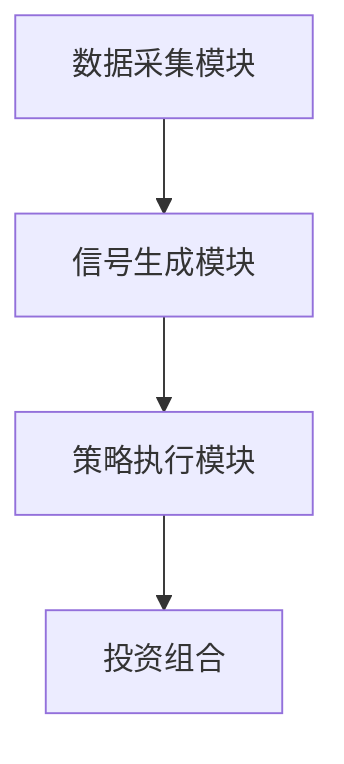
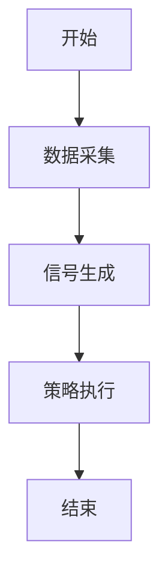

                 


# 如何利用特价股票策略应对市场泡沫

---

## 关键词：
市场泡沫，特价股票，投资策略，风险管理，数学模型，系统架构

---

## 摘要：
市场泡沫是金融市场的常见现象，往往伴随着股票价格的剧烈波动。在这种情况下，投资者需要一种有效的策略来应对市场波动，保护资产并抓住潜在的收益机会。特价股票策略是一种基于市场周期和股票估值的投资方法，能够在市场泡沫期间帮助投资者识别低估的股票，制定合理的投资组合，并通过科学的系统架构实现自动化管理。本文将从市场泡沫的形成、特价股票策略的核心原理、数学模型的设计、系统架构的实现以及实际案例分析等多个方面，详细探讨如何利用特价股票策略应对市场泡沫。

---

## 第1章：市场泡沫的形成与影响

### 1.1 市场泡沫的定义与特征
市场泡沫是指资产价格在短时间内迅速上涨，远远超过其实际价值的现象。这种现象通常由投资者的非理性行为、过度杠杆和市场情绪推动。市场泡沫的特征包括价格虚高、交易量激增、市场参与者情绪狂热等。

#### 1.1.1 市场泡沫的定义
市场泡沫是金融市场中的一种异常现象，通常表现为资产价格与实际价值的严重偏离。市场泡沫的形成往往与投资者的乐观情绪、信息不对称和市场操纵等因素密切相关。

#### 1.1.2 市场泡沫的形成机制
市场泡沫的形成机制可以分为以下几个阶段：
1. **信息传播**：市场参与者通过各种渠道获取信息，形成对资产价值的乐观预期。
2. **价格攀升**：投资者基于乐观预期不断推高资产价格，导致价格与实际价值严重脱节。
3. **市场情绪加剧**：随着价格的上涨，更多的投资者加入，市场情绪进一步升温。
4. **泡沫破裂**：当市场情绪达到顶峰后，价格开始快速下跌，泡沫破裂。

#### 1.1.3 市场泡沫对投资者的影响
市场泡沫对投资者的影响是双重的：
- **正面影响**：在泡沫形成阶段，投资者可以通过高位卖出资产获得收益。
- **负面影响**：当泡沫破裂时，资产价格迅速下跌，投资者可能面临重大损失。

---

### 1.2 特价股票的定义与特点
特价股票是指在市场泡沫期间，价格被市场低估的股票。这些股票通常具有较高的安全边际，能够在市场调整时为投资者提供保护。

#### 1.2.1 特价股票的定义
特价股票是指市场价格远低于其内在价值的股票。这类股票通常被市场忽视或低估，但在市场调整后往往能够恢复其真实价值。

#### 1.2.2 特价股票的核心特点
- **低估值**：市场价格远低于公司的真实价值。
- **高安全边际**：即使市场出现波动，股票价格下跌的空间有限。
- **潜在收益**：在市场调整后，股票价格可能恢复，为投资者带来收益。

#### 1.2.3 特价股票与普通股票的区别
| 特性 | 特价股票 | 普通股票 |
|------|----------|----------|
| 价格 | 远低于内在价值 | 接近或高于内在价值 |
| 风险 | 低 | 高 |
| 收益 | 高 | 中等 |

---

## 第2章：特价股票策略的基本原理

### 2.1 特价股票策略的背景
#### 2.1.1 市场波动与投资机会
市场波动为投资者提供了低价买入优质资产的机会。特别是在市场泡沫期间，特价股票的出现为投资者提供了潜在的高收益机会。

#### 2.1.2 特价股票策略的起源与发展
特价股票策略起源于价值投资理念，强调以低于内在价值的价格买入股票。该策略在市场泡沫期间尤为有效，因为市场波动为投资者提供了寻找低估资产的机会。

---

### 2.2 特价股票策略的核心概念
#### 2.2.1 市场周期与投资机会
市场周期是影响股票价格的重要因素。投资者需要根据市场周期的变化调整投资策略，抓住特价股票的投资机会。

#### 2.2.2 特价股票的识别与选择
识别特价股票的关键在于评估股票的内在价值。投资者需要通过基本面分析和估值指标（如市盈率、市净率等）来判断股票是否被低估。

#### 2.2.3 特价股票策略的风险与收益
- **风险**：市场波动可能导致股票价格进一步下跌。
- **收益**：在市场调整后，股票价格可能恢复，为投资者带来收益。

---

### 2.3 特价股票策略与市场周期的关系
#### 2.3.1 市场周期的定义与阶段划分
市场周期通常分为四个阶段：复苏、上升、高峰和下跌。在不同阶段，投资者应采取不同的投资策略。

#### 2.3.2 不同市场周期中的投资策略
- **牛市**：适合采取积极的投资策略，寻找高价股票。
- **熊市**：适合采取保守的投资策略，寻找特价股票。

---

## 第3章：市场周期与特价股票策略的结合

### 3.1 市场周期的分析
#### 3.1.1 市场周期的定义与阶段划分
市场周期通常分为四个阶段：复苏、上升、高峰和下跌。在不同阶段，投资者应采取不同的投资策略。

#### 3.1.2 不同市场周期中的投资策略
- **牛市**：适合采取积极的投资策略，寻找高价股票。
- **熊市**：适合采取保守的投资策略，寻找特价股票。

---

### 3.2 特价股票策略在市场周期中的应用
#### 3.2.1 牛市中的特价股票策略
在牛市中，市场情绪高涨，股票价格普遍上涨。投资者应警惕市场泡沫的形成，并寻找那些价格远高于内在价值的股票。

#### 3.2.2 熊市中的特价股票策略
在熊市中，市场情绪低落，股票价格普遍下跌。投资者可以利用市场恐慌，低价买入被低估的股票。

#### 3.2.3 震荡市中的特价股票策略
在震荡市中，股票价格波动剧烈。投资者应保持冷静，根据市场周期和股票估值，灵活调整投资策略。

---

## 第4章：特价股票策略的核心概念

### 4.1 特价股票策略的数学模型
#### 4.1.1 市场估值模型
市场估值模型是评估股票内在价值的重要工具。常用的市场估值模型包括市盈率（PE）、市净率（PB）和市销率（PS）等。

#### 4.1.2 特价股票的量化标准
- **市盈率（PE）**：市盈率 = 股票价格 / 每股收益。
- **市净率（PB）**：市净率 = 股票价格 / 每股净资产。
- **市销率（PS）**：市销率 = 股票价格 / 每股销售收入。

#### 4.1.3 市场波动与股票价格的关系
股票价格与市场波动密切相关。市场波动越剧烈，股票价格的波动性越高。

---

### 4.2 特价股票策略的算法原理
#### 4.2.1 市场信号的生成算法
市场信号的生成算法是基于市场波动和股票估值指标，生成买入或卖出信号。

#### 4.2.2 特价股票的筛选算法
特价股票的筛选算法是基于股票估值指标，筛选出那些价格远低于内在价值的股票。

#### 4.2.3 投资组合的优化算法
投资组合的优化算法是基于风险与收益的权衡，优化投资组合。

---

## 第5章：特价股票策略的系统架构设计

### 5.1 系统功能设计
#### 5.1.1 数据采集模块
数据采集模块负责采集市场数据，包括股票价格、成交量等。

#### 5.1.2 信号生成模块
信号生成模块负责根据市场数据生成买入或卖出信号。

#### 5.1.3 策略执行模块
策略执行模块负责根据信号生成投资组合，并执行交易。

---

### 5.2 系统架构设计
#### 5.2.1 系统架构图（Mermaid）


#### 5.2.2 系统交互流程图（Mermaid）


---

## 第6章：特价股票策略的数学模型与公式

### 6.1 市场估值模型
#### 6.1.1 市盈率（PE）计算公式
$$ PE = \frac{\text{股票价格}}{\text{每股收益}} $$

#### 6.1.2 市净率（PB）计算公式
$$ PB = \frac{\text{股票价格}}{\text{每股净资产}} $$

#### 6.1.3 市销率（PS）计算公式
$$ PS = \frac{\text{股票价格}}{\text{每股销售收入}} $$

---

### 6.2 特价股票筛选公式
#### 6.2.1 市场估值折扣率公式
$$ \text{折扣率} = \frac{\text{股票价格}}{\text{内在价值}} $$

#### 6.2.2 股票价格波动率公式
$$ \text{波动率} = \sqrt{\text{方差}} $$

#### 6.2.3 股票流动性指标公式
$$ \text{流动性指标} = \frac{\text{成交量}}{\text{股票价格}} $$

---

## 第7章：特价股票策略的项目实战

### 7.1 环境安装与配置
#### 7.1.1 数据分析工具安装
- 安装Python编程语言和相关库（如Pandas、NumPy）。

#### 7.1.2 系统开发环境配置
- 安装Jupyter Notebook或其他数据分析工具。

---

### 7.2 系统核心实现
#### 7.2.1 数据采集与处理代码
```python
import pandas as pd
import requests

# 数据采集
url = "https://example.com/stock_data"
data = requests.get(url).json()
df = pd.DataFrame(data)
```

#### 7.2.2 信号生成算法代码
```python
def generate_signal(df):
    # 计算市盈率
    df['PE'] = df['价格'] / df['每股收益']
    # 生成信号
    df['信号'] = '买入' if df['PE'] < 15 else '卖出'
    return df
```

#### 7.2.3 投资组合优化代码
```python
import numpy as np

def optimize_portfolio(returns, weights):
    # 计算投资组合的收益
    portfolio_return = np.dot(returns, weights)
    return portfolio_return
```

---

## 第8章：最佳实践与注意事项

### 8.1 投资策略的注意事项
#### 8.1.1 风险控制策略
投资者应设定止损点，以避免重大损失。

#### 8.1.2 仓位管理原则
投资者应根据市场情况调整仓位，避免过度集中投资。

#### 8.1.3 交易纪律的重要性
投资者应遵守交易纪律，避免情绪化交易。

---

### 8.2 实战案例分析
#### 8.2.1 特价股票策略的成功案例
在2020年新冠疫情爆发期间，许多股票价格大幅下跌，投资者可以利用特价股票策略，低价买入优质股票，在市场恢复后获得收益。

#### 8.2.2 特价股票策略的失败案例
如果投资者在市场顶部买入高价股票，可能会在市场下跌时面临重大损失。

---

## 第9章：小结与展望

### 9.1 小结
特价股票策略是一种有效的市场应对策略，能够在市场泡沫期间帮助投资者保护资产并抓住潜在的收益机会。通过科学的系统架构和数学模型，投资者可以更有效地识别特价股票，并制定合理的投资组合。

### 9.2 展望
随着金融市场的发展，特价股票策略将不断完善，投资者可以通过技术创新和数据分析，进一步优化投资策略，提高投资收益。

---

## 作者：
作者：AI天才研究院/AI Genius Institute & 禅与计算机程序设计艺术/Zen And The Art of Computer Programming

---

# 结束语：
感谢您的阅读！希望本文能够为您提供有价值的信息和启发。如果您有任何问题或建议，请随时与我们联系。

