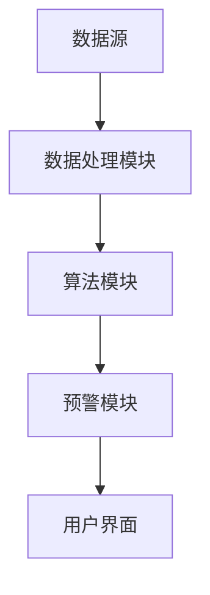
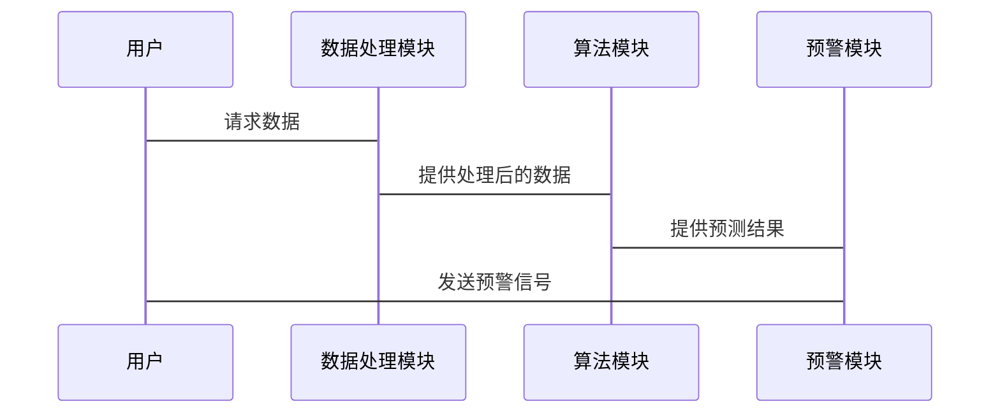

                 


# 如何利用特价股票策略应对市场泡沫风险

> 关键词：特价股票策略、市场泡沫、风险管理、量化分析、投资策略

> 摘要：本文将详细介绍如何利用特价股票策略来应对市场泡沫风险。通过分析市场泡沫的形成机制、特价股票的定义与分类，以及如何通过量化分析和算法实现来制定有效的投资策略，帮助投资者在市场波动中保护和增强投资收益。本文还将结合实际案例和系统架构设计，提供可操作的实战指南，并总结最佳实践和风险管理技巧。

---

## 第一部分：市场泡沫与投资风险的背景介绍

### 第1章：市场泡沫的定义与特征

#### 1.1 市场泡沫的定义与形成机制

- **1.1.1 什么是市场泡沫**
  市场泡沫是指资产价格在短期内远高于其内在价值的现象。这种现象通常由投资者的非理性行为、过度乐观和羊群效应驱动。

- **1.1.2 泡沫形成的经济机制**
  市场泡沫的形成通常涉及以下几个阶段：
  1. **初始阶段**：资产价格因利好消息或市场情绪而小幅上涨。
  2. **膨胀阶段**：价格快速上涨，吸引更多投资者进入，形成正反馈循环。
  3. **泡沫阶段**：价格远超基本面，市场参与者基于价格将继续上涨的预期进行交易。
  4. **破裂阶段**：预期落空，价格迅速下跌，导致市场崩盘。

- **1.1.3 泡沫与周期性波动的区别**
  - 泡沫是价格与价值严重脱节，通常由非理性因素驱动。
  - 周期性波动是市场正常波动的一部分，与经济周期密切相关。

#### 1.2 投资者行为对市场泡沫的影响

- **1.2.1 羊群效应的定义与表现**
  羊群效应是指投资者在市场趋势中盲目跟风的行为，通常导致资产价格的非理性波动。

- **1.2.2 非理性繁荣的典型案例**
  - 2000年互联网泡沫：科技股价格远超其实际价值，最终导致大规模崩盘。
  - 2008年次贷危机：房地产市场的过度投机导致全球金融危机。

- **1.2.3 投资者情绪与市场波动的关系**
  投资者情绪通过影响交易量和价格走势，加剧市场的波动性。情绪高涨时，市场容易出现泡沫；情绪低落时，市场容易出现超跌反弹。

---

## 第二部分：特价股票策略的核心概念

### 第2章：特价股票策略的基本原理

#### 2.1 特价股票的定义与分类

- **2.1.1 低价股的定义与特征**
  - 低价股是指价格低于市场平均水平的股票，通常具有较高的股息收益率和较低的市盈率。

- **2.1.2 垂直整合型股票的特性**
  - 这类股票通常在产业链中具有较高的控制力，能够通过内部协同降低成本，提高盈利能力。

- **2.1.3 周期性股票的投资机会**
  - 周期性股票在市场低谷时价格被低估，而在市场复苏时具有较大的上涨潜力。

#### 2.2 特价股票与市场泡沫的关系

- **2.2.1 泡沫市场中低价股的投资价值**
  在泡沫市场中，高价股可能严重高估，而低价股可能被市场忽视，具有较大的增值潜力。

- **2.2.2 市场泡沫破裂时的防御性投资策略**
  - 在市场泡沫破裂时，低价股通常跌幅较小，能够为投资者提供一定的安全垫。

- **2.2.3 特价股票在市场周期中的位置**
  - 特价股票通常在市场底部阶段具有较高的投资价值，而在市场顶部阶段可能因价格过低而被市场忽视。

---

## 第三部分：市场泡沫风险的量化分析

### 第3章：市场泡沫量化指标与模型

#### 3.1 市场估值指标

- **3.1.1 市盈率（P/E）的计算与应用**
  市盈率 = 股票价格 / 每股收益（EPS）
  - 高市盈率可能意味着市场泡沫，低市盈率可能意味着低估。

- **3.1.2 市净率（P/B）的计算与应用**
  市净率 = 股票价格 / 每股净资产（BPS）
  - 低市净率通常意味着股票价格被低估。

- **3.1.3 市场整体估值的指标分析**
  - 使用市场整体市盈率和市净率来判断市场整体的估值水平。

#### 3.2 市场情绪指标

- **3.2.1 投资者情绪指数（如VIX指数）**
  VIX指数是衡量市场波动性和投资者情绪的重要指标，通常被称为“恐慌指数”。

- **3.2.2 媒体情绪分析**
  - 通过分析媒体对市场的报道和评论，判断市场情绪的变化。

- **3.2.3 交易量与价格的关系**
  - 高交易量伴随价格上涨可能表明市场情绪高涨，存在泡沫风险。
  - 高交易量伴随价格下跌可能表明市场情绪恐慌，存在超跌反弹的机会。

---

## 第四部分：特价股票策略的算法与实现

### 第4章：基于数学模型的市场泡沫预警系统

#### 4.1 数据采集与处理

- 使用Yahoo Finance API获取股票数据。
- 数据清洗：处理缺失值和异常值。

#### 4.2 特征提取与指标计算

- 计算市盈率、市净率等估值指标。
- 计算VIX指数等市场情绪指标。

#### 4.3 泡沫风险量化模型

- 使用主成分分析（PCA）提取主要特征。
- 构建逻辑回归模型，预测市场泡沫风险。

#### 4.4 特价股票筛选算法

- 基于量化指标筛选低价股。
- 使用遗传算法优化筛选条件。

#### 4.5 策略信号与触发机制

- 设置止损点和止盈点。
- 根据市场情绪指标动态调整投资组合。

---

## 第五部分：系统分析与架构设计

### 第5章：系统架构设计与实现

#### 5.1 系统功能设计

- 数据源：Yahoo Finance API、社交媒体数据。
- 数据处理模块：清洗、特征提取。
- 算法模块：泡沫风险预测、股票筛选。
- 预警模块：触发买卖信号。
- 用户界面：可视化界面展示结果。

#### 5.2 系统架构图



#### 5.3 系统交互流程



---

## 第六部分：项目实战

### 第6章：特价股票策略的实现

#### 6.1 环境配置

- 安装必要的Python库：pandas、numpy、scikit-learn。

#### 6.2 数据获取与处理

```python
import pandas as pd
import numpy as np
import yfinance as yf

# 下载数据
data = yf.download(tickers='AAPL', period='5y')
data.head()
```

#### 6.3 策略实现

```python
def calculate_valuation_indicators(data):
    # 计算市盈率
    pe = data['Close'] / data['EPS']
    # 计算市净率
    pb = data['Close'] / data['Book Value']
    return pe, pb

pe, pb = calculate_valuation_indicators(data)
```

#### 6.4 回测与优化

```python
def backtest_strategy(data, pe, pb):
    # 策略：当市盈率低于历史均值时买入
    data['signal'] = 0
    data['signal'][pe < pe.mean()] = 1
    data['signal'][pe > pe.mean()] = -1
    # 计算收益
    data['return'] = data['signal'].shift(1) * data['Return']
    return data

backtest_results = backtest_strategy(data, pe, pb)
```

---

## 第七部分：最佳实践与风险管理

### 第7章：策略执行中的注意事项

#### 7.1 风险管理技巧

- 设置止损点：当股价下跌超过一定比例时立即卖出。
- 分散投资：避免将所有资金投入单一股票或行业。

#### 7.2 策略调整与优化

- 根据市场变化调整筛选条件。
- 定期回顾和优化策略参数。

#### 7.3 成功与失败案例分析

- 成功案例：2008年金融危机期间，投资低价股成功避险。
- 失败案例：2000年互联网泡沫破裂，高价科技股大幅下跌。

---

## 第八部分：附录

### 第8章：数据来源与工具推荐

- 数据来源：Yahoo Finance API、社交媒体数据。
- 工具推荐：Python、pandas、numpy、Matplotlib、Seaborn。

---

## 作者：AI天才研究院/AI Genius Institute & 禅与计算机程序设计艺术 /Zen And The Art of Computer Programming

---

以上是《如何利用特价股票策略应对市场泡沫风险》的完整目录大纲，涵盖了从理论分析到实际操作的各个方面，帮助投资者系统地理解和应用特价股票策略，以应对市场泡沫风险。

