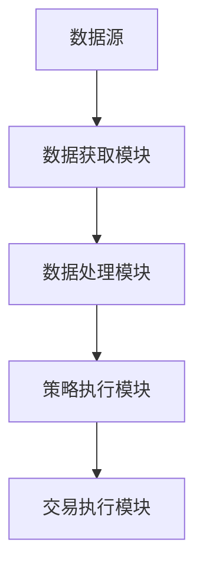

                 


# 如何利用特价股票策略应对市场结构性变化

> **关键词**：特价股票、市场结构性变化、技术分析、风险管理、投资策略  
> **摘要**：本文探讨了如何利用特价股票策略应对市场结构性变化，分析了特价股票的定义、策略类型、技术分析方法、市场周期对策略的影响，以及如何通过系统设计和风险管理优化投资效果。

---

## 第一部分：特价股票策略的背景与概念

### 第1章：特价股票策略概述

#### 1.1 特价股票的定义与特点

##### 1.1.1 特价股票的定义
特价股票是指价格远低于市场平均水平的股票，通常具有较高的市盈率、市净率或股息收益率。这些股票可能因市场低估或公司困境而被忽视，但潜在的反弹空间较大。

##### 1.1.2 特价股票的特点
- **低估值**：市盈率（P/E）和市净率（P/B）远低于行业平均水平。
- **高股息率**：部分公司提供较高的股息回报，吸引价值投资者。
- **高波动性**：价格波动较大，容易受市场情绪影响。
- **市场关注度低**：交易量小，信息不对称较高。

##### 1.1.3 特价股票的市场定位
特价股票通常出现在市场低迷期，尤其是在熊市或行业衰退期，投资者可能因公司财务状况不佳或行业前景黯淡而抛售股票，导致价格被低估。

---

#### 1.2 特价股票策略的适用性与边界

##### 1.2.1 特价股票策略的适用场景
- **市场低迷期**：熊市或行业衰退期，低价股票可能因市场反弹而回升。
- **价值投资**：适合长期投资者，寻找被市场低估的优质公司。
- **短期反弹**：适合技术投资者，利用价格波动进行短期操作。

##### 1.2.2 特价股票策略的边界与限制
- **市场周期性**：策略在市场底部或复苏期效果显著，而在市场顶部可能面临较大风险。
- **公司基本面**：部分特价股票可能是“价值陷阱”，即公司基本面严重恶化，无法恢复。
- **流动性风险**：部分低价股票交易量小，可能导致买卖价差较大或难以快速变现。

##### 1.2.3 特价股票策略的优劣
- **优势**：潜在收益高，适合长期投资。
- **劣势**：风险较高，需要严格筛选公司基本面。

---

## 第二部分：技术分析与市场周期

### 第2章：技术分析基础

#### 2.1 K线图与形态分析

##### K线图
K线图通过记录股票价格的开盘价、收盘价、最高价和最低价，展示价格走势。技术分析师通过K线图识别趋势和反转信号。

##### 常见K线形态
- **头肩顶**：价格在高位形成头肩顶形态，预示趋势反转。
- **双底**：价格在低位形成双底形态，预示趋势反转。

##### 形态分析
形态分析通过识别价格走势的图形模式，判断未来价格变动方向。例如，双底形态预示价格可能在底部反转。

---

#### 2.2 移动平均线与指标分析

##### 移动平均线（MA）
移动平均线是一定时期内价格的平均值，用于过滤短期价格波动，识别价格趋势。常用的方法包括简单移动平均线（SMA）和指数移动平均线（EMA）。

##### 相对强弱指数（RSI）
RSI用于衡量价格超买或超卖状态，通常在0-100之间。RSI低于30表示超卖，RSI高于70表示超买。

##### 移动平均收敛散度（MACD）
MACD用于识别价格趋势和趋势强度，通过两条移动平均线（通常是12天和26天）及其收敛或发散情况判断趋势变化。

---

#### 2.3 技术分析的数学模型

##### 简单移动平均线（SMA）
$$
SMA_n = \frac{1}{n} \sum_{i=1}^{n} P_i
$$
其中，$P_i$ 是第i天的价格，$n$ 是天数。

##### 相对强弱指数（RSI）
$$
RSI = \frac{100}{1 + \text{标准差}(P_{\text{变动}})}
$$

---

## 第三部分：市场周期分析

### 第3章：市场周期对策略的影响

#### 3.1 不同周期的市场特征

##### 牛市
牛市中，高价股表现优于低价股，但牛市末期可能出现市场泡沫，高价股面临回调风险。

##### 熊市
熊市中，低价股可能因市场恐慌而进一步下跌，但也可能因市场底部反转而反弹。

##### 行业周期
行业周期对特价股票的影响尤为显著。例如，经济衰退期间，周期性行业（如房地产、汽车）的股票可能成为特价股票，但在经济复苏时可能反弹。

---

## 第四部分：风险管理与优化

### 第4章：风险管理策略

#### 4.1 风险评估与控制

##### 风险评估
通过分析市场波动、公司基本面和行业前景，评估特价股票的投资风险。

##### 风险控制
- 设置止损点：当价格跌破某一阈值时，立即卖出。
- 分批建仓：分批买入股票，分散风险。

---

## 第五部分：系统设计与实现

### 第5章：系统架构设计

#### 5.1 功能模块设计

##### 领域模型
- 数据获取：从数据库或API获取股票数据。
- 数据处理：清洗和转换数据。
- 策略执行：根据技术指标和市场周期生成买卖信号。

##### 系统架构图


---

## 第六部分：项目实战与案例分析

### 第6章：实战环境与代码实现

#### 6.1 环境安装与配置
- **工具**：Python、Pandas、Matplotlib、Trading Strategy平台。
- **数据源**：Yahoo Finance API。

#### 6.2 核心代码实现

##### 示例代码
```python
import pandas as pd
import matplotlib.pyplot as plt
import pandas_datareader as pdr

# 获取数据
ticker = 'AAPL'
data = pdr.get_data_yahoo(ticker, start='2020-01-01', end='2023-12-31')

# 计算移动平均线
data['SMA_20'] = data['Close'].rolling(20).mean()
data['SMA_50'] = data['Close'].rolling(50).mean()

# 绘制图表
plt.figure(figsize=(12, 6))
plt.plot(data['Close'], label='Close Price')
plt.plot(data['SMA_20'], label='20-Day SMA')
plt.plot(data['SMA_50'], label='50-Day SMA')
plt.legend()
plt.show()
```

---

## 第七部分：总结与展望

### 第7章：总结与最佳实践

#### 7.1 小结
特价股票策略在应对市场结构性变化中具有重要作用，但需要结合技术分析和风险管理，避免“价值陷阱”。

#### 7.2 注意事项
- **严格筛选公司基本面**：避免投资于基本面恶化的公司。
- **控制仓位**：避免过度集中，分散投资风险。
- **关注市场周期**：根据市场周期调整投资策略。

#### 7.3 拓展阅读
- 《投资学基础》
- 《技术分析实战技巧》
- 《风险管理与投资组合》

---

## 作者信息

**作者**：AI天才研究院/AI Genius Institute & 禅与计算机程序设计艺术/Zen And The Art of Computer Programming

---

通过以上内容，您可以系统地了解如何利用特价股票策略应对市场结构性变化。从技术分析到风险管理，本文为您提供了一个全面的视角，帮助您在复杂多变的市场中做出明智的投资决策。

