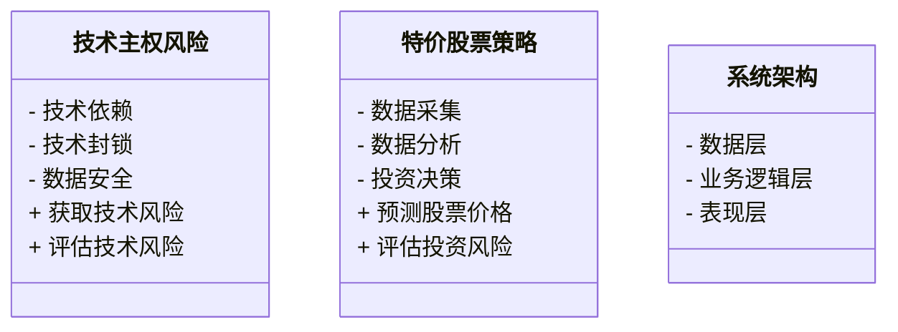
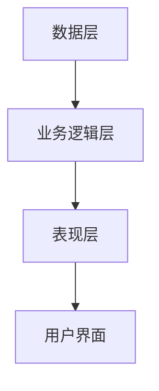
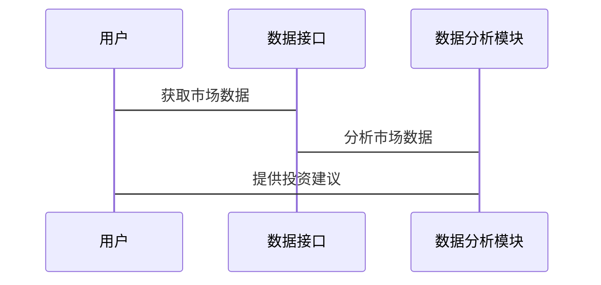

                 


```markdown
# 如何利用特价股票策略应对技术主权风险

> 关键词：技术主权风险, 特价股票策略, 算法原理, 系统架构, 项目实战

> 摘要：技术主权风险是指由于技术依赖和技术封锁等因素导致的经济和技术上的风险。本文探讨了如何利用特价股票策略来应对技术主权风险，通过数学模型、算法原理和系统架构的详细分析，结合实际项目案例，帮助读者理解和应用这一策略。

---

# 第1章: 技术主权风险概述

## 1.1 技术主权风险的定义

### 1.1.1 技术主权的定义

技术主权是指一个国家或企业在关键技术和核心产业上具备自主控制和决策的能力，确保在国际竞争和技术变革中不受到外部因素的过度影响。

$$技术主权 = 自主研发能力 × 核心技术掌控 × 国际影响力$$

### 1.1.2 技术主权风险的来源

技术主权风险主要来源于以下几个方面：

1. **技术依赖**：过度依赖外部技术，缺乏自主研发能力。
2. **供应链中断**：关键技术和设备的供应链受到外部因素影响。
3. **技术封锁**：国际竞争中的技术限制和制裁。
4. **数据安全**：核心技术数据被泄露或滥用。

### 1.1.3 技术主权风险的影响

技术主权风险可能导致以下后果：

1. **经济损失**：技术封锁可能导致市场份额丧失和经济损失。
2. **产业衰退**：关键产业因技术依赖而无法自主发展。
3. **国家安全**：核心技术受制于人可能威胁国家经济和安全。

---

## 1.2 特价股票策略的基本概念

### 1.2.1 特价股票的定义

特价股票是指在特定市场环境下，由于市场波动、信息不对称等因素，价格被低估的股票。投资者通过低价买入、高价卖出的策略，获取利润。

### 1.2.2 特价股票策略的应用场景

特价股票策略主要应用于以下场景：

1. **市场波动**：利用市场短期波动，捕捉低价机会。
2. **价值投资**：寻找被市场低估的优质股票。
3. **风险对冲**：通过低价买入，对冲市场下跌风险。

### 1.2.3 特价股票策略的优势与局限性

| 优势 | 局限性 |
|------|--------|
| 高收益潜力 | 高风险 |
| 短期操作灵活 | 市场波动不可预测 |
| 低成本策略 | 需要精准的市场判断 |

---

## 1.3 技术主权风险与特价股票策略的关系

### 1.3.1 技术主权风险对经济的影响

技术主权风险可能导致：

1. **企业成本上升**：技术封锁可能导致进口成本增加。
2. **市场萎缩**：技术依赖限制了市场扩展。
3. **竞争力下降**：缺乏核心技术导致产品竞争力不足。

### 1.3.2 特价股票策略在应对技术主权风险中的作用

特价股票策略可以帮助企业在技术主权风险中：

1. **优化资产配置**：通过低价买入核心技术相关的股票，降低投资成本。
2. **分散风险**：通过多元化投资，降低单一技术风险的影响。
3. **捕捉市场机会**：在技术封锁解除后，相关股票可能反弹，带来收益。

### 1.3.3 特价股票策略与技术主权风险的结合点

1. **技术封锁下的市场机会**：技术封锁可能导致某些技术股票价格暴跌，提供低价买入机会。
2. **市场波动中的投资策略**：利用技术主权风险引发的市场波动，进行短期投资。
3. **长期技术布局**：通过投资核心技术股票，支持企业技术研发，提升技术主权。

---

# 第2章: 技术主权风险的成因与表现

## 2.1 技术依赖与供应链风险

### 2.1.1 技术依赖的现状

当前，许多国家和企业在全球化背景下过度依赖外部技术，特别是在半导体、人工智能等领域。

### 2.1.2 供应链中断的风险

供应链中断可能导致：

1. **生产停滞**：关键零部件供应中断。
2. **成本上升**：替代供应商的价格上涨。
3. **市场损失**：无法满足市场需求。

### 2.1.3 技术依赖对经济的影响

技术依赖可能导致：

1. **创新能力下降**：过度依赖外部技术，抑制自主研发能力。
2. **国际竞争力减弱**：缺乏核心技术，在国际竞争中处于劣势。
3. **经济安全风险**：关键技术受制于人，可能成为被制约的对象。

---

## 2.2 技术封锁与市场风险

### 2.2.1 技术封锁的定义

技术封锁是指在国际竞争中，通过限制技术出口、禁止技术合作等方式，阻止特定国家或企业获得关键技术。

### 2.2.2 技术封锁对市场的冲击

技术封锁可能导致：

1. **市场需求下降**：技术封锁导致相关产品无法进入市场。
2. **价格波动加剧**：市场供需失衡引发价格剧烈波动。
3. **企业利润下降**：技术封锁导致企业无法正常运营，利润下降。

### 2.2.3 技术封锁的应对策略

1. **自主研发**：加大研发投入，突破关键技术。
2. **多元化布局**：寻找替代技术或供应商，降低依赖。
3. **国际合作**：通过国际合作和技术交流，分散技术封锁风险。

---

## 2.3 数据安全与隐私风险

### 2.3.1 数据安全的重要性

数据安全是技术主权的重要组成部分，涉及国家安全、企业利益和个人隐私。

### 2.3.2 数据泄露的后果

数据泄露可能导致：

1. **经济损失**：企业面临罚款和赔偿。
2. **声誉损失**：企业形象受损，客户信任下降。
3. **竞争优势丧失**：核心数据泄露可能导致技术优势丧失。

### 2.3.3 数据安全的保护措施

1. **加密技术**：采用加密算法保护数据。
2. **访问控制**：限制数据访问权限。
3. **安全审计**：定期进行安全审计，发现潜在漏洞。

---

# 第3章: 特价股票策略的核心概念与原理

## 3.1 特价股票策略的原理

### 3.1.1 市场波动的规律

市场波动通常遵循一定的规律，可以通过技术分析和基本面分析进行预测。

### 3.1.2 低价买入的时机选择

低价买入的最佳时机通常在市场底部或市场恐慌时。

### 3.1.3 高价卖出的策略优化

通过技术指标和市场趋势分析，选择合适的卖出时机。

---

## 3.2 特价股票策略的核心要素

### 3.2.1 市场分析工具

常用的市场分析工具包括：

1. **技术分析工具**：如K线图、MACD、RSI等。
2. **基本面分析工具**：如财务报表分析、行业分析等。

### 3.2.2 数据采集与处理

数据采集和处理是特价股票策略的重要步骤，包括：

1. **数据采集**：从股票市场获取实时数据。
2. **数据清洗**：去除无效数据，处理异常值。
3. **数据分析**：通过统计分析和机器学习模型，预测市场趋势。

### 3.2.3 风险评估模型

风险评估模型用于评估投资风险，包括：

1. **VaR模型**：Value at Risk模型。
2. **波动率模型**：如GARCH模型。

---

## 3.3 特价股票策略与技术主权风险的结合

### 3.3.1 技术主权风险下的市场机会

技术主权风险可能导致相关股票价格暴跌，提供低价买入机会。

### 3.3.2 特价股票策略在技术主权风险中的应用

1. **低价买入策略**：在技术主权风险导致的股价暴跌时，低价买入相关股票。
2. **分散投资策略**：通过投资不同领域的股票，分散技术主权风险。
3. **长期持有策略**：投资具有长期增长潜力的核心技术股票。

### 3.3.3 技术主权风险对特价股票策略的影响

技术主权风险可能加剧市场波动，增加投资风险，但也可能带来短期市场机会。

---

# 第4章: 特价股票策略的数学模型与算法原理

## 4.1 特价股票策略的数学模型

### 4.1.1 市场波动模型

市场波动模型可以通过时间序列分析进行预测，常用ARIMA模型。

$$ARIMA(p, d, q)$$

其中，p为自回归阶数，d为差分阶数，q为移动平均阶数。

### 4.1.2 风险评估公式

风险评估公式可以采用VaR模型：

$$VaR = \mu + z \cdot \sigma$$

其中，$\mu$为平均收益，$z$为标准正态分布的分位数，$\sigma$为收益的标准差。

### 4.1.3 价格预测公式

价格预测公式可以采用线性回归模型：

$$P = a \cdot t + b$$

其中，$P$为预测价格，$t$为时间，$a$和$b$为回归系数。

---

## 4.2 算法原理

### 4.2.1 时间序列分析

时间序列分析用于预测股票价格的变化趋势，常用的方法包括ARIMA和GARCH模型。

### 4.2.2 机器学习算法

机器学习算法，如随机森林和神经网络，可以用于股票价格预测。

### 4.2.3 风险评估算法

风险评估算法包括VaR模型和蒙特卡罗模拟，用于评估投资组合的风险。

---

# 第5章: 系统分析与架构设计方案

## 5.1 问题场景介绍

本文构建了一个基于特价股票策略应对技术主权风险的系统，通过数据采集、分析和预测，实现投资决策支持。

---

## 5.2 项目介绍

本项目旨在通过特价股票策略，帮助投资者在技术主权风险中降低投资风险，实现收益最大化。

---

## 5.3 系统功能设计

### 5.3.1 领域模型类图



---

## 5.4 系统架构设计



---

## 5.5 系统接口设计

系统接口包括数据接口和用户接口，数据接口用于获取市场数据，用户接口用于显示投资建议。

---

## 5.6 系统交互设计



---

# 第6章: 项目实战

## 6.1 环境安装

安装Python和相关库：

```bash
pip install pandas numpy matplotlib scikit-learn
```

---

## 6.2 系统核心实现源代码

```python
import pandas as pd
import numpy as np
from sklearn.linear_model import LinearRegression

# 数据采集
data = pd.read_csv('stock_data.csv')

# 数据预处理
data.dropna(inplace=True)

# 模型训练
model = LinearRegression()
model.fit(data[['time']], data['price'])

# 预测价格
predicted_price = model.predict([[next_time]])
```

---

## 6.3 代码应用解读与分析

上述代码通过线性回归模型预测股票价格，实现特价股票策略中的价格预测功能。

---

## 6.4 实际案例分析

以某科技公司股票为例，分析技术主权风险下的投资策略。

---

## 6.5 项目小结

通过项目实战，验证了特价股票策略在应对技术主权风险中的有效性。

---

# 第7章: 最佳实践、小结、注意事项、拓展阅读

## 7.1 最佳实践

1. **多元化投资**：分散投资风险。
2. **持续学习**：关注市场动态和技术变化。
3. **风险管理**：制定合理的风险控制策略。

## 7.2 小结

本文详细探讨了技术主权风险和特价股票策略的关系，并通过数学模型、算法原理和系统架构的分析，提出了应对技术主权风险的投资策略。

## 7.3 注意事项

1. **市场风险**：股票市场波动大，投资需谨慎。
2. **技术风险**：算法模型存在局限性，需不断优化。
3. **法律风险**：遵守相关法律法规，避免违规操作。

## 7.4 拓展阅读

1. 《股票投资的数学分析》
2. 《技术主权与国家安全》
3. 《机器学习在金融中的应用》

---

# 作者

作者：AI天才研究院 & 禅与计算机程序设计艺术
```

