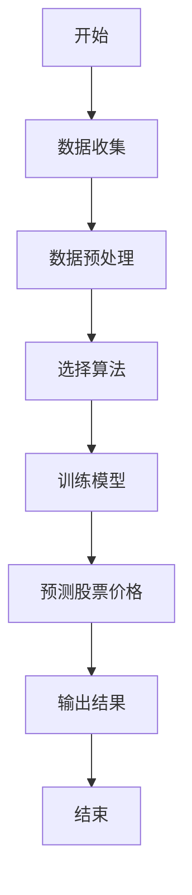
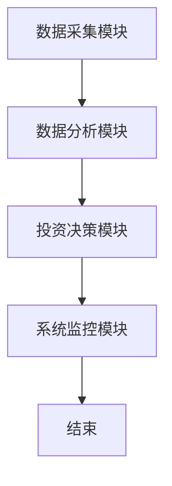
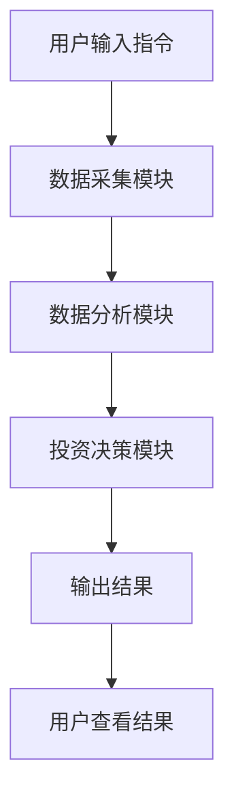

                 


# 如何利用特价股票策略应对数字主权风险

> 关键词：数字主权，风险应对，特价股票，投资策略，技术分析，机器学习

> 摘要：随着全球数字化进程的加速，数字主权问题日益凸显，对金融市场尤其是股票市场产生了深远影响。本文探讨如何利用特价股票策略来应对数字主权风险，结合技术分析和机器学习模型，为投资者提供有效的投资策略和风险管理方案。

---

# 第一部分: 数字主权风险与特价股票策略的背景介绍

## 第1章: 数字主权风险的定义与影响

### 1.1 数字主权的定义与内涵
- **1.1.1 数字主权的核心概念**
  - 数字主权的定义：国家对数字资源、数字技术和数字基础设施的控制权和自主权。
  - 数字主权的内涵：包括数据主权、网络安全、技术自主等多个方面。

- **1.1.2 数字主权的法律与伦理框架**
  - 数据主权的法律原则：数据存储、传输和使用的法律规范。
  - 数字主权的伦理挑战：数据隐私、技术中立性与全球化的冲突。

- **1.1.3 数字主权对全球经济的影响**
  - 数字经济的崛起：数字经济对全球GDP的贡献。
  - 数字主权对国际贸易的影响：数据壁垒、技术限制对全球化的挑战。

### 1.2 数字主权风险的来源与特征
- **1.2.1 数字主权风险的主要来源**
  - 技术依赖：对外国技术供应商的依赖带来的风险。
  - 数据泄露：数据被非法获取或滥用的风险。
  - 网络攻击：针对关键信息基础设施的攻击风险。

- **1.2.2 数字主权风险的特征分析**
  - 隐蔽性：风险往往不易察觉，直到发生重大事件。
  - 复杂性：涉及技术、法律、经济等多个层面。
  - 动态性：随着技术进步和全球政治经济环境的变化而不断演变。

- **1.2.3 数字主权风险的边界与外延**
  - 数字主权与国家安全的边界：数字主权不仅仅是技术问题，更关系到国家主权和安全。
  - 数字主权的全球性：数字主权问题具有全球性，但各国的数字主权意识和能力差异较大。

### 1.3 特价股票策略的背景与意义
- **1.3.1 特价股票的定义与特点**
  - 特价股票的定义：指价格低于其内在价值的股票，通常具有较高的投资回报潜力。
  - 特价股票的特点：低估值、高分红、行业龙头等。

- **1.3.2 特价股票策略的市场环境**
  - 特价股票策略的适用场景：市场低迷、行业调整期、公司基本面改善阶段。
  - 特价股票策略的市场影响：吸引资金流入，推动股价回升。

- **1.3.3 特价股票策略在数字主权风险应对中的作用**
  - 通过投资具有强大技术自主能力的公司，间接增强国家数字主权。
  - 在数字主权风险引发的市场波动中，利用特价股票策略进行套利和风险管理。

### 1.4 本章小结
本章从数字主权的定义、风险来源及特征入手，分析了数字主权风险对全球经济的影响，并引出特价股票策略在应对这种风险中的重要性。通过理解数字主权风险的本质，投资者可以更好地把握市场机会和规避潜在风险。

---

## 第2章: 数字主权风险与特价股票策略的核心概念

### 2.1 数字主权风险的核心要素
- **2.1.1 数据主权**
  - 数据主权的定义：数据的所有权和控制权归属于数据产生地的国家或个人。
  - 数据主权的挑战：跨国数据流动的监管难题。

- **2.1.2 技术依赖风险**
  - 技术依赖的定义：对外国技术供应商的依赖带来的风险。
  - 技术依赖的具体表现：关键技术和核心设备的依赖。

- **2.1.3 数字经济中的权力斗争**
  - 数字经济的权力结构：技术垄断、数据控制与国家主权的博弈。
  - 数字主权风险与全球经济治理：数字主权问题对国际政治经济格局的影响。

### 2.2 特价股票策略的核心机制
- **2.2.1 市场波动与投资机会**
  - 市场波动的定义：股票价格的短期波动。
  - 投资机会的识别：利用市场波动中的低点买入，高位卖出。

- **2.2.2 特价股票的筛选标准**
  - 低市盈率（P/E）：市盈率低于行业平均水平。
  - 高股息率：股息收益率较高。
  - 健康的财务状况：低负债率、稳定的收入来源。

- **2.2.3 投资组合优化策略**
  - 分散投资：通过投资不同行业的股票降低风险。
  - 风险管理：设定止损点，控制仓位。

### 2.3 数字主权风险与特价股票策略的关联性分析
- **2.3.1 数字主权风险对股票市场的冲击**
  - 数字主权风险引发的市场恐慌：投资者对数字主权风险的担忧导致股价下跌。
  - 特定行业的影响：如科技、金融行业的股票可能受到更大影响。

- **2.3.2 特价股票策略在应对数字主权风险中的优势**
  - 投资低成本：利用低估值股票在市场波动中的反弹潜力。
  - 风险对冲：通过投资具有强大基本面的公司，规避市场系统性风险。

- **2.3.3 数字主权风险与特价股票策略的协同效应**
  - 技术自主公司的投资机会：投资那些具有技术自主能力、抗风险能力强的公司。
  - 市场波动中的套利机会：利用数字主权风险引发的市场波动进行套利。

### 2.4 本章小结
本章通过分析数字主权风险的核心要素，揭示了其对股票市场的影响，并探讨了特价股票策略在应对这种风险中的独特优势。投资者可以利用特价股票策略，不仅在市场波动中获利，还能间接支持具有技术自主能力的公司，增强国家数字主权。

---

## 第3章: 特价股票策略的算法原理与数学模型

### 3.1 特价股票策略的算法原理
- **3.1.1 机器学习在股票预测中的应用**
  - 机器学习的基本原理：通过数据训练模型，预测未来走势。
  - 常用算法：线性回归、支持向量机（SVM）、随机森林、神经网络。

- **3.1.2 时间序列分析方法**
  - 时间序列分析的定义：对按时间顺序排列的数据进行建模和预测。
  - 常用模型：ARIMA、GARCH、LSTM。

- **3.1.3 基于大数据的市场情绪分析**
  - 市场情绪分析的定义：通过分析新闻、社交媒体等数据，判断市场情绪。
  - 大数据来源：新闻网站、社交媒体、金融论坛等。

### 3.2 数学模型与公式
- **3.2.1 股票价格预测的回归模型**
  $$ y = \beta_0 + \beta_1x_1 + \beta_2x_2 + \epsilon $$
  其中，\( y \) 是股票价格，\( x_1 \) 和 \( x_2 \) 是影响价格的两个因素，\( \beta \) 是回归系数，\( \epsilon \) 是误差项。

- **3.2.2 时间序列模型**
  $$ ARIMA(p, d, q) $$
  其中，\( p \) 是自回归阶数，\( d \) 是差分阶数，\( q \) 是移动平均阶数。

- **3.2.3 基于情绪分析的股票价格波动模型**
  $$ P = \alpha \cdot S + \beta \cdot V + \gamma \cdot M $$
  其中，\( P \) 是股票价格，\( S \) 是市场情绪得分，\( V \) 是市场波动性，\( M \) 是宏观经济指标。

### 3.3 算法流程图


### 3.4 本章小结
本章通过数学模型和算法流程图，详细讲解了特价股票策略的算法原理。投资者可以利用这些模型和方法，结合市场情绪和技术分析，制定有效的投资策略。

---

## 第4章: 特价股票策略的系统架构设计

### 4.1 系统功能设计
- **4.1.1 数据采集模块**
  - 数据源：股票市场数据、新闻数据、社交媒体数据。
  - 采集工具：API接口、爬虫技术。

- **4.1.2 数据分析模块**
  - 数据清洗：去除异常数据。
  - 数据分析：利用机器学习和时间序列分析模型进行预测。

- **4.1.3 投资决策模块**
  - 投资策略制定：根据模型预测结果，制定买入、卖出策略。
  - 风险管理：设定止损点、调整仓位。

- **4.1.4 系统监控模块**
  - 实时监控：监控系统运行状态。
  - 报警机制：当预测结果出现重大偏差时，触发报警。

### 4.2 系统架构图


### 4.3 系统接口设计
- **API接口**
  - 数据接口：从金融数据供应商获取股票数据。
  - 预测接口：调用机器学习模型进行预测。

- **用户界面**
  - 界面设计：用户友好的界面，方便投资者查看预测结果和操作。

### 4.4 系统交互流程图


### 4.5 本章小结
本章通过系统架构设计，展示了如何构建一个基于特价股票策略的投资系统。系统模块化设计清晰，功能齐全，能够满足投资者的需求。

---

## 第5章: 特价股票策略的项目实战

### 5.1 项目环境安装
- **5.1.1 安装Python环境**
  - 安装步骤：下载并安装Python，配置环境变量。
- **5.1.2 安装依赖库**
  - 常用库：numpy、pandas、scikit-learn、matplotlib、 seaborn、yfinance。

### 5.2 核心代码实现
- **5.2.1 数据采集代码**
  ```python
  import yfinance as yf
  import pandas as pd

  def get_stock_data(ticker, start_date, end_date):
      data = yf.download(ticker, start=start_date, end=end_date)
      return data
  ```

- **5.2.2 数据分析代码**
  ```python
  from sklearn.linear_model import LinearRegression
  import numpy as np

  def stock_price_prediction(data):
      X = np.arange(len(data)).reshape(-1, 1)
      y = data['Close'].values
      model = LinearRegression()
      model.fit(X, y)
      return model.predict(X)
  ```

- **5.2.3 投资决策代码**
  ```python
  import numpy as np

  def investment_strategy(prices, threshold=0.1):
      buy_signal = False
      if prices[-1] < prices.mean() * (1 - threshold):
          buy_signal = True
      return buy_signal
  ```

### 5.3 案例分析与详细解读
- **5.3.1 案例背景**
  - 选择某只股票，分析其历史数据。
- **5.3.2 数据分析与预测**
  - 使用回归模型进行预测，对比实际价格和预测价格。
- **5.3.3 投资策略实施**
  - 根据模型预测结果，制定买入和卖出策略，计算收益。

### 5.4 本章小结
本章通过实际案例，详细讲解了特价股票策略的实施过程，从数据采集到模型预测，再到投资决策，帮助投资者掌握实战技巧。

---

## 第6章: 总结与展望

### 6.1 本章总结
- **数字主权风险的核心问题**：数据主权、技术依赖和全球经济权力的博弈。
- **特价股票策略的优势**：低估值、高分红、技术自主公司的投资机会。
- **系统架构的完整性**：模块化设计，功能齐全，易于扩展。

### 6.2 未来展望
- **技术进步带来的新机会**：人工智能和大数据技术的进一步发展，将为股票投资提供更多的工具和方法。
- **数字主权风险的新挑战**：随着技术的进步，数字主权风险可能更加复杂，需要投资者不断学习和适应。

### 6.3 最佳实践 tips
- **风险管理**：始终设定止损点，控制仓位，避免过度杠杆。
- **长期投资**：关注具有强大基本面和技术自主能力的公司，进行长期投资。
- **持续学习**：关注数字主权风险的新动态，学习新的投资策略和技术工具。

### 6.4 本章小结
本章总结了全文的主要内容，展望了未来的发展方向，并提出了最佳实践的建议，帮助投资者在数字主权风险的背景下，利用特价股票策略实现稳健投资。

---

## 作者：AI天才研究院/AI Genius Institute & 禅与计算机程序设计艺术 /Zen And The Art of Computer Programming

---

**注：以上内容为文章的详细目录大纲，每章和每个小节的具体内容需要根据实际分析和写作进一步扩展，确保逻辑清晰、内容详实。**

