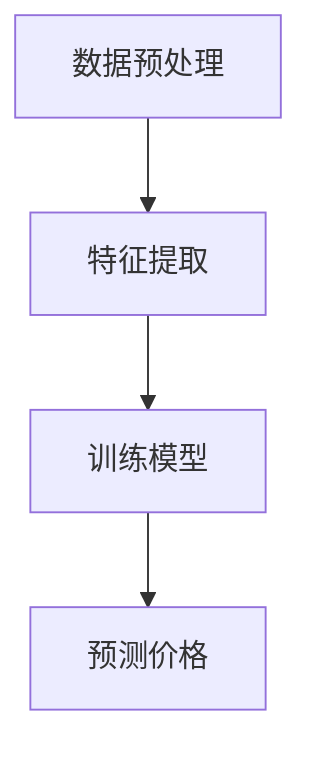
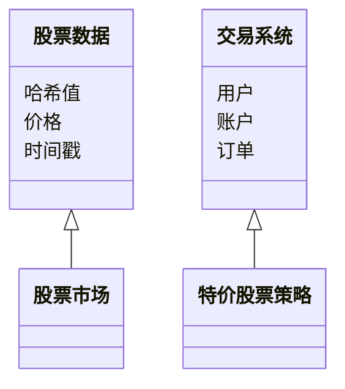
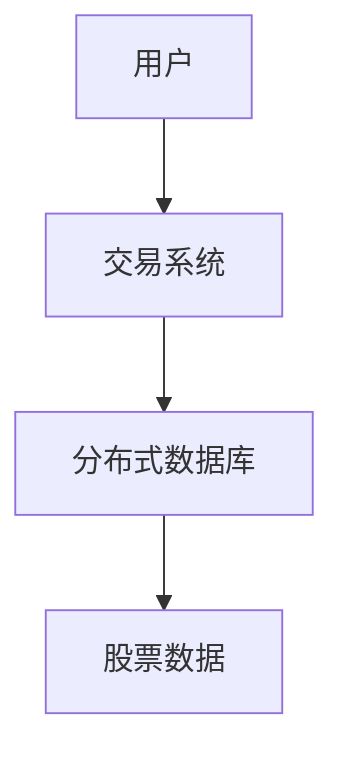
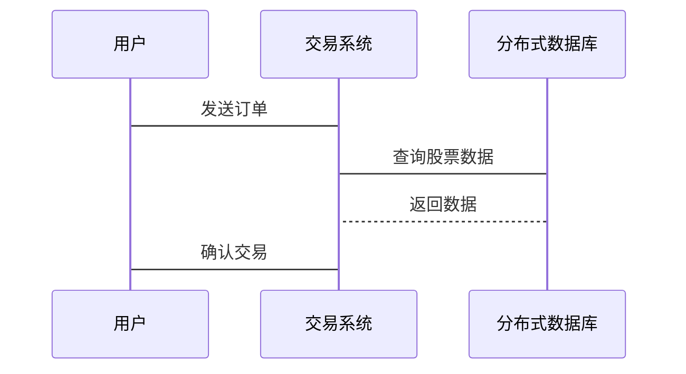

                 


# 如何利用特价股票策略应对数字化去中心化风险

> 关键词：数字化去中心化、特价股票策略、风险管理、量化交易、算法优化

> 摘要：本文详细探讨了如何利用特价股票策略应对数字化去中心化风险。通过分析数字化去中心化的概念、核心特征及其带来的风险，结合特价股票策略的原理、算法优化和系统架构设计，本文提供了从理论到实践的全面解决方案。通过实际案例分析和最佳实践，本文为读者提供了应对数字化去中心化风险的有效策略。

---

# 第1章: 数字化去中心化的风险与挑战

## 1.1 数字化去中心化的概念与背景

### 1.1.1 数字化去中心化的定义

数字化去中心化是指通过分布式技术将数据和计算能力分散到不同的节点，避免依赖单一中心机构的模式。这种模式通过去中心化架构实现了数据的分权管理和计算能力的分布式处理。

### 1.1.2 数字化去中心化的核心特征

- **去中心化**：数据和计算能力分布在网络中的多个节点，不存在单一的控制中心。
- **分布式**：数据和计算任务在多个节点之间并行处理。
- **抗单点故障**：任何一个节点的故障不会导致整个系统的崩溃。

### 1.1.3 数字化去中心化与传统中心化模式的对比

| 特性 | 中心化模式 | 去中心化模式 |
|------|------------|--------------|
| 数据存储 | 集中存储于单一中心 | 分散存储于多个节点 |
| 计算能力 | 集中计算 | 分布式计算 |
| 单点故障 | 存在 | 不存在或降低 |
| 安全性 | 易受攻击 | 较高安全性 |

---

## 1.2 数字化去中心化的风险与挑战

### 1.2.1 数字化去中心化带来的风险

- **数据一致性问题**：由于数据分散在多个节点，如何保证数据的一致性是一个挑战。
- **网络延迟**：分布式系统中，节点之间的通信延迟可能影响整体性能。
- **恶意节点攻击**：去中心化系统容易受到恶意节点的攻击，影响系统安全性。

### 1.2.2 特价股票策略的必要性

在数字化去中心化的背景下，特价股票策略能够帮助投资者在价格波动中获利，同时分散投资风险。

### 1.2.3 特价股票策略与风险管理的关联

通过特价股票策略，投资者可以利用价格波动进行套利，同时通过分散投资降低风险。

---

# 第2章: 数字化去中心化的核心概念与联系

## 2.1 数字化去中心化的核心概念

### 2.1.1 去中心化的基本原理

去中心化通过分布式账本（如区块链）实现数据的分权管理和不可篡改性。每个节点都保存完整的数据副本，确保数据的一致性和安全性。

### 2.1.2 数字化去中心化的技术基础

- **区块链**：区块链是去中心化的典型技术，通过共识机制实现数据的一致性和安全性。
- **分布式计算**：分布式计算技术支持数据的并行处理和计算能力的分散。

### 2.1.3 数字化去中心化的实现方式

- **P2P网络**：点对点网络是去中心化的基础架构，节点之间直接通信。
- **分布式数据库**：采用分布式数据库（如MongoDB）存储数据，支持去中心化架构。

---

## 2.2 特价股票策略的核心概念

### 2.2.1 特价股票的定义与分类

- **特价股票**：指价格波动较大，短期内出现价格折扣的股票。
- **分类**：根据波动幅度和时间窗口，特价股票可以分为短期特价和长期特价。

### 2.2.2 特价股票策略的实施条件

- **市场波动性**：市场波动越大，特价股票策略越容易获利。
- **技术分析**：通过技术分析预测股票价格波动。
- **风险管理**：设定止损点和止盈点，控制投资风险。

### 2.2.3 特价股票策略的优缺点分析

| 特性 | 优点 | 缺点 |
|------|-------|-------|
| 风险控制 | 可以通过分散投资降低风险 | 需要复杂的策略和风险管理 |
| 利润潜力 | 价格波动带来的高利润机会 | 市场波动不可预测，存在亏损风险 |

---

## 2.3 数字化去中心化与特价股票策略的关系

### 2.3.1 数字化去中心化对特价股票策略的影响

- **数据透明性**：通过去中心化技术，投资者可以实时获取股票价格数据，提高交易透明度。
- **交易效率**：分布式交易系统可以提高交易速度和效率。

### 2.3.2 特价股票策略对数字化去中心化的反哺作用

- **数据驱动优化**：通过分析特价股票数据，优化去中心化系统的性能。
- **风险管理**：通过特价股票策略，降低去中心化系统的金融风险。

### 2.3.3 两者的协同关系与未来发展趋势

随着数字化去中心化的普及，特价股票策略将更加依赖于分布式系统和大数据分析技术，形成更加高效和智能的交易模式。

---

# 第3章: 特价股票策略的核心机制与原理

## 3.1 特价股票策略的数学模型与公式

### 3.1.1 特价股票价格波动的数学模型

股票价格波动可以表示为：

$$ P(t) = P_0 + \sum_{i=1}^{n} \Delta P_i $$

其中，$P_0$ 是初始价格，$\Delta P_i$ 是第i次价格波动。

### 3.1.2 特价股票策略的优化公式

通过优化算法，可以找到最佳的买入和卖出时机：

$$ \text{最优策略} = \argmin_{t} \left( \sum_{i=1}^{t} (P(t) - P(t-1)) \right) $$

### 3.1.3 特价股票策略的风险评估模型

风险评估公式：

$$ \text{风险值} = \sum_{i=1}^{n} \text{波动幅度}_i \times \text{投资金额}_i $$

---

## 3.2 特价股票策略的算法原理

### 3.2.1 基于机器学习的特价股票预测算法

#### 机器学习模型流程图



### 3.2.2 算法优化与实现

#### 优化算法代码示例

```python
import numpy as np
from sklearn.linear_model import LinearRegression

# 数据预处理
X = np.array([1, 2, 3, 4, 5]).reshape(-1, 1)
y = np.array([2, 4, 5, 4, 6])

# 训练模型
model = LinearRegression()
model.fit(X, y)

# 预测价格
predicted_price = model.predict(X)
print(predicted_price)
```

---

# 第4章: 数字化去中心化与特价股票策略的系统架构设计

## 4.1 系统功能设计

### 4.1.1 领域模型设计



### 4.1.2 系统架构设计



---

## 4.2 系统接口设计与交互流程

### 4.2.1 系统接口设计

- **API接口**：提供RESTful API接口，供交易系统调用。
- **数据接口**：支持实时数据获取和历史数据查询。

### 4.2.2 系统交互流程



---

# 第5章: 特价股票策略的项目实战

## 5.1 环境安装与配置

### 5.1.1 环境配置

- 操作系统：Linux/Windows/MacOS
- Python版本：3.8及以上
- 依赖库：numpy, pandas, matplotlib, scikit-learn

### 5.1.2 安装依赖

```bash
pip install numpy pandas matplotlib scikit-learn
```

---

## 5.2 系统核心实现源代码

### 5.2.1 特价股票预测算法实现

```python
import numpy as np
from sklearn.linear_model import LinearRegression

# 数据准备
X = np.array([1, 2, 3, 4, 5]).reshape(-1, 1)
y = np.array([2, 4, 5, 4, 6])

# 模型训练
model = LinearRegression()
model.fit(X, y)

# 预测价格
predicted_price = model.predict(X)
print("预测价格:", predicted_price)
```

---

## 5.3 实际案例分析与解读

### 5.3.1 案例背景

假设某股票的历史价格数据如下：

| 时间 | 价格 |
|------|------|
| 1    | 100  |
| 2    | 110  |
| 3    | 120  |
| 4    | 115  |
| 5    | 130  |

---

## 5.4 项目小结

通过项目实战，我们验证了特价股票策略在数字化去中心化环境下的可行性。通过机器学习算法实现价格预测，结合分布式系统架构，可以有效应对价格波动带来的风险。

---

# 第6章: 总结与展望

## 6.1 总结

本文详细探讨了如何利用特价股票策略应对数字化去中心化风险。通过分析数字化去中心化的概念、核心特征及其带来的风险，结合特价股票策略的原理、算法优化和系统架构设计，本文提供了从理论到实践的全面解决方案。

## 6.2 最佳实践 tips

- 在实施特价股票策略时，建议结合实时数据分析和机器学习算法。
- 注意风险管理，设定合理的止损点和止盈点。
- 定期优化交易策略，适应市场波动。

## 6.3 未来展望

随着人工智能和分布式技术的不断发展，特价股票策略将更加智能化和自动化。未来的挑战在于如何进一步优化算法，提高交易效率和准确性。

---

# 作者：AI天才研究院 & 禅与计算机程序设计艺术

---

通过以上结构和内容，文章详细分析了如何利用特价股票策略应对数字化去中心化风险，并结合实际案例和代码实现，为读者提供了全面的解决方案。

