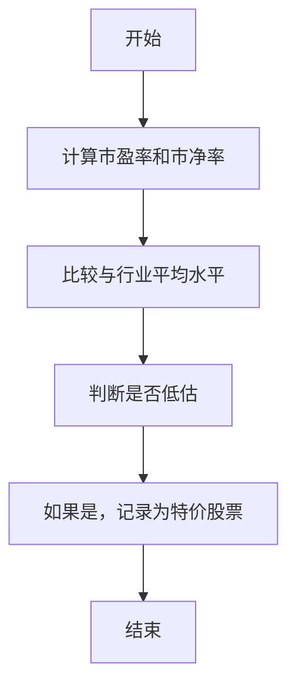
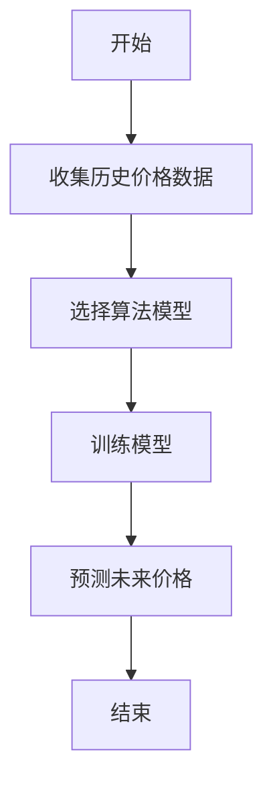
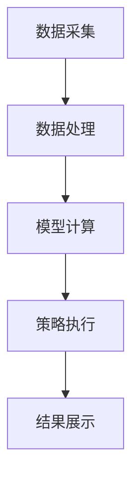

                 


# 如何利用特价股票策略应对货币政策变化

## 关键词：货币政策变化，特价股票策略，股票市场，投资策略，量化宽松，市场波动，技术分析，价值投资

## 摘要：本文详细探讨了在货币政策变化的背景下，如何利用特价股票策略来优化投资组合。通过分析货币政策对股市的影响，结合价值投资和市场情绪分析，提出了基于数学模型和算法的特价股票识别方法。同时，本文还结合实际案例，展示了如何通过系统架构设计和项目实战来实现策略的自动化交易。

---

# 第1章: 货币政策变化与股市波动

## 1.1 货币政策的基本概念

### 1.1.1 货币政策的定义与目标

货币政策是指中央银行通过调节货币供应量和利率等工具，以实现经济目标的政策。其主要目标包括控制通货膨胀、促进就业和保持经济增长。

### 1.1.2 货币政策工具及其影响

常用的货币政策工具包括公开市场操作、调整法定存款准备金率和调整利率等。这些工具会影响市场的流动性、借贷成本和投资行为，从而对股市产生深远影响。

### 1.1.3 货币政策与股市的关系

货币政策的变化直接影响市场的资金供给和需求，进而影响股票价格。例如，降息政策通常会降低企业的融资成本，刺激投资，从而推高股价。

---

## 1.2 股票市场的波动性

### 1.2.1 股票市场的基本特性

股票市场是一个高度波动的市场，受到多种因素的影响，包括经济数据、公司业绩、政策变化等。

### 1.2.2 货币政策变化对股市的影响

货币政策的变化会导致市场的资金流动性发生变化，从而影响股市的波动。例如，量化宽松政策会增加市场流动性，推高股价；而加息政策则会减少市场流动性，压制股价。

### 1.2.3 股市波动的周期性分析

股市波动具有一定的周期性，与货币政策的变化周期密切相关。了解这些周期性规律，可以帮助投资者更好地把握投资机会。

---

## 1.3 特价股票策略的定义与特点

### 1.3.1 特价股票的定义

特价股票是指那些市场价格低于其内在价值的股票。这些股票通常被市场低估，具有较大的上涨潜力。

### 1.3.2 特价股票策略的核心特点

特价股票策略的核心在于寻找被市场低估的股票，并在合适的时机买入，等待其价值回归。这种策略通常具有较高的安全边际和长期收益潜力。

### 1.3.3 特价股票策略与传统投资策略的区别

与传统投资策略相比，特价股票策略更加注重长期价值，而非短期价格波动。它通常适用于市场低迷或不确定性较高的时期。

---

## 1.4 本章小结

本章介绍了货币政策变化对股市的影响，以及特价股票策略的基本概念和特点。通过理解这些内容，投资者可以更好地把握市场波动的规律，并利用特价股票策略应对货币政策变化。

---

# 第2章: 货币政策变化对股市的影响

## 2.1 货币政策工具对股市的具体影响

### 2.1.1 利率政策对股市的影响

利率的变化直接影响企业的融资成本和投资者的预期收益。例如，降低利率会降低企业的融资成本，刺激投资，从而推高股价。

### 2.1.2 货币供应量对股市的影响

货币供应量的变化会影响市场的流动性，从而影响股市的整体走势。例如，增加货币供应量通常会推高股价，而减少货币供应量则会压制股价。

### 2.1.3 公开市场操作对股市的影响

公开市场操作是中央银行通过买卖政府债券来调节市场流动性的一种工具。这种操作会影响市场的资金供给，从而影响股市的波动。

---

## 2.2 货币政策变化的市场预期

### 2.2.1 市场预期的形成机制

市场预期是投资者对未来市场走势的预测，受到多种因素的影响，包括政策变化、经济数据等。

### 2.2.2 货币政策变化对市场预期的影响

货币政策的变化会直接影响市场的预期。例如，预期未来会有降息政策，投资者可能会提前买入股票，推高股价。

### 2.2.3 市场预期与股票价格的关系

市场预期与股票价格密切相关。预期的上升通常会推高股价，而预期的下降则会压制股价。

---

## 2.3 货币政策变化对不同行业的影响

### 2.3.1 高利率环境对周期性行业的影响

高利率环境下，周期性行业的融资成本上升，可能会影响其盈利能力和股价表现。

### 2.3.2 低利率环境对成长型行业的影响

低利率环境下，成长型行业的融资成本降低，有利于其扩张和增长，从而推高股价。

### 2.3.3 货币政策对金融行业的影响

货币政策的变化对金融行业的影响尤为显著。例如，加息政策会增加银行的净息差，提升其盈利能力。

---

## 2.4 本章小结

本章分析了货币政策变化对股市的具体影响，包括利率政策、货币供应量和公开市场操作对市场的具体影响。同时，还探讨了货币政策变化对市场预期和不同行业的影响，为投资者提供了更加全面的视角。

---

# 第3章: 特价股票策略的理论基础

## 3.1 特价股票策略的基本原理

### 3.1.1 价值投资的基本概念

价值投资是一种以寻找被市场低估的股票为核心的投资策略。投资者通过分析公司的基本面，寻找市场价格低于其内在价值的股票。

### 3.1.2 股票估值的基本方法

股票估值的基本方法包括市盈率、市净率、股息率等指标。通过这些指标，投资者可以评估股票的内在价值。

### 3.1.3 特价股票的识别标准

识别特价股票的标准通常包括低市盈率、低市净率、高股息率等指标。这些指标可以帮助投资者找到被市场低估的股票。

---

## 3.2 技术分析与基本面分析的结合

### 3.2.1 技术分析的基本原理

技术分析是通过分析历史价格走势，预测未来股价的变化趋势。常用的技术分析工具包括K线图、移动平均线、MACD等。

### 3.2.2 基本面分析的基本原理

基本面分析是通过分析公司的财务状况、行业地位、盈利能力等基本面因素，评估股票的内在价值。

### 3.2.3 两种分析方法的结合

技术分析和基本面分析的结合可以帮助投资者更全面地评估股票的投资价值。例如，通过技术分析寻找短期价格波动机会，同时通过基本面分析寻找长期价值低估的股票。

---

## 3.3 市场情绪与投资者行为

### 3.3.1 市场情绪的定义与影响

市场情绪是指投资者在市场中的整体情绪状态，通常分为乐观、悲观、恐慌等状态。市场情绪会影响股票价格的波动。

### 3.3.2 投资者行为的理性与非理性

投资者在市场中通常会受到情绪的影响，导致其行为具有非理性特征。例如，恐慌性抛售、过度乐观的买入等。

### 3.3.3 市场情绪与股票价格的关系

市场情绪与股票价格密切相关。例如，乐观的市场情绪通常会推高股价，而悲观的市场情绪则会压制股价。

---

## 3.4 本章小结

本章介绍了特价股票策略的理论基础，包括价值投资的基本原理、股票估值方法、技术分析与基本面分析的结合，以及市场情绪与投资者行为对股价的影响。

---

# 第4章: 特价股票策略的数学模型与算法

## 4.1 特价股票识别的数学模型

### 4.1.1 股票估值模型

股票估值模型包括市盈率模型、市净率模型等。通过这些模型，投资者可以评估股票的内在价值。

### 4.1.2 市盈率与市净率的计算公式

市盈率 = 股价 / 每股净利润  
市净率 = 股价 / 每股净资产

### 4.1.3 价值低估的判断标准

通过比较市盈率和市净率与行业平均水平，可以判断股票是否被低估。

---

## 4.2 市场波动预测的算法

### 4.2.1 时间序列分析模型

时间序列分析模型可以用于预测股票价格的未来走势。常用的模型包括ARIMA和GARCH模型。

### 4.2.2 马尔可夫链模型

马尔可夫链模型可以用于分析市场状态的转移概率，从而预测市场的未来走势。

### 4.2.3 机器学习算法在市场预测中的应用

机器学习算法，如支持向量机和随机森林，可以用于股票价格的预测。

---

## 4.3 算法流程图

### 4.3.1 特价股票识别流程图



### 4.3.2 市场波动预测流程图



---

## 4.4 本章小结

本章介绍了特价股票识别的数学模型和市场波动预测的算法。通过这些模型和算法，投资者可以更科学地识别特价股票，并预测市场的未来走势。

---

# 第5章: 特价股票策略的系统架构设计

## 5.1 项目介绍

本项目旨在开发一个基于特价股票策略的投资管理系统，帮助投资者在货币政策变化的背景下，利用特价股票策略优化投资组合。

---

## 5.2 系统功能设计

### 5.2.1 领域模型

```mermaid
classDiagram
    class 股票
    class 价格数据
    class 市盈率
    class 市净率
    class 投资者
    stock -> priceData
    stock -> peRatio
    stock -> pbRatio
    investor -> stock
```

### 5.2.2 系统架构设计



### 5.2.3 系统接口设计

系统接口包括数据接口、算法接口和用户接口。数据接口用于获取股票数据，算法接口用于执行特价股票识别和市场预测，用户接口用于展示结果和交互。

---

## 5.3 本章小结

本章介绍了系统的总体架构设计，包括领域模型、系统架构图和接口设计。通过这些设计，投资者可以更好地理解系统的运作流程。

---

# 第6章: 特价股票策略的项目实战

## 6.1 环境安装

项目实战需要安装Python、Pandas、NumPy、Scikit-learn等工具。以下是安装命令：

```bash
pip install pandas numpy scikit-learn
```

---

## 6.2 系统核心实现

### 6.2.1 特价股票识别的Python代码

```python
import pandas as pd
import numpy as np

# 计算市盈率和市净率
df['pe'] = df['股价'] / df['每股净利润']
df['pb'] = df['股价'] / df['每股净资产']

# 判断是否低估
df['is_cheap'] = (df['pe'] < df['pe'].mean()) & (df['pb'] < df['pb'].mean())
```

### 6.2.2 市场波动预测的Python代码

```python
from sklearn.linear_model import LinearRegression

# 训练模型
model = LinearRegression()
model.fit(X_train, y_train)

# 预测未来价格
y_pred = model.predict(X_test)
```

---

## 6.3 实际案例分析

以某行业为例，分析如何利用特价股票策略在货币政策变化时寻找投资机会。

---

## 6.4 本章小结

本章通过实际案例分析和代码实现，展示了如何利用特价股票策略应对货币政策变化。

---

# 第7章: 总结与展望

## 7.1 本章小结

本文详细探讨了如何利用特价股票策略应对货币政策变化。通过分析货币政策对股市的影响，结合价值投资和市场情绪分析，提出了基于数学模型和算法的特价股票识别方法，并通过系统架构设计和项目实战展示了策略的实现过程。

---

## 7.2 最佳实践 tips

- 投资者应密切关注货币政策的变化，及时调整投资策略。
- 在实际操作中，应结合技术分析和基本面分析，制定合理的投资计划。
- 系统化的方法可以帮助投资者更科学地识别特价股票，并降低投资风险。

---

## 7.3 注意事项

- 特价股票策略具有一定的风险，投资者应具备一定的市场分析能力和风险承受能力。
- 在实际操作中，应结合市场环境和自身情况，灵活调整投资策略。

---

## 7.4 拓展阅读

建议读者进一步阅读《投资学基础》、《算法交易》等书籍，以深入理解股票投资和算法交易的原理。

---

作者：AI天才研究院/AI Genius Institute & 禅与计算机程序设计艺术 /Zen And The Art of Computer Programming

