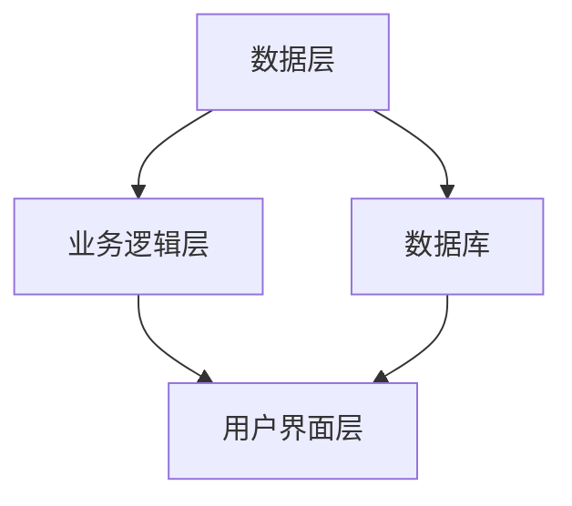

                 


# 如何利用特价股票策略应对通货膨胀风险

> 关键词：通货膨胀，股票投资，特价股票，风险管理，数学模型，系统架构

> 摘要：本文详细探讨了通货膨胀对股市的影响，特别是如何利用特价股票策略来应对通货膨胀带来的投资风险。文章从通货膨胀的基本概念出发，分析了其对股市和投资策略的影响，详细讲解了特价股票的定义、特点以及如何通过特价股票策略来应对通货膨胀。同时，本文还结合数学模型和系统架构，提供了具体的实施方法和案例分析，帮助投资者在通货膨胀环境下制定有效的投资策略。

---

## 第一部分: 通货膨胀与股票投资基础

### 第1章: 通货膨胀的基本概念

#### 1.1 通货膨胀的定义与成因

通货膨胀是指物价总水平在一段时间内持续上涨，导致货币购买力下降的经济现象。通货膨胀的原因多种多样，主要包括需求拉动型、成本推动型和货币供应增加型。

- **需求拉动型**：总需求超过总供给，导致价格水平上升。
- **成本推动型**：生产成本（如工资、原材料）上升，导致企业提高产品价格。
- **货币供应增加型**：货币供给过多，超过实际经济需求，导致货币贬值。

通货膨胀对经济的影响是多方面的，包括对消费能力、企业利润和投资行为的影响。在投资领域，通货膨胀可能导致资产价格波动，尤其是股票市场的波动。

#### 1.2 股票投资的基本原理

股票是企业的一部分所有权，投资者通过购买股票成为企业的股东，享有分红和资本增值的收益。股票市场的价格受多种因素影响，包括宏观经济环境、企业盈利状况、市场情绪等。

股票投资的基本原理包括：

1. **价值投资**：寻找被低估的股票，长期持有，等待其价值回归。
2. **成长投资**：投资于高成长性企业，预期其未来收益增长。
3. **技术分析**：通过分析股票价格走势，预测未来价格变化。

### 第2章: 通货膨胀对股市的影响

#### 2.1 通货膨胀对股价的影响

通货膨胀对股价的影响是复杂且多变的。在短期内，适度的通货膨胀可能提升企业利润，推动股价上涨。但长期来看，过高的通货膨胀可能导致企业成本上升，利润减少，股价下跌。

- **直接影响**：通货膨胀导致企业成本上升，利润减少，股价下跌。
- **间接影响**：通货膨胀可能导致央行加息，增加企业融资成本，抑制股市表现。

#### 2.2 通货膨胀对投资策略的影响

在通货膨胀环境下，投资者需要调整投资策略，以应对通货膨胀带来的风险。常见的策略包括：

1. **增加抗通胀资产配置**：投资于房地产、黄金等实物资产，对冲通货膨胀风险。
2. **选择高分红股票**：高分红股票在通货膨胀期间能够提供稳定的现金流，减少价格波动。
3. **短期投资策略**：通过短期交易规避通货膨胀带来的价格波动风险。

---

## 第二部分: 特价股票策略的核心概念

### 第3章: 特价股票的定义与特点

#### 3.1 特价股票的定义

特价股票是指市场价格低于其内在价值的股票。这些股票通常被市场低估，具有较大的增值潜力。特价股票的定义包括以下几点：

1. **低估值**：市盈率、市净率等估值指标低于行业平均水平。
2. **高分红**：公司有稳定的分红能力，能够为投资者提供稳定的现金流。
3. **成长潜力**：公司具有较高的成长性，未来盈利预期良好。

#### 3.2 特价股票的投资价值

特价股票的投资价值主要体现在以下方面：

- **价格优势**：市场价格低于内在价值，具有上涨潜力。
- **风险较低**：低估的股票通常价格波动较小，风险相对较低。
- **分红稳定**：高分红股票能够为投资者提供稳定的现金流。

### 第4章: 特价股票策略与通货膨胀应对

#### 4.1 特价股票策略的基本原理

特价股票策略的核心思想是通过寻找被低估的股票进行投资，利用市场低估带来的价格回升实现收益。在通货膨胀环境下，特价股票策略的优势在于：

- **抗通胀能力**：特价股票通常具有较高的分红能力，能够对冲通货膨胀带来的货币贬值风险。
- **价值回归**：市场低估的股票在通货膨胀环境下更容易实现价值回归，推动股价上涨。

#### 4.2 通货膨胀下的投资策略选择

在通货膨胀环境下，投资者需要根据通货膨胀的严重程度选择合适的投资策略。以下是几种常见的投资策略：

1. **选择高分红股票**：高分红股票能够提供稳定的现金流，对冲通货膨胀带来的货币贬值风险。
2. **投资于抗通胀资产**：如房地产信托基金（REITs）、黄金等实物资产，能够有效对冲通货膨胀风险。
3. **短期投资策略**：通过短期交易规避通货膨胀带来的价格波动风险。

---

## 第三部分: 特价股票策略的数学模型与系统架构

### 第5章: 特价股票策略的数学模型

#### 5.1 通货膨胀与股票价格的关系模型

通货膨胀与股票价格的关系可以通过以下数学模型进行描述：

$$ P = P_0 \times (1 + \pi)^t $$

其中，\( P \) 为股票价格，\( P_0 \) 为初始价格，\( \pi \) 为通货膨胀率，\( t \) 为时间。

该模型表明，通货膨胀率越高，股票价格的上涨速度越快。

#### 5.2 特价股票策略的数学公式

特价股票策略的核心是寻找市场价格低于内在价值的股票。内在价值可以通过以下公式进行估算：

$$ V = \frac{D}{r - g} $$

其中，\( V \) 为内在价值，\( D \) 为股息支付，\( r \) 为折现率，\( g \) 为股息增长率。

通过比较市场价格 \( P \) 和内在价值 \( V \)，投资者可以判断股票是否被低估。

---

## 第四部分: 系统分析与架构设计

### 第6章: 系统分析与架构设计

#### 6.1 项目介绍

本项目旨在开发一个基于特价股票策略的投资管理系统，帮助投资者在通货膨胀环境下制定有效的投资策略。

#### 6.2 系统功能设计

系统的功能模块包括：

1. **数据采集模块**：采集股票价格、财务数据等。
2. **数据分析模块**：计算股票的内在价值和市场价格。
3. **投资策略模块**：根据数据结果制定投资策略。
4. **风险评估模块**：评估投资策略的风险和收益。

#### 6.3 系统架构设计

系统架构采用分层设计，包括数据层、业务逻辑层和用户界面层。以下是系统架构的Mermaid图：



---

## 第五部分: 项目实战

### 第7章: 项目实战

#### 7.1 环境配置

需要安装Python编程语言和相关库，如Pandas、NumPy等。

#### 7.2 核心代码实现

以下是核心代码实现：

```python
import pandas as pd
import numpy as np

# 数据采集
data = pd.read_csv('stock_data.csv')

# 计算内在价值
def calculate_intrinsic_value(dividends, discount_rate, growth_rate):
    return dividends / (discount_rate - growth_rate)

# 应用特价股票策略
data['intrinsic_value'] = data.apply(lambda x: calculate_intrinsic_value(x['dividends'], x['discount_rate'], x['growth_rate']), axis=1)
data['is_undervalued'] = data['price'] < data['intrinsic_value']

# 生成投资组合
undervalued_stocks = data[data['is_undervalued']]
```

#### 7.3 实际案例分析

通过分析实际案例，验证特价股票策略的有效性。例如，假设某公司在通货膨胀期间被低估，通过投资该股票实现资本增值。

---

## 第六部分: 最佳实践

### 第8章: 最佳实践

#### 8.1 投资者注意事项

- **风险控制**：合理配置资产，避免过度集中。
- **长期投资**：特价股票策略适合长期投资者。
- **持续学习**：关注市场变化，及时调整策略。

#### 8.2 小结

通过本文的分析，读者可以了解如何利用特价股票策略应对通货膨胀风险，并掌握相关的数学模型和系统设计方法。

---

## 作者信息

作者：AI天才研究院/AI Genius Institute & 禅与计算机程序设计艺术 /Zen And The Art of Computer Programming

---

通过以上内容，您可以系统地了解如何利用特价股票策略应对通货膨胀风险，并掌握相关的数学模型和系统设计方法。

