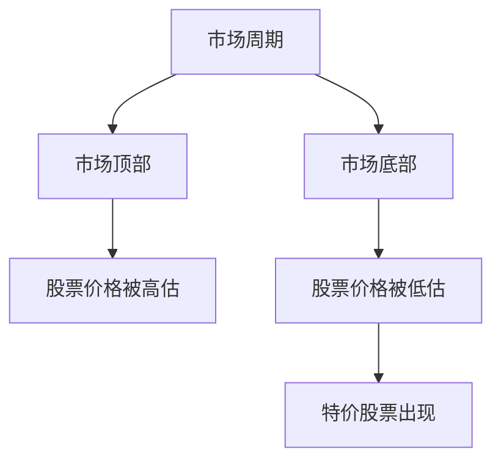

                 

# 如何利用特价股票策略捕捉市场底部

> 关键词：特价股票，市场底部，投资策略，估值分析，风险管理

> 摘要：本文详细探讨了如何利用特价股票策略捕捉市场底部。首先介绍了特价股票的定义和特点，分析了市场底部的形成机制，随后讲解了特价股票的筛选标准和底部识别方法。接着，从基本面和技术面两个角度详细分析了特价股票的估值方法，探讨了市场情绪和宏观经济指标对市场底部的影响。最后，结合实际案例，总结了投资策略的制定和风险管理的重要性，为投资者提供了系统的指导。

---

## 第一部分: 特价股票策略的背景与基础

### 第1章: 特价股票策略概述

#### 1.1 特价股票的定义与特点

##### 1.1.1 什么是特价股票
特价股票指的是那些市场价格远低于其内在价值的股票。这类股票通常被市场低估，可能由于市场情绪、行业周期或公司特定问题导致其价格被压制。特价股票的核心在于其潜在的估值修复机会。

##### 1.1.2 特价股票的特点
- **低估值**：市盈率（P/E）和市净率（P/B）等指标远低于行业平均水平。
- **高分红**：部分公司可能维持较高的股息率，吸引价值投资者。
- **行业周期性**：通常出现在行业低谷期，随着行业复苏，公司价值逐步回归。

##### 1.1.3 特价股票与市场周期的关系
市场周期对特价股票的出现有直接影响。在市场顶部，股票价格被高估，而在市场底部，股票价格被低估，为特价股票提供了投资机会。

#### 1.2 投资者心理与市场情绪

##### 1.2.1 市场情绪对股票价格的影响
市场情绪是影响股票价格的重要因素。当市场情绪乐观时，股票价格上涨；当市场情绪悲观时，股票价格下跌。

##### 1.2.2 投资者心理与特价股票策略
投资者心理在特价股票策略中起着关键作用。在市场底部，恐慌性抛售可能导致股票价格远低于其真实价值，为投资者提供了买入机会。

##### 1.2.3 市场恐慌与投资机会
市场恐慌通常出现在市场底部，投资者的恐慌情绪会导致股票价格超跌，为有耐心的投资者提供了廉价买入的机会。

---

### 第2章: 市场底部的形成机制

#### 2.1 市场周期与底部识别

##### 2.1.1 市场周期的定义与特征
市场周期是指股票市场从高点到低点再到高点的循环过程。市场周期通常分为四个阶段：繁荣、衰退、萧条和复苏。

##### 2.1.2 底部形成的条件与信号
底部形成通常伴随着以下信号：
- 市场估值达到历史低点。
- 市场成交量逐步萎缩。
- 市场情绪极度悲观。

##### 2.1.3 历史案例分析
通过分析历史市场底部，我们可以总结出一些共同特征，例如2008年全球金融危机后的市场底部。

---

## 第二部分: 特价股票的筛选标准

### 第3章: 特价股票的筛选标准

#### 3.1 基本面分析

##### 3.1.1 盈利能力分析
盈利能力是评估公司价值的重要指标。常用的指标包括净利润率、毛利率和净利率。

##### 3.1.2 负债与财务健康度
公司负债情况直接影响其财务健康度。低负债公司通常具有更强的抗风险能力。

##### 3.1.3 行业地位与竞争优势
行业地位和竞争优势决定了公司的长期发展潜力。投资者应选择行业龙头或具有独特竞争优势的公司。

#### 3.2 技术分析

##### 3.2.1 K线图与趋势识别
K线图是技术分析的重要工具。通过分析K线图，投资者可以识别股票的短期趋势和长期趋势。

##### 3.2.2 均线与成交量分析
均线和成交量分析是技术分析的两大支柱。均线可以帮助投资者识别趋势，成交量则反映市场的活跃程度。

##### 3.2.3 技术指标的综合应用
综合运用技术指标（如RSI、MACD等）可以提高底部识别的准确性。

---

## 第三部分: 市场底部的识别方法

### 第4章: 市场底部的识别方法

#### 4.1 宏观经济分析

##### 4.1.1 经济指标与市场底部
GDP增速、失业率等宏观经济指标对市场底部的识别有重要影响。

##### 4.1.2 经济周期与股票市场的关联
经济周期与股票市场密切相关。在经济衰退期，股票市场通常处于底部区域。

##### 4.1.3 宏观分析在底部识别中的应用
通过分析宏观经济指标，投资者可以更好地判断市场所处的经济周期阶段。

#### 4.2 市场情绪与行为分析

##### 4.2.1 市场情绪的衡量指标
恐慌指数（VIX）是衡量市场情绪的重要指标。当恐慌指数上升时，市场情绪趋于悲观。

##### 4.2.2 市场情绪与投资机会
市场情绪的极端悲观通常预示着市场底部的到来。

##### 4.2.3 投资者行为分析
投资者行为分析可以帮助识别市场的非理性行为，从而捕捉市场底部的机会。

---

## 第四部分: 投资策略与风险管理

### 第5章: 投资策略的制定与优化

#### 5.1 投资策略的制定

##### 5.1.1 投资目标的确定
投资者需要明确自己的投资目标和风险承受能力。

##### 5.1.2 投资策略的选择
根据市场环境和个人情况，选择适合的投资策略。

##### 5.1.3 投资组合的构建
通过分散投资，降低投资风险。

#### 5.2 风险管理与心理控制

##### 5.2.1 风险管理的重要性
风险管理是投资成功的关键。投资者需要制定合理的止损策略。

##### 5.2.2 心理控制与纪律性
投资者需要克服贪婪和恐惧，保持纪律性。

##### 5.2.3 投资记录与反思
定期记录投资行为，反思投资决策，总结经验教训。

---

## 第五部分: 实战案例与经验总结

### 第6章: 实战案例分析

#### 6.1 历史案例分析

##### 6.1.1 2008年全球金融危机
2008年金融危机期间，许多股票价格被大幅低估，为投资者提供了买入机会。

##### 6.1.2 2020年新冠疫情冲击
2020年新冠疫情导致市场恐慌，许多股票价格超跌，为投资者提供了投资机会。

#### 6.2 实战经验总结

##### 6.2.1 特价股票投资的注意事项
投资者需要注意公司基本面、行业前景和市场环境。

##### 6.2.2 投资策略的调整
根据市场变化，及时调整投资策略。

##### 6.2.3 投资心态的培养
投资者需要保持冷静，避免情绪化决策。

---

## 第六部分: 总结与展望

### 第7章: 总结与展望

#### 7.1 总结
本文详细探讨了如何利用特价股票策略捕捉市场底部。通过基本面分析、技术分析和宏观经济分析，投资者可以更好地识别市场底部，抓住投资机会。

#### 7.2 展望
随着市场环境的变化，特价股票策略需要不断优化和完善。未来，投资者需要更加关注宏观经济趋势和公司基本面，以应对市场的不确定性。

---

## 作者信息

作者：AI天才研究院/AI Genius Institute & 禅与计算机程序设计艺术 /Zen And The Art of Computer Programming

---

以上是关于“如何利用特价股票策略捕捉市场底部”的完整目录和内容概要。希望对您有所帮助！

