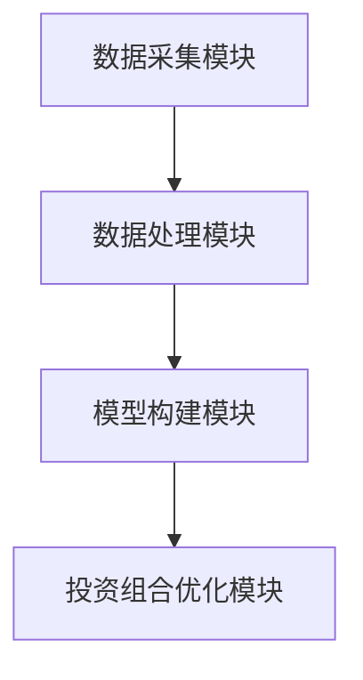
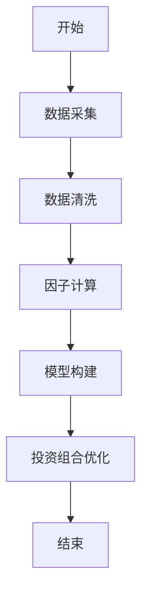

                 


# 如何利用特价股票策略构建全球宏观主题基金

> 关键词：特价股票，宏观主题基金，投资策略，量化分析，系统架构

> 摘要：本文详细探讨了如何利用特价股票策略构建全球宏观主题基金。通过分析特价股票的定义、分类及其在宏观主题基金中的应用，结合量化分析方法和系统架构设计，提出了一个完整的解决方案。文章还通过实际案例分析和代码实现，展示了如何在实际投资中应用这些策略，并总结了相关经验与注意事项。

---

## 第1章 特价股票策略的概述

### 1.1 特价股票的定义与特点

#### 1.1.1 什么是特价股票
特价股票是指市场价格低于其内在价值的股票。这种股票通常被认为具有被市场低估的潜力，可能因为市场波动、公司特定问题或其他外部因素导致价格被暂时压低。

#### 1.1.2 特价股票的分类
特价股票可以根据多种标准进行分类：
- **价值型股票**：市盈率（P/E）或市净率（P/B）低于行业平均水平的股票。
- **低波动性股票**：历史波动率低于市场平均水平的股票。
- **高分红股票**：股息率较高的股票。

#### 1.1.3 特价股票的投资价值
特价股票的投资价值主要体现在以下几个方面：
- **潜在收益**：被低估的股票有更大的上涨空间。
- **风险控制**：相对于高估股票，特价股票的风险较低。
- **长期收益**：通过长期持有，特价股票可能因市场重新估值而获得收益。

### 1.2 全球宏观主题基金的定义与特点

#### 1.2.1 宏观主题基金的定义
宏观主题基金是一种投资于与全球经济趋势、行业周期或社会趋势相关的资产的基金。其核心在于捕捉宏观经济中的长期趋势，如能源转型、科技创新、老龄化社会等。

#### 1.2.2 宏观主题基金的特点
- **主题导向**：基金的投资策略围绕特定的宏观主题展开。
- **长期视角**：宏观主题基金通常关注长期趋势，而非短期市场波动。
- **分散风险**：通过投资多个相关行业或资产，分散单一行业的风险。

#### 1.2.3 宏观主题基金的投资策略
- **趋势投资**：基于宏观经济预测，投资于与趋势相关的行业或公司。
- **资产配置**：根据市场环境调整资产配置比例。
- **风险管理**：通过多样化投资和风险对冲控制投资风险。

### 1.3 特价股票策略与宏观主题基金的结合

#### 1.3.1 特价股票策略在宏观主题基金中的应用
在宏观主题基金中，特价股票策略用于筛选特定主题中的低估股票，从而在捕捉长期趋势的同时，降低投资成本。

#### 1.3.2 宏观主题基金中特价股票策略的优势
- **成本优势**：特价股票通常价格较低，适合大规模投资。
- **风险分散**：通过投资多个低价股票，分散投资风险。

#### 1.3.3 宏观主题基金中特价股票策略的挑战
- **流动性风险**：某些特价股票可能流动性较差，难以快速变现。
- **市场波动**：宏观经济波动可能影响特价股票的表现。

## 第2章 特价股票策略的背景与现状

### 2.1 特价股票策略的背景

#### 2.1.1 特价股票策略的起源
特价股票策略起源于价值投资理念，强调寻找市场价格低于内在价值的股票。这种策略在20世纪30年代由本杰明·格雷厄姆提出，并在后来被 Warren Buffett 等投资者广泛应用。

#### 2.1.2 特价股票策略的发展历程
随着金融市场的不断发展，特价股票策略逐渐从传统的方法发展到量化分析的方法，利用大数据和机器学习技术进行选股。

#### 2.1.3 特价股票策略在金融市场的地位
特价股票策略是价值投资的重要组成部分，尤其适用于长期投资和风险承受能力较高的投资者。

### 2.2 全球宏观主题基金的现状

#### 2.2.1 宏观主题基金的市场规模
近年来，随着全球经济的不确定性增加，宏观主题基金的市场规模迅速增长，吸引了大量投资者。

#### 2.2.2 宏观主题基金的主要参与者
主要参与者包括全球知名的投资机构、资产管理公司和 hedge fund。

#### 2.2.3 宏观主题基金的未来发展趋势
随着科技的发展和数据的丰富，宏观主题基金将更多地依赖于量化分析和人工智能技术进行投资决策。

### 2.3 特价股票策略与宏观主题基金的结合现状

#### 2.3.1 特价股票策略在宏观主题基金中的应用现状
越来越多的宏观主题基金开始采用特价股票策略，特别是在能源转型和科技创新等主题中。

#### 2.3.2 宏观主题基金中特价股票策略的优劣势分析
- **优势**：成本低、风险分散。
- **劣势**：流动性风险、市场波动风险。

#### 2.3.3 宏观主题基金中特价股票策略的未来发展趋势
随着量化技术的进步，特价股票策略在宏观主题基金中的应用将更加广泛和深入。

## 第3章 特价股票策略的核心概念与原理

### 3.1 特价股票策略的核心概念

#### 3.1.1 特价股票的定义与分类
如前所述，特价股票可以根据市盈率、市净率、股息率等因素进行分类。

#### 3.1.2 特价股票的市场定位
特价股票通常被视为具有长期投资价值的股票，适合价值投资者。

#### 3.1.3 特价股票的投资价值评估
投资价值评估可以通过市盈率、市净率、股息率等指标进行量化分析。

### 3.2 宏观主题基金的核心概念

#### 3.2.1 宏观主题基金的定义与分类
宏观主题基金根据投资主题的不同可以分为能源转型基金、科技创新基金、老龄化社会基金等。

#### 3.2.2 宏观主题基金的投资策略
- **趋势投资**：基于宏观经济预测进行投资。
- **资产配置**：根据市场环境调整资产配置比例。

### 3.3 特价股票策略与宏观主题基金的结合

#### 3.3.1 特价股票策略在宏观主题基金中的应用
在宏观主题基金中，特价股票策略用于筛选特定主题中的低估股票。

#### 3.3.2 宏观主题基金中特价股票策略的实现
通过量化分析和大数据技术，筛选符合特定主题的特价股票。

### 3.4 本章小结

---

## 第4章 特价股票策略的量化分析方法

### 4.1 数据收集与预处理

#### 4.1.1 数据来源
数据来源包括股票价格、财务报表、行业指数等。

#### 4.1.2 数据清洗
数据清洗包括处理缺失值、异常值等。

#### 4.1.3 数据转换
数据转换包括标准化、归一化等。

### 4.2 因子分析与建模

#### 4.2.1 因子选择
选择市盈率、市净率、股息率等因子。

#### 4.2.2 因子权重分配
通过历史数据和回归分析确定因子权重。

#### 4.2.3 模型构建
构建多因子模型，用于评估股票的投资价值。

### 4.3 风险控制与回测策略

#### 4.3.1 风险控制
通过分散投资和对冲工具控制投资风险。

#### 4.3.2 回测策略
通过历史数据验证策略的有效性。

### 4.4 本章小结

---

## 第5章 系统架构与实现

### 5.1 系统架构设计

#### 5.1.1 系统功能模块
- 数据采集模块
- 数据处理模块
- 模型构建模块
- 投资组合优化模块

#### 5.1.2 系统架构图
使用 Mermaid 绘制系统架构图。



### 5.2 数据流与交互流程

#### 5.2.1 数据流
数据从数据源流入系统，经过处理后，用于模型构建和投资组合优化。

#### 5.2.2 交互流程
用户通过界面输入参数，系统根据参数进行计算并输出结果。

### 5.3 核心算法实现

#### 5.3.1 算法流程图
使用 Mermaid 绘制算法流程图。



#### 5.3.2 代码实现
以下是核心算法的 Python 代码示例：

```python
import pandas as pd
import numpy as np

# 数据预处理
data = pd.read_csv('stock_data.csv')
data = data.dropna()

# 因子计算
data['PE'] = data['Price'] / data['Earnings']
data['PB'] = data['Price'] / data['Book Value']

# 模型构建
from sklearn.linear_model import LinearRegression
model = LinearRegression()
model.fit(data[['PE', 'PB']], data['Return'])

# 投资组合优化
# 假设我们选择前10只股票
selected_stocks = data.sort_values('PE').head(10)
```

### 5.4 本章小结

---

## 第6章 实战与案例分析

### 6.1 环境安装与配置

#### 6.1.1 数据库安装
安装 MySQL 或其他数据库。

#### 6.1.2 工具安装
安装 Python、Pandas、Scikit-learn 等工具。

### 6.2 代码实现与解读

#### 6.2.1 数据采集与处理
编写代码从 Yahoo Finance 获取数据并进行处理。

```python
import yfinance as yf

# 下载数据
data = yf.download('AAPL', start='2020-01-01', end='2023-12-31')

# 数据处理
data['Return'] = data['Close'].pct_change()
data = data.dropna()
```

#### 6.2.2 模型实现
使用机器学习模型进行因子分析。

```python
from sklearn.ensemble import RandomForestRegressor

# 训练模型
model = RandomForestRegressor(n_estimators=100)
model.fit(data[['PE', 'PB']], data['Return'])
```

#### 6.2.3 投资组合优化
根据模型结果构建投资组合。

```python
selected_stocks = data.sort_values('PE').head(10)
```

### 6.3 案例分析

#### 6.3.1 案例背景
以能源转型主题为例，选择相关的特价股票。

#### 6.3.2 案例分析
分析过去三年的能源转型主题基金的表现。

#### 6.3.3 绩效评估
计算基金的年化收益率、夏普比率等指标。

### 6.4 本章小结

---

## 第7章 总结与展望

### 7.1 总结
本文详细探讨了如何利用特价股票策略构建全球宏观主题基金，从理论到实践进行了全面分析。

### 7.2 展望
未来，随着人工智能和大数据技术的发展，特价股票策略在宏观主题基金中的应用将更加广泛和深入。

## 第8章 注意事项与最佳实践

### 8.1 投资风险提示
投资者应充分了解投资风险，特别是在市场波动较大的情况下。

### 8.2 最佳实践 tips
- 定期调整投资组合。
- 保持对市场的敏感性。
- 合理控制杠杆比例。

### 8.3 小结

---

## 附录

### 附录A 数据来源与工具推荐

### 附录B 参考文献

---

作者：AI天才研究院/AI Genius Institute & 禅与计算机程序设计艺术 /Zen And The Art of Computer Programming

