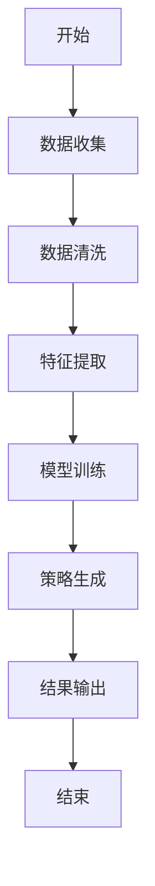
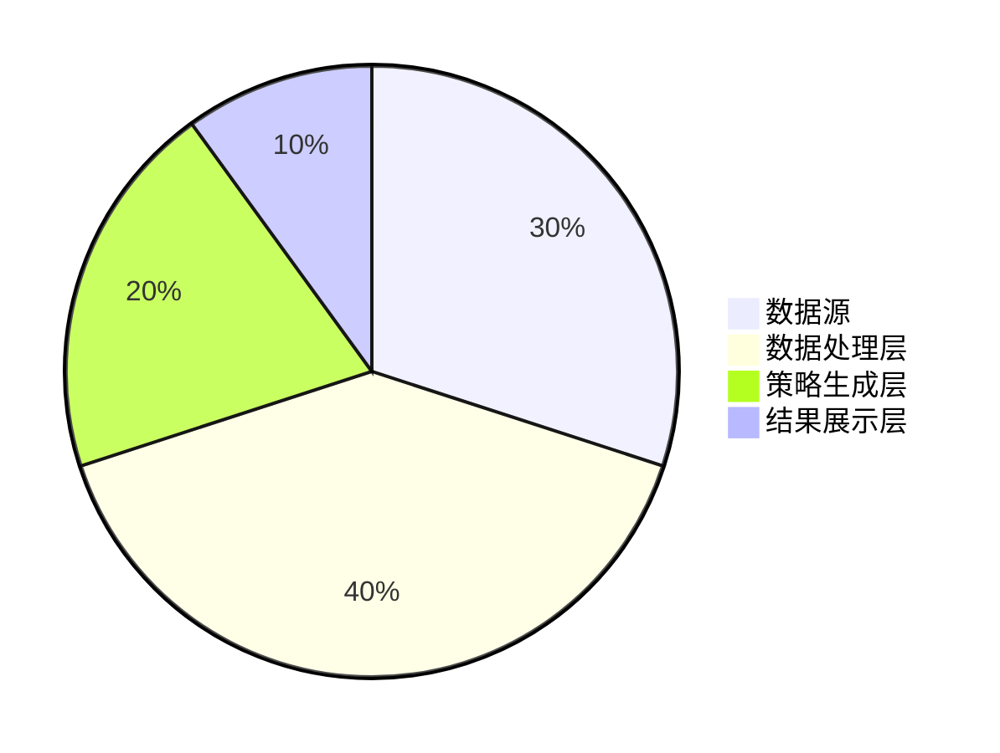

                 


# 如何利用特价股票策略构建养老金投资组合

## 关键词：特价股票、养老金投资、投资组合、股票策略、风险管理

## 摘要：本文详细探讨了如何利用特价股票策略构建一个稳健的养老金投资组合。文章从背景介绍、核心概念、算法原理、系统架构到项目实战，全面分析了特价股票策略在养老金投资中的应用，帮助读者理解如何通过长期价值投资实现稳健收益。

---

## 第一部分：背景介绍

### 第1章：特价股票策略与养老金投资组合的背景介绍

#### 1.1 特价股票策略的定义与特点
- **1.1.1 什么是特价股票**
  特价股票指的是市场价格低于其内在价值的股票。投资者认为这些股票被市场低估，具有长期增值的潜力。

- **1.1.2 特价股票的市场定位**
  特价股票通常出现在市场低迷时期或公司暂时遇到困难时。这些股票可能因为市场情绪或短期因素被低估，但具备长期投资价值。

- **1.1.3 特价股票与传统股票的区别**
  | 属性       | 特价股票                   | 传统股票                  |
  |------------|---------------------------|---------------------------|
  | 定价       | 低于内在价值               | 接近或高于内在价值         |
  | 投资策略   | 长期持有，等待价值回归      | 短期交易或关注增长          |
  | 风险       | 较高，需长期持有            | 风险分散，适合多种投资策略  |

#### 1.2 养老金投资组合的基本概念
- **1.2.1 养老金投资的基本原理**
  养老金投资组合旨在通过多元化投资实现资产的保值与增值，确保在退休时有足够的资金来源。

- **1.2.2 养老金投资的目标与风险**
  - **目标**：实现资产的长期稳健增长，控制通货膨胀影响，确保资金安全。
  - **风险**：市场波动、流动性风险、通货膨胀风险等。

- **1.2.3 养老金投资的常见策略**
  - **价值投资**：寻找被低估的资产进行投资。
  - **指数投资**：通过投资指数基金实现市场平均收益。
  - **多元投资**：分散投资于不同资产类别，降低风险。

#### 1.3 特价股票策略在养老金投资中的应用
- **1.3.1 特价股票策略的优势**
  - **高收益潜力**：长期持有特价股票可能带来较高的资本增值。
  - **低估值优势**：特价股票通常具有较高的安全边际，降低投资风险。

- **1.3.2 特价股票策略的潜在风险**
  - **流动性风险**：某些特价股票可能流动性较差，难以迅速变现。
  - **市场风险**：市场低迷时，特价股票可能继续下跌，影响投资组合表现。

- **1.3.3 特价股票策略与养老金投资目标的契合点**
  - **长期投资**：特价股票策略适合长期持有，与养老金的长期投资目标一致。
  - **风险控制**：通过选择优质特价股票，可以在控制风险的同时追求稳健收益。

---

## 第二部分：核心概念与联系

### 第2章：特价股票策略的核心概念与联系

#### 2.1 特价股票策略的核心原理
- **市场有效性的假设**
  市场并非总是有效的，存在被低估的股票，这些股票的市场价格低于其内在价值。

- **价值投资与成长投资的对比**
  | 指标       | 价值投资                   | 成长投资                  |
  |------------|---------------------------|---------------------------|
  | 估值       | 低于市场价                  | 高于市场价或合理增长       |
  | 股东回报   | 通过价值回归实现收益        | 通过公司增长实现收益        |
  | 风险       | 较低，注重安全边际            | 较高，依赖公司未来增长        |

- **特价股票的识别方法**
  - **基本面分析**：分析公司的财务指标，如市盈率（P/E）、市净率（P/B）等。
  - **技术分析**：通过股价走势识别超跌股票。

#### 2.2 特价股票与养老金投资的关联性
- **特价股票的长期收益特征**
  长期来看，特价股票可能表现优于市场平均水平，尤其是在市场复苏时。

- **特价股票在资产配置中的作用**
  在养老金投资组合中，特价股票可以作为价值投资的一部分，提供长期稳健的收益。

- **特价股票策略对养老金投资组合的优化**
  通过选择低估股票，可以提高投资组合的收益，同时降低整体风险。

#### 2.3 特价股票策略与现代投资组合理论的结合
- **现代投资组合理论的基本框架**
  现代投资组合理论强调通过多元化投资来降低风险，同时最大化收益。

- **特价股票策略在投资组合中的应用**
  将特价股票与其他资产类别（如债券、房地产等）结合，构建一个多元化投资组合。

- **特价股票策略与风险分散的关系**
  通过选择不同行业的特价股票，可以分散行业风险，降低投资组合的整体波动性。

---

## 第三部分：算法原理与数学模型

### 第3章：特价股票策略的算法原理与数学模型

#### 3.1 特价股票筛选算法
- **基于基本面分析的筛选算法**
  1. 计算市盈率（P/E）：市盈率 = 股价 / 每股收益。
  2. 筛选市盈率低于行业平均水平的股票。
  3. 结合其他基本面指标（如市净率、股息率）进行综合评估。

- **基于技术分析的筛选算法**
  1. 计算相对强弱指数（RSI）：RSI = (N天内上涨天数 / N天) × 100。
  2. 筛选RSI低于30的股票，表示超卖状态。
  3. 结合其他技术指标（如MACD）进行确认。

- **组合优化算法**
  使用优化算法（如遗传算法）在多个候选股票中选择最优组合，最大化收益同时最小化风险。

#### 3.2 特价股票策略的数学模型
- **市盈率模型**
  $$ P/E = \frac{\text{股价}}{\text{每股收益}} $$
  通过比较P/E与行业平均水平，筛选低估股票。

- **市净率模型**
  $$ P/B = \frac{\text{股价}}{\text{每股净资产}} $$
  P/B低于1通常被视为低估的信号。

- **股息率模型**
  $$ \text{股息率} = \frac{\text{每股股息}}{\text{股价}} \times 100\% $$
  高股息率的股票可能提供稳定的收益。

#### 3.3 算法流程图


---

## 第四部分：系统架构与设计

### 第4章：特价股票策略的系统架构与设计

#### 4.1 系统功能设计
- **数据采集模块**
  - 从多个数据源（如Yahoo Finance、Google Finance）获取实时数据。
- **数据处理模块**
  - 清洗数据，处理缺失值和异常值。
- **策略生成模块**
  - 应用筛选算法生成投资策略。
- **风险评估模块**
  - 分析投资组合的风险，如波动率、VaR等。

#### 4.2 系统架构图


#### 4.3 系统接口设计
- **数据接口**
  - REST API接口，用于数据采集和传输。
- **策略接口**
  - 提供API，供其他系统调用投资策略。
- **风险评估接口**
  - 返回投资组合的风险评估结果。

---

## 第五部分：项目实战

### 第5章：特价股票策略的项目实战

#### 5.1 环境安装
- **Python环境搭建**
  安装Python 3.8及以上版本，并安装必要的库（如Pandas、NumPy、Scipy）。
- **数据库安装与配置**
  使用SQLite或MySQL作为数据存储。
- **开发工具安装**
  安装Jupyter Notebook或VS Code作为开发环境。

#### 5.2 系统核心实现
- **数据采集与清洗**
  ```python
  import pandas as pd
  import numpy as np

  # 数据采集
  df = pd.read_csv('stock_data.csv')
  # 数据清洗
  df.dropna(inplace=True)
  ```

- **特价股票筛选算法实现**
  ```python
  def calculate_pe(stock_data):
      pe = stock_data['股价'] / stock_data['每股收益']
      return pe

  # 筛选P/E低于行业平均水平的股票
  pe_threshold = stock_data['P/E'].mean()
  value_stocks = stock_data[stock_data['P/E'] < pe_threshold]
  ```

- **投资组合优化代码实现**
  ```python
  from scipy.optimize import minimize

  def portfolio_optimization(weights, returns, risk_free_rate):
      portfolio_return = np.dot(weights, returns)
      portfolio_variance = np.dot(weights.T, np.dot(returns.cov(), weights))
      return portfolio_variance

  # 使用优化算法选择最优权重
  def optimize_portfolio(returns):
      n = len(returns.columns)
      initial_weights = np.array([1/n]*n)
      result = minimize(portfolio_optimization, initial_weights, args=(returns, 0.05))
      return result.x

  optimized_weights = optimize_portfolio(value_stocks.returns)
  ```

#### 5.3 代码应用解读与分析
- **数据处理代码**
  使用Pandas和NumPy进行数据清洗和处理，确保数据的准确性和完整性。

- **策略生成代码**
  应用筛选算法生成投资策略，并通过优化算法选择最优的投资组合。

- **风险评估代码**
  使用统计方法评估投资组合的风险，并进行风险调整。

#### 5.4 实际案例分析
- **案例背景**
  假设我们有一个包含10只股票的投资组合，目标是通过特价股票策略实现长期收益。

- **数据分析与策略制定**
  通过基本面分析和筛选算法，选出5只低估股票，并进行组合优化。

- **投资组合表现评估**
  监测投资组合的收益和风险，定期调整投资策略以应对市场变化。

---

## 第六部分：最佳实践与小结

### 第6章：特价股票策略的最佳实践与小结

#### 6.1 最佳实践 Tips
- **数据来源的选择**
  使用多个可靠的数据源，确保数据的准确性和全面性。
- **模型的持续优化**
  定期更新模型，根据市场变化调整策略参数。
- **风险管理**
  设置止损点和止盈点，避免过度亏损和过度收益。

#### 6.2 小结
通过合理运用特价股票策略，投资者可以在养老金投资组合中实现稳健的收益。本文详细分析了特价股票策略的核心原理、算法实现以及系统架构，为读者提供了理论和实践的双重指导。

---

## 作者：AI天才研究院/AI Genius Institute & 禅与计算机程序设计艺术 /Zen And The Art of Computer Programming

---

以上是关于《如何利用特价股票策略构建养老金投资组合》的完整文章大纲，希望对您有所帮助！

