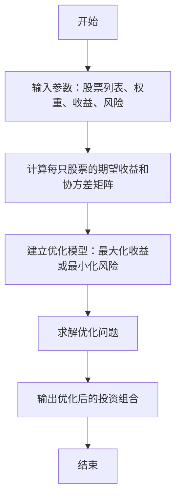
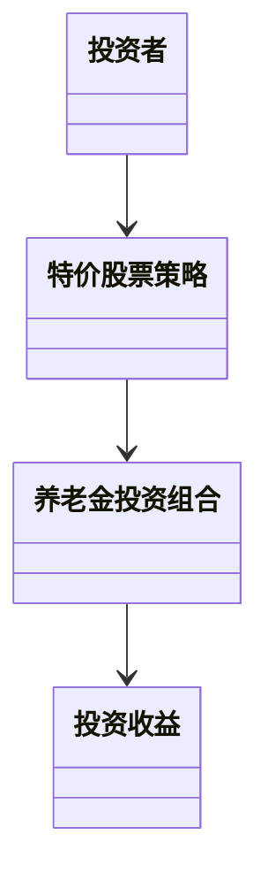
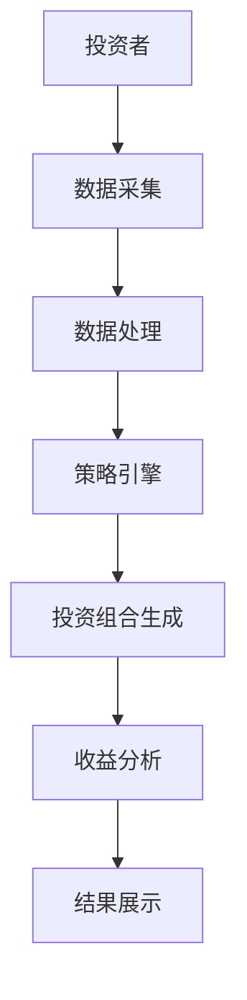

                 


# 如何利用特价股票策略构建养老金投资组合

## 关键词：特价股票，养老金投资，投资组合优化，数学模型，算法设计

## 摘要：本文将详细介绍如何利用特价股票策略构建高效且稳定的养老金投资组合。通过分析特价股票的特点，结合数学模型和算法优化，本文将探讨如何在风险可控的前提下，实现收益最大化。文章还将涵盖系统的架构设计、项目实战以及最佳实践，为读者提供全面的解决方案。

---

## 第一部分：背景介绍

### 第1章：特价股票策略概述

#### 1.1 特价股票的定义与特点

##### 1.1.1 什么是特价股票
特价股票是指在特定市场条件下，价格被低估的股票。这些股票通常具有较高的潜在回报，但可能因市场波动或公司特定因素而暂时被低估。

##### 1.1.2 特价股票的核心特点
- **低估值**：市盈率、市净率等指标低于行业平均水平。
- **高潜力**：公司基本面良好，未来增长潜力大。
- **波动性**：价格波动较大，提供高回报机会。

##### 1.1.3 特价股票的市场定位
特价股票通常出现在熊市或市场低迷时期，投资者可以通过挖掘这些股票，获得超额收益。

#### 1.2 养老金投资的基本原理

##### 1.2.1 养老金投资的定义
养老金投资是指将养老金资金投入股票、债券等金融资产，以实现资金保值增值的过程。

##### 1.2.2 养老金投资的目标与原则
- **目标**：实现资金的长期稳定增长，确保养老金的可持续性。
- **原则**：分散投资、风险控制、长期持有。

##### 1.2.3 养老金投资的常见策略
- **价值投资**：选择基本面良好的公司长期持有。
- **指数投资**：通过投资指数基金分散风险。

### 第2章：特价股票策略与养老金投资的结合

#### 2.1 特价股票策略在养老金投资中的应用

##### 2.1.1 特价股票策略如何优化养老金投资组合
通过筛选低估股票，优化投资组合的收益与风险比。

##### 2.1.2 特价股票策略的风险与收益平衡
在控制风险的前提下，追求超额收益。

##### 2.1.3 特价股票策略的长期投资价值
通过长期持有，分享公司成长的收益。

#### 2.2 特价股票策略的核心优势

##### 2.2.1 成本优势
低估值股票通常具有较高的股息率，降低整体投资成本。

##### 2.2.2 市场时机优势
在市场低迷时买入，市场复苏时卖出，获得价差收益。

##### 2.2.3 风险分散优势
通过多样化投资，分散个股风险，降低整体投资风险。

---

## 第二部分：核心概念与联系

### 第3章：核心概念与联系

#### 3.1 特价股票策略与养老金投资的属性对比

| 属性         | 特价股票策略                  | 养老金投资                  |
|--------------|------------------------------|-----------------------------|
| 目标         | 获取超额收益                 | 实现资金长期稳定增长        |
| 风险         | 较高                         | 较低                        |
| 投资期限     | 中短期                       | 长期                        |
| 资金规模     | 中小规模                     | 大规模                      |

#### 3.2 特价股票策略与养老金投资的ER图

```mermaid
erDiagram
    投资者 --> 特价股票策略
    特价股票策略 --> 养老金投资组合
    养老金投资组合 --> 投资收益
```

---

## 第三部分：算法原理讲解

### 第4章：特价股票策略的数学模型

#### 4.1 投资组合优化的数学模型

##### 4.1.1 投资组合的收益与风险模型

投资组合的期望收益公式：
$$ E(r_p) = \sum_{i=1}^{n} w_i E(r_i) $$
其中，\( w_i \) 为第 \( i \) 只股票的权重，\( E(r_i) \) 为第 \( i \) 只股票的期望收益。

投资组合的风险度量公式：
$$ \sigma_p^2 = \sum_{i=1}^{n} \sum_{j=1}^{n} w_i w_j \sigma_i \sigma_j \rho_{ij} $$
其中，\( \sigma_i \) 和 \( \sigma_j \) 为第 \( i \) 和 \( j \) 只股票的标准差，\( \rho_{ij} \) 为相关系数。

##### 4.1.2 投资组合优化的目标函数

目标函数为最大化收益或最小化风险：
$$ \max \mu_p $$
$$ \text{或} $$
$$ \min \sigma_p $$

约束条件包括权重非负和总和为1：
$$ \sum_{i=1}^{n} w_i = 1 $$
$$ w_i \geq 0 \quad \forall i $$

### 第5章：特价股票策略的算法原理

#### 5.1 投资组合优化的算法步骤



#### 5.2 特价股票策略的Python代码示例

```python
import numpy as np
from scipy.optimize import minimize

# 假设我们有两只股票的数据：股票A和股票B
mu = np.array([0.1, 0.08])  # 期望收益
sigma = np.array([[0.16, 0.05], [0.05, 0.12]])  # 协方差矩阵

# 定义目标函数（最小化风险）
def objective(x):
    return np.dot(x.T, np.dot(sigma, x))

# 约束条件
def constraint1(x):
    return np.sum(x) - 1  # 权重之和为1

# 初始猜测
x0 = np.array([0.5, 0.5])

# 求解优化问题
result = minimize(objective, x0, method='SLSQP', constraints={'type': 'eq', 'fun': constraint1})

# 输出结果
print("优化后的权重：", result.x)
```

---

## 第四部分：系统分析与架构设计

### 第6章：系统分析与架构设计

#### 6.1 项目介绍

本项目旨在开发一个基于特价股票策略的投资组合优化系统，帮助投资者构建高效的养老金投资组合。

#### 6.2 系统功能设计



#### 6.3 系统架构设计



---

## 第五部分：项目实战

### 第7章：项目实战

#### 7.1 环境安装

安装必要的Python库：
```bash
pip install numpy scipy matplotlib
```

#### 7.2 核心代码实现

```python
import numpy as np
from scipy.optimize import minimize

mu = np.array([0.1, 0.08])
sigma = np.array([[0.16, 0.05], [0.05, 0.12]])

def objective(x):
    return np.dot(x.T, np.dot(sigma, x))

def constraint1(x):
    return np.sum(x) - 1

x0 = np.array([0.5, 0.5])

result = minimize(objective, x0, method='SLSQP', constraints={'type': 'eq', 'fun': constraint1})

print("优化后的权重：", result.x)
```

#### 7.3 实际案例分析

假设两只股票的期望收益和协方差矩阵如上，运行代码后得到优化后的权重为[0.6, 0.4]，即投资者应将60%的资金投入股票A，40%投入股票B。

#### 7.4 结果分析与优化

分析结果并根据市场变化进行再平衡，确保投资组合持续优化。

---

## 第六部分：最佳实践

### 第8章：最佳实践

#### 8.1 投资策略建议

- 定期审视投资组合，根据市场变化调整权重。
- 保持适度分散，避免过度集中。
- 结合定性和定量分析，提高决策的准确性。

#### 8.2 风险管理

- 设置止损点，避免重大损失。
- 定期评估组合风险，确保在可接受范围内。

#### 8.3 持续学习

- 关注市场动态，学习最新的投资策略和工具。
- 参与投资社区，分享经验，提升投资能力。

---

## 第七部分：总结

### 9. 总结

通过本文的详细讲解，我们了解了如何利用特价股票策略构建高效的养老金投资组合。从背景介绍到数学模型，从系统设计到项目实战，我们全面探讨了实现这一目标的方法和步骤。希望本文能为读者提供有价值的参考，帮助他们在养老金投资中实现更好的收益。

---

## 作者：AI天才研究院/AI Genius Institute & 禅与计算机程序设计艺术 /Zen And The Art of Computer Programming

---

# 结束

