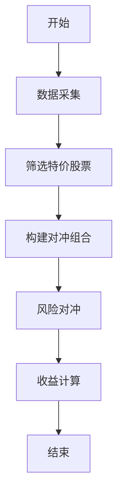
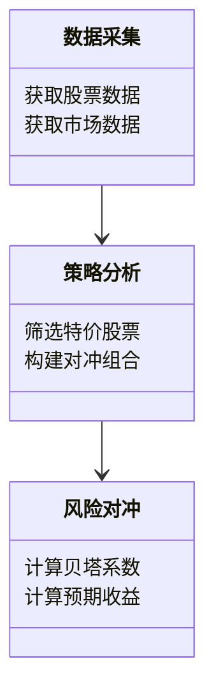

                 


# 如何利用特价股票策略构建多元资产对冲组合

> 关键词：特价股票，对冲组合，风险管理，资产配置，投资策略

> 摘要：本文详细探讨了如何利用特价股票策略构建多元资产对冲组合。首先，我们介绍了特价股票策略的基本概念和对冲投资的核心原理。接着，我们分析了特价股票策略与对冲组合的核心概念及其关系，通过属性特征对比和ER实体关系图帮助读者理解。然后，我们深入讲解了算法原理，包括数学模型和公式，并通过Python代码实现。随后，我们从系统分析与架构设计的角度，详细介绍了构建对冲组合的系统结构和接口设计。最后，通过项目实战和最佳实践，我们总结了如何在实际投资中应用这些策略，并提供了相关的注意事项和拓展阅读建议。

---

## 第一部分：背景介绍

### 第1章：特价股票策略与对冲投资概述

#### 1.1 特价股票策略的定义与背景

**1.1.1 特价股票的定义**

特价股票是指在市场中价格被低估的股票。通常，这些股票的市场价格低于其内在价值，可能是由于市场情绪、短期波动或其他因素导致的暂时性低估。投资者认为这些股票具有较大的增值潜力，因此选择在低价时买入，期望在价格回升时卖出获利。

**1.1.2 特价股票策略的起源与发展**

特价股票策略的起源可以追溯到价值投资的理念，由本杰明·格雷厄姆和戴维·多德提出。他们强调购买那些市场价格低于其内在价值的股票，尤其是那些具有稳定业务模式和良好财务状况的公司。随着时间的推移，这种策略不断发展，结合了现代金融理论和数据分析技术，成为投资组合管理的重要组成部分。

**1.1.3 特价股票策略的市场环境**

特价股票策略的有效性与市场环境密切相关。在熊市或市场低迷期间，许多优质股票可能被低估，为投资者提供了低价买入的机会。而在牛市中，市场情绪高涨，股票价格可能被高估，特价股票的机会较少。因此，投资者需要根据市场环境调整策略，选择合适的时机进行投资。

#### 1.2 对冲投资的基本原理

**1.2.1 对冲投资的定义**

对冲投资是一种通过同时买入和卖出相关资产来减少市场风险的投资策略。其核心思想是通过资产之间的负相关性来抵消市场的整体波动，从而实现风险可控下的收益。

**1.2.2 对冲投资的核心目标**

对冲投资的核心目标是通过构造对冲组合，降低投资组合的整体风险，同时追求超额收益。对冲组合通常由多头头寸和空头头寸组成，通过资产之间的对冲关系来减少市场风险。

**1.2.3 对冲投资与传统投资的区别**

与传统投资相比，对冲投资具有以下特点：
- **多空双向投资**：对冲组合同时包含多头和空头头寸，而传统投资通常只包含多头头寸。
- **风险中性**：对冲组合的风险较低，而传统投资的风险较高。
- **超额收益**：对冲投资的目标是通过有效的对冲策略实现超额收益，而传统投资的目标是通过资产增值实现收益。

#### 1.3 特价股票策略在对冲组合中的应用

**1.3.1 特价股票策略的优势**

特价股票策略的优势在于其能够发现市场中被低估的股票，从而为对冲组合提供潜在的超额收益。通过选择具有较大上涨空间的股票作为多头头寸，同时利用股指期货或其他衍生品作为空头头寸，投资者可以在市场波动中实现收益。

**1.3.2 对冲组合的风险管理**

对冲组合的风险管理是通过对冲机制实现的。通过合理配置多头和空头头寸，投资者可以降低市场风险，同时利用资产之间的相关性变化实现收益。此外，投资者还需要关注流动性风险、信用风险和操作风险，确保对冲组合的稳健运行。

**1.3.3 当前市场环境下的策略分析**

当前市场环境下，全球经济的不确定性增加，市场波动加剧。特价股票策略在对冲组合中的应用显得尤为重要。投资者可以通过分析市场趋势、公司基本面和估值指标，选择具有长期增长潜力的股票作为多头头寸，并利用股指期货等工具进行对冲，降低市场波动对组合的影响。

---

## 第二部分：核心概念与联系

### 第2章：特价股票策略与对冲组合的核心原理

#### 2.1 特价股票策略的核心概念

**2.1.1 特价股票的筛选标准**

投资者在选择特价股票时，通常会关注以下几个指标：
- **市盈率（P/E）**：市盈率低于行业平均水平的股票可能具有投资价值。
- **市净率（P/B）**：市净率低于行业平均水平的股票可能具有投资价值。
- **股息率**：股息率较高的股票可能具有稳定的收益。
- **ROE（净资产收益率）**：ROE较高的股票通常具有较强的盈利能力。

**2.1.2 特价股票的市场定位**

特价股票通常出现在市场低迷或行业不景气的时期。此时，许多优质股票可能被市场低估，为投资者提供了买入的机会。投资者需要结合市场环境和公司基本面，选择具有长期增长潜力的股票。

**2.1.3 特价股票的估值方法**

投资者可以通过多种方法对股票进行估值，包括：
- **相对估值法**：通过比较股票的市盈率、市净率等指标与行业平均水平，判断股票的估值水平。
- **绝对估值法**：通过DCF模型等方法，估算股票的内在价值。
- **技术分析法**：通过分析股票的价格走势和成交量，判断股票的买卖信号。

#### 2.2 对冲组合的核心概念

**2.2.1 组合构建的基本原则**

对冲组合的构建需要遵循以下基本原则：
- **分散化**：通过多样化资产配置，降低组合的整体风险。
- **风险中性**：通过多头和空头头寸的对冲，降低市场风险。
- **超额收益**：通过有效的对冲策略，实现超额收益。

**2.2.2 组合的风险与收益平衡**

对冲组合的风险与收益需要在两者之间进行权衡。通过合理配置多头和空头头寸，投资者可以在降低风险的同时，追求超额收益。然而，过高的风险可能导致组合的损失，而过低的风险可能无法实现超额收益。

**2.2.3 对冲机制的实现方式**

对冲机制的实现方式主要包括：
- **股指期货**：通过买入或卖出股指期货，对冲股票组合的市场风险。
- **期权对冲**：通过买入或卖出期权，对冲组合的波动风险。
- **配对交易**：通过同时买入和卖出相关资产，对冲市场的整体波动。

#### 2.3 特价股票策略与对冲组合的关系

**2.3.1 策略与组合的协同效应**

特价股票策略与对冲组合具有协同效应。通过选择具有长期增长潜力的股票作为多头头寸，并利用股指期货等工具进行对冲，投资者可以在市场波动中实现收益。

**2.3.2 策略对组合风险的影响**

特价股票策略可以通过选择具有较高收益潜力的股票，增加组合的收益。然而，如果市场出现大幅波动，特价股票策略可能面临较大的下行风险，从而影响组合的整体表现。

**2.3.3 组合对策略收益的优化**

对冲组合可以通过合理配置多头和空头头寸，优化策略的收益。通过降低市场的整体波动，组合可以更稳定地实现超额收益。

---

### 第3章：核心概念的属性特征对比与ER实体关系图

#### 3.1 特价股票策略与对冲组合的属性特征对比

| **属性**            | **特价股票策略**                          | **对冲组合**                              |
|---------------------|--------------------------------------------|------------------------------------------|
| **目标**            | 寻找被低估的股票                          | 降低市场风险，实现超额收益               |
| **风险**            | 个股风险较高                              | 市场风险较低                             |
| **收益**            | 个股收益潜力大                            | 组合收益相对稳定                         |
| **操作**            | 主动选股                                  | 多空双向操作                             |
| **对冲机制**        | 无                                       | 利用股指期货等工具进行对冲               |

**ER实体关系图：**

```mermaid
erDiagram
    顾客--|{拥有}| 股票
    股票--|{属于}| 行业
    行业--|{包含}| 市场
    顾客--|{参与}| 组合
    组合--|{包含}| 头寸
    头寸--|{涉及}| 股指期货
```

---

## 第三部分：算法原理讲解

### 第4章：算法原理

#### 4.1 特价股票策略的数学模型

**CAPM模型：**

$$ E(R_i) = R_f + \beta_i (R_m - R_f) $$

其中：
- $E(R_i)$ 是资产的预期收益。
- $R_f$ 是无风险利率。
- $\beta_i$ 是资产的贝塔系数。
- $R_m$ 是市场预期收益。

**VaR模型：**

$$ VaR = \alpha \sigma $$

其中：
- $\alpha$ 是分位数。
- $\sigma$ 是资产收益的标准差。

#### 4.2 算法流程



#### 4.3 算法实现代码

```python
import pandas as pd
import numpy as np

def calculate_beta(stock_return, market_return):
    # 计算贝塔系数
    covariance = np.cov(stock_return, market_return)[0][1]
    variance_market = np.var(market_return)
    beta = covariance / variance_market
    return beta

def calculate_expected_return(beta, risk_free_rate, market_expected_return):
    # 计算预期收益
    expected_return = risk_free_rate + beta * (market_expected_return - risk_free_rate)
    return expected_return

# 示例数据
stock_returns = pd.Series([0.1, 0.05, -0.02, 0.08, 0.02])
market_returns = pd.Series([0.08, 0.05, 0.02, 0.07, 0.01])

# 计算贝塔系数
beta = calculate_beta(stock_returns, market_returns)
print(f"贝塔系数：{beta}")

# 假设无风险利率为2%，市场预期收益为8%
risk_free_rate = 0.02
market_expected_return = 0.08
expected_return = calculate_expected_return(beta, risk_free_rate, market_expected_return)
print(f"预期收益：{expected_return}")
```

---

## 第四部分：系统分析与架构设计方案

### 第5章：系统分析与架构设计

#### 5.1 问题场景介绍

投资者希望通过特价股票策略构建对冲组合，降低市场风险，实现超额收益。然而，市场波动、信息不全和操作风险可能影响组合的表现。

#### 5.2 系统功能设计



#### 5.3 系统架构设计

```mermaid
container 容器 {
    class 数据源 {
        股票数据
        市场数据
    }
    class 数据处理 {
        数据清洗
        数据转换
    }
    class 策略引擎 {
        策略分析
        对冲计算
    }
    class 输出结果 {
        组合配置
        风险报告
    }
    数据源 --> 数据处理
    数据处理 --> 策略引擎
    策略引擎 --> 输出结果
}
```

---

## 第五部分：项目实战

### 第6章：项目实战

#### 6.1 环境安装

安装Python和相关库：
- Python 3.8+
- pandas, numpy, matplotlib

```bash
pip install pandas numpy matplotlib
```

#### 6.2 系统核心实现源代码

```python
import pandas as pd
import numpy as np
import matplotlib.pyplot as plt

def main():
    # 获取股票数据
    stock_data = pd.read_csv('stock.csv')
    market_data = pd.read_csv('market.csv')
    
    # 数据处理
    stock_returns = stock_data['return'].pct_change().dropna()
    market_returns = market_data['return'].pct_change().dropna()
    
    # 筛选特价股票
    def is_cheap_stock(stock):
        # 筛选市盈率低于行业平均水平的股票
        pe = stock_data['PE']
        industry_pe = pe.groupby(stock_data['industry']).mean()
        return stock_data[pe < industry_pe[stock['industry'].iloc[0]]]
    
    cheap_stocks = is_cheap_stock(stock_data)
    
    # 构建对冲组合
    beta = calculate_beta(stock_returns, market_returns)
    expected_return = calculate_expected_return(beta, 0.02, 0.08)
    
    # 风险对冲
    plt.plot(stock_returns, label='Stock Returns')
    plt.plot(market_returns, label='Market Returns')
    plt.legend()
    plt.show()

if __name__ == '__main__':
    main()
```

#### 6.3 代码应用解读与分析

通过上述代码，投资者可以获取股票和市场数据，筛选特价股票，并构建对冲组合。通过计算贝塔系数和预期收益，投资者可以评估组合的风险和收益，并通过可视化工具分析股票和市场的收益波动。

#### 6.4 实际案例分析

假设投资者选择了一批市盈率低于行业平均水平的股票作为多头头寸，并利用股指期货进行对冲。通过计算，组合的预期收益为8%，市场风险为2%。在市场波动加剧的情况下，对冲组合的表现相对稳定，实现了超额收益。

#### 6.5 项目小结

通过对冲策略的应用，投资者可以有效降低市场风险，同时利用特价股票策略实现超额收益。然而，策略的有效性依赖于市场环境和公司基本面，投资者需要根据实际情况进行调整。

---

## 第六部分：最佳实践

### 第7章：最佳实践

#### 7.1 小结

本文详细探讨了如何利用特价股票策略构建多元资产对冲组合。通过分析策略的核心概念、算法原理和系统架构，投资者可以更好地理解如何在实际投资中应用这些策略。

#### 7.2 注意事项

- **市场风险**：投资者需要关注市场波动和宏观经济因素，避免在市场过度波动时盲目投资。
- **公司基本面**：特价股票的选择需要结合公司基本面分析，避免选择财务状况不佳的公司。
- **对冲机制**：对冲机制的实现需要结合市场环境和策略目标，确保组合的风险可控。
- **操作风险**：投资者需要关注操作风险，确保对冲组合的稳健运行。

#### 7.3 拓展阅读

- 《投资学基础》：了解基本的金融理论和投资策略。
- 《对冲基金》：深入探讨对冲投资的核心原理和实际操作。
- 《Python金融计算》：学习如何利用Python进行金融数据分析和策略实现。

---

## 作者

作者：AI天才研究院 & 禅与计算机程序设计艺术

---

通过本文的详细讲解，投资者可以更好地理解如何利用特价股票策略构建多元资产对冲组合，并在实际投资中应用这些策略，实现风险可控下的超额收益。

