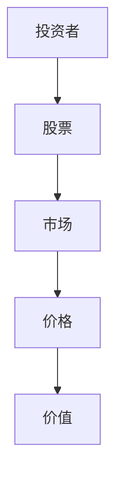
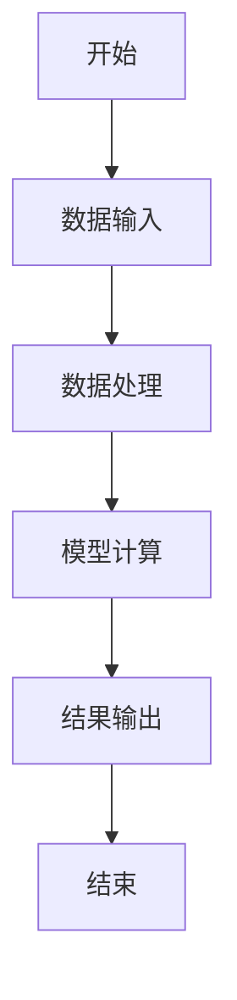
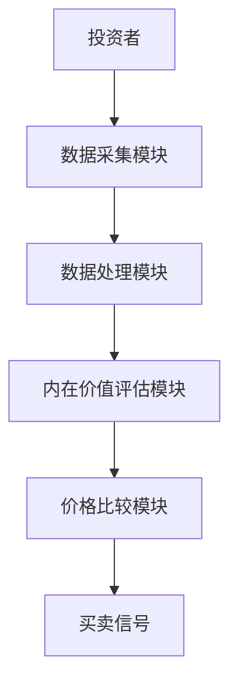

                 


---

# 如何利用特价股票策略构建新兴科技主题基金

> 关键词：特价股票策略、科技主题基金、股票分析、投资策略、系统架构、项目实战

> 摘要：本文详细探讨了如何利用特价股票策略构建新兴科技主题基金。首先介绍了特价股票策略和科技主题基金的基本概念，分析了其背景、特点和发展趋势。接着，深入讲解了特价股票策略的核心概念和数学模型，结合科技主题基金的投资领域和策略特点，分析了其在科技主题基金中的应用前景。然后，通过详细的数学模型和算法，结合系统架构设计和项目实战，展示了如何将特价股票策略应用于新兴科技主题基金的构建过程中。最后，总结了整个策略的关键点，并提出了最佳实践和未来发展的建议。

---

# 第一部分: 特价股票策略与新兴科技主题基金概述

# 第1章: 特价股票策略与科技主题基金的背景介绍

## 1.1 特价股票策略的定义与特点

### 1.1.1 特价股票的定义

特价股票是指那些市场价格低于其内在价值的股票。通常，这类股票可能因为市场波动、行业周期性或公司特定因素而被低估，但其内在价值并未完全反映在当前市场价格中。

### 1.1.2 特价股票策略的核心特点

1. **低估值**：特价股票的核心特征是市场价格低于其内在价值。
2. **逆向投资**：投资者在市场低迷时买入被低估的股票，等待市场回升时卖出。
3. **高风险-高回报**：特价股票通常具有较高的波动性和潜在的高回报。
4. **长期视角**：特价股票策略通常需要较长的投资周期，以等待内在价值的实现。

### 1.1.3 特价股票策略与传统投资策略的区别

| 投资策略 | 定义 | 优缺点 |
|----------|------|--------|
| 价值投资 | 买入市场价格低于内在价值的股票 | 优点：长期回报高；缺点：需要深入研究，周期长 |
| 趋势投资 | 根据价格趋势进行买卖 | 优点：灵活性高；缺点：风险较大，容易受市场情绪影响 |

---

## 1.2 科技主题基金的概念与发展趋势

### 1.2.1 科技主题基金的定义

科技主题基金是以科技行业相关股票为投资标的基金。这类基金通常聚焦于信息技术、人工智能、半导体、互联网等科技领域。

### 1.2.2 科技主题基金的投资领域

1. **信息技术**：包括软件、硬件、通信技术等。
2. **人工智能**：包括AI技术、大数据、云计算等。
3. **半导体**：包括芯片设计、制造等。
4. **互联网**：包括电子商务、社交媒体等。

### 1.2.3 科技主题基金的发展趋势

1. **技术创新驱动**：科技行业持续创新，推动基金收益增长。
2. **政策支持**：政府对科技行业的支持政策不断出台。
3. **全球化**：科技行业的全球化发展趋势为基金投资提供了更广阔的市场空间。

---

## 1.3 特价股票策略在科技主题基金中的应用前景

### 1.3.1 特价股票策略的潜在应用场景

1. **市场低迷期**：在市场低迷时，科技主题基金可以通过买入被低估的科技股票，等待市场回升。
2. **行业调整期**：当科技行业出现调整时，一些优质股票可能被低估，成为特价股票策略的目标。

### 1.3.2 科技主题基金采用特价股票策略的优势

1. **高增长潜力**：科技行业具有较高的增长潜力，特价股票策略可以在行业复苏时获得较高收益。
2. **分散风险**：通过投资多个被低估的科技股票，分散投资风险。

### 1.3.3 特价股票策略应用的挑战与机遇

1. **挑战**：科技行业波动性较大，特价股票策略需要较高的市场敏感性和快速的反应能力。
2. **机遇**：科技行业的快速发展为特价股票策略提供了更多潜在的高增长机会。

---

## 1.4 本章小结

本章介绍了特价股票策略和科技主题基金的基本概念，分析了两者的背景、特点和发展趋势。通过对比价值投资和趋势投资，强调了特价股票策略在科技主题基金中的潜在应用价值。同时，也指出了应用中的挑战与机遇。

---

# 第二部分: 特价股票策略的核心概念与数学模型

# 第2章: 特价股票策略的核心概念与联系

## 2.1 特价股票策略的核心原理

### 2.1.1 特价股票策略的基本原理

特价股票策略的核心原理是基于市场价格与内在价值的差异。当市场价格低于内在价值时，买入股票，等待市场价格回升至内在价值时卖出。

### 2.1.2 特价股票策略的关键要素

1. **内在价值评估**：准确评估股票的内在价值是策略成功的关键。
2. **市场价格波动**：利用市场价格波动，寻找被低估的股票。
3. **投资周期**：需要较长的投资周期，等待内在价值的实现。

### 2.1.3 特价股票策略与市场周期的关系

市场周期对特价股票策略的影响至关重要。在市场低迷期，特价股票策略更容易找到被低估的股票；在市场繁荣期，策略可能面临较高的卖出压力。

---

## 2.2 特价股票策略的核心概念对比

### 2.2.1 特价股票策略与价值投资的对比

| 对比维度 | 特价股票策略 | 价值投资 |
|----------|---------------|-----------|
| 定义     | 基于市场价格与内在价值的差异 | 基于内在价值的投资 |
| 投资周期 | 较短          | 较长      |
| 风险     | 较高          | 较低      |

---

## 2.3 特价股票策略的ER实体关系图



---

## 2.4 本章小结

本章深入分析了特价股票策略的核心原理和关键要素，对比了不同投资策略的特点，并通过ER实体关系图展示了策略的核心要素之间的关系。

---

# 第三部分: 特价股票策略的数学模型与算法

# 第3章: 特价股票策略的数学模型

## 3.1 特价股票策略的数学模型概述

### 3.1.1 特价股票策略的核心公式

$$ \text{内在价值} = \text{未来现金流的现值} $$

### 3.1.2 特价股票策略的数学表达式

$$ \text{买入价格} < \text{内在价值} $$

### 3.1.3 特价股票策略的数学模型特点

1. **简单性**：模型基于基本的现金流折现原理。
2. **实用性**：能够为投资者提供明确的买卖信号。

---

## 3.2 特价股票策略的算法原理

### 3.2.1 特价股票策略的基本算法

1. **数据收集**：收集目标股票的历史价格、财务数据等。
2. **内在价值评估**：使用DCF模型评估股票的内在价值。
3. **价格比较**：比较当前市场价格与内在价值，确定是否买入或卖出。

### 3.2.2 特价股票策略的优化算法

1. **动态调整**：根据市场变化动态调整内在价值评估。
2. **多因子模型**：结合多个因素（如市盈率、市净率等）进行综合评估。

---

## 3.3 特价股票策略的mermaid流程图



---

## 3.4 本章小结

本章详细讲解了特价股票策略的数学模型和算法原理，通过流程图展示了策略的实现步骤。

---

# 第四部分: 新兴科技主题的股票分析与策略实施

# 第4章: 新兴科技主题的股票分析

## 4.1 新兴科技主题的定义与范围

### 4.1.1 新兴科技主题的定义

新兴科技主题指的是那些具有较高增长潜力的新兴科技领域，如人工智能、区块链、5G等。

### 4.1.2 新兴科技主题的范围

1. **人工智能**：包括AI算法、机器学习等。
2. **区块链**：包括加密货币、智能合约等。
3. **5G技术**：包括5G网络、通信设备等。

---

## 4.2 新兴科技主题股票的特点

### 4.2.1 新兴科技主题股票的核心特征

1. **高增长潜力**：新兴科技行业具有较高的增长潜力。
2. **高波动性**：新兴科技股票通常波动较大。
3. **高风险**：新兴科技行业存在较高的市场风险和技术风险。

---

## 4.3 新兴科技主题股票的估值方法

### 4.3.1 市盈率法

$$ \text{市盈率} = \frac{\text{股价}}{\text{每股收益}} $$

### 4.3.2 市净率法

$$ \text{市净率} = \frac{\text{股价}}{\text{每股净资产}} $$

---

## 4.4 本章小结

本章分析了新兴科技主题的定义和范围，探讨了新兴科技主题股票的特点和估值方法，为后续策略实施奠定了基础。

---

# 第五章: 特价股票策略在科技主题基金中的实施

## 5.1 特价股票策略在科技主题基金中的应用步骤

### 5.1.1 确定投资目标

1. **明确投资目标**：确定基金的投资目标和投资范围。
2. **选择目标股票**：根据内在价值评估，选择被低估的科技股票。

### 5.1.2 构建投资组合

1. **分散投资**：通过投资多个被低估的科技股票，分散投资风险。
2. **动态调整**：根据市场变化，动态调整投资组合。

---

## 5.2 特价股票策略在科技主题基金中的实施案例

### 5.2.1 案例背景

假设当前市场低迷，科技行业出现调整，一些优质科技股票被低估。

### 5.2.2 案例分析

1. **选择目标股票**：通过内在价值评估，选择被低估的科技股票。
2. **构建投资组合**：将选择的股票组合成投资组合。
3. **动态调整**：根据市场变化，动态调整投资组合。

---

## 5.3 本章小结

本章详细讲解了特价股票策略在科技主题基金中的实施步骤，并通过案例分析展示了策略的具体应用。

---

# 第六章: 系统架构与项目实战

## 6.1 系统架构设计

### 6.1.1 系统功能设计

1. **数据采集模块**：采集目标股票的市场数据和财务数据。
2. **内在价值评估模块**：使用DCF模型评估股票的内在价值。
3. **价格比较模块**：比较市场价格与内在价值，生成买卖信号。

### 6.1.2 系统架构图



---

## 6.2 项目实战

### 6.2.1 环境安装

1. **安装Python**：安装Python 3.x及以上版本。
2. **安装相关库**：安装pandas、numpy、scikit-learn等库。

### 6.2.2 核心代码实现

```python
import pandas as pd
import numpy as np

def calculate_intrinsic_value(fcf, discount_rate):
    return fcf / (1 + discount_rate)

# 示例数据
fcf = 100
discount_rate = 0.1

intrinsic_value = calculate_intrinsic_value(fcf, discount_rate)
print("内在价值:", intrinsic_value)
```

---

## 6.3 本章小结

本章通过系统架构设计和项目实战，展示了如何将特价股票策略应用于科技主题基金的构建过程中。

---

# 第七章: 总结与展望

## 7.1 总结

本文详细探讨了如何利用特价股票策略构建新兴科技主题基金，分析了策略的核心概念和数学模型，结合系统架构设计和项目实战，展示了策略的具体应用。

## 7.2 未来展望

随着科技行业的快速发展，特价股票策略在科技主题基金中的应用前景广阔。未来，可以通过引入更多因素（如技术风险、行业风险等）来优化策略模型，进一步提升投资收益。

---

# 作者信息

作者：AI天才研究院/AI Genius Institute & 禅与计算机程序设计艺术/Zen And The Art of Computer Programming

---

