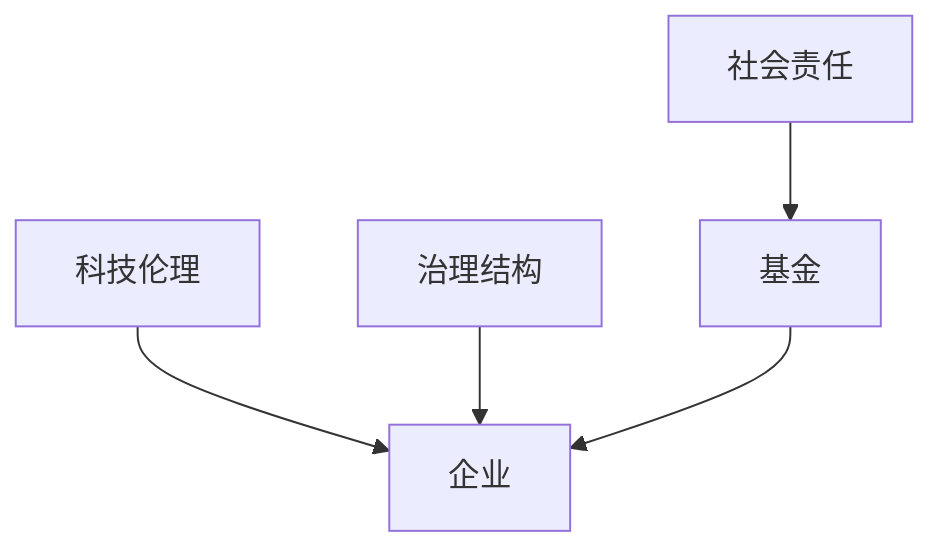

                 


# 如何利用特价股票策略构建未来科技伦理与治理主题基金

> 关键词：科技伦理，治理主题，基金构建，特价股票，投资策略，量化分析，系统设计

> 摘要：本文详细探讨如何利用特价股票策略构建未来科技伦理与治理主题基金。首先分析科技伦理与治理主题基金的背景与核心概念，接着介绍评估模型与算法原理，包括量化分析与数学模型，再设计系统架构，最后通过实战案例详细阐述投资策略的应用，并总结最佳实践与注意事项。

---

# 第一部分: 背景介绍与核心概念

## 第1章: 科技伦理与治理主题基金的背景与意义

### 1.1 问题背景

#### 1.1.1 科技发展带来的伦理挑战

随着科技的快速发展，人工智能、大数据、区块链等技术的应用引发了诸多伦理问题。例如，数据隐私、算法偏见、劳动替代等问题，要求企业在追求利润的同时，必须履行社会责任，注重科技伦理。

#### 1.1.2 企业治理与社会责任的重要性

现代企业治理结构的完善与否直接影响企业的长期发展。良好的治理能够确保企业在决策上的透明性、合规性，同时有效管理风险，提升企业声誉。

#### 1.1.3 科技伦理与治理主题基金的定义

科技伦理与治理主题基金是指专门投资于那些在科技伦理和公司治理方面表现优异的企业的基金。这类基金不仅关注企业的财务表现，更注重其在社会价值创造和合规性方面的表现。

### 1.2 特价股票策略的概述

#### 1.2.1 特价股票的定义与特点

特价股票是指市场价格低于其内在价值的股票。这种股票通常被认为具有较高的投资潜力，因为市场往往会重新评估其价值，从而带来资本增值的机会。

#### 1.2.2 特价股票策略的核心思想

特价股票策略的核心思想是寻找被市场低估的股票，通过长期持有或短期操作，利用市场纠错机制实现收益。该策略强调基本面分析，注重企业的财务健康、管理团队和市场地位。

#### 1.2.3 特价股票与科技行业的结合

科技行业作为高增长行业，技术创新快，竞争激烈，企业估值波动较大。在科技行业应用特价股票策略，可以重点关注那些因市场短期波动而被低估的优质企业。

## 第2章: 科技伦理与治理主题基金的核心概念

### 2.1 核心概念与联系

#### 2.1.1 科技伦理与治理主题基金的概念结构

科技伦理与治理主题基金的构建涉及多个维度，包括：

- **科技伦理**：企业如何处理技术应用中的道德问题。
- **治理结构**：企业的管理架构和监督机制。
- **社会责任**：企业在社会价值创造中的角色。
- **投资策略**：如何通过定价模型选择投资标的。

#### 2.1.2 核心要素对比表

下表对比了科技伦理与治理主题基金的核心要素：

| 核心要素       | 定义与特性                                   |
|----------------|--------------------------------------------|
| 科技伦理       | 企业在技术应用中的道德规范，如数据隐私保护。 |
| 治理结构       | 包括董事会、管理层和内部监督机制。          |
| 投资策略       | 基于定价模型和财务分析的投资决策。          |
| 社会责任       | 企业在环保、公益等方面的社会贡献。          |

#### 2.1.3 ER实体关系图（Mermaid）

下图展示了科技伦理与治理主题基金的核心要素之间的关系：



### 2.2 特价股票策略与科技伦理的结合

#### 2.2.1 理论基础

科技伦理与治理主题基金的构建需要结合定价模型和企业基本面分析。通过分析企业的治理结构、社会责任履行情况，以及科技伦理表现，选择那些被市场低估的优质企业。

#### 2.2.2 实践意义

通过特价股票策略，投资者可以在科技行业找到那些因市场短期波动而被低估，但具备良好治理结构和科技伦理表现的企业，实现长期收益。

### 2.3 本章小结

本章介绍了科技伦理与治理主题基金的背景、核心概念，以及特价股票策略的基本思想。科技伦理与治理主题基金不仅关注企业的财务表现，更注重其在社会价值创造和合规性方面的表现。

---

# 第二部分: 算法原理与数学模型

## 第3章: 科技伦理与治理评估的量化分析

### 3.1 评估指标体系

#### 3.1.1 科技伦理评估指标

科技伦理评估指标包括：

- 数据隐私保护
- 算法公平性
- 环境影响
- 社会责任履行情况

#### 3.1.2 治理结构评估指标

治理结构评估指标包括：

- 董事会构成
- 内部审计
- 股权结构
- 透明度

### 3.2 评估模型

#### 3.2.1 科技伦理与治理评分模型

科技伦理与治理评分模型如下：

$$
\text{综合评分} = 0.4 \times \text{科技伦理评分} + 0.6 \times \text{治理结构评分}
$$

其中，科技伦理评分和治理结构评分均采用1-10分制。

#### 3.2.2 评估流程（Mermaid）


### 3.3 投资策略生成

#### 3.3.1 投资策略生成模型

投资策略生成模型如下：

$$
\text{投资建议} = \begin{cases}
\text{买入} & \text{if 综合评分} > 7 \text{且价格} < \text{内在价值} \\
\text{持有} & \text{if 综合评分} > 5 \text{且价格} \approx \text{内在价值} \\
\text{卖出} & \text{otherwise}
\end{cases}
$$

---

## 第4章: 系统架构设计与实现

### 4.1 系统分析

#### 4.1.1 需求分析

系统需求包括：

- 数据收集与处理
- 综合评分计算
- 投资策略生成
- 报告生成

#### 4.1.2 功能设计

系统功能模块包括：

- 数据采集模块
- 综合评分计算模块
- 投资策略生成模块
- 报告生成模块

### 4.2 系统架构设计

#### 4.2.1 系统架构（Mermaid）


---

## 第5章: 项目实战与代码实现

### 5.1 项目实战

#### 5.1.1 项目背景

选择一家科技公司作为案例，分析其科技伦理与治理表现，评估其是否符合特价股票投资条件。

#### 5.1.2 数据收集与处理

收集公司以下数据：

- 财务数据
- 科技伦理评分
- 治理结构评分

#### 5.1.3 投资策略实现

根据评分模型，计算综合评分，生成投资建议。

### 5.2 代码实现

#### 5.2.1 数据处理代码

```python
import pandas as pd

# 假设df为包含公司数据的DataFrame
def calculate_intrinsic_value(df):
    df['内在价值'] = df['净利润'] * 10  # 示例计算
    return df

df = calculate_intrinsic_value(df)
```

#### 5.2.2 投资策略代码

```python
def generate_investment_strategy(df):
    df['投资建议'] = df.apply(lambda x: '买入' if (x['综合评分'] > 7 and x['价格'] < x['内在价值']) else '持有' if (x['综合评分'] > 5 and x['价格'] == x['内在价值']) else '卖出', axis=1)
    return df

df = generate_investment_strategy(df)
```

---

## 第6章: 最佳实践与注意事项

### 6.1 最佳实践

- **定期评估**：定期更新企业数据和评分，确保投资策略的有效性。
- **分散投资**：避免过度集中投资于单一行业或公司。
- **长期视角**：关注企业的长期发展，而非短期波动。

### 6.2 小结

通过本文的分析与实践，我们可以利用特价股票策略构建未来科技伦理与治理主题基金，实现财务回报与社会责任的双赢。

---

# 作者

作者：AI天才研究院/AI Genius Institute & 禅与计算机程序设计艺术 /Zen And The Art of Computer Programming

