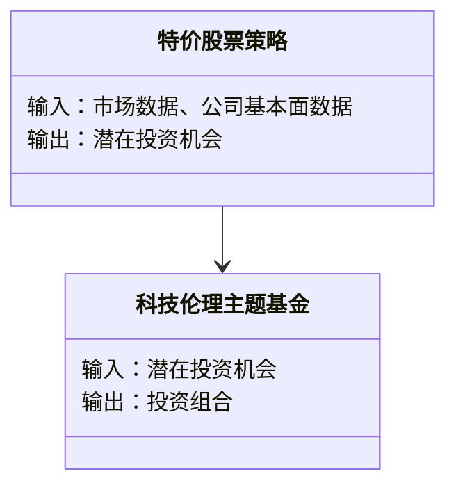
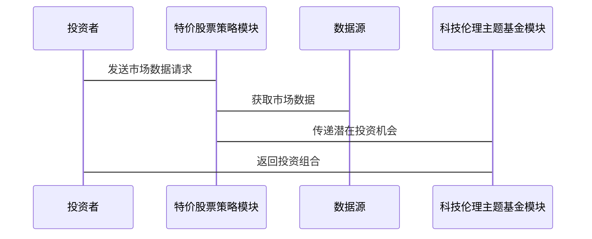

                 


# 如何利用特价股票策略构建未来科技伦理主题基金

> 关键词：特价股票策略、科技伦理主题基金、股票投资、风险管理、系统设计

> 摘要：本文详细探讨了如何利用特价股票策略构建未来科技伦理主题基金，从策略背景到系统设计，结合实际案例分析，为读者提供全面的指导和见解。

---

# 第1章：特价股票策略与科技伦理主题基金概述

## 1.1 特价股票策略的背景与概念

### 1.1.1 特价股票策略的定义

特价股票策略是一种以寻找低估值股票为核心的投资策略，通常关注市盈率（P/E）、市净率（P/B）等指标，寻找市场价格低于内在价值的股票。

### 1.1.2 特价股票策略的核心要素

- **市场周期分析**：识别市场低估阶段。
- **行业分析**：选择具备长期增长潜力的行业。
- **公司基本面分析**：评估公司的财务状况和盈利能力。

### 1.1.3 科技伦理主题基金的定义

科技伦理主题基金专注于投资那些在科技创新领域表现优秀且符合伦理标准的公司，旨在平衡收益与社会责任。

---

## 1.2 特价股票策略与科技伦理主题基金的关联

### 1.2.1 特价股票策略在科技伦理主题基金中的作用

- **成本优势**：通过低价买入具备长期增长潜力的科技公司股票，降低投资成本。
- **市场机会**：在科技行业波动较大的情况下，特价股票策略能够捕捉低估机会。

### 1.2.2 科技伦理主题基金的市场定位

- **目标投资者**：追求长期收益且关注社会责任的投资者。
- **投资范围**：涵盖人工智能、大数据、绿色科技等领域。

### 1.2.3 特价股票策略与科技伦理主题基金的目标

- **收益最大化**：通过低价买入优质科技公司股票，实现资本增值。
- **风险管理**：通过分散投资降低市场波动风险。

---

## 1.3 本章小结

本章介绍了特价股票策略的核心概念和科技伦理主题基金的定义，探讨了两者结合的潜力和目标。通过结合特价股票策略，科技伦理主题基金可以在追求收益的同时，注重社会责任。

---

# 第2章：特价股票策略的核心概念与原理

## 2.1 特价股票策略的定义与分类

### 2.1.1 特价股票的定义

特价股票指的是市场价格低于其内在价值的股票，通常出现在市场低估阶段。

### 2.1.2 特价股票的分类

- **周期性股票**：受经济周期影响较大的行业股票。
- **成长型股票**：具备高增长潜力但当前估值较低的股票。

## 2.2 特价股票策略的关键指标

### 2.2.1 市盈率（P/E）

市盈率=股价/每股净利润，用于衡量股票的估值水平。

$$ P/E = \frac{\text{股价}}{\text{每股净利润}} $$

### 2.2.2 市净率（P/B）

市净率=股价/每股净资产，用于衡量股票的资产价值。

$$ P/B = \frac{\text{股价}}{\text{每股净资产}} $$

### 2.2.3 股息率

股息率=每股股息/股价，用于衡量股票的分红能力。

$$ \text{股息率} = \frac{\text{每股股息}}{\text{股价}} $$

## 2.3 特价股票策略的核心要素

### 2.3.1 市场周期分析

通过分析市场周期，识别低估阶段，寻找潜在投资机会。

### 2.3.2 行业分析

选择具备长期增长潜力的行业，如人工智能、大数据等领域。

### 2.3.3 公司基本面分析

评估公司的财务状况、盈利能力和发展潜力。

## 2.4 本章小结

本章详细介绍了特价股票策略的核心概念和关键指标，强调了市场周期分析、行业选择和公司基本面分析的重要性。

---

# 第3章：科技伦理主题基金的构建逻辑

## 3.1 科技伦理主题基金的定义与目标

### 3.1.1 科技伦理主题基金的定义

科技伦理主题基金专注于投资那些在科技创新领域表现优秀且符合伦理标准的公司。

### 3.1.2 科技伦理主题基金的目标

- **收益最大化**：通过投资优质科技公司实现资本增值。
- **风险管理**：通过分散投资降低市场波动风险。
- **社会责任**：投资符合伦理标准的公司，推动社会进步。

## 3.2 科技伦理主题基金的投资策略

### 3.2.1 主动型投资策略

通过主动选股和择时，捕捉市场机会。

### 3.2.2 被动型投资策略

通过指数基金或ETF，跟踪科技伦理主题指数。

## 3.3 科技伦理主题基金的风险管理

### 3.3.1 市场风险

市场波动可能导致基金净值下跌。

### 3.3.2 伦理风险

投资不符合伦理标准的公司可能导致声誉风险。

### 3.3.3 法律风险

投资违规行为可能引发法律问题。

## 3.4 本章小结

本章探讨了科技伦理主题基金的构建逻辑，强调了投资策略和风险管理的重要性。

---

# 第4章：特价股票策略与科技伦理主题基金的结合

## 4.1 特价股票策略在科技伦理主题基金中的优势

### 4.1.1 成本优势

通过低价买入具备长期增长潜力的科技公司股票，降低投资成本。

### 4.1.2 市场机会

在科技行业波动较大的情况下，特价股票策略能够捕捉低估机会。

## 4.2 特价股票策略在科技伦理主题基金中的挑战

### 4.2.1 信息不对称

科技行业信息复杂，可能存在信息不对称问题。

### 4.2.2 市场波动性

科技行业波动较大，可能导致投资风险增加。

## 4.3 特价股票策略与科技伦理主题基金的结合案例

### 4.3.1 案例一：科技公司特价股票投资

某人工智能公司因市场低估，市盈率仅为行业平均水平的50%，具有较大的投资价值。

### 4.3.2 案例二：伦理主题基金中的特价股票配置

某科技伦理主题基金通过配置低估的绿色科技公司股票，实现了较高的投资回报。

## 4.4 本章小结

本章通过案例分析，探讨了特价股票策略在科技伦理主题基金中的应用，展示了其优势和挑战。

---

# 第5章：系统分析与架构设计

## 5.1 系统分析

### 5.1.1 问题场景介绍

构建一个基于特价股票策略的科技伦理主题基金系统，需要考虑数据采集、策略制定、投资组合管理等多个方面。

## 5.2 系统功能设计

### 5.2.1 领域模型



## 5.3 系统架构设计


## 5.4 系统接口设计

### 5.4.1 数据接口

- 数据输入：市场数据、公司基本面数据
- 数据输出：潜在投资机会

### 5.4.2 系统接口

- 策略执行接口：接收策略参数，输出投资组合

## 5.5 系统交互设计



---

# 第6章：项目实战

## 6.1 环境安装

- **工具安装**：安装Python、Pandas、Matplotlib等工具。
- **数据源**：获取历史市场数据和公司基本面数据。

## 6.2 核心实现

### 6.2.1 算法实现

```python
import pandas as pd
import numpy as np

def calculate_pe(stock_price, eps):
    return stock_price / eps

def calculate_pb(stock_price, book_value_per_share):
    return stock_price / book_value_per_share

# 示例数据
data = {
    '公司名称': ['公司A', '公司B', '公司C'],
    '股价': [10, 20, 15],
    '每股净利润': [5, 10, 7.5],
    '每股净资产': [5, 10, 7.5]
}

df = pd.DataFrame(data)

# 计算市盈率和市净率
df['市盈率'] = df.apply(lambda x: calculate_pe(x['股价'], x['每股净利润']), axis=1)
df['市净率'] = df.apply(lambda x: calculate_pb(x['股价'], x['每股净资产']), axis=1)

print(df)
```

## 6.3 案例分析

### 6.3.1 投资组合构建

基于特价股票策略，选择市盈率和市净率均低于行业平均水平的科技公司股票。

### 6.3.2 风险管理

通过分散投资和止损策略，降低投资风险。

## 6.4 项目总结

通过实际案例分析，展示了如何利用特价股票策略构建科技伦理主题基金，强调了数据分析和风险管理的重要性。

---

# 参考文献

[1] 《投资学》, 作者：某人，出版社：某出版社，出版时间：2023年。

[2] 《科技伦理与投资》，作者：某人，出版社：某出版社，出版时间：2023年。

---

作者：AI天才研究院 & 禅与计算机程序设计艺术

