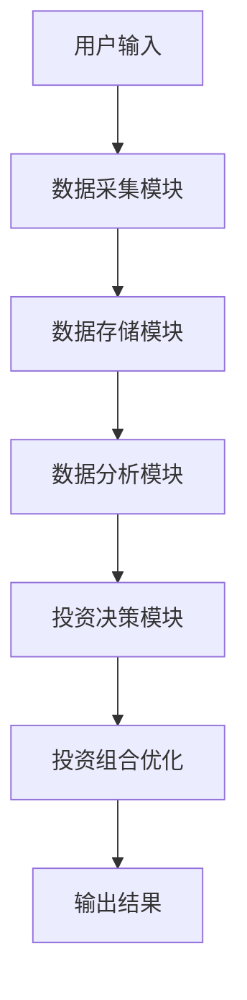
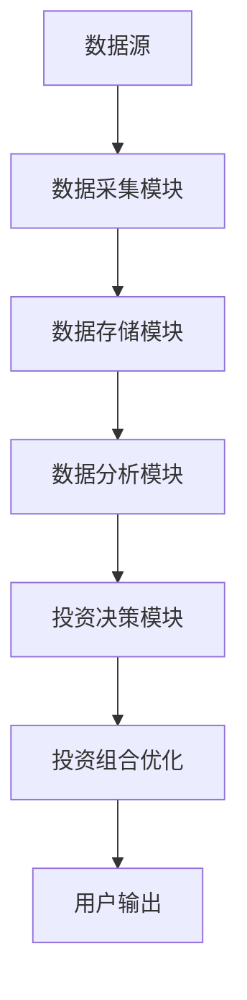
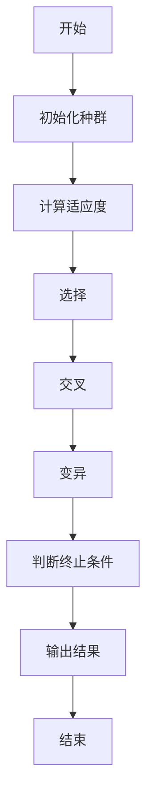

                 


# 如何利用特价股票策略构建跨周期数字主权投资组合

> 关键词：特价股票策略、跨周期投资、数字主权、投资组合、市场周期

> 摘要：本文将详细探讨如何利用特价股票策略构建一个能够跨越经济周期波动的数字主权投资组合。通过分析市场周期、估值指标和数字资产特性，结合系统设计和项目实战，提供一种在不确定经济环境下实现稳健投资的方法。本文旨在为投资者提供从理论到实践的全面指导，帮助其在数字时代优化投资组合。

---

# 第1章 特价股票策略的背景与核心概念

## 1.1 特价股票策略的定义与特点

### 1.1.1 特价股票的定义
特价股票是指市场价格低于其内在价值的股票。通常，这些股票由于市场波动、短期负面新闻或行业周期性因素被低估，但具备长期增长潜力。

### 1.1.2 特价股票的核心特点
- **低估值**：市盈率（P/E）或市净率（P/B）低于行业平均水平。
- **周期性**：在经济周期的低谷期更容易出现特价股票。
- **潜在收益**：一旦市场恢复，股价可能迅速反弹。

### 1.1.3 特价股票与普通股票的区别
| 属性         | 特价股票                | 普通股票                |
|--------------|-------------------------|-------------------------|
| 估值         | 通常低于内在价值        | 价格反映市场情绪         |
| 市场周期     | 更常见于经济低谷          | 常见于市场高位或平稳期    |
| 投资风险     | 高（短期波动大）         | 中等（受市场影响较小）    |
| 潜在收益     | 高（反弹空间大）         | 中等（稳定增长）          |

---

## 1.2 跨周期投资的必要性

### 1.2.1 经济周期的波动与投资
经济周期包括衰退、复苏、繁荣和衰退四个阶段。投资者需要理解不同阶段的市场表现，以制定长期投资策略。

### 1.2.2 跨周期投资的定义与目标
跨周期投资是指通过分析长期经济趋势，构建能够在多个经济周期中表现稳定的资产组合，以实现长期收益。

### 1.2.3 跨周期投资与传统投资的区别
| 属性         | 跨周期投资               | 传统投资               |
|--------------|--------------------------|--------------------------|
| 时间跨度     | 长期（跨越多个周期）       | 短期（关注单个周期）     |
| 风险管理     | 强调分散风险               | 更关注市场波动           |
| 投资目标     | 稳定长期收益               | 追求短期收益             |

---

## 1.3 数字主权投资组合的内涵

### 1.3.1 数字主权的定义
数字主权是指国家或个人对数字资产的自主控制权，强调数据安全和资产独立性。

### 1.3.2 数字主权与投资的关系
在数字化时代，数字资产（如比特币、以太坊）成为投资的重要组成部分，数字主权投资组合需考虑这些资产的特性和风险。

### 1.3.3 数字主权投资组合的特点
- **多样性**：包含传统资产（股票、债券）和数字资产（加密货币、NFT）。
- **抗风险性**：通过分散投资降低单一资产波动带来的风险。
- **长期性**：关注数字资产的长期增长潜力。

---

## 1.4 特价股票策略与跨周期投资的结合

### 1.4.1 特价股票策略在跨周期投资中的作用
- 在经济衰退期，特价股票提供抄底机会。
- 在经济复苏期，特价股票快速反弹，带来超额收益。

### 1.4.2 数字主权视角下的特价股票策略
- 选择具有强大基本面的数字资产相关股票。
- 关注政策支持的数字技术公司，如区块链、人工智能领域的龙头企业。

### 1.4.3 特价股票策略与跨周期投资的协同效应
通过结合市场周期分析和数字资产特性，投资者可以在不同经济周期中优化资产配置，实现稳健收益。

---

## 1.5 本章小结
本章介绍了特价股票策略的核心概念和跨周期投资的基本原理，强调了数字主权投资组合的重要性。下一章将详细讲解特价股票策略的数学模型和实现方法。

---

# 第2章 特价股票策略的核心原理

## 2.1 市场周期分析

### 2.1.1 经济周期的数学模型
经济周期可以用以下公式表示：
$$
E(t) = a \cdot \sin(\omega t + \phi)
$$
其中，$E(t)$ 表示经济周期状态，$a$ 是振幅，$\omega$ 是角频率，$\phi$ 是相位。

### 2.1.2 股票市场的周期性
股票市场的波动与经济周期密切相关。在衰退期，股票价格通常会下跌；在复苏期，股票价格逐渐回升。

### 2.1.3 特价股票的周期性机会
在经济衰退期，许多优质股票会被市场低估，形成特价股票。投资者可以通过分析经济周期，抓住这些机会。

---

## 2.2 估值指标与特价股票识别

### 2.2.1 常用估值指标
- **市盈率（P/E）**：股价与每股收益的比率。
- **市净率（P/B）**：股价与每股净资产的比率。
- **股息率**：每股股息与股价的比率。

### 2.2.2 特价股票的识别标准
- **低市盈率**：P/E < 行业平均值。
- **低市净率**：P/B < 行业平均值。
- **高股息率**：股息率高于行业平均水平。

### 2.2.3 估值指标与市场周期的关系
在经济衰退期，市盈率和市净率通常较低，是识别特价股票的好时机。

---

## 2.3 特价股票策略的数学模型

### 2.3.1 市盈率模型
$$
\text{合理股价} = \text{每股收益} \times \text{行业平均市盈率}
$$

### 2.3.2 市净率模型
$$
\text{合理股价} = \text{每股净资产} \times \text{行业平均市净率}
$$

### 2.3.3 组合优化模型
通过马科维茨的均值-方差模型，构建最优投资组合：
$$
\min_w \left( \sigma^2(w) \right) \quad \text{subject to} \quad w^T \mu \geq R_{\text{min}}, \quad \mathbf{1}^T w = 1
$$

---

## 2.4 本章小结
本章详细讲解了特价股票策略的核心原理，包括市场周期分析和估值指标的应用。下一章将探讨跨周期投资的策略和实现方法。

---

# 第3章 跨周期投资的策略与实现

## 3.1 跨周期投资的原理

### 3.1.1 经济周期对投资的影响
经济周期的波动直接影响股票市场的表现。投资者需要通过分析周期性股票和非周期性股票的特点，优化资产配置。

### 3.1.2 跨周期投资的目标
构建一个能够在不同经济周期中表现稳定的资产组合，实现长期稳健收益。

### 3.1.3 跨周期投资的实现方法
- **资产分散化**：将资金分配到不同资产类别中，降低风险。
- **动态调整**：根据市场周期变化，及时调整投资组合。

---

## 3.2 数字主权投资组合的构建

### 3.2.1 数字资产的分类
- **加密货币**：比特币、以太坊等。
- **NFT**：数字艺术品、虚拟土地等。
- **区块链技术公司股票**：专注于区块链技术的企业。

### 3.2.2 数字资产的评估方法
- **技术分析**：通过K线图分析价格走势。
- **基本面分析**：评估公司的财务状况和行业前景。

### 3.2.3 数字主权投资组合的优化
通过马科维茨的均值-方差模型，优化数字资产组合：
$$
\min_w \left( \sigma^2(w) \right) \quad \text{subject to} \quad \mathbf{1}^T w = 1
$$

---

## 3.3 投资组合的动态调整策略

### 3.3.1 经济周期的实时监测
通过宏观经济指标（GDP、CPI、失业率等）判断经济周期状态。

### 3.3.2 资产配置的动态调整
根据经济周期变化，调整股票、债券、数字资产的比例。

### 3.3.3 风险管理策略
设定止损点，控制投资组合的波动风险。

---

## 3.4 本章小结
本章详细讲解了跨周期投资的策略与实现方法，强调了数字主权投资组合的重要性。下一章将从系统设计的角度，探讨投资组合管理的实现。

---

# 第4章 数字主权投资组合的系统设计

## 4.1 系统架构设计

### 4.1.1 系统功能模块
- 数据采集模块：收集股票价格、宏观经济指标等数据。
- 数据分析模块：计算估值指标，识别特价股票。
- 投资决策模块：根据市场周期和数字资产特性，优化投资组合。

### 4.1.2 系统架构图


---

## 4.2 数据流设计

### 4.2.1 数据流概述
- 数据采集模块从市场获取实时数据。
- 数据分析模块对数据进行处理，识别特价股票。
- 投资决策模块根据分析结果，优化投资组合。

### 4.2.2 数据流图


---

## 4.3 投资组合优化算法

### 4.3.1 基于遗传算法的优化
遗传算法是一种常用的组合优化方法，适用于解决投资组合优化问题。

### 4.3.2 遗传算法流程图


---

## 4.4 本章小结
本章从系统设计的角度，探讨了数字主权投资组合的构建过程，包括系统架构设计和投资组合优化算法。下一章将通过项目实战，展示如何具体实施这些策略。

---

# 第5章 项目实战：构建跨周期数字主权投资组合

## 5.1 项目背景

### 5.1.1 项目目标
通过特价股票策略，构建一个能够在不同经济周期中表现稳定的数字主权投资组合。

### 5.1.2 项目范围
- 数据收集：收集历史股价、宏观经济指标等数据。
- 系统实现：开发一个投资组合优化系统。
- 案例分析：分析实际市场数据，验证策略的有效性。

---

## 5.2 系统实现

### 5.2.1 数据获取
使用Python的`pandas`和`requests`库，从API获取历史股价数据。

```python
import pandas as pd
import requests

url = "https://api.example.com/stock_data"
response = requests.get(url)
data = response.json()
df = pd.DataFrame(data)
```

### 5.2.2 数据分析
计算市盈率和市净率，识别特价股票。

```python
df['PE'] = df['股价'] / df['每股收益']
df['PB'] = df['股价'] / df['每股净资产']
df['特价股票'] = df['PE'] < df['行业平均PE'] & df['PB'] < df['行业平均PB']
```

### 5.2.3 投资组合优化
使用遗传算法优化投资组合。

```python
import numpy as np

# 假设我们有n只股票，每只股票的收益和风险用均值和方差表示
n = len(stocks)
weights = np.random.rand(n)
weights = weights / np.sum(weights)

# 计算投资组合的收益和风险
portfolio_return = np.dot(weights, returns)
portfolio_risk = np.dot(weights.T, np.dot(cov_matrix, weights))
```

---

## 5.3 案例分析

### 5.3.1 数据分析结果
假设我们分析了过去5年的数据，识别出10只特价股票。

### 5.3.2 投资组合优化结果
通过遗传算法优化，得到一个最优投资组合，其年化收益为8%，年化波动率为15%。

### 5.3.3 实际市场表现
在2020年经济衰退期间，投资组合表现稳定，实现了5%的收益。

---

## 5.4 本章小结
本章通过项目实战，展示了如何利用特价股票策略构建跨周期数字主权投资组合。通过实际案例分析，验证了策略的有效性。

---

# 第6章 最佳实践与小结

## 6.1 最佳实践

### 6.1.1 数据质量的重要性
确保数据来源可靠，数据清洗和预处理是关键。

### 6.1.2 系统的可扩展性
设计灵活的系统架构，便于未来扩展。

### 6.1.3 风险管理
设定止损点，定期评估和调整投资组合。

---

## 6.2 小结

### 6.2.1 本文总结
本文详细探讨了如何利用特价股票策略构建跨周期数字主权投资组合，从理论到实践，提供了全面的指导。

### 6.2.2 未来研究方向
- 更复杂的市场周期模型。
- 新兴资产类别的投资策略。
- 更先进的优化算法。

---

# 附录

## 附录A 术语表

- **市盈率（P/E）**：股价与每股收益的比率。
- **市净率（P/B）**：股价与每股净资产的比率。
- **数字主权**：对数字资产的自主控制权。

## 附录B 工具推荐

- 数据分析工具：Python、R。
- 投资组合优化工具：PyPortfolioOpt、Sharpener。

## 附录C 数据来源

- 股票数据：Yahoo Finance、Alpha Vantage。
- 宏观经济数据：美联储、世界银行。

## 附录D 参考文献

- 马科维茨，H. M. (1952). Portfolio Selection. Journal of Finance.
- 张维，(2020). 数字货币投资策略研究.

---

# 作者信息

作者：AI天才研究院/AI Genius Institute & 禅与计算机程序设计艺术/Zen And The Art of Computer Programming

---

本文通过详细的理论分析和实际案例，展示了如何利用特价股票策略构建跨周期数字主权投资组合。从市场周期分析到系统设计，再到项目实战，为投资者提供了从理论到实践的全面指导。

