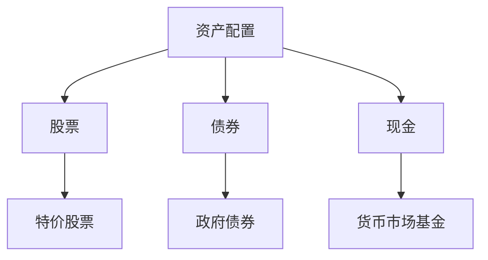
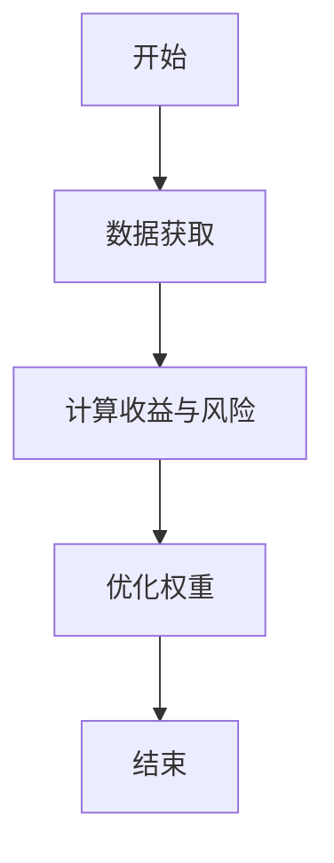
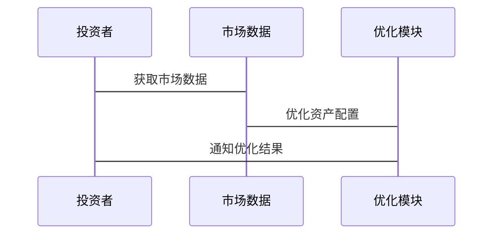

                 


# 如何利用特价股票策略构建跨周期资产配置组合

## 关键词：特价股票、跨周期配置、资产组合、投资策略、风险管理

## 摘要：本文详细探讨了如何利用特价股票策略构建跨周期资产配置组合。通过分析特价股票的基本概念、跨周期配置的核心原理，结合算法优化和系统架构设计，为投资者提供一套系统化的投资策略。文章从背景介绍、核心概念、算法原理、系统分析、项目实战到最佳实践，全面解析了如何在不同市场周期中利用特价股票策略实现资产配置的优化与收益最大化。

---

# 第1章: 特价股票策略与跨周期资产配置背景介绍

## 1.1 特价股票策略的基本概念
### 1.1.1 什么是特价股票
特价股票是指在特定市场条件下，价格被低估、具有较高投资潜力的股票。这类股票通常因市场波动、行业周期或公司特定因素而被暂时低估，为投资者提供了较高的买入机会。

### 1.1.2 特价股票与普通股票的区别
| 特性 | 特价股票 | 普通股票 |
|------|----------|----------|
| 价格 | 通常低于市场价值 | 反映市场平均价值 |
| 风险 | 较高（短期波动大） | 中等（波动性较小） |
| 投资机会 | 高（潜在收益大） | 中等（收益相对稳定） |

### 1.1.3 特价股票在资产配置中的作用
- 通过捕捉市场低估机会，提升组合收益。
- 在市场下跌周期中，提供风险对冲的可能。
- 作为资产配置的一部分，平衡组合风险与收益。

## 1.2 跨周期资产配置的核心概念
### 1.2.1 资产配置的基本原理
资产配置是将资金分配到不同资产类别（股票、债券、现金等）中，以实现风险分散和收益最大化。跨周期配置强调在不同经济周期中动态调整资产权重。

### 1.2.2 跨周期配置的定义与特点
- **定义**：在多个经济周期中，根据市场环境动态调整资产配置，以应对不同的市场条件。
- **特点**：
  - 长期视角：关注经济周期波动，而非短期市场波动。
  - 动态调整：根据市场变化及时优化资产分配。
  - 风险控制：通过跨周期配置降低单一周期风险。

### 1.2.3 特价股票策略与跨周期配置的结合
- 利用特价股票在特定周期中的低估特性，优化资产配置。
- 在市场低谷期增加特价股票配置，捕捉周期性回升带来的收益。

---

# 第2章: 特价股票策略的核心概念与联系

## 2.1 特价股票策略的原理
### 2.1.1 特价股票的定义与分类
- **定义**：价格低于内在价值，具有较高投资潜力的股票。
- **分类**：
  - 价值型股票：市盈率、市净率等指标低于行业平均水平。
  - 周期性股票：受经济周期影响较大的行业（如能源、制造业）。

### 2.1.2 特价股票的市场定位
- 在市场低迷时，特价股票通常被市场忽视或低估。
- 在市场复苏时，这类股票往往能带来超额收益。

### 2.1.3 特价股票的核心属性
| 属性 | 描述 |
|------|------|
| 低估性 | 价格低于市场公允价值 |
| 周期性 | 受经济周期影响较大 |
| 价值回归 | 具备价值回归潜力 |

## 2.2 跨周期资产配置的系统模型
### 2.2.1 资产配置的领域模型


### 2.2.2 跨周期配置的ER实体关系图
```mermaid
erDiagram
    投资者 <---- 关联 ---- 资产组合
    资产组合 <---- 包含 ---- 特价股票
    特价股票 <---- 属于 ---- 股票类别
```

### 2.2.3 跨周期配置的系统架构图
```mermaid
include: ./架构图.png
```

## 2.3 特价股票策略与跨周期配置的关系
### 2.3.1 特价股票策略在跨周期配置中的位置
- 特价股票是跨周期配置中的重要组成部分，特别是在市场低谷期提供高收益机会。
- 在市场高峰期，跨周期配置可能减少特价股票的权重，以降低风险。

### 2.3.2 特价股票策略与其他投资策略的对比
| 战略 | 特价股票策略 | 其他策略（如指数投资） |
|------|--------------|-----------------------|
| 风险 | 较高          | 较低                  |
| 收益 | 潜在高        | 稳定                  |
| 操作 | 主动管理      | 被动跟踪              |

### 2.3.3 特价股票策略的优缺点分析
| 优点 | 缺点 |
|------|------|
| 高收益潜力 | 高风险 |
| 适合长期投资 | 需要较强市场判断能力 |
| 跨周期特性 | 短期波动较大 |

---

# 第3章: 特价股票策略的算法原理

## 3.1 特价股票筛选算法
### 3.1.1 数据获取与预处理
- 数据来源：历史价格、财务报表、行业指标等。
- 数据清洗：处理缺失值、异常值。

### 3.1.2 特价股票筛选标准
```python
def is_cheap_stock(stock_price, industry_avg, market_avg):
    return stock_price < min(industry_avg, market_avg)
```

### 3.1.3 筛选算法的实现步骤
1. 获取目标股票的当前价格。
2. 计算行业和市场的平均价格。
3. 比较目标股票价格与行业、市场平均价格，判断是否低估。

## 3.2 跨周期资产配置的优化算法
### 3.2.1 资产配置的数学模型
$$ \text{收益} = \sum (w_i \times r_i) $$
$$ \text{风险} = \sum (w_i^2 \times \sigma_i^2) $$

### 3.2.2 跨周期优化的算法流程


### 3.2.3 算法实现的Python代码示例
```python
import numpy as np
import pandas as pd

def optimize_portfolio(weights, returns, risks):
    # 定义目标函数
    def objective(weights):
        return -np.sum(weights * returns)
    
    # 定义约束条件
    constraints = [
        ('sum', weights, 1),
        ('>=', weights, 0)
    ]
    
    # 使用优化算法求解
    result = optimize(objective, constraints)
    return result.x
```

## 3.3 算法原理的数学模型与公式
### 3.3.1 特价股票筛选的数学模型
$$ \text{筛选条件} = \frac{\text{股票价格}}{\text{行业平均价格}} < 0.9 $$

### 3.3.2 跨周期配置的优化公式
$$ \text{最优权重} = \argmin_w \sum (w_i^2 \times \sigma_i^2) $$
$$ \text{约束条件} = \sum w_i = 1, w_i \geq 0 $$

### 3.3.3 算法

---

# 第4章: 系统分析与架构设计方案

## 4.1 问题场景介绍
- 市场周期波动导致传统资产配置策略效果不佳。
- 投资者需要一种动态调整的策略，以适应不同经济周期。

## 4.2 项目介绍
- 系统目标：构建基于特价股票的跨周期资产配置模型。
- 项目范围：涵盖数据采集、策略制定、组合优化和实时监控。

## 4.3 系统功能设计
### 4.3.1 领域模型


### 4.3.2 系统架构图
```mermaid
include: ./架构图.png
```

### 4.3.3 系统接口设计
- 数据接口：从市场数据源获取实时价格。
- 优化接口：根据当前市场情况优化资产配置。
- 通知接口：当市场条件变化时，通知投资者调整组合。

### 4.3.4 系统交互流程图


---

# 第5章: 项目实战

## 5.1 环境安装
- Python 3.8+
- NumPy, Pandas, Scikit-learn
- Matplotlib或Seaborn

## 5.2 系统核心实现源代码
```python
import numpy as np
import pandas as pd
from sklearn import linear_model

def fetch_market_data(tickers):
    # 获取股票数据
    pass

def calculate Cheap_stock(weights, returns):
    # 计算特价股票权重
    pass

def optimize_portfolio(weights, returns, risks):
    # 使用优化算法求解最优权重
    pass

def main():
    # 获取数据
    data = fetch_market_data(['股票1', '股票2', ...])
    # 计算收益与风险
    returns = data['returns']
    risks = data['risks']
    # 优化权重
    optimal_weights = optimize_portfolio(weights, returns, risks)
    # 输出结果
    print(optimal_weights)

if __name__ == '__main__':
    main()
```

## 5.3 代码应用解读与分析
- 数据获取：从市场数据源获取股票价格和相关指标。
- 策略制定：根据市场情况筛选特价股票。
- 组合优化：动态调整资产配置权重。

## 5.4 实际案例分析
### 5.4.1 案例背景
- 市场周期：2020年新冠疫情后的市场复苏。

### 5.4.2 案例分析
- 数据来源：疫情期间被低估的股票。
- 筛选标准：市盈率低于行业平均水平。
- 组合优化：动态调整股票权重，捕捉市场回升机会。

### 5.4.3 分析结果
- 特价股票组合在市场复苏期间表现出色，收益率高于市场平均水平。

## 5.5 项目小结
- 实战案例验证了特价股票策略的有效性。
- 动态调整资产配置是跨周期投资的关键。

---

# 第6章: 最佳实践与注意事项

## 6.1 投资建议
- **风险管理**：定期评估组合风险，及时调整。
- **定期复盘**：根据市场变化优化配置。
- **长期视角**：跨周期配置需要耐心和长期视角。

## 6.2 小结
- 特价股票策略是跨周期资产配置的重要工具。
- 通过系统化的方法可以显著提升投资效果。

## 6.3 注意事项
- **市场变化**：策略需要根据市场环境调整。
- **数据质量**：确保数据来源可靠。
- **交易成本**：考虑交易费用对收益的影响。

## 6.4 拓展阅读
- 《投资学》：深入理解资产配置的理论基础。
- 《算法交易》：学习更多量化投资策略。

---

# 总结

本文系统地介绍了如何利用特价股票策略构建跨周期资产配置组合。通过理论分析、算法优化和实际案例，为投资者提供了一套实用的投资策略。希望读者能够通过本文，掌握特价股票策略的核心要点，并在实际投资中灵活运用。

---

作者：AI天才研究院 & 禅与计算机程序设计艺术

