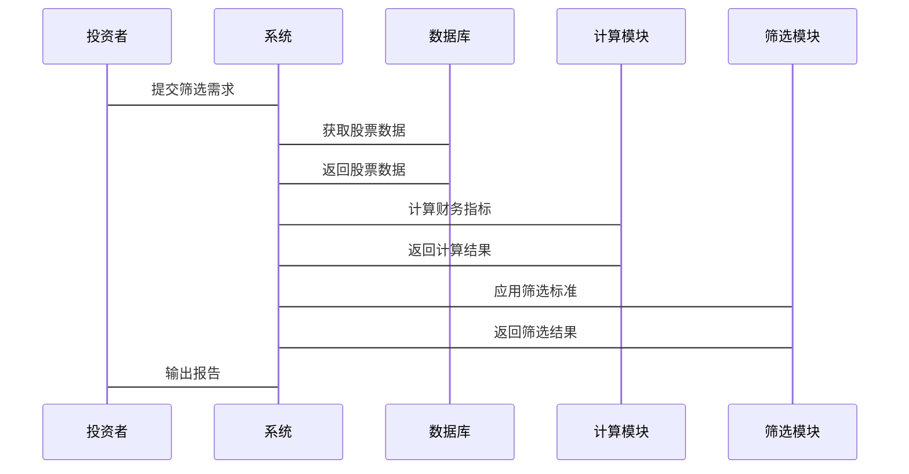

                 


# 如何利用特价股票策略构建长期增值组合

> 关键词：特价股票策略，长期增值，价值投资，组合投资，风险管理，股票筛选，投资逻辑

> 摘要：本文系统地介绍了如何利用特价股票策略构建长期增值的投资组合。首先，我们从价值投资的基本概念出发，分析了特价股票策略的背景与现状。接着，详细讲解了特价股票的定义、分类及其与长期增值投资的关系。然后，我们探讨了特价股票策略的核心算法原理，包括数学模型与筛选标准。之后，构建了一个基于特价股票策略的投资决策系统，并通过实际案例展示了如何实现这一策略。最后，我们总结了最佳实践方法，为投资者提供了风险管理与策略优化的建议。

---

# 第一部分: 特价股票策略与长期增值概述

## 第1章: 价值投资与特价股票策略背景

### 1.1 价值投资的基本概念

#### 1.1.1 价值投资的定义与核心理念
价值投资是一种以基本面分析为基础的投资策略，旨在通过识别市场中被低估的资产，长期持有以实现超额收益。其核心理念在于寻找市场价格低于其内在价值的股票。

#### 1.1.2 价值投资与投机的区别
- 投资：基于基本面分析，追求长期稳定收益。
- 投机：基于市场情绪和短期价格波动，追求短期收益。

#### 1.1.3 价值投资在现代投资中的地位
价值投资是投资领域的重要流派之一，尤其在市场波动较大时表现出较强的防御性和进攻性。通过长期持有优质资产，价值投资能够在市场低迷时提供安全边际，同时在市场复苏时获得超额收益。

### 1.2 特价股票策略的背景与现状

#### 1.2.1 特价股票的定义与特点
- **定义**：特价股票是指市场价格显著低于其内在价值的股票。
- **特点**：
  - 市场价格低于内在价值。
  - 通常具有较高的股息收益率。
  - 市场关注度较低，流动性可能较低。

#### 1.2.2 特价股票市场的主要参与者
- 机构投资者：通过基本面分析寻找低估股票。
- 个人投资者：通过技术分析或简单筛选寻找廉价股票。
- 投资基金：专注于价值投资策略的公募或私募基金。

#### 1.2.3 当前市场环境下的特价股票机会
- 经济周期波动为寻找特价股票提供了机会。
- 市场情绪低落时，许多优质股票可能被低估。

### 1.3 长期增值投资的逻辑

#### 1.3.1 长期增值的核心理念
- 长期持有优质资产，通过复利效应实现财富增长。
- 通过分散投资降低风险，同时捕捉个股的长期增长潜力。

#### 1.3.2 长期增值与短期波动的关系
- 长期增值的核心在于忽略短期波动，专注于资产的长期增长潜力。
- 短期波动为投资者提供了低位买入的机会。

#### 1.3.3 长期增值投资的策略选择
- 选择具有持续盈利能力的公司。
- 重点关注企业的财务健康状况和管理团队。

### 1.4 当前市场的机遇与挑战

#### 1.4.1 特价股票市场的现状分析
- 市场波动加剧，为价值投资者提供了更多机会。
- 特价股票通常集中在低估值行业，如金融、能源等。

#### 1.4.2 长期增值投资的潜在机会
- 通过筛选特价股票，构建高质量的投资组合。
- 重点关注具有长期增长潜力的行业。

#### 1.4.3 市场波动对投资策略的影响
- 市场波动为价值投资者提供了低位买入的机会。
- 需要耐心等待市场回归理性。

---

## 第2章: 特价股票策略的核心概念

### 2.1 特价股票的定义与分类

#### 2.1.1 特价股票的定义
- 特价股票是指市场价格显著低于其内在价值的股票。
- 这种股票通常被视为被市场低估的资产。

#### 2.1.2 特价股票的分类
- **深度特价股票**：市场价格远低于内在价值，通常具有较高的安全边际。
- **适度特价股票**：市场价格低于内在价值，但安全边际较小。
- **潜在特价股票**：市场价格接近内在价值，但具有潜在的增长空间。

#### 2.1.3 特价股票与普通股票的区别
- **价格与价值的关系**：特价股票市场价格低于内在价值，而普通股票市场价格接近或高于内在价值。
- **风险与收益**：特价股票通常具有较高的收益潜力，但风险也较高。

### 2.2 特价股票策略的原理

#### 2.2.1 价值发现的核心原理
- 通过基本面分析，识别市场价格低于内在价值的股票。
- 重点关注企业的盈利能力、财务状况和成长潜力。

#### 2.2.2 市场情绪与股票价格的关系
- 市场情绪波动影响股票价格，但长期来看，价格回归内在价值。
- 投资者应避免被短期市场情绪左右，专注于长期价值。

#### 2.2.3 特价股票策略的数学模型

##### 2.2.3.1 市盈率（P/E）计算公式
$$ P/E = \frac{Price}{Earnings} $$

##### 2.2.3.2 市净率（P/B）计算公式
$$ P/B = \frac{Price}{Book\ Value} $$

##### 2.2.3.3 股息率计算公式
$$ Dividend\ Yield = \frac{Dividend}{Price} $$

### 2.3 特价股票策略的优势与劣势

#### 2.3.1 特价股票策略的优势
- **高安全边际**：通过筛选特价股票，投资者可以降低投资风险。
- **潜在高收益**：特价股票具有较高的增长潜力，能够在市场复苏时获得超额收益。

#### 2.3.2 特价股票策略的劣势
- **流动性风险**：某些特价股票可能流动性较差，难以迅速变现。
- **选择难度**：识别真正低估的股票需要较高的分析能力。

#### 2.3.3 如何平衡策略优劣势
- **分散投资**：通过分散投资降低流动性风险。
- **持续学习**：提升分析能力，提高识别低估股票的准确性。

---

## 第3章: 长期增值组合的构建逻辑

### 3.1 组合投资的基本原理

#### 3.1.1 组合投资的定义与特点
- **定义**：通过将资金分配到多个资产或股票，降低投资风险。
- **特点**：分散风险，平滑收益波动。

#### 3.1.2 组合投资的优势
- **风险分散**：通过多样化投资降低单一资产的风险。
- **收益稳定**：组合投资能够在不同市场条件下保持相对稳定的收益。

#### 3.1.3 组合投资的风险分散机制
- **资产类别分散**：将资金分配到股票、债券等多种资产。
- **行业分散**：选择不同行业的股票，降低行业风险。

### 3.2 长期增值组合的构建步骤

#### 3.2.1 确定投资目标与风险承受能力
- **投资目标**：明确投资的收益目标和时间跨度。
- **风险承受能力**：评估自己对风险的承受能力，选择合适的风险水平。

#### 3.2.2 选择合适的股票池
- **行业分布**：选择具有长期增长潜力的行业。
- **市场资本化**：考虑大中小盘股票的分布。
- **估值指标**：筛选市盈率、市净率等指标低于行业平均水平的股票。

#### 3.2.3 设定权重分配与再平衡策略
- **权重分配**：根据风险承受能力和收益目标，设定各股票的权重。
- **再平衡策略**：定期调整投资组合，确保权重符合初始目标。

### 3.3 长期增值组合的优化与调整

#### 3.3.1 定期评估与调整策略
- **定期评估**：每年至少评估一次投资组合的表现。
- **动态调整**：根据市场变化和个人情况调整投资策略。

#### 3.3.2 应对市场变化的调整方法
- **市场低迷**：增加对特价股票的配置。
- **市场繁荣**：减少对高估值股票的配置，增加现金储备。

#### 3.3.3 组合优化的数学模型
- **现代投资组合理论（MPT）**：通过优化数学模型，找到最优的资产配置。

---

## 第4章: 特价股票策略的数学模型与算法原理

### 4.1 特价股票筛选的数学模型

#### 4.1.1 市盈率（P/E）计算公式
$$ P/E = \frac{Price}{Earnings} $$

#### 4.1.2 市净率（P/B）计算公式
$$ P/B = \frac{Price}{Book\ Value} $$

#### 4.1.3 股息率计算公式
$$ Dividend\ Yield = \frac{Dividend}{Price} $$

#### 4.1.4 综合评分模型
- **评分标准**：根据市盈率、市净率、股息率等指标，对股票进行综合评分。
- **评分公式**：
$$ Score = \frac{P/E + P/B + Dividend\ Yield}{3} $$

### 4.2 特价股票策略的算法流程

#### 4.2.1 数据获取与预处理
- **数据来源**：获取股票的历史价格、财务数据等。
- **数据清洗**：处理缺失值和异常值。

#### 4.2.2 筛选标准
- **市盈率低于行业平均水平**。
- **市净率低于行业平均水平**。
- **股息率高于行业平均水平**。

#### 4.2.3 筛选结果
- **筛选结果展示**：通过表格展示符合筛选标准的股票。

---

## 第5章: 系统分析与架构设计方案

### 5.1 问题场景介绍
- **目标**：构建一个基于特价股票策略的投资决策系统。
- **需求**：实现自动化筛选、分析和监控特价股票。

### 5.2 系统功能设计

#### 5.2.1 领域模型（Mermaid 类图）


#### 5.2.2 系统架构设计（Mermaid 架构图）
```mermaid
container 投资决策系统 {
    投资者请求
    接收数据
    数据处理
    结果输出
}
```

#### 5.2.3 系统接口设计
- **输入接口**：接收投资者的筛选需求。
- **输出接口**：输出符合筛选标准的股票列表。

#### 5.2.4 系统交互（Mermaid 序列图）


---

## 第6章: 项目实战

### 6.1 环境安装

#### 6.1.1 安装 Python 环境
```bash
python --version
pip install numpy pandas matplotlib
```

#### 6.1.2 安装数据获取工具
```bash
pip install yfinance
```

### 6.2 系统核心实现源代码

#### 6.2.1 数据获取与预处理
```python
import yfinance as yf
import pandas as pd

# 获取股票数据
tickers = ['AAPL', 'MSFT', 'GOOGL']
data = yf.download(tickers, start='2020-01-01', end='2023-12-31')

# 数据清洗
data = data['Adj Close']
data = data.dropna()
```

#### 6.2.2 财务指标计算
```python
import pandas as pd

def calculate_metrics(df):
    df['P/E'] = df['Price'] / df['Earnings']
    df['P/B'] = df['Price'] / df['Book Value']
    df['Dividend Yield'] = df['Dividend'] / df['Price']
    return df

# 假设 df 是预处理后的数据
metrics = calculate_metrics(data)
```

#### 6.2.3 筛选标准
```python
# 筛选条件
threshold_pe = 15
threshold_pb = 2
threshold_dividend = 5

selected_stocks = []
for stock in tickers:
    if metrics[stock]['P/E'] < threshold_pe and \
       metrics[stock]['P/B'] < threshold_pb and \
       metrics[stock]['Dividend Yield'] > threshold_dividend:
        selected_stocks.append(stock)

print(selected_stocks)
```

---

## 第7章: 最佳实践与小结

### 7.1 最佳实践 tips
- **持续学习**：市场环境不断变化，需要持续学习新的知识和策略。
- **风险管理**：即使采用价值投资策略，也需要注重风险管理。
- **长期持有**：耐心持有优质资产，避免频繁交易。

### 7.2 小结
通过本文的详细介绍，我们系统地探讨了如何利用特价股票策略构建长期增值的投资组合。从理论到实践，我们详细讲解了策略的核心概念、算法原理和系统实现，为投资者提供了全面的指导。

### 7.3 注意事项
- **市场风险**：市场波动可能会影响策略的表现。
- **数据质量**：数据的准确性和完整性对策略结果至关重要。
- **策略优化**：需要根据市场变化不断优化策略。

### 7.4 拓展阅读
- 《The Intelligent Investor》 - 本杰明·格雷厄姆
- 《价值投资实战手册》 - 李录

---

作者：AI天才研究院/AI Genius Institute & 禅与计算机程序设计艺术 /Zen And The Art of Computer Programming

