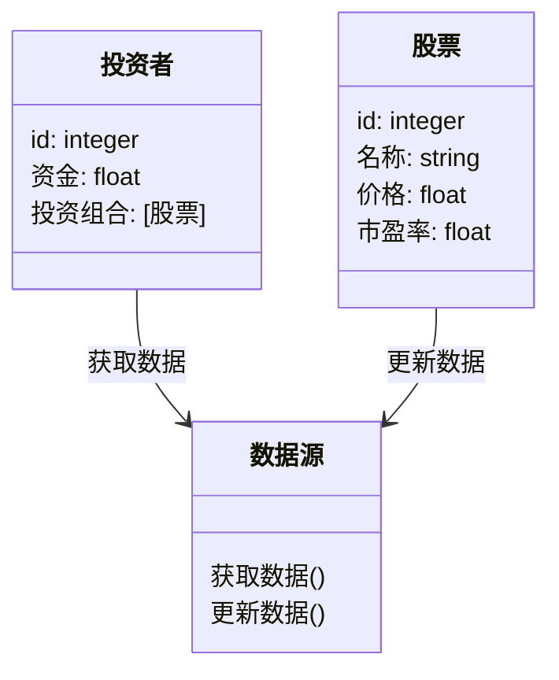

                 


# 如何利用特价股票策略构建长期增值组合

> **关键词**：特价股票策略, 长期增值, 股票投资, 投资组合, 风险管理  
> **摘要**：本文详细探讨了如何利用特价股票策略构建长期增值投资组合。通过分析特价股票的定义、核心原理、数学模型、组合构建方法以及风险管理策略，结合实际案例和工具使用，为投资者提供了一套系统化的投资方法论。

---

## 第一部分：特价股票策略概述

### 第1章：特价股票策略的背景与概念

#### 1.1 投资背景与股票市场的基本概念

股票市场作为现代金融体系的核心组成部分，为投资者提供了多样化的投资机会。股票投资的本质是通过购买企业股份，分享其成长收益。长期投资策略强调时间复利效应，而特价股票策略则是其中的一种有效方式。

**1.1.1 投资的基本概念与分类**

- **定义**：投资是通过购买资产以期在未来获得收益或资本增值的行为。
- **分类**：包括股票、债券、房地产、黄金等多种形式。
- **长期投资**：以持有资产较长时间（通常超过一年）为目标，注重复利效应。

**1.1.2 股票市场的运作机制**

- **定义**：股票市场是企业融资和投资者交易股票的场所。
- **主要参与者**：上市公司、投资者、券商、交易所等。
- **价格波动**：受供需关系、市场情绪、宏观经济等多种因素影响。

**1.1.3 长期投资的价值与意义**

- **复利效应**：长期持有优质资产，收益呈指数级增长。
- **风险分散**：通过投资组合分散单一资产的风险。
- **时间价值**：利用复利效应，逐步积累财富。

#### 1.2 特价股票策略的定义与特点

**1.2.1 特价股票的定义**

- **定义**：指市场价格低于其内在价值的股票。
- **内在价值**：基于公司基本面（如盈利能力、财务状况）评估的股票真实价值。
- **市场价格**：由供需关系决定的当前股票价格。

**1.2.2 特价股票策略的核心特点**

- **逆向投资**：在市场恐慌时买入，利用市场的非理性低估。
- **价值导向**：关注企业的长期价值，而非短期市场波动。
- **风险可控**：通过选择基本面良好但被市场低估的股票，降低投资风险。

**1.2.3 特价策略与其它投资策略的对比**

| 战略类型 | 短期交易 | 价值投资 | 特价投资 |
|----------|----------|----------|----------|
| 时间框架 | 短于1年   | 长期     | 中长期   |
| 核心理念 | 抓住短期价格波动 | 寻找被低估的价值 | 买入低于内在价值的股票 |
| 风险水平 | 高       | 中       | 中       |

---

## 第二部分：特价股票策略的核心原理

### 第2章：价值投资与特价股票策略

#### 2.1 价值投资的基本原理

**2.1.1 价值投资的起源与发展**

- **起源**：由本杰明·格雷厄姆和戴维·多德提出，强调安全边际和内在价值。
- **发展**： Warren Buffett等投资者将其发扬光大，成为长期投资的重要策略。

**2.1.2 价值投资的核心理念**

- **核心思想**：买入低于内在价值的股票，长期持有，等待市场回归。
- **安全边际**：购买价格与内在价值的差距，提供风险缓冲。
- **重点指标**：市盈率（P/E）、市净率（P/B）、股息率等。

#### 2.2 市场情绪与特价股票机会

**2.2.1 市场情绪的周期性分析**

- **情绪周期**：从乐观到恐慌，再到悲观，循环往复。
- **恐慌性抛售**：市场恐慌时，股票价格可能大幅低于内在价值，提供买入机会。
- **投资者心理**：多数投资者在市场高点买入，在低点卖出，逆向思维是关键。

---

## 第三部分：特价股票策略的数学模型与算法

### 第3章：股票价格预测的数学模型

#### 3.1 时间序列分析模型

**3.1.1 ARIMA模型的原理**

- **ARIMA模型**：自回归积分滑动平均模型，适用于非平稳时间序列。
- **公式**：ARIMA(p, d, q)，p为自回归阶数，d为差分阶数，q为滑动平均阶数。
- **应用**：用于预测股票价格的未来走势，帮助识别趋势和周期性。

**3.1.2 GARCH模型的应用**

- **GARCH模型**：广义自回归条件异方差模型，用于估计金融资产的波动性。
- **公式**：$$ GARCH(p, q) = \alpha_0 + \alpha_1 r_{t-1}^2 + \beta_1 h_{t-1} $$。
- **应用**：预测股票价格的波动区间，帮助设定止损点。

**3.1.3 LSTM在股票预测中的应用**

- **LSTM**：长短期记忆网络，适用于捕捉时间序列中的长期依赖关系。
- **结构**：通过门控机制，有效处理股票价格的复杂波动。
- **优势**：在处理非线性关系和复杂模式时表现优异。

#### 3.2 机器学习算法在股票预测中的应用

**3.2.1 支持向量机（SVM）的使用**

- **SVM**：通过构建超平面，将数据点分类到不同类别。
- **应用**：用于股票价格的分类预测，如上涨、下跌或持平。
- **优势**：在非线性关系中表现良好，但需要大量数据支持。

**3.2.2 随机森林模型的构建**

- **随机森林**：基于决策树的集成学习方法，通过投票机制预测结果。
- **优势**：对噪声数据有较强的鲁棒性，适合处理多维数据。
- **应用**：用于多因素分析，评估股票的内在价值。

**3.2.3 神经网络模型的实现**

- **神经网络**：模拟人脑神经网络，通过多层感知机（MLP）进行预测。
- **结构**：输入层、隐藏层、输出层，每层节点之间通过权重连接。
- **训练方法**：使用反向传播算法和梯度下降优化权重。

---

## 第四部分：投资组合构建与优化

### 第4章：投资组合构建的理论基础

#### 4.1 现代投资组合理论（MPT）

**4.1.1 MPT的核心思想**

- **核心思想**：通过资产多样化降低投资风险，实现收益最大化。
- **无差异曲线**：表示投资者对风险和收益的偏好。
- **有效前沿**：代表在给定风险下收益最高的投资组合。

**4.1.2 风险与收益的平衡**

- **标准差**：衡量资产收益的波动性，即风险。
- **夏普比率**：衡量投资组合的超额收益相对于其风险的表现。

#### 4.2 基于特价股票的投资组合构建

**4.2.1 确定投资目标与风险承受能力**

- **目标设定**：明确投资期限、收益目标和风险承受能力。
- **风险评估**：通过风险承受能力测试，选择适合的投资组合。

**4.2.2 选择合适的特价股票**

- **基本面分析**：评估公司的财务状况、盈利能力、行业地位。
- **技术分析**：通过K线图、成交量等指标判断股票的买卖信号。
- **组合优化**：使用数学模型（如均值-方差优化）选择最优股票组合。

---

## 第五部分：风险管理与策略执行

### 第5章：风险管理策略

#### 5.1 风险评估与控制

**5.1.1 风险的分类与评估方法**

- **市场风险**：股票价格波动带来的损失。
- **流动性风险**：无法及时变现资产的风险。
- **信用风险**：投资对象违约的风险。

**5.1.2 如何设置止损点**

- **止损点**：当股价跌破设定价格时，立即卖出以限制损失。
- **策略**：根据技术分析或价值评估，设定合理的止损位。

**5.1.3 风险分散化策略**

- **资产配置**：将资金分散投资于不同资产类别（股票、债券、现金等）。
- **行业分散**：选择不同行业的股票，降低行业风险。

#### 5.2 策略执行中的注意事项

**5.2.1 确保资金流动性**

- **流动资金**：保持部分资金用于应对突发情况或抓住新机会。
- **杠杆风险**：避免过度杠杆，防止市场下跌时的强制平仓。

**5.2.2 定期审视与调整投资组合**

- **定期审查**：根据市场变化和个人财务状况，评估投资组合的表现。
- **动态调整**：根据市场变化和企业基本面，优化投资组合。

**5.2.3 避免情绪化交易**

- **纪律性**：严格按照策略执行买卖决策，避免贪婪和恐惧影响判断。
- **长期视角**：坚持长期投资，避免短期波动干扰。

---

## 第六部分：实战操作与案例分析

### 第6章：特价股票策略的实战应用

#### 6.1 工具的选择与使用

**6.1.1 数据获取工具**

- **数据源**：使用Yahoo Finance、Google Finance等平台获取股票数据。
- **工具选择**：Excel、Python（Pandas、NumPy）、R等。

**6.1.2 分析工具**

- **技术分析工具**：使用MTS、TradingView等软件绘制K线图、成交量分析。
- **基本面分析工具**：使用Morningstar、S&P Capital IQ等进行公司基本面分析。

**6.1.3 优化工具**

- **优化算法**：使用Python的Scipy库进行投资组合优化。
- **回测工具**：使用Backtrader、Zipline等平台进行策略回测。

#### 6.2 项目核心实现源代码

**6.2.1 数据预处理**

```python
import pandas as pd
import numpy as np

# 获取股票数据
data = pd.read_csv('stock_data.csv')
data['date'] = pd.to_datetime(data['date'])
data.set_index('date', inplace=True)
data = data['close']
```

**6.2.2 回测策略实现**

```python
from backtrader import Strategy

class MyStrategy(Strategy):
    def __init__(self):
        self.buy_price = None
        self.sell_price = None
    
    def next(self):
        if self.buy_price is None:
            if data[-1] < data.mean():
                self.buy()
                self.buy_price = data[-1]
        else:
            if data[-1] > data.mean() * 1.1:
                self.sell()
                self.sell_price = data[-1]
```

**6.2.3 策略回测与分析**

```python
import backtrader as bt

# 初始化 cerebro
cerebro = bt.Cerebro()
cerebro.addstrategy(MyStrategy)
cerebro.adddata(data)
cerebro.broker.setcash(10000.0)
cerebro.run()
```

---

## 第七部分：系统架构与工具

### 第7章：系统分析与架构设计方案

#### 7.1 问题场景介绍

- **目标**：构建一个基于特价股票策略的投资组合管理系统。
- **用户角色**：个人投资者、机构投资者。
- **需求分析**：提供实时数据监控、策略回测、组合优化等功能。

#### 7.2 系统功能设计

**7.2.1 领域模型**



**7.2.2 系统架构**


**7.2.3 系统接口设计**

- **API接口**：
  - 获取股票数据：`GET /api/stock/prices`
  - 计算内在价值：`POST /api/value/assessment`
  - 执行交易：`POST /api/trade/order`

---

## 第八部分：项目实战与案例分析

### 第8章：项目核心实现与解读

#### 8.1 环境安装与配置

- **Python环境**：安装Python 3.8及以上版本。
- **依赖库安装**：使用pip安装numpy、pandas、backtrader等库。
  ```bash
  pip install numpy pandas backtrader
  ```

#### 8.2 代码实现与解读

**8.2.1 数据预处理**

```python
import pandas as pd
import numpy as np

# 读取数据
data = pd.read_csv('stock_data.csv', parse_dates=['date'], index_col='date')
data = data['close']
```

**8.2.2 策略实现**

```python
from backtrader import Strategy

class MeanReversionStrategy(Strategy):
    def __init__(self):
        self.position = None
    
    def next(self):
        current_price = self.data.close[0]
        average_price = data.mean()
        
        if current_price < average_price * 0.95:
            self.buy()
        elif current_price > average_price * 1.05:
            self.sell()
```

**8.2.3 策略回测**

```python
import backtrader as bt

# 初始化 cerebro
cerebro = bt.Cerebro()
cerebro.addstrategy(MeanReversionStrategy)
cerebro.adddata(data)
cerebro.broker.setcash(10000.0)
cerebro.run()
```

#### 8.3 实际案例分析

**案例：假设某股票的历史数据**

| 日期   | 收盘价 |
|--------|--------|
| 2023-01| 100    |
| 2023-02| 98     |
| 2023-03| 95     |
| 2023-04| 105    |

**分析**：
- 数据均值为：(100 + 98 + 95 + 105) / 4 = 100。
- 当价格低于95时（即95 < 100 * 0.95），买入信号。
- 当价格高于105时（即105 > 100 * 1.05），卖出信号。

**策略表现**：
- 2023-03价格为95，低于95，触发买入。
- 2023-04价格为105，高于105，触发卖出。
- 收益：(105 - 95) / 95 ≈ 10.5%。

---

## 第九部分：最佳实践与小结

### 第9章：总结与注意事项

#### 9.1 最佳实践

- **持续学习**：关注市场动态，学习新的投资理念和技术。
- **纪律执行**：严格按照策略执行交易，避免情绪干扰。
- **定期评估**：定期检查投资组合，根据市场变化进行调整。

#### 9.2 小结

特价股票策略通过寻找市场价格低于内在价值的股票，结合长期持有和价值投资理念，能够在市场低估时捕捉机会，构建稳健的投资组合。然而，成功实施该策略需要扎实的市场分析能力、严格的风险管理以及纪律性的执行。

#### 9.3 注意事项

- **避免过度杠杆**：高杠杆可能放大亏损，增加风险。
- **分散投资**：避免将所有资金投入到单一股票或行业。
- **长期视角**：耐心持有，避免频繁交易。

---

## 第十部分：拓展阅读

### 第10章：推荐阅读书籍与资源

- **书籍推荐**：
  - 《证券分析》——本杰明·格雷厄姆
  - 《投资学原理》——Richard A. Brealey
  - 《算法驱动的交易》——Peter W. breakpoints
- **在线资源**：
  - Quantitative Finance Stack Exchange
  - Quandl 数据平台
  - Backtrader 官方文档

---

## 作者信息

作者：AI天才研究院/AI Genius Institute & 禅与计算机程序设计艺术/Zen And The Art of Computer Programming

---

通过以上详细的内容结构，您可以逐步撰写完整的博客文章，确保每个部分都详细且符合逻辑，帮助读者全面理解如何利用特价股票策略构建长期增值组合。

