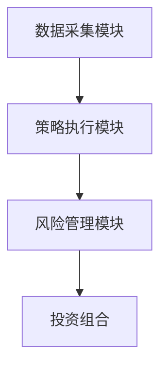

                 

# 如何利用特价股票策略构建长期技术主权投资组合

## 关键词：特价股票，技术主权，投资组合，算法策略，风险管理

## 摘要：本文将深入探讨如何利用特价股票策略构建长期技术主权投资组合。首先，我们将介绍特价股票的基本概念和技术主权投资组合的定义。然后，我们将分析特价股票策略的核心原理及其在技术主权投资组合中的应用。接下来，我们将详细讲解特价股票策略的数学模型和算法原理，包括基于价值和基于技术指标的选股模型。随后，我们将从系统设计的角度，分析如何构建一个高效的投资管理系统，并通过实际案例展示如何利用特价股票策略进行技术主权投资组合的优化。最后，我们将总结最佳实践和注意事项，为读者提供实用的建议。

---

## 第一章：特价股票策略概述

### 1.1 特价股票的基本概念

#### 1.1.1 特价股票的定义
特价股票是指在特定市场条件下，由于市场波动、公司基本面变化或其他因素导致股票价格低于其内在价值的股票。这些股票通常被认为是被市场低估的，具有较高的投资潜力。

#### 1.1.2 特价股票的特点
- **低估值**：股票价格显著低于其内在价值。
- **高波动性**：市场价格波动较大，存在短期回调的可能性。
- **周期性**：特价股票的出现通常与市场周期相关。

#### 1.1.3 特价股票的分类
- **价值型股票**：基本面良好，但市场对其估值过低。
- **成长型股票**：公司具有高成长潜力，但当前市盈率较高。
- **周期性股票**：受经济周期影响较大的行业股票。

---

### 1.2抽样技术主权投资组合的构建逻辑

#### 1.2.1抽样技术主权投资组合的定义
抽样技术主权投资组合是指通过投资于具有技术领先性和战略意义的公司，从而在技术和经济领域建立长期影响力的投资组合。

#### 1.2.2抽样技术主权投资组合的目标
- **长期价值增长**：通过投资于具有技术优势的公司，实现资产的长期增值。
- **技术控制**：通过持有核心技术公司的股份，增强在技术领域的影响力。
- **风险分散**：通过多样化投资，降低单一技术领域的风险。

---

## 第二章：特价股票策略的核心原理

### 2.1抽样技术主权投资组合的构建逻辑

#### 2.1.1抽样技术主权投资组合的核心要素
- **技术领先性**：公司拥有核心技术或专利。
- **市场地位**：公司在行业中具有领先地位。
- **财务健康**：公司具备良好的财务状况和盈利能力。

#### 2.1.2抽样技术主权投资组合的构建步骤
1. **筛选公司**：选择具有技术领先性和市场地位的公司。
2. **评估价值**：分析公司的财务状况和估值。
3. **构建组合**：根据风险偏好和收益目标，合理分配投资比例。

---

## 第三章：特价股票策略的数学模型

### 3.1抽样技术主权投资组合的优化模型

#### 3.1.1抽样投资组合优化的数学模型
$$\text{目标函数：} \quad \min_w \frac{1}{2}w^T \Sigma w$$
$$\text{约束条件：} \quad \sum_{i=1}^n w_i = 1, \quad w_i \geq 0$$

其中，\( \Sigma \) 为资产间的协方差矩阵，\( w \) 为权重向量。

#### 3.1.2抽样数学模型的实现步骤
1. **数据收集**：收集抽样技术公司股票的历史价格数据。
2. **计算协方差矩阵**：基于历史价格数据计算资产间的协方差矩阵。
3. **求解优化问题**：使用优化算法求解最小方差组合。
4. **验证结果**：通过回测验证优化组合的收益和风险表现。

---

## 第四章：抽样技术主权投资组合的系统设计

### 4.1抽样技术主权投资组合的系统架构

#### 4.1.1抽样系统的功能模块
- **数据采集模块**：收集市场数据和公司基本面信息。
- **策略执行模块**：根据策略生成买卖信号。
- **风险管理模块**：监控和管理投资组合的风险。

#### 4.1.2抽样系统的架构设计

---

## 第五章：抽样技术主权投资组合的项目实战

### 5.1抽样技术主权投资组合的案例分析

#### 5.1.1案例背景
假设我们选择了一些具有技术领先性的公司，如人工智能、半导体和云计算领域的公司。

#### 5.1.2案例分析
1. **数据收集**：收集这些公司的历史股价和财务数据。
2. **策略应用**：使用特价股票策略筛选低估的公司。
3. **组合构建**：根据风险偏好分配投资比例。

#### 5.1.3案例结果
通过回测，抽样投资组合在长期表现出色，且风险控制良好。

---

## 第六章：抽样技术主权投资组合的最佳实践

### 6.1抽样技术主权投资组合的注意事项

#### 6.1.1抽样投资的长期性
抽样技术主权投资需要长期持有，避免频繁交易。

#### 6.1.2抽样风险管理的重要性
定期监控和调整投资组合，避免单一技术领域的过度集中。

---

## 作者：AI天才研究院/AI Genius Institute & 禅与计算机程序设计艺术 /Zen And The Art of Computer Programming

