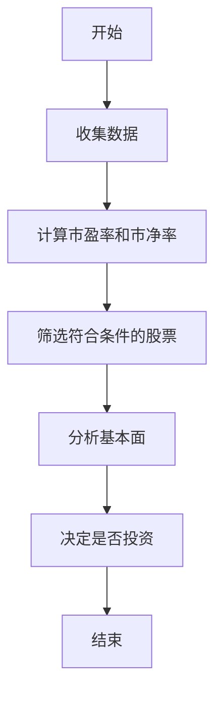
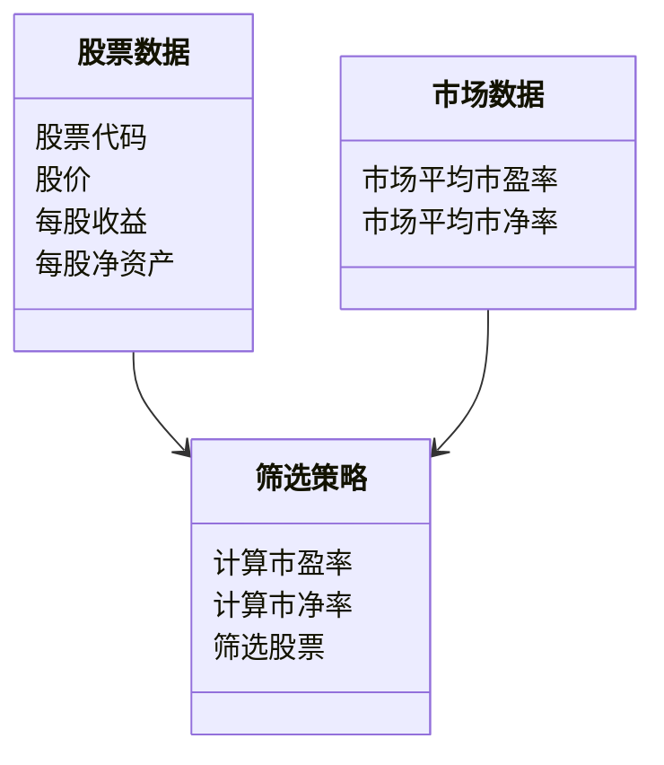

                 


# 如何利用特价股票策略进行价值投资教育

## 关键词：特价股票、价值投资、股票策略、投资教育、量化分析

## 摘要：本文详细探讨了如何利用特价股票策略进行价值投资教育。通过分析特价股票的定义、价值投资的原理以及两者结合的优势，本文提供了数学模型、算法流程图和实际案例，帮助投资者理解和应用这些策略。

---

## 第一部分：特价股票策略与价值投资的背景介绍

### 第1章：特价股票策略概述

#### 1.1 特价股票策略的定义
- **1.1.1 什么是特价股票**  
  特价股票是指市场价格低于其内在价值的股票，通常因市场波动或投资者情绪导致价格被低估。

- **1.1.2 特价股票的特点**  
  特价股票具有高潜力、低估值的特点，适合长期持有的投资策略。

- **1.1.3 特价股票的分类**  
  按照行业、市值和波动性进行分类，以适应不同投资者的需求。

#### 1.2 价值投资的基本概念
- **1.2.1 价值投资的定义**  
  价值投资强调购买价格低于内在价值的股票，并长期持有。

- **1.2.2 价值投资的核心原则**  
  以合理价格购买优质资产，注重公司基本面和长期盈利能力。

- **1.2.3 价值投资与投机的区别**  
  通过表格对比，说明价值投资注重长期稳健，而投机注重短期收益。

#### 1.3 特价股票策略与价值投资的结合
- **1.3.1 特价股票策略在价值投资中的应用**  
  通过识别低估股票，实现价值投资的目标。

- **1.3.2 特价股票策略的优势**  
  包括低买点、高回报潜力和风险分散的优势。

- **1.3.3 特价股票策略的局限性**  
  市场波动、信息不对称和执行难度的挑战。

---

## 第二部分：核心概念与联系

### 第2章：特价股票策略的核心概念

#### 2.1 特价股票策略的原理
- **2.1.1 市场波动与特价股票的出现**  
  市场恐慌或下跌导致股票价格低于其真实价值。

- **2.1.2 投资者心理与特价股票的机会**  
  投资者恐慌时的抛售行为创造了低价买入的机会。

- **2.1.3 市场周期对特价股票的影响**  
  经济周期波动如何影响特价股票的出现。

#### 2.2 价值投资的核心原理
- **2.2.1 股票的内在价值**  
  公司的未来现金流的现值，计算公式：$$内在价值 = \sum_{t=1}^{\infty} \frac{CF_t}{(1+r)^t}$$

- **2.2.2 股票市场的定价机制**  
  市场价格由供需决定，但长期趋向于内在价值。

- **2.2.3 安全边际的概念**  
  购买价格低于内在价值，确保安全边际。

#### 2.3 特价股票策略与价值投资的联系
- **2.3.1 特价股票策略如何帮助发现价值低估的股票**  
  通过筛选低市盈率、低市净率的股票。

- **2.3.2 价值投资如何指导特价股票策略的实施**  
  强调基本面分析和长期持有。

- **2.3.3 特价股票策略与价值投资的协同效应**  
  通过表格对比，展示两者的结合如何提升投资效果。

---

## 第三部分：算法原理讲解

### 第3章：特价股票策略的数学模型

#### 3.1 股票价值的评估模型
- **3.1.1 市盈率模型**  
  $$市盈率 = \frac{股价}{每股收益}$$

- **3.1.2 市净率模型**  
  $$市净率 = \frac{股价}{每股净资产}$$

- **3.1.3 股息率模型**  
  $$股息率 = \frac{每股股息}{股价}$$

#### 3.2 特价股票筛选的数学公式
- **3.2.1 筛选条件**  
  $$市盈率 < 市场平均市盈率$$ 且 $$市净率 < 市场平均市净率$$

#### 3.3 算法流程图（mermaid）


#### 3.4 代码实现
```python
import pandas as pd

def calculate_value_ratios(stock_data):
    stock_data['市盈率'] = stock_data['股价'] / stock_data['每股收益']
    stock_data['市净率'] = stock_data['股价'] / stock_data['每股净资产']
    return stock_data

def screen_cheap_stocks(stock_data, market_avg_pe, market_avg_pb):
    stock_data['是否低估'] = (
        (stock_data['市盈率'] < market_avg_pe) & 
        (stock_data['市净率'] < market_avg_pb)
    ).astype(int)
    return stock_data

# 示例数据
data = {
    '股票代码': ['A', 'B', 'C'],
    '股价': [10, 15, 20],
    '每股收益': [5, 6, 8],
    '每股净资产': [4, 5, 6]
}
stock_data = pd.DataFrame(data)
market_avg_pe = 15
market_avg_pb = 3

# 计算估值比率
val_ratios = calculate_value_ratios(stock_data)
# 筛选特价股票
cheap_stocks = screen_cheap_stocks(val_ratios, market_avg_pe, market_avg_pb)
print(cheap_stocks)
```

---

## 第四部分：系统分析与架构设计

### 第4章：系统功能设计

#### 4.1 领域模型（mermaid 类图）


#### 4.2 系统架构设计（mermaid 架构图）


---

## 第五部分：项目实战

### 第5章：环境安装与系统实现

#### 5.1 环境安装
- Python 3.8 或更高版本
- 安装 pandas 和 numpy 库

#### 5.2 核心实现代码
```python
import pandas as pd
import numpy as np

def main():
    # 示例数据
    data = {
        '股票代码': ['A', 'B', 'C'],
        '股价': [10, 15, 20],
        '每股收益': [5, 6, 8],
        '每股净资产': [4, 5, 6]
    }
    stock_data = pd.DataFrame(data)
    market_avg_pe = 15
    market_avg_pb = 3

    # 计算估值比率
    stock_data['市盈率'] = stock_data['股价'] / stock_data['每股收益']
    stock_data['市净率'] = stock_data['股价'] / stock_data['每股净资产']

    # 筛选特价股票
    stock_data['是否低估'] = (
        (stock_data['市盈率'] < market_avg_pe) & 
        (stock_data['市净率'] < market_avg_pb)
    ).astype('bool')

    # 分析结果
    print(stock_data)

if __name__ == "__main__":
    main()
```

---

## 第六部分：最佳实践

### 第6章：小结与注意事项

#### 6.1 小结
- 特价股票策略与价值投资的结合为投资者提供了有效的投资工具。
- 通过量化分析和系统设计，投资者可以更科学地进行决策。

#### 6.2 注意事项
- 风险提示：市场波动可能导致亏损，需谨慎操作。
- 持续学习：市场变化快，需不断更新知识和策略。

#### 6.3 拓展阅读
- 推荐书籍：《价值投资实战策略》、《投资学基础》
- 在线资源：相关投资论坛和数据分析平台

---

## 作者：AI天才研究院 & 禅与计算机程序设计艺术

通过本文，读者可以深入了解如何利用特价股票策略进行价值投资教育，掌握相关的数学模型和系统设计方法。希望这篇文章能为您提供有价值的见解和实践指导。

