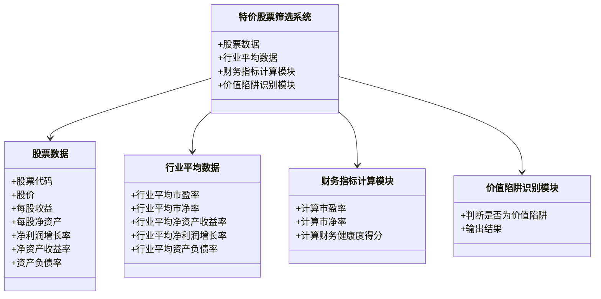
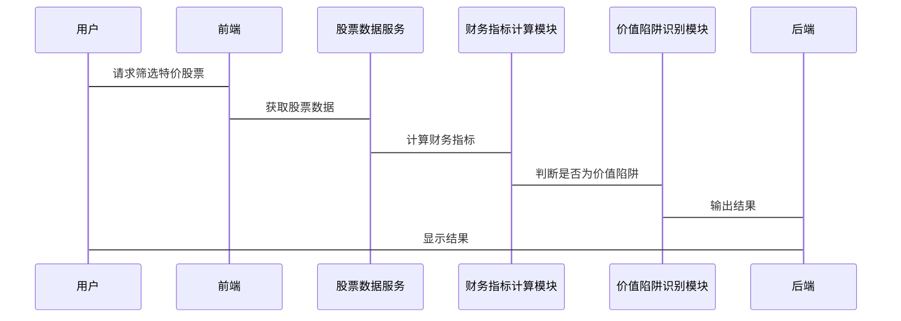

                 


# 如何利用特价股票策略进行价值陷阱规避

> 关键词：特价股票，价值陷阱，股票投资，价值投资，投资策略

> 摘要：本文详细探讨了如何利用特价股票策略来规避价值陷阱。通过分析特价股票的定义、特征，以及价值陷阱的类型和识别方法，结合数学模型和实际案例，帮助投资者制定有效的策略。文章还介绍了系统的架构设计和项目实战，提供了从理论到实践的完整指导。

---

## 第1章: 特价股票策略的背景与概念

### 1.1 特价股票的定义与特征

#### 1.1.1 特价股票的定义
特价股票是指市场价格显著低于其内在价值的股票。这种股票通常被认为具有较高的投资潜力，因为它们可能被市场低估。

#### 1.1.2 特价股票的特征
- **低市盈率（P/E）**：市盈率低于行业平均水平。
- **低市净率（P/B）**：市净率低于行业平均水平。
- **高股息率**：股息收益率较高，通常高于行业平均水平。
- **高ROE（净资产收益率）**：净资产收益率较高，表明公司盈利能力强。

#### 1.1.3 特价股票与非特价股票的对比
| 特性 | 特价股票 | 非特价股票 |
|------|----------|------------|
| 市盈率 | 低       | 高或适中   |
| 市净率 | 低       | 高或适中   |
| 股息率 | 高       | 低或适中   |
| ROE   | 高       | 中或低     |

### 1.2 价值陷阱的概念与分类

#### 1.2.1 价值陷阱的定义
价值陷阱是指那些表面上看便宜，但实际上存在严重问题或风险的股票。投资者如果只关注价格，而忽视了公司的基本面，就可能掉进价值陷阱。

#### 1.2.2 价值陷阱的常见类型
- **财务造假**：公司财务报表造假，掩盖真实情况。
- **行业衰退**：所在行业处于衰退期，公司难以维持增长。
- **管理问题**：公司管理层存在问题，如腐败或管理不善。
- **法律风险**：公司面临法律诉讼或合规问题。

#### 1.2.3 价值陷阱与价值投资的区别
- **价值陷阱**：价格便宜，但公司存在问题，风险高。
- **价值投资**：价格便宜，且公司基本面良好，具有长期增长潜力。

### 1.3 特价股票策略的核心思想

#### 1.3.1 特价股票策略的目标
通过识别市场价格低于内在价值的股票，捕捉投资机会。

#### 1.3.2 特价股票策略的核心原则
- **基本面分析**：重点关注公司的财务状况、盈利能力、管理团队等。
- **风险控制**：识别并规避价值陷阱。
- **长期投资**：选择具有长期增长潜力的公司。

#### 1.3.3 特价股票策略的适用场景
适用于市场波动较大、部分股票被低估的情况，尤其适合价值投资者。

---

## 第2章: 特价股票策略与价值陷阱的关系

### 2.1 特价股票策略的潜在风险

#### 2.1.1 价值陷阱的常见表现形式
- **低市盈率但高负债**：公司负债过高，财务风险大。
- **高股息率但无成长性**：公司股息高，但缺乏增长潜力。
- **低市净率但业务衰退**：公司业务萎缩，市场竞争力下降。

#### 2.1.2 特价股票策略的局限性
- **短期波动**：特价股票可能因为市场情绪波动而继续被低估。
- **信息不对称**：投资者可能无法完全掌握公司的基本面信息。
- **行业周期**：部分行业可能处于衰退期，导致公司基本面恶化。

#### 2.1.3 如何避免价值陷阱
- **深入研究公司基本面**：分析财务报表，识别潜在风险。
- **关注行业趋势**：选择处于上升期的行业。
- **多元化投资**：分散投资，降低风险。

### 2.2 价值陷阱的识别与规避

#### 2.2.1 价值陷阱的识别方法
- **财务指标分析**：关注公司的负债率、利润率、现金流等。
- **行业分析**：了解公司所在行业的前景。
- **管理层分析**：研究公司管理层的背景和稳定性。

#### 2.2.2 如何利用特价股票策略规避价值陷阱
- **结合多种指标**：综合市盈率、市净率、股息率等指标，全面评估公司价值。
- **长期跟踪**：持续关注公司动态，及时调整投资策略。
- **分散投资**：避免将所有资金投入到单一股票或行业。

#### 2.2.3 特价股票策略与长期投资的结合
- **长期视角**：选择具有长期增长潜力的公司。
- **价值发现**：通过深入分析，发现被市场低估的股票。

---

## 第3章: 特价股票策略的核心要素

### 3.1 特价股票的量化指标

#### 3.1.1 常见的股票估值指标
- **市盈率（P/E）**：股价除以每股收益。
- **市净率（P/B）**：股价除以每股净资产。
- **股息率**：股息除以股价。
- **ROE（净资产收益率）**：净利润除以净资产。

#### 3.1.2 市盈率（P/E）的计算与应用
市盈率 = 股价 / 每股收益（EPS）

**案例分析**：假设某公司股价为10元，每股收益为2元，市盈率为5。如果行业平均市盈率为15，则该股票可能被低估。

#### 3.1.3 市净率（P/B）的计算与应用
市净率 = 股价 / 每股净资产（BPS）

**案例分析**：假设某公司股价为10元，每股净资产为5元，市净率为2。如果行业平均市净率为5，则该股票可能被低估。

### 3.2 特价股票策略的实施步骤

#### 3.2.1 确定投资目标
- **设定投资目标**：明确投资目的和风险承受能力。
- **选择行业**：根据市场趋势和行业前景选择投资行业。
- **筛选股票**：根据量化指标筛选出潜在的特价股票。

#### 3.2.2 数据收集与分析
- **数据来源**：使用金融数据平台获取股票的财务数据。
- **数据分析**：分析公司的财务状况、盈利能力、成长性等。
- **指标计算**：计算市盈率、市净率、股息率等指标。

#### 3.2.3 策略制定与执行
- **制定策略**：根据分析结果制定投资策略。
- **执行交易**：根据策略进行买入、卖出等操作。
- **持续监控**：定期监控股票表现，及时调整策略。

### 3.3 价值陷阱的数学模型与公式

#### 3.3.1 价值陷阱识别的数学模型
- **多指标分析模型**：综合市盈率、市净率、股息率等指标进行评估。
- **财务健康度模型**：通过财务指标分析公司的健康状况。

#### 3.3.2 价值陷阱识别的公式推导
**财务健康度得分** = （净资产收益率 / 行业平均净资产收益率）× 30% + （净利润增长率 / 行业平均净利润增长率）× 30% + （资产负债率 / 行业平均资产负债率）× 40%

**案例分析**：假设某公司财务健康度得分为85，行业平均得分为60，则该公司财务状况良好，可能不是价值陷阱。

---

## 第4章: 特价股票策略的算法原理

### 4.1 算法原理概述

#### 4.1.1 算法的核心思想
通过量化指标筛选出潜在的特价股票，并结合基本面分析识别价值陷阱。

#### 4.1.2 算法的输入与输出
- **输入**：股票的财务数据，如市盈率、市净率、股息率等。
- **输出**：潜在的特价股票列表，以及是否为价值陷阱的判断结果。

#### 4.1.3 算法的步骤分解
1. 收集股票的财务数据。
2. 计算量化指标，如市盈率、市净率等。
3. 对比行业平均值，筛选出潜在的特价股票。
4. 进行基本面分析，识别价值陷阱。
5. 输出结果。

### 4.2 算法的数学模型与公式

#### 4.2.1 算法的数学模型
$$ \text{财务健康度得分} = \left( \frac{\text{净资产收益率}}{\text{行业平均净资产收益率}} \times 30\% \right) + \left( \frac{\text{净利润增长率}}{\text{行业平均净利润增长率}} \times 30\% \right) + \left( \frac{\text{资产负债率}}{\text{行业平均资产负债率}} \times 40\% \right) $$

#### 4.2.2 算法的公式推导
- 计算行业平均值：
  $$ \text{行业平均值} = \frac{\sum \text{行业公司指标值}}{\text{行业公司数量}} $$
- 计算标准化值：
  $$ \text{标准化值} = \frac{\text{公司指标值}}{\text{行业平均值}} $$

---

## 第5章: 系统分析与架构设计方案

### 5.1 问题场景介绍
投资者需要一个系统来自动筛选特价股票，并识别价值陷阱。

### 5.2 项目介绍
开发一个基于量化指标的股票筛选系统，帮助投资者识别潜在的特价股票，并避免价值陷阱。

### 5.3 系统功能设计

#### 5.3.1 领域模型（Mermaid 类图）


### 5.4 系统架构设计（Mermaid 架构图）


### 5.5 系统交互设计（Mermaid 序列图）


---

## 第6章: 项目实战

### 6.1 环境安装

#### 6.1.1 安装Python
```bash
# 安装Python
sudo apt-get install python3 python3-pip
```

#### 6.1.2 安装必要的库
```bash
pip install pandas numpy matplotlib seaborn scikit-learn
```

### 6.2 系统核心实现源代码

#### 6.2.1 数据收集与预处理
```python
import pandas as pd

# 假设我们有一个包含股票数据的Excel文件
df = pd.read_excel('stock_data.xlsx')
```

#### 6.2.2 计算量化指标
```python
# 计算市盈率
df['市盈率'] = df['股价'] / df['每股收益']

# 计算市净率
df['市净率'] = df['股价'] / df['每股净资产']

# 计算股息率
df['股息率'] = df['股息'] / df['股价']

# 计算财务健康度得分
industry_avg_er = df['行业平均净资产收益率']
df['财务健康度得分'] = (df['净资产收益率'] / industry_avg_er * 30) + \
                        (df['净利润增长率'] / df['行业平均净利润增长率'] * 30) + \
                        (df['资产负债率'] / df['行业平均资产负债率'] * 40)
```

#### 6.2.3 识别价值陷阱
```python
# 定义价值陷阱判断标准
def is_value_trap(row):
    if row['市盈率'] < row['行业平均市盈率'] and \
       row['市净率'] < row['行业平均市净率'] and \
       row['股息率'] > row['行业平均股息率'] and \
       row['财务健康度得分'] > 80:
        return False
    else:
        return True

# 应用判断函数
df['是否为价值陷阱'] = df.apply(is_value_trap, axis=1)
```

### 6.3 实际案例分析

#### 6.3.1 案例分析
假设我们有一个股票数据集，包含以下信息：
- 股票代码
- 股价
- 每股收益
- 每股净资产
- 股息
- 净利润增长率
- 净资产收益率
- 资产负债率
- 行业平均市盈率
- 行业平均市净率
- 行业平均股息率
- 行业平均净利润增长率
- 行业平均资产负债率

#### 6.3.2 结果展示
通过上述代码，我们可以筛选出财务健康、市盈率和市净率低于行业平均的股票，并判断它们是否为价值陷阱。

---

## 第7章: 总结与最佳实践

### 7.1 总结

#### 7.1.1 文章总结
本文详细探讨了如何利用特价股票策略来规避价值陷阱。通过分析特价股票的定义、特征，以及价值陷阱的识别方法，结合数学模型和实际案例，为投资者提供了从理论到实践的完整指导。

#### 7.1.2 投资策略总结
- **基本面分析**：重点关注公司的财务状况、盈利能力、管理团队等。
- **风险控制**：识别并规避价值陷阱。
- **长期投资**：选择具有长期增长潜力的公司。

### 7.2 最佳实践 tips

#### 7.2.1 价值陷阱识别的注意事项
- **数据准确性**：确保数据来源可靠。
- **行业分析**：关注行业趋势和周期。
- **管理层分析**：研究公司管理层的背景和稳定性。

#### 7.2.2 风险管理
- **分散投资**：避免将所有资金投入到单一股票或行业。
- **持续学习**：保持对市场和公司的关注，及时调整投资策略。

#### 7.2.3 持续优化
- **定期复盘**：评估投资策略的有效性。
- **优化模型**：根据市场变化和投资经验优化算法。

### 7.3 拓展阅读
- **书籍推荐**：《价值投资实战手册》、《股票投资的奥秘》。
- **在线资源**：关注金融博客、投资论坛，获取最新的市场信息和投资策略。

### 7.4 项目小结
通过本文的系统设计和项目实战，读者可以掌握如何利用特价股票策略进行投资，并避免价值陷阱。系统架构和代码实现为投资者提供了有力的工具，帮助他们做出更明智的投资决策。

---

## 作者

作者：AI天才研究院/AI Genius Institute & 禅与计算机程序设计艺术 /Zen And The Art of Computer Programming

