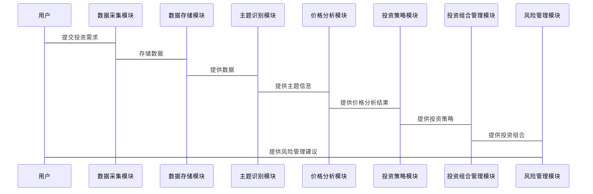

                 

# 如何利用特价股票策略进行全球主题性投资

> 关键词：特价股票策略、全球主题性投资、股票投资、市场分析、主题识别、投资策略

> 摘要：本文详细探讨了如何利用特价股票策略在全球范围内进行主题性投资。文章从特价股票策略和全球主题性投资的基本概念出发，分析了两者的核心原理和联系，结合实际案例，讲解了如何在全球市场中应用特价股票策略进行主题性投资。文章还从算法原理、系统架构、项目实战等多个角度进行了深入分析，并给出了最佳实践和注意事项。

---

## 第1章: 特价股票策略与全球主题性投资概述

### 1.1 特价股票策略的定义与特点

#### 1.1.1 特价股票的定义
特价股票通常指那些市场价格低于其内在价值，或者具有较大波动性的股票。这类股票通常被认为是被市场低估的，具有较大的增值潜力。

#### 1.1.2 特价股票的核心特点
- **低估值**：市场价格低于内在价值。
- **高波动性**：价格波动较大，存在短期套利机会。
- **周期性**：通常在市场周期性低谷时出现。

#### 1.1.3 特价股票与传统股票投资的区别
- **投资目标**：特价股票策略注重短期套利和价格波动，而传统股票投资注重长期价值。
- **风险偏好**：特价股票策略风险较高，而传统股票投资风险相对较低。
- **操作方式**：特价股票策略需要频繁交易和市场监控，而传统股票投资注重长期持有。

### 1.2 全球主题性投资的定义与特点

#### 1.2.1 全球主题性投资的定义
全球主题性投资是指投资于具有全球性趋势或主题的股票，如科技、环保、人工智能等领域。这类投资注重长期趋势和行业前景，而非短期价格波动。

#### 1.2.2 全球主题性投资的核心特点
- **全球化视角**：关注全球市场和行业的趋势。
- **主题驱动**：以特定主题为导向，如科技、医疗、能源等。
- **长期性**：注重长期趋势和行业前景。

#### 1.2.3 全球主题性投资与区域投资的区别
- **投资范围**：全球主题性投资跨越多个国家和地区，而区域投资仅限于某一地区。
- **风险分散**：全球投资可以分散区域风险，而区域投资风险集中。
- **机会多样性**：全球投资能够捕捉更多元化的投资机会。

### 1.3 特价股票策略与全球主题性投资的结合

#### 1.3.1 特价股票策略在全球主题性投资中的应用
- **主题识别**：通过全球市场数据分析，识别具有潜力的主题。
- **价格优势**：在特定主题中寻找价格被低估的股票。
- **短期套利**：在主题热点出现时，利用特价股票的短期波动获利。

#### 1.3.2 特价股票策略与主题性投资的协同效应
- **主题筛选**：通过全球市场数据分析，筛选出具有长期增长潜力的主题。
- **价格优势**：在选定的主题中，寻找价格被低估的股票。
- **组合优化**：结合主题和价格优势，构建最优投资组合。

#### 1.3.3 特价股票策略在全球市场中的优势
- **全球化视角**：能够在全球范围内寻找低估的股票。
- **主题驱动**：结合全球市场趋势，捕捉长期增长机会。
- **风险分散**：通过全球市场分散投资风险。

### 1.4 本章小结
本章介绍了特价股票策略和全球主题性投资的基本概念、特点以及两者的结合方式。通过结合全球市场趋势和特价股票的价格优势，投资者可以在全球范围内捕捉到更多的投资机会，并实现风险分散和收益最大化。

---

## 第2章: 特价股票策略的核心原理

### 2.1 市场周期与特价股票策略

#### 2.1.1 市场周期的定义与分类
市场周期是指市场在不同时间阶段的表现，通常分为复苏期、增长期、成熟期和衰退期。

#### 2.1.2 市场周期对特价股票策略的影响
- **复苏期**：市场开始复苏，股票价格逐渐上升。
- **增长期**：市场繁荣，股票价格持续上涨。
- **成熟期**：市场稳定，股票价格波动较小。
- **衰退期**：市场低迷，股票价格大幅下降。

#### 2.1.3 不同市场周期下特价股票策略的调整
- **衰退期**：寻找价格被低估的股票。
- **复苏期**：逐步建仓，等待价格上涨。
- **增长期**：持有股票，享受价格上涨。
- **成熟期**：适当降低仓位，防范风险。

### 2.2 技术分析与特价股票策略

#### 2.2.1 技术分析的基本原理
技术分析是通过分析股票价格的历史走势，预测未来价格变化。常用的技术指标包括移动平均线（MA）、相对强弱指数（RSI）、MACD等。

#### 2.2.2 技术分析在特价股票策略中的应用
- **价格趋势分析**：通过技术指标识别股票的价格趋势。
- **买卖信号识别**：通过技术指标寻找买入和卖出信号。
- **波动性分析**：通过技术指标判断股票的波动性。

#### 2.2.3 常用的技术指标与策略结合
- **移动平均线（MA）**：用于判断股票的价格趋势。
- **相对强弱指数（RSI）**：用于判断股票的超买超卖状态。
- **MACD**：用于判断股票的动能变化。

### 2.3 基本面分析与特价股票策略

#### 2.3.1 基本面分析的定义与方法
基本面分析是通过分析公司的财务状况、行业地位、盈利能力等基本面因素，评估股票的内在价值。

#### 2.3.2 基本面分析在特价股票策略中的应用
- **公司财务状况分析**：评估公司的盈利能力、资产负债情况。
- **行业地位分析**：评估公司在行业中的竞争地位。
- **估值分析**：评估股票的市场价格是否低于其内在价值。

#### 2.3.3 基本面分析与技术分析的结合
- **结合使用**：通过基本面分析筛选出具有潜力的股票，再通过技术分析寻找合适的买卖时机。
- **互补性分析**：基本面分析提供长期投资依据，技术分析提供短期交易信号。

### 2.4 本章小结
本章详细介绍了特价股票策略的核心原理，包括市场周期、技术分析和基本面分析。通过结合这些方法，投资者可以在不同市场环境下，制定出有效的投资策略。

---

## 第3章: 全球主题性投资的分析框架

### 3.1 全球经济与市场主题的识别

#### 3.1.1 全球经济趋势的分析方法
- **宏观经济指标**：分析GDP、通货膨胀率、利率等宏观经济指标。
- **行业趋势分析**：分析全球范围内各行业的发展趋势。
- **政策分析**：分析政府政策对市场的影响。

#### 3.1.2 主题性投资的识别标准
- **长期增长潜力**：选择具有长期增长潜力的主题。
- **市场规模**：选择市场规模大、参与者多的主题。
- **风险分散**：选择能够分散投资风险的主题。

#### 3.1.3 全球市场主题的分类与特点
- **科技主题**：包括人工智能、大数据、云计算等领域。
- **环保主题**：包括新能源、绿色能源、环保技术等领域。
- **医疗主题**：包括生物技术、医疗设备、医疗服务等领域。

### 3.2 行业分析与主题性投资

#### 3.2.1 行业分析的基本方法
- **行业生命周期分析**：分析行业的成熟度和增长潜力。
- **行业竞争分析**：分析行业的竞争格局和市场集中度。
- **行业财务分析**：分析行业的财务状况和盈利能力。

#### 3.2.2 行业趋势对主题性投资的影响
- **行业增长潜力**：选择具有长期增长潜力的行业。
- **行业风险**：分析行业面临的政策、技术、市场等风险。
- **行业周期**：选择处于上升周期的行业。

#### 3.2.3 行业选择与主题性投资的结合
- **主题识别**：通过行业分析识别具有潜力的主题。
- **行业筛选**：在选定的主题中筛选出具有增长潜力的行业。
- **行业配置**：根据行业分析结果，配置投资组合。

### 3.3 市场情绪与主题性投资

#### 3.3.1 市场情绪的定义与测量
市场情绪是指市场参与者对市场的看法和情绪，通常通过市场成交量、投资者情绪指数等指标进行测量。

#### 3.3.2 市场情绪对主题性投资的影响
- **市场情绪与主题选择**：市场情绪高涨时，选择热点主题；市场情绪低落时，选择冷门主题。
- **市场情绪与投资策略**：市场情绪高涨时，增加投资仓位；市场情绪低落时，减少投资仓位。

#### 3.3.3 市场情绪分析在主题性投资中的应用
- **情绪监测**：通过市场情绪指标监测市场的整体情绪。
- **情绪预测**：通过历史数据预测未来的市场情绪。
- **情绪策略**：根据市场情绪制定投资策略。

### 3.4 本章小结
本章详细介绍了全球主题性投资的分析框架，包括全球经济与市场主题的识别、行业分析与主题性投资、市场情绪与主题性投资等方面。通过这些分析，投资者可以更好地识别和选择具有潜力的主题，并制定出有效的投资策略。

---

## 第4章: 特价股票策略与全球主题性投资的结合

### 4.1 特价股票策略与全球主题性投资的协同效应

#### 4.1.1 主题轮动策略
主题轮动是指根据市场趋势和主题热度的变化，及时调整投资主题的策略。通过主题轮动，投资者可以捕捉到不同主题的投资机会。

#### 4.1.2 事件驱动策略
事件驱动策略是指根据特定事件（如并购、重组、政策变化等）对股票价格的影响，进行投资的策略。通过事件驱动策略，投资者可以在特定事件中获得超额收益。

#### 4.1.3 跨市场套利策略
跨市场套利是指在不同市场之间利用价格差异进行套利的策略。通过跨市场套利，投资者可以利用不同市场的价格差异，获取无风险或低风险的收益。

### 4.2 特价股票策略在全球主题性投资中的应用

#### 4.2.1 全球市场主题的识别与筛选
- **主题识别**：通过全球经济和行业分析，识别具有潜力的全球主题。
- **主题筛选**：在识别出的主题中，筛选出具有价格优势的股票。

#### 4.2.2 特价股票策略的具体应用
- **主题筛选**：在选定的主题中，寻找价格被低估的股票。
- **价格分析**：通过技术分析和基本面分析，判断股票的价格走势。
- **交易策略**：根据分析结果，制定具体的交易策略。

### 4.3 全球主题性投资中的风险管理

#### 4.3.1 风险识别与评估
- **市场风险**：市场波动对投资组合的影响。
- **行业风险**：特定行业面临的政策、技术等风险。
- **流动性风险**：投资标的的流动性不足，难以快速变现。

#### 4.3.2 风险管理策略
- **分散投资**：通过投资不同主题和市场，分散投资风险。
- **止损策略**：设定止损点，避免亏损过大。
- **风险监控**：定期监控投资组合的风险指标，及时调整投资策略。

### 4.4 本章小结
本章详细介绍了特价股票策略与全球主题性投资的结合方式，包括协同效应、具体应用和风险管理等方面。通过结合特价股票策略和全球主题性投资，投资者可以在全球范围内捕捉到更多的投资机会，并实现风险分散和收益最大化。

---

## 第5章: 特价股票策略与全球主题性投资的系统架构

### 5.1 系统功能设计

#### 5.1.1 数据采集模块
- **数据源**：全球市场的股票数据、宏观经济数据、行业数据等。
- **数据处理**：清洗、转换、存储。

#### 5.1.2 主题识别模块
- **主题筛选**：通过数据分析，识别具有潜力的主题。
- **主题分类**：对主题进行分类，便于后续分析和投资。

#### 5.1.3 价格分析模块
- **技术分析**：使用技术指标分析股票价格走势。
- **基本面分析**：评估股票的内在价值。

#### 5.1.4 投资策略模块
- **主题轮动策略**：根据市场趋势调整投资主题。
- **事件驱动策略**：根据特定事件进行投资。
- **跨市场套利策略**：利用不同市场的价格差异进行套利。

### 5.2 系统架构设计

#### 5.2.1 系统架构图

#### 5.2.2 系统交互流程

### 5.3 系统接口设计

#### 5.3.1 数据接口
- **数据输入接口**：接收全球市场的股票数据、宏观经济数据、行业数据等。
- **数据输出接口**：输出主题识别结果、价格分析结果、投资策略等。

#### 5.3.2 用户接口
- **用户输入接口**：接收用户的投资需求和参数设置。
- **用户输出接口**：输出投资建议、风险管理建议等。

### 5.4 本章小结
本章详细介绍了系统架构设计，包括功能模块设计、系统交互流程、系统接口设计等方面。通过系统化的架构设计，投资者可以更好地实施特价股票策略和全球主题性投资。

---

## 第6章: 项目实战——全球主题性投资中的特价股票策略应用

### 6.1 项目背景与目标

#### 6.1.1 项目背景
随着全球市场的不断发展，投资者越来越关注具有长期增长潜力的主题，如科技、环保、医疗等领域。同时，特价股票因其价格优势，也吸引了众多投资者的关注。

#### 6.1.2 项目目标
- **识别全球主题**：通过数据分析，识别具有潜力的全球主题。
- **筛选特价股票**：在选定的主题中，筛选出价格被低估的股票。
- **制定投资策略**：根据分析结果，制定具体的投资策略。

### 6.2 项目实施步骤

#### 6.2.1 数据收集与预处理
- **数据来源**：全球市场的股票数据、宏观经济数据、行业数据等。
- **数据清洗**：去除无效数据、填补缺失值、处理异常值。
- **数据存储**：将数据存储在数据库中，便于后续分析。

#### 6.2.2 主题识别与筛选
- **主题识别**：通过数据分析，识别具有潜力的全球主题。
- **主题筛选**：在识别出的主题中，筛选出具有价格优势的股票。

#### 6.2.3 价格分析与策略制定
- **技术分析**：使用技术指标分析股票价格走势。
- **基本面分析**：评估股票的内在价值。
- **策略制定**：根据分析结果，制定具体的投资策略。

### 6.3 项目实现与案例分析

#### 6.3.1 数据分析与可视化
- **数据可视化**：通过图表展示数据分析结果，便于理解和决策。
- **数据挖掘**：使用数据挖掘技术，发现数据中的潜在规律。

#### 6.3.2 策略实现与回测
- **策略实现**：根据分析结果，编写投资策略代码。
- **策略回测**：对策略进行历史数据回测，验证策略的有效性。

#### 6.3.3 案例分析
- **案例选择**：选择一个具有代表性的全球主题，如人工智能。
- **案例分析**：分析人工智能领域的股票，筛选出价格被低估的股票。
- **案例总结**：总结案例分析结果，提出投资建议。

### 6.4 项目小结
本章通过一个具体的项目实战，展示了如何在全球主题性投资中应用特价股票策略。通过数据收集、主题识别、价格分析和策略制定，投资者可以更好地捕捉到投资机会，并实现收益最大化。

---

## 第7章: 最佳实践与注意事项

### 7.1 投资策略的调整与优化

#### 7.1.1 定期评估与调整
- **定期评估**：定期评估投资策略的有效性，及时调整。
- **动态优化**：根据市场变化和投资目标，动态优化投资策略。

#### 7.1.2 知识更新与学习
- **持续学习**：关注市场变化和投资理论的发展，不断更新知识。
- **经验总结**：总结投资经验，优化投资策略。

### 7.2 风险管理与控制

#### 7.2.1 风险识别与预警
- **风险识别**：识别潜在的投资风险，如市场风险、行业风险等。
- **风险预警**：建立风险预警机制，及时发现和应对风险。

#### 7.2.2 风险应对策略
- **风险分散**：通过投资多元化，分散投资风险。
- **风险管理**：制定风险管理策略，如止损策略、风险对冲等。

### 7.3 投资纪律与心态管理

#### 7.3.1 投资纪律
- **纪律性执行**：严格按照投资策略执行，避免情绪化投资。
- **纪律性回顾**：定期回顾投资决策，总结经验教训。

#### 7.3.2 心态管理
- **保持冷静**：在市场波动中保持冷静，避免过度反应。
- **长期视角**：保持长期投资视角，避免短期波动干扰。

### 7.4 本章小结
本章总结了全球主题性投资中的特价股票策略的最佳实践，包括投资策略的调整与优化、风险管理与控制、投资纪律与心态管理等方面。通过遵循这些最佳实践，投资者可以更好地应对市场变化，实现投资目标。

---

## 第8章: 总结与展望

### 8.1 本章总结
本文详细探讨了如何利用特价股票策略进行全球主题性投资。通过分析特价股票策略和全球主题性投资的核心原理、结合方式和系统架构，展示了如何在全球范围内捕捉投资机会，并实现收益最大化。

### 8.2 未来展望
随着全球市场的不断发展和科技的进步，特价股票策略和全球主题性投资将面临更多新的机遇和挑战。未来的研究可以进一步探索人工智能、大数据等技术在投资策略中的应用，以提高投资效率和收益。

---

## 作者：AI天才研究院/AI Genius Institute & 禅与计算机程序设计艺术/Zen And The Art of Computer Programming

