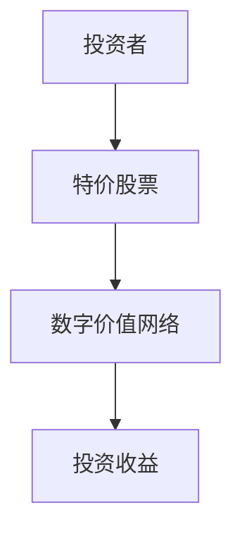
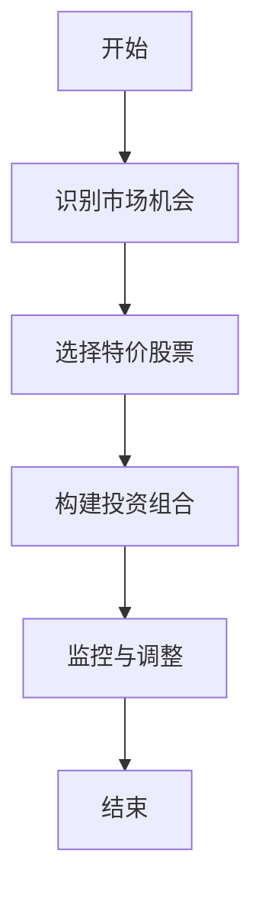
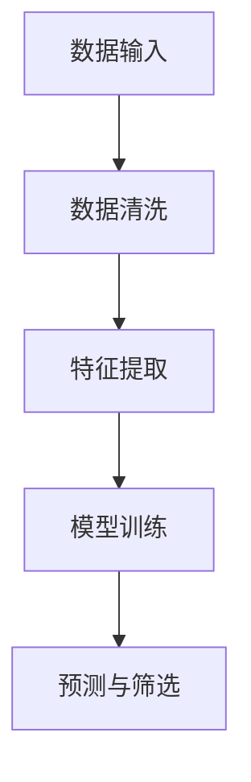
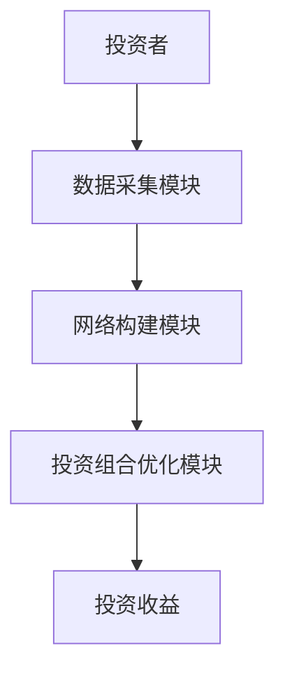

                 


# 《如何利用特价股票策略进行全球数字价值网络投资》

## 关键词：特价股票策略、数字价值网络、投资、全球市场、算法、风险管理

## 摘要：  
本文详细探讨了如何利用特价股票策略在全球范围内构建数字价值网络，以优化投资组合并实现稳健收益。通过分析特价股票的定义、算法原理以及数字价值网络的构建方法，结合全球市场环境和风险管理策略，为投资者提供一套系统化的投资方案。

---

# 第一部分: 特价股票策略的背景与基础

## 第2章: 特价股票策略的核心概念与联系

### 2.1 特价股票与数字价值网络的核心概念

#### 2.1.1 特价股票的定义与属性
- **特价股票**：指在特定市场环境下，价格被低估或具有较大折扣潜力的股票。
- **属性**：
  - 价格波动性高
  - 投资价值被市场暂时低估
  - 具备较高的成长潜力

#### 2.1.2 数字价值网络的定义与属性
- **数字价值网络**：基于数字技术构建的价值链网络，通过数据连接、分析和优化，实现资源的高效配置和价值最大化。
- **属性**：
  - 数据驱动
  - 网络化协同
  - 实时动态优化

#### 2.1.3 特价股票与数字价值网络的关系
- 特价股票是数字价值网络中的核心资产。
- 数字价值网络为特价股票的投资提供了数据支持和技术手段。

### 2.2 实体关系图（ER图）与流程图

#### 2.2.1 实体关系图（ER图）


#### 2.2.2 流程图


---

## 第3章: 特价股票策略的算法原理

### 3.1 算法原理概述

#### 3.1.1 特价股票识别算法
- **目标**：识别具有投资价值的特价股票。
- **步骤**：
  1. 数据收集：获取市场数据（如股价、成交量、财务指标）。
  2. 数据清洗：去除异常值和缺失数据。
  3. 特征提取：提取关键特征（如市盈率、市净率、股息率）。
  4. 模型训练：使用机器学习模型（如随机森林、支持向量机）进行分类。
  5. 预测与筛选：预测股票价格走势，筛选出具备投资价值的股票。

#### 3.1.2 数字价值网络构建算法
- **目标**：构建基于数字技术的价值网络。
- **步骤**：
  1. 数据挖掘：从市场数据中提取关联性高的股票。
  2. 网络构建：使用图论算法（如PageRank）构建股票间的关联网络。
  3. 网络优化：通过优化算法（如遗传算法）提升网络效率。

### 3.2 算法实现与数学模型

#### 3.2.1 特价股票识别算法的数学模型
- **公式**：
  $$ \text{预测价值} = \sum_{i=1}^{n} w_i \cdot x_i $$
  其中，$w_i$为特征权重，$x_i$为特征值。

#### 3.2.2 数字价值网络构建算法的数学模型
- **公式**：
  $$ \text{网络价值} = \sum_{i=1}^{m} a_i \cdot b_i $$
  其中，$a_i$为节点价值，$b_i$为节点间关联度。

#### 3.2.3 算法流程图


---

## 第4章: 全球数字价值网络的构建与优化

### 4.1 全球市场环境分析

#### 4.1.1 全球市场的特点
- 多元化：不同国家和地区的市场具有不同的特点。
- 不确定性：全球经济波动对市场的影响显著。

#### 4.1.2 数字价值网络的全球化布局
- 通过数字技术实现全球市场的互联互通。
- 利用数据分析优化全球投资组合。

### 4.2 数字价值网络的系统架构设计

#### 4.2.1 系统功能设计
- 数据采集模块：实时采集市场数据。
- 网络构建模块：构建股票关联网络。
- 投资组合优化模块：优化投资组合。

#### 4.2.2 系统架构图


---

## 第5章: 项目实战——特价股票策略的实现

### 5.1 环境安装与配置

#### 5.1.1 工具安装
- Python：用于数据分析和算法实现。
- Pandas：用于数据处理。
- Scikit-learn：用于机器学习模型训练。

#### 5.1.2 数据源获取
- 从Yahoo Finance获取市场数据。

### 5.2 核心代码实现

#### 5.2.1 特价股票识别代码
```python
import pandas as pd
from sklearn.ensemble import RandomForestClassifier

# 数据加载
data = pd.read_csv('stock_data.csv')

# 数据清洗
data.dropna(inplace=True)

# 特征提取
features = ['PE', 'PB', 'Dividend Yield']
target = 'Target'

X = data[features]
y = data[target]

# 模型训练
model = RandomForestClassifier()
model.fit(X, y)

# 预测与筛选
predictions = model.predict(X)
selected_stocks = X[where predictions == 1]
```

#### 5.2.2 数字价值网络构建代码
```python
import networkx as nx

# 数据加载
data = pd.read_csv('stock_network.csv')

# 网络构建
G = nx.Graph()
for i in range(len(data)):
    G.add_edge(data['Source'][i], data['Target'][i])

# 网络优化
nx pagerank(G)
```

### 5.3 实战案例分析

#### 5.3.1 案例分析
- 数据来源：某段时间内的市场数据。
- 分析结果：识别出若干具备投资价值的股票。
- 投资组合优化：构建最优投资组合，实现收益最大化。

### 5.4 代码应用解读与分析
- **数据预处理**：确保数据质量。
- **模型训练**：选择合适的算法提升预测精度。
- **网络优化**：通过算法优化提升网络效率。

---

## 第6章: 风险管理与优化

### 6.1 投资风险管理

#### 6.1.1 风险来源
- 市场波动风险。
- 信息不对称风险。
- 操作风险。

#### 6.1.2 风险管理策略
- 分散投资：降低单一资产的风险。
- 风险对冲：利用衍生工具对冲风险。
- 定期评估：及时调整投资策略。

### 6.2 投资组合优化

#### 6.2.1 优化方法
- 基于数学模型的优化。
- 基于机器学习的优化。

#### 6.2.2 优化工具
- 使用Python的Optimization工具包。

---

## 第7章: 总结与展望

### 7.1 总结
- 特价股票策略的有效性。
- 数字价值网络的投资优势。

### 7.2 展望
- 技术进步对投资策略的影响。
- 数字价值网络的未来发展。

---

## 作者：AI天才研究院/AI Genius Institute & 禅与计算机程序设计艺术 /Zen And The Art of Computer Programming

