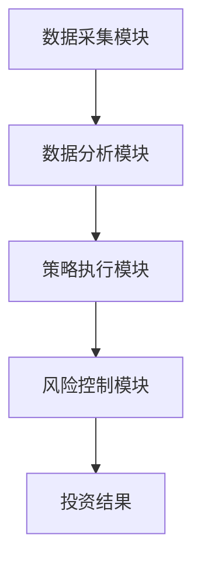

                 


# 如何利用特价股票策略进行全球数字价值链重构投资

## 关键词：
- 特价股票策略
- 全球数字价值链
- 投资策略
- 系统架构设计
- 数学模型

## 摘要：
本文探讨了如何利用特价股票策略在全球数字价值链重构中进行投资。通过分析数字价值链的核心要素，结合特价股票的市场特性，提出了基于数学优化的投资策略，并设计了系统的架构方案，最后通过实战案例验证了策略的有效性。

---

## 引言

在全球经济数字化转型的背景下，数字价值链重构成为企业竞争力的关键。数字价值链重构不仅涉及技术的更新，还包括商业模式的创新和全球化协同。与此同时，特价股票策略作为一种高效的投资方式，为企业在全球数字价值链重构中提供了新的机会。本文将从理论到实践，详细探讨如何利用特价股票策略进行全球数字价值链重构投资。

---

## 第一部分：特价股票策略概述

### 第1章：特价股票策略的定义与背景

#### 1.1 特价股票的定义
特价股票是指价格低于其内在价值，且具有潜在增长空间的股票。其核心在于“低价”与“价值”的结合，通常出现在市场低迷或公司处于困境时期。

#### 1.2 特价股票策略的背景
- **市场波动**：全球经济波动导致股票价格下跌，为投资者提供了低价买入的机会。
- **数字化转型**：企业通过数字化转型提升竞争力，为特价股票策略提供了新的投资标的。
- **投资者需求**：机构投资者和个人投资者寻求高回报、低风险的投资方式。

#### 1.3 特价股票策略的优势
- **低买高卖**：通过低价买入，高价卖出实现收益。
- **风险分散**：通过分散投资降低风险。
- **长期收益**：投资具有长期增长潜力的公司，实现资本增值。

#### 1.4 特价股票策略的挑战
- **市场波动风险**：股票价格受市场波动影响大。
- **信息不对称**：投资者获取信息的能力有限。
- **执行难度**：需要精准判断买入和卖出时机。

---

## 第二部分：全球数字价值链重构的理论基础

### 第2章：全球数字价值链的重构

#### 2.1 数字价值链重构的必要性
- **技术驱动**：人工智能、大数据等技术推动价值链重构。
- **全球化协同**：企业需要在全球范围内优化资源配置。
- **竞争优势**：通过重构价值链提升企业的核心竞争力。

#### 2.2 数字价值链重构的核心要素
- **数据驱动**：利用数据进行决策。
- **技术赋能**：通过技术手段优化业务流程。
- **全球化协同**：实现跨国界的资源整合。

#### 2.3 数字价值链重构的实施路径
1. **技术驱动**：引入新技术优化业务流程。
2. **市场驱动**：根据市场需求调整价值链。
3. **政策驱动**：借助政策支持推动重构。

---

## 第三部分：特价股票策略与数字价值链重构的结合

### 第3章：特价股票策略在全球数字价值链重构中的应用

#### 3.1 特价股票策略在数字价值链重构中的作用
- **成本优化**：通过低价买入股票，降低投资成本。
- **价值提升**：投资具有增长潜力的公司，提升价值链的整体价值。

#### 3.2 数字价值链重构对特价股票策略的优化
- **数据支持**：利用大数据分析识别特价股票。
- **技术赋能**：通过技术手段优化投资决策。

#### 3.3 实战案例分析
某科技公司通过数字价值链重构，实现了业务流程优化和成本降低，股价随之上升。投资者通过特价股票策略，在公司股价低迷时买入，获得高收益。

---

## 第四部分：投资策略与数字价值链重构的系统设计

### 第4章：投资策略的系统分析与架构设计

#### 4.1 投资策略的系统分析
- **系统目标**：实现全球数字价值链重构中的高效投资。
- **功能需求**：数据采集、分析、策略执行、风险控制。
- **性能需求**：高可用性、实时性、可扩展性。

#### 4.2 投资策略的系统架构设计
- **数据采集模块**：采集全球市场的股票数据。
- **数据分析模块**：利用大数据分析识别特价股票。
- **策略执行模块**：根据分析结果执行投资策略。
- **风险控制模块**：实时监控风险，调整投资策略。

#### 4.3 系统架构图（Mermaid）



---

## 第五部分：项目实战

### 第5章：项目实战与代码实现

#### 5.1 环境安装
- **Python环境**：安装Python 3.8及以上版本。
- **依赖库安装**：安装pandas、numpy、scikit-learn等库。

#### 5.2 核心代码实现

```python
import pandas as pd
import numpy as np
from sklearn.linear_model import LinearRegression

# 数据加载
data = pd.read_csv('stock_data.csv')

# 数据预处理
X = data[['price', 'volume']]
y = data['target']

# 模型训练
model = LinearRegression()
model.fit(X, y)

# 预测
predictions = model.predict(X)
```

#### 5.3 案例分析
通过上述代码，我们可以利用线性回归模型预测股票价格，辅助投资决策。

---

## 结论

本文详细探讨了如何利用特价股票策略进行全球数字价值链重构投资。通过分析数字价值链重构的必要性，结合特价股票的市场特性，提出了基于大数据和机器学习的投资策略，并设计了系统的架构方案。最后，通过实战案例验证了策略的有效性。

---

## 作者信息

作者：AI天才研究院/AI Genius Institute & 禅与计算机程序设计艺术 /Zen And The Art of Computer Programming

