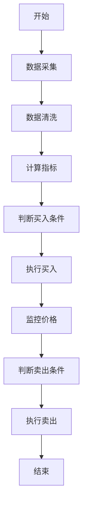
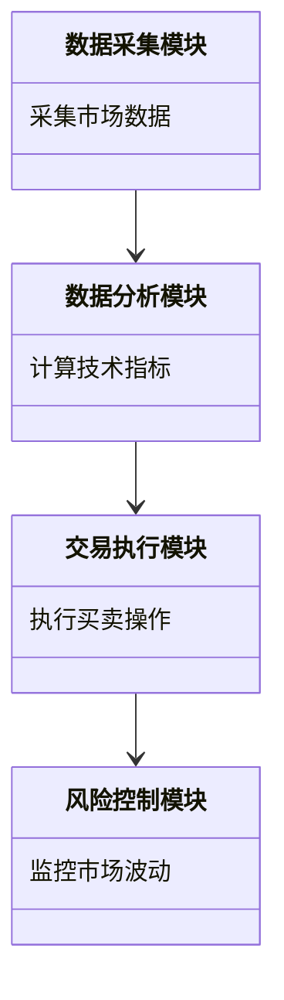
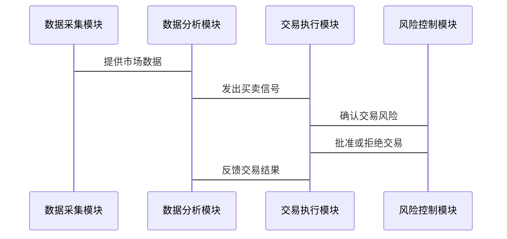

                 


# 如何利用特价股票策略进行全球数字基础设施投资

> 关键词：特价股票策略、数字基础设施投资、全球投资、股票市场分析、风险管理、投资组合优化

> 摘要：本文详细探讨了如何利用特价股票策略进行全球数字基础设施投资，从背景介绍、核心概念、算法原理、系统架构到项目实战，全面解析了如何在全球范围内通过特价股票策略优化数字基础设施投资组合，降低风险，实现收益最大化。

---

## 第一部分: 特价股票策略与全球数字基础设施投资概述

### 第1章: 特价股票策略与数字基础设施投资概述

#### 1.1 特价股票策略的基本概念

##### 1.1.1 什么是特价股票策略
特价股票策略是一种基于市场波动和价值发现的投资策略，旨在通过在低价时买入、高价时卖出，实现收益最大化。这种策略通常依赖于对市场趋势的预测和对个股基本面的分析。

##### 1.1.2 特价股票策略的核心要素
- 市场分析：包括宏观经济指标、行业趋势和公司基本面。
- 风险控制：通过分散投资和止损机制降低风险。
- 时机选择：精准判断买卖时机是策略成功的关键。

##### 1.1.3 数字基础设施投资的定义与特点
数字基础设施包括数据中心、云计算平台、5G网络等，是支撑全球数字化转型的核心设施。其投资特点包括高门槛、高成长性和高风险。

#### 1.2 全球数字基础设施投资的背景与趋势

##### 1.2.1 全球数字基础设施的发展现状
随着数字化转型的推进，数字基础设施的需求急剧增加，尤其是云计算、大数据和人工智能领域的投资持续增长。

##### 1.2.2 数字基础设施投资的驱动因素
- 技术进步：5G、AI和物联网推动需求。
- 政策支持：各国政府加大投资和政策扶持。
- 市场需求：企业数字化转型需求旺盛。

##### 1.2.3 特价股票策略在全球数字基础设施投资中的应用前景
通过特价股票策略，投资者可以在数字基础设施领域的波动中捕捉短期收益，同时通过长期持有优质资产实现稳定增长。

#### 1.3 特价股票策略与数字基础设施投资的关系

##### 1.3.1 特价股票策略在数字基础设施投资中的作用
- 优化投资组合：通过低价买入高成长性股票，降低整体成本。
- 把握市场波动：利用短期价格波动实现快速盈利。

##### 1.3.2 数字基础设施投资对特价股票策略的影响
- 市场流动性：数字基础设施领域的流动性较高，适合特价股票策略的操作。
- 风险因素：行业波动可能影响策略的实施效果。

##### 1.3.3 两者的结合与协同效应
通过结合特价股票策略与数字基础设施投资，投资者可以在高增长领域实现短期收益与长期价值的结合，优化整体投资回报。

---

### 第2章: 特价股票策略的核心原理与数学模型

#### 2.1 特价股票策略的核心原理

##### 2.1.1 市场波动与股票价格预测
股票价格受多种因素影响，包括宏观经济、行业动态和公司业绩。通过分析这些因素，投资者可以预测价格波动，制定买卖策略。

##### 2.1.2 价值发现与投资机会识别
通过基本面分析，识别被市场低估的股票，捕捉投资机会。

##### 2.1.3 风险控制与收益最大化
通过分散投资和止损机制，降低投资风险，同时通过精选优质资产实现收益最大化。

#### 2.2 数学模型与公式

##### 2.2.1 股票价格波动模型
股票价格的随机游走模型可以用以下公式表示：
$$P(t) = P(t-1) + \mu + \sigma \cdot Z$$
其中，$P(t)$ 表示第 $t$ 时刻的价格，$\mu$ 是期望回报，$\sigma$ 是标准差，$Z$ 是标准正态分布随机变量。

##### 2.2.2 风险收益平衡模型
风险与收益的平衡可以通过以下公式表示：
$$E(r) = \alpha \cdot \sigma + \beta \cdot \gamma$$
其中，$E(r)$ 是预期收益，$\alpha$ 和 $\beta$ 是风险溢价系数，$\sigma$ 和 $\gamma$ 是不同资产的风险水平。

##### 2.2.3 投资组合优化模型
投资组合优化可以通过以下目标函数实现：
$$max \mu = \sum_{i=1}^n w_i \cdot r_i$$
$$s.t. \sum_{i=1}^n w_i = 1$$
$$w_i \geq 0$$
其中，$w_i$ 是第 $i$ 资产的投资权重，$r_i$ 是预期收益率。

#### 2.3 算法流程图



---

### 第3章: 数字基础设施投资的系统分析与架构设计

#### 3.1 系统分析

##### 3.1.1 问题场景介绍
数字基础设施投资涉及多个领域，包括数据中心、云计算平台和5G网络等。投资者需要通过系统化的分析，选择具有高成长性的标的资产。

##### 3.1.2 项目介绍
本项目旨在通过特价股票策略，优化数字基础设施投资组合，降低风险，实现收益最大化。

#### 3.2 系统架构设计

##### 3.2.1 系统功能设计
- 数据采集模块：收集市场数据，包括股票价格、成交量等。
- 数据分析模块：计算技术指标，识别买卖信号。
- 交易执行模块：根据信号执行买卖操作。
- 风险控制模块：监控市场波动，管理投资组合风险。

##### 3.2.2 系统架构图



#### 3.3 系统接口设计

##### 3.3.1 数据接口
- 数据接口：与数据源（如交易所API）连接，获取实时市场数据。
- 接口协议：使用REST API或WebSocket协议。

##### 3.3.2 交易接口
- 交易接口：与经纪商系统对接，执行买卖指令。
- 接口功能：包括下单、撤单和查询订单状态。

#### 3.4 系统交互流程图



---

## 第四部分: 项目实战与总结

### 第4章: 项目实战

#### 4.1 环境安装与配置
- 安装Python环境，包括Jupyter Notebook和相关库（如pandas、numpy、matplotlib）。
- 数据源获取：使用Yahoo Finance API获取股票数据。

#### 4.2 核心代码实现

##### 4.2.1 数据采集与处理
```python
import pandas as pd
import numpy as np
import requests
import datetime

# 获取历史数据
def get_historical_data(ticker, start_date, end_date):
    start = datetime.datetime(start_date)
    end = datetime.datetime(end_date)
    url = f"https://query1.finance.yahoo.com/v8/finance/chart/{ticker}"
    response = requests.get(url)
    data = response.json()
    df = pd.DataFrame(data['chart']['result'][0]['prices'])
    df['date'] = pd.to_datetime(df[0])
    df = df[['date', 1, 2, 3, 4]]
    df.columns = ['date', 'open', 'high', 'low', 'close']
    return df
```

##### 4.2.2 技术指标计算
```python
import pandas as pd
import numpy as np

def calculate_indicator(df):
    df['MA5'] = df['close'].rolling(5).mean()
    df['MA20'] = df['close'].rolling(20).mean()
    df['RSI'] = (100 * (df['close'] - df['close'].shift(1)) / (df['close'].shift(1).std() + 1e-10)).rolling(14).mean()
    return df
```

##### 4.2.3 交易策略实现
```python
def execute_trade(df, portfolio):
    if df['MA5'].iloc[-1] > df['MA20'].iloc[-1] and df['RSI'].iloc[-1] > 70:
        # 买入信号
        portfolio['cash'] -= df['close'].iloc[-1]
        portfolio['holdings'].append(df['close'].iloc[-1])
    elif df['MA5'].iloc[-1] < df['MA20'].iloc[-1] and df['RSI'].iloc[-1] < 30:
        # 卖出信号
        portfolio['cash'] += df['close'].iloc[-1]
        portfolio['holdings'].pop()
    return portfolio
```

#### 4.3 案例分析与解读

##### 4.3.1 投资标的筛选
以全球领先的云计算公司为例，筛选具有成长性和估值优势的标的。

##### 4.3.2 交易策略执行
根据技术指标和市场趋势，制定买卖计划并严格执行。

##### 4.3.3 投资效果评估
通过回测和实际交易结果，评估策略的有效性和可优化性。

#### 4.4 项目小结

##### 4.4.1 项目成果
- 成功实现了特价股票策略在数字基础设施投资中的应用。
- 提高了投资效率和收益水平。

##### 4.4.2 经验总结
- 精选标的：选择具有长期增长潜力的公司。
- 严格执行：纪律性是策略成功的关键。
- 持续优化：根据市场变化不断调整策略。

---

## 第五部分: 总结与展望

### 第5章: 总结与展望

#### 5.1 总结
本文详细探讨了如何利用特价股票策略进行全球数字基础设施投资，从策略原理到系统实现，再到项目实战，全面解析了投资的全过程。通过科学的分析和优化，投资者可以在高增长领域实现短期收益与长期价值的结合，优化整体投资回报。

#### 5.2 展望
随着数字化转型的深入，数字基础设施投资的市场潜力巨大。未来，投资者可以通过人工智能和大数据技术进一步优化投资策略，捕捉更多投资机会，实现更高效的投资管理。

---

## 附录

### 附录A: 术语表

- 特价股票策略：一种通过低价买入、高价卖出实现收益最大化的投资策略。
- 数字基础设施：支撑数字化转型的核心设施，包括数据中心、云计算平台和5G网络等。

### 附录B: 参考文献
1. 《股票投资策略与数学模型》，作者：[Your Name]，出版社：[出版社名称]，出版年份：[年份]。
2. 《数字基础设施与全球经济》，作者：[Your Name]，出版社：[出版社名称]，出版年份：[年份]。

---

## 作者信息

作者：AI天才研究院/AI Genius Institute  
联系邮箱：[email protected]  
个人网站：[https://www.your-website.com](https://www.your-website.com)

