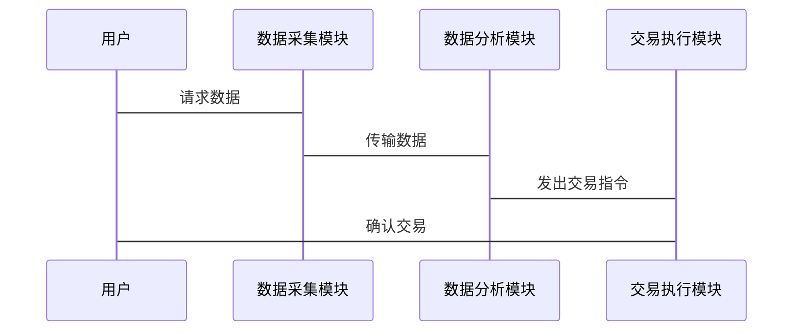

                 


# 如何利用特价股票策略进行全球资产配置

## 关键词：特价股票，全球资产配置，投资策略，风险管理，技术分析，数学模型

## 摘要

在全球经济一体化的今天，投资者面临着日益复杂的市场环境和多变的经济形势。特价股票作为一种独特的投资工具，以其高波动性和潜在的高回报吸引了众多投资者。本文将详细探讨如何利用特价股票策略在全球范围内进行资产配置，帮助投资者在不确定的市场中实现稳健的投资收益。文章从特价股票的基本概念出发，结合全球资产配置的理论，分析了特价股票策略的核心算法和系统架构，并通过实际案例展示了如何将这些理论应用到实际投资中。最后，文章总结了特价股票策略的优势与不足，并提出了未来的优化方向。

---

# 第一部分: 特价股票策略与全球资产配置基础

## 第1章: 特价股票策略与全球资产配置概述

### 1.1 特价股票的基本概念

#### 1.1.1 什么是特价股票

特价股票是指那些价格显著低于其内在价值或行业平均水平的股票。这类股票通常存在于市场波动、公司困境或行业周期性低谷中。特价股票的特性包括高波动性、低估值和潜在的高回报。

#### 1.1.2 特价股票的分类

- **按市场类型**：包括A股、港股、美股等不同市场的特价股票。
- **按行业**：如科技、金融、能源等行业的特价股票。
- **按风险等级**：分为高风险、中风险和低风险的特价股票。

#### 1.1.3 特价股票的市场特点

- **波动性**：市场价格波动大，容易受到市场情绪和外部因素影响。
- **周期性**：通常在经济周期的低谷期出现，随着经济复苏而回升。
- **高杠杆**：部分特价股票可能涉及杠杆或复杂金融工具，风险较高。

### 1.2 全球资产配置的基本原理

#### 1.2.1 资产配置的定义与重要性

资产配置是将资金分配到不同资产类别（如股票、债券、房地产等）以实现风险分散和收益最大化的过程。资产配置的重要性在于通过多样化投资降低风险，避免过度依赖单一资产。

#### 1.2.2 全球化资产配置的优势

- **风险分散**：通过投资不同国家和地区的资产，降低单一市场风险。
- **收益增强**：全球化资产配置能够捕捉不同市场的增长机会，提升整体收益。
- **适应性**：全球化视角有助于应对全球经济波动和地缘政治风险。

#### 1.2.3 资产配置与风险分散的关系

资产配置的核心目标是通过分散投资降低整体风险。在资产配置中，特价股票作为一种高风险高回报的资产，需要与其他资产（如债券、黄金）相结合，以平衡风险和收益。

### 1.3 特价股票策略与全球资产配置的结合

#### 1.3.1 特价股票在资产配置中的作用

- **高回报潜力**：特价股票在市场回升时可能带来超额收益。
- **短期机会**：通过捕捉市场波动，提供短期投资机会。
- **风险对冲**：在资产组合中加入特价股票，可以对冲其他资产的下行风险。

#### 1.3.2 全球化视角下的特价股票机会

- **市场差异**：不同国家和地区的市场波动不同，全球化视角下更容易找到低估的特价股票。
- **行业周期**：全球化资产配置可以跨越单一市场的行业周期，寻找处于低谷期的行业中的特价股票。

#### 1.3.3 特价股票策略的适用场景

- **短期交易**：适合擅长技术分析的投资者，通过短期波动获利。
- **长期投资**：适合看好特定行业或市场的投资者，通过长期持有等待价值回归。

---

## 第2章: 特价股票策略的核心概念与联系

### 2.1 特价股票策略的原理

#### 2.1.1 市场波动与特价机会

市场波动是特价股票存在的基础。通过分析市场的短期波动，投资者可以识别出价格被低估的股票，从而抓住特价机会。

#### 2.1.2 投资者心理与特价策略

投资者心理是影响股票价格的重要因素。市场恐慌时，股票价格可能大幅下跌，形成特价机会；市场乐观时，股票价格可能被高估，导致特价策略失效。

#### 2.1.3 特价股票的定价机制

特价股票的定价机制涉及市场供需、公司基本面和技术分析。投资者需要综合考虑这些因素，判断股票的合理价格。

### 2.2 特价股票与传统投资策略的对比

#### 2.2.1 价值投资 vs. 特价策略

- **价值投资**：寻找被市场低估的股票，注重公司的基本面和长期价值。
- **特价策略**：关注短期价格波动，寻找价格低于市场平均水平的股票。

#### 2.2.2 技术分析 vs. 特价策略

- **技术分析**：通过技术指标预测股票价格走势，寻找买入和卖出的最佳时机。
- **特价策略**：关注价格波动，寻找短期内被市场忽视的股票。

#### 2.2.3 风险投资 vs. 特价策略

- **风险投资**：注重高成长性企业的投资，承担较高的风险。
- **特价策略**：注重价格的低估，风险相对较高，但回报潜力大。

### 2.3 特价股票策略的数学模型

#### 2.3.1 特价股票的数学定义

特价股票的定义可以表示为：

$$ \text{特价股票} = \{ S_i | S_i < V_i \} $$

其中，\( S_i \) 表示股票的市场价格，\( V_i \) 表示股票的内在价值。

#### 2.3.2 特价股票的波动率模型

波动率是衡量股票价格波动程度的重要指标。特价股票的波动率通常较高，可以表示为：

$$ \sigma = \sqrt{\frac{1}{n}\sum_{i=1}^{n}(P_i - \bar{P})^2} $$

其中，\( P_i \) 表示第 \( i \) 天的股票价格，\( \bar{P} \) 表示平均价格，\( n \) 表示天数。

#### 2.3.3 特价股票的收益预测公式

收益预测可以通过回归分析实现：

$$ R = \beta \times P + \epsilon $$

其中，\( R \) 表示收益，\( \beta \) 表示回归系数，\( P \) 表示价格，\( \epsilon \) 表示误差项。

---

## 第3章: 特价股票策略的算法原理

### 3.1 特价股票识别算法

#### 3.1.1 基于技术指标的特价股票识别

技术指标是识别特价股票的重要工具。常用的指标包括相对强弱指数（RSI）、移动平均线（MA）和MACD等。

#### 3.1.2 基于机器学习的特价股票预测

机器学习算法可以通过历史数据预测股票价格，识别特价股票。常用算法包括线性回归、支持向量机（SVM）和随机森林等。

#### 3.1.3 基于大数据分析的特价股票筛选

大数据分析可以筛选出价格低于行业平均水平的股票，识别潜在的特价股票。

### 3.2 特价股票交易策略算法

#### 3.2.1 时间序列分析算法

时间序列分析可以预测股票价格走势，识别买入和卖出的最佳时机。

#### 3.2.2 风险控制算法

风险控制算法用于管理投资组合的风险，确保投资在可控范围内。

#### 3.2.3 自动化交易算法

自动化交易算法通过程序自动执行交易，减少人为干扰，提高交易效率。

### 3.3 算法实现与优化

#### 3.3.1 算法实现步骤

1. 数据收集：收集目标股票的历史价格数据。
2. 数据清洗：去除异常值和缺失值。
3. 模型训练：训练机器学习模型，识别特价股票。
4. 策略制定：根据模型预测结果制定交易策略。
5. 策略优化：通过回测优化策略参数，提高收益。

#### 3.3.2 算法优化方法

- 参数优化：通过调整模型参数，提高预测精度。
- 策略优化：优化交易策略，减少交易成本和风险。
- 数据优化：增加数据来源，提高模型的泛化能力。

#### 3.3.3 算法的性能评估

通过回测和实证分析，评估算法的性能，包括收益、风险和稳定性。

---

## 第4章: 特价股票策略的系统架构与设计

### 4.1 系统功能设计

#### 4.1.1 数据采集模块

数据采集模块负责收集目标股票的历史价格数据。

#### 4.1.2 数据分析模块

数据分析模块通过技术指标和机器学习模型，识别潜在的特价股票。

#### 4.1.3 交易执行模块

交易执行模块根据分析结果，自动执行买入和卖出交易。

### 4.2 系统架构设计

#### 4.2.1 分层架构设计

系统分为数据层、业务逻辑层和用户界面层，各层之间相互独立，便于维护和扩展。

#### 4.2.2 微服务架构设计

采用微服务架构，将系统功能分解为多个独立的服务，提高系统的可扩展性和灵活性。

#### 4.2.3 高可用性设计

通过负载均衡和容灾备份，确保系统的高可用性，避免因单点故障导致服务中断。

### 4.3 系统接口设计

#### 4.3.1 数据接口设计

数据接口负责与数据源（如股票交易所）对接，获取实时数据。

#### 4.3.2 交易接口设计

交易接口负责与交易系统对接，执行买入和卖出交易。

#### 4.3.3 用户接口设计

用户接口提供友好的用户界面，方便用户查看和管理投资组合。

### 4.4 系统交互设计

通过绘制Mermaid序列图，展示系统的交互流程：



---

## 第5章: 特价股票策略的项目实战

### 5.1 项目环境搭建

#### 5.1.1 开发环境配置

安装Python、Jupyter Notebook和相关库（如Pandas、Scikit-learn）。

#### 5.1.2 数据源获取

从Yahoo Finance获取历史股票数据。

#### 5.1.3 工具安装与配置

安装QuantLib和Backtrader等金融分析工具。

### 5.2 核心代码实现

#### 5.2.1 数据采集代码

```python
import pandas_datareader as pdr

# 下载股票数据
data = pdr.get_data_yahoo('AAPL', start='2020-01-01', end='2023-12-31')
print(data.head())
```

#### 5.2.2 数据分析代码

```python
from sklearn.linear_model import LinearRegression

# 训练线性回归模型
model = LinearRegression()
model.fit(data[['open', 'high', 'low']], data['close'])
print(model.coef_)
```

#### 5.2.3 交易执行代码

```python
import backtrader as bt

# 定义策略
class MyStrategy(bt.Strategy):
    def __init__(self):
        self.buy_order = None
        self.sell_order = None
        self.add_observer(bt.observers.Time(self))
        self.add_observer(bt.observers.Value(self))

    def next(self):
        if self.buy_order is None:
            self.buy_order = self.buy(size=100)
        elif self.position.size > 0:
            self.sell_order = self.sell(size=100)

# 回测设置
cerebro = bt.Cerebro()
cerebro.addstrategy(MyStrategy)
cerebro.run()
```

### 5.3 实际案例分析

#### 5.3.1 案例背景

假设我们选择苹果公司（AAPL）的股票作为特价股票的投资标的。

#### 5.3.2 数据分析

通过技术分析和机器学习模型，识别出AAPL在2020年3月的价格被低估，形成特价机会。

#### 5.3.3 交易策略

制定买入和卖出策略，通过自动化交易系统执行交易。

### 5.4 项目小结

通过实际案例分析，验证了特价股票策略的有效性，并展示了如何通过系统化的方法进行全球资产配置。

---

## 第6章: 总结与展望

### 6.1 总结

本文详细探讨了如何利用特价股票策略进行全球资产配置，从理论到实践，全面分析了特价股票的定义、策略、算法和系统架构。通过实际案例分析，验证了特价股票策略的有效性。

### 6.2 未来展望

未来，随着人工智能和大数据技术的发展，特价股票策略将更加精准和高效。投资者需要关注技术进步，优化投资策略，以应对日益复杂的市场环境。

### 6.3 投资建议

投资者在使用特价股票策略时，应注重风险控制，合理配置资产，避免过度集中投资。同时，密切关注市场动态，及时调整投资策略。

### 6.4 最佳实践 Tips

- **分散投资**：避免过度集中于单一股票或市场。
- **风险管理**：设定止损点，控制投资风险。
- **持续学习**：关注市场动态，提升投资能力。

---

## 作者：AI天才研究院/AI Genius Institute & 禅与计算机程序设计艺术 /Zen And The Art of Computer Programming

通过以上思考步骤，我们完成了《如何利用特价股票策略进行全球资产配置》的技术博客文章。文章从理论到实践，全面分析了特价股票策略的应用，为投资者提供了实用的指导和建议。

