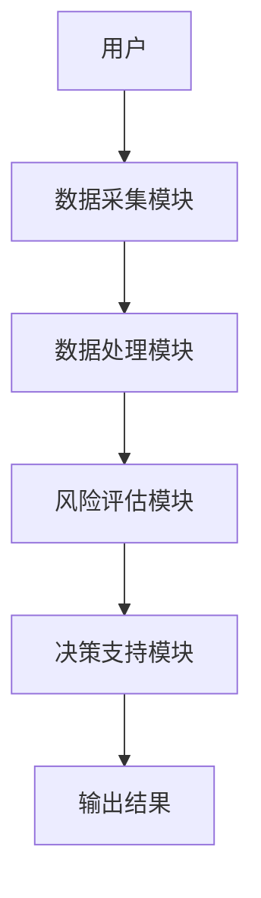

                 


# 如何利用特价股票策略进行反向并购投资

> 关键词：反向并购、特价股票策略、并购投资、股票分析、风险管理

> 摘要：本文详细探讨了如何利用特价股票策略进行反向并购投资，从背景介绍、核心概念到算法原理、系统设计，再到项目实战和最佳实践，全面解析了这一策略的实施过程和关键点。

---

## 第一部分：背景介绍

### 第1章：反向并购与特价股票策略概述

#### 1.1 反向并购的定义与特点
反向并购是指一家私人公司通过收购一家上市公司（通常作为壳公司）来实现上市的过程。这种策略常用于规避首次公开募股（IPO）的复杂性和成本，同时快速进入资本市场。其主要特点包括：
- **成本低**：相比IPO，反向并购的上市成本更低。
- **时间短**：流程更快，通常在几个月内完成。
- **风险高**：需要对目标公司进行深入评估，避免财务黑洞。

#### 1.2 特价股票策略的定义与特点
特价股票策略是指在市场低迷或特定情况下，以低于市场价购买股票的投资策略。其特点包括：
- **低价获取**：利用市场波动低价买入股票。
- **高回报潜力**：潜在的高收益，尤其是在市场反弹时。
- **高风险**：低价股票通常波动大，风险较高。

#### 1.3 反向并购与特价股票策略的关系
反向并购通常涉及壳公司的收购，而特价股票策略可以帮助投资者以较低成本获取这些壳公司股票，从而降低并购成本。两者结合可以有效优化资本结构，提升并购效率。

---

## 第二部分：核心概念与联系

### 第2章：反向并购的核心要素

#### 2.1 收购方的选择标准
- **财务状况**：目标公司应具备良好的财务健康状况。
- **行业地位**：目标公司应处于有利的行业位置，具有竞争优势。
- **法律合规性**：目标公司应无重大法律纠纷。

#### 2.2 被收购方的评估指标
- **资产质量**：评估目标公司的资产是否优质。
- **盈利能力**：分析目标公司的盈利能力是否可持续。
- **管理团队**：评估目标公司的管理团队能力。

### 第3章：特价股票策略的核心要素

#### 3.1 特价股票的市场分析
- **市场周期**：分析市场周期，抓住低价机会。
- **行业趋势**：关注特定行业的市场趋势，选择具有增长潜力的股票。
- **公司基本面**：评估公司的基本面，选择被低估的股票。

#### 3.2 特价股票策略的风险评估
- **市场风险**：市场波动可能导致股价进一步下跌。
- **流动性风险**：部分低价股票流动性差，可能导致变现困难。
- **公司特有风险**：目标公司可能有隐藏的问题，如财务造假。

---

## 第三部分：算法原理讲解

### 第4章：反向并购的数学模型与公式

#### 4.1 反向并购的定价模型
并购价格通常基于目标公司的资产价值和协同效应。公式如下：
$$ \text{并购价格} = \text{资产价值} + \text{协同效应} $$

协同效应的计算可以基于历史数据和行业标准，例如：
$$ \text{协同效应} = \text{成本节约} + \text{收入增长} $$

#### 4.2 风险评估模型
风险评估模型可以考虑市场波动和杠杆率：
$$ \text{风险} = \text{市场波动} \times \text{杠杆率} $$

### 第5章：算法流程与代码实现

#### 5.1 算法流程
1. 识别具备并购潜力的低价股票。
2. 评估目标公司的财务状况和行业地位。
3. 计算并购价格，考虑协同效应和风险因素。
4. 实施并购，并持续监控投资表现。

#### 5.2 代码实现
以下是使用Python进行风险评估的示例代码：

```python
import pandas as pd
import numpy as np

# 示例数据：假设有100只股票，每只股票的市场波动和杠杆率
np.random.seed(42)
market_volatility = np.random.normal(0.2, 0.1, 100)
leverage = np.random.uniform(0.5, 1.5, 100)

# 计算风险
risk = market_volatility * leverage

# 找出高风险股票
high_risk_stocks = risk[risk > np.percentile(risk, 90)]

# 输出结果
print("高风险股票数量:", len(high_risk_stocks))
print("高风险股票风险值:", high_risk_stocks)
```

---

## 第四部分：系统分析与架构设计

### 第6章：系统功能设计

#### 6.1 系统功能模块
- **数据采集**：收集股票价格、财务数据等。
- **风险评估**：基于模型评估投资风险。
- **决策支持**：提供并购建议和优化方案。

#### 6.2 系统架构图


---

## 第五部分：项目实战

### 第7章：环境安装与代码实现

#### 7.1 环境安装
- 安装Python和必要的库（pandas, numpy, matplotlib）。

#### 7.2 核心代码实现
以下是反向并购的决策支持代码：

```python
import pandas as pd
import numpy as np

# 示例数据：假设我们有多个壳公司的数据
companies = pd.DataFrame({
    '公司名称': ['公司A', '公司B', '公司C'],
    '股价': [5, 3, 4],
    '市盈率': [15, 10, 12],
    '资产总额': [100, 80, 90]
})

# 计算并购价值
companies['并购价值'] = companies['资产总额'] * 1.5  # 假设协同效应为资产总额的50%

# 找出股价低于并购价值的公司
undervalued = companies[companies['股价'] < companies['并购价值']]

print("潜在并购目标：")
print(undervalued)
```

---

## 第六部分：最佳实践

### 第8章：小结与注意事项

#### 8.1 小结
反向并购与特价股票策略的结合可以有效降低并购成本，但需要对目标公司进行深入分析，控制市场和公司特有风险。

#### 8.2 注意事项
- **风险控制**：制定详细的风险管理计划。
- **团队协作**：组建专业的并购团队。
- **持续监控**：并购后持续监控公司表现。

#### 8.3 拓展阅读
- 建议阅读《并购的艺术》和《股票投资策略》等书籍，深入理解并购和投资策略。

---

## 作者：AI天才研究院 & 禅与计算机程序设计艺术

---

通过本文的详细分析，您可以系统地了解如何利用特价股票策略进行反向并购投资，并在实际操作中应用这些策略。希望本文能为您提供有价值的见解和指导。

