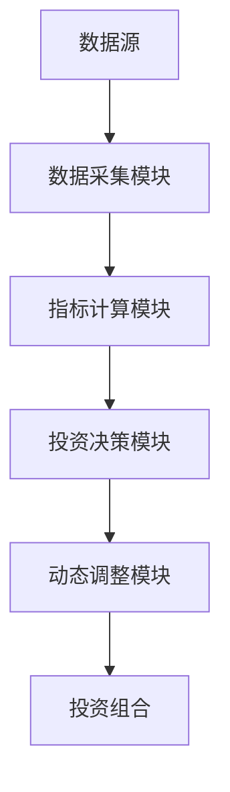

                 


# 如何利用特价股票策略进行反周期投资

---

## 关键词：特价股票，反周期投资，投资策略，股票分析，经济周期

---

## 摘要：  
本文详细探讨了如何利用特价股票策略进行反周期投资。首先，我们介绍了特价股票和反周期投资的基本概念，分析了它们在经济周期中的作用。接着，我们从数学模型和算法的角度，详细讲解了特价股票的识别方法和反周期投资的策略制定。最后，我们通过实际案例，展示了如何将这些理论应用于实践，并总结了投资中的注意事项和最佳实践。本文旨在为投资者提供一套系统化的反周期投资方法，帮助他们在经济低谷中抓住投资机会，实现稳健收益。

---

## 第一部分：特价股票与反周期投资的背景

### 第1章：特价股票的基本概念

#### 1.1 什么是特价股票

特价股票是指市场价格低于其内在价值的股票。这些股票通常被市场低估，具有较大的上涨潜力。判断一只股票是否为特价股票，通常需要结合市盈率（P/E）、市净率（P/B）等指标进行分析。

- **市盈率（P/E）**：$$ P/E = \frac{Price}{Earnings} $$
  - 当P/E低于行业平均水平时，股票可能被低估。
- **市净率（P/B）**：$$ P/B = \frac{Price}{Book\ Value} $$
  - 当P/B低于1时，股票通常被认为是特价股票。

#### 1.2 反周期投资的核心理念

反周期投资是指在经济周期低谷时进行投资，以期在周期回升时获得超额收益。这种策略的核心在于识别周期性行业的低估股票，并在市场底部布局。

- **经济周期波动对股价的影响**：周期性行业的股票价格通常在经济繁荣时上涨，在经济衰退时下跌。反周期投资正是利用了这一波动规律。

### 第2章：反周期投资的策略制定

#### 2.1 特价股票与经济周期的关系

- 在经济低谷时，许多周期性行业的股票会被市场低估，成为特价股票。
- 在经济复苏时，这些股票通常会反弹，为投资者带来丰厚的收益。

#### 2.2 特价股票的识别与筛选

- **第一步：数据采集**：收集目标行业股票的历史数据，包括市盈率、市净率、股息率等指标。
- **第二步：指标计算**：通过数学模型计算股票的内在价值，判断其是否为特价股票。
- **第三步：筛选与排序**：根据筛选标准，对股票进行排序，选择最具投资价值的股票。

---

## 第二部分：特价股票策略的数学模型与算法

### 第3章：特价股票识别的数学模型

#### 3.1 基于市盈率的特价股票筛选模型

- **模型公式**：$$ P/E_{target} = \frac{Price}{Earnings} $$
- **筛选标准**：选择P/E低于行业平均水平的股票。
- **优化改进**：结合市净率和股息率进行多维度筛选。

#### 3.2 基于市净率的特价股票筛选模型

- **模型公式**：$$ P/B_{target} = \frac{Price}{Book\ Value} $$
- **筛选标准**：选择P/B低于1的股票。
- **优化改进**：考虑ROE（净资产收益率）等其他指标，进一步优化筛选标准。

### 第4章：反周期投资的算法实现

#### 4.1 特价股票识别的算法流程

- **数据采集**：从金融数据库中获取目标股票的历史数据。
- **指标计算**：计算P/E、P/B等指标，判断股票是否为特价股票。
- **筛选与排序**：根据筛选标准，对股票进行排序，选择最具投资价值的股票。

#### 4.2 基于经济周期的动态调整算法

- **经济周期指标**：选取GDP增长率、失业率等宏观经济指标，判断当前经济所处的周期阶段。
- **动态调整策略**：根据经济周期的变化，动态调整投资组合中特价股票的权重。

---

## 第三部分：系统分析与架构设计

### 第5章：投资决策系统的架构设计

#### 5.1 系统功能设计

- **数据采集模块**：负责从金融数据库中获取股票数据。
- **指标计算模块**：计算P/E、P/B等指标，判断股票是否为特价股票。
- **投资决策模块**：根据筛选结果，制定投资策略。
- **动态调整模块**：根据经济周期的变化，动态调整投资组合。

#### 5.2 系统架构设计



---

## 第四部分：项目实战

### 第6章：特价股票策略的实战应用

#### 6.1 实战案例：2020年全球经济衰退时期的反周期投资

- **背景**：2020年全球经济受到新冠疫情的影响，许多周期性行业的股票价格大幅下跌，提供了绝佳的特价股票投资机会。
- **筛选过程**：
  - 数据采集：收集2020年全球主要经济体的股票数据。
  - 指标计算：计算P/E、P/B等指标，筛选出具有投资价值的股票。
  - 投资决策：根据筛选结果，制定投资策略。
- **结果分析**：通过投资周期性行业的特价股票，在经济复苏过程中获得了超额收益。

#### 6.2 代码实现

```python
import pandas as pd
import numpy as np

# 数据采集
data = pd.read_csv('stock_data.csv')

# 计算市盈率和市净率
data['P/E'] = data['Price'] / data['Earnings']
data['P/B'] = data['Price'] / data['Book Value']

# 筛选特价股票
data = data[(data['P/E'] < data['P/E'].mean()) & (data['P/B'] < 1)]
```

---

## 第五部分：总结与注意事项

### 第7章：总结与最佳实践

#### 7.1 投资关键点

- **时机选择**：在经济低谷时，及时识别特价股票，布局反周期投资。
- **风险管理**：分散投资，避免过度集中于单一行业或股票。
- **持续学习**：关注宏观经济指标，及时调整投资策略。

#### 7.2 注意事项

- **避免盲目跟风**：在市场恐慌时，要冷静分析，避免情绪化投资。
- **关注行业周期**：选择周期性行业中的龙头企业，降低投资风险。
- **定期复盘**：定期评估投资组合的表现，及时调整策略。

#### 7.3 拓展阅读

- 《价值投资实战入门》
- 《股票投资的真谛》
- 《投资学原理》

---

## 作者：AI天才研究院 & 禅与计算机程序设计艺术

---

这篇文章通过系统的分析和详细的讲解，为投资者提供了一套基于特价股票策略的反周期投资方法。希望对您在投资领域有所帮助！

