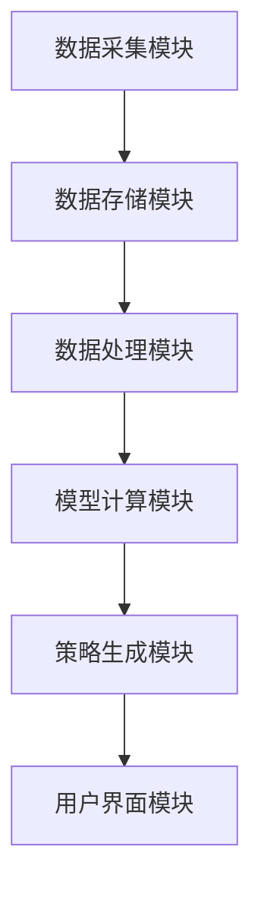
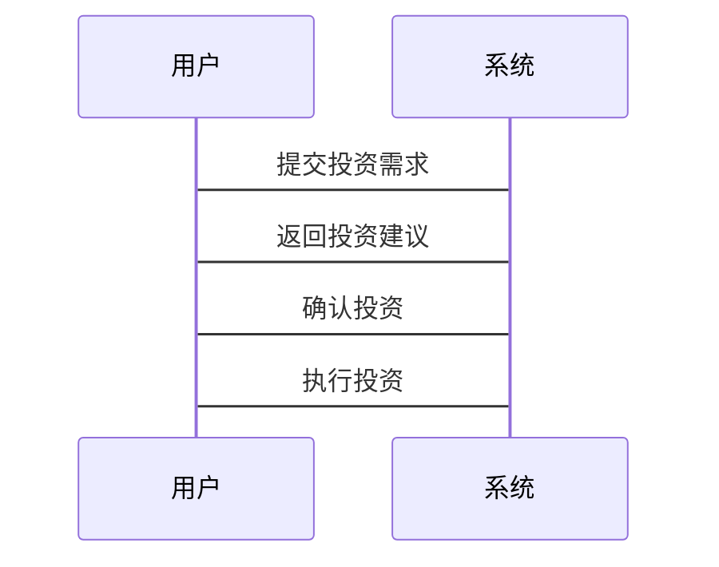

                 


# 如何利用特价股票策略进行可转债投资

## 关键词：可转债，特价股票，投资策略，风险管理，数学模型

## 摘要：本文将深入探讨如何利用特价股票策略进行可转债投资。首先，我们将介绍特价股票和可转债的基本概念，分析它们的特点和结合方式。然后，我们将详细讲解可转债的定价模型和转股条件，探讨特价股票策略在可转债投资中的应用。接下来，我们将分析风险管理和投资组合优化的方法，设计一个基于特价股票策略的可转债投资系统。最后，我们将通过实际案例分析，总结最佳实践和注意事项。

---

# 第一部分: 特价股票策略与可转债投资基础

## 第1章: 特价股票策略与可转债投资概述

### 1.1 特价股票策略的基本概念

#### 1.1.1 特价股票的定义与特点

特价股票是指在特定市场条件下，价格被低估的股票。其特点包括：

- **低估值**：通常市盈率、市净率等指标低于行业平均水平。
- **高波动性**：价格波动较大，存在快速上涨的可能性。
- **风险较高**：由于价格较低，可能存在较高的下行风险。

#### 1.1.2 特价股票策略的应用场景

- **市场低迷期**：在市场下跌时，低价股票可能具有更大的反弹潜力。
- **价值投资**：寻找被市场忽视的优质公司股票。
- **短期投机**：通过短期价格波动获利。

#### 1.1.3 特价股票与普通股票的区别

| 特性 | 特价股票 | 普通股票 |
|------|----------|----------|
| 价格 | 通常较低 | 价格较高 |
| 估值 | 低估值   | 市场估值 |
| 风险 | 风险较高  | 风险适中 |
| 收益 | 潜在高收益 | 收益稳定 |

### 1.2 可转债的基本概念与特点

#### 1.2.1 可转债的定义

可转债（Convertible Bond）是一种可以在一定条件下转换为公司股票的债券。它结合了债券的固定收益和股票的潜在收益。

#### 1.2.2 可转债的核心属性

- **债券部分**：提供固定的利息收入和本金偿还保证。
- **转股权部分**：允许投资者在特定条件下将债券转换为公司股票。

#### 1.2.3 可转债与普通债券的区别

| 特性 | 可转债 | 普通债券 |
|------|--------|----------|
| 转股权 | 有     | 无       |
| 风险 | 较低    | 较高      |
| 收益 | 双重收益 | 单一收益 |

### 1.3 特价股票策略与可转债投资的结合

#### 1.3.1 特价股票策略在可转债投资中的作用

通过寻找被低估的股票，投资者可以找到具有较高转股价值的可转债，从而在转股时获得更高的收益。

#### 1.3.2 可转债作为投资工具的优势

- **风险较低**：债券部分提供了本金和利息的保障。
- **收益潜力大**：转股后可能获得股票上涨的收益。
- **灵活性高**：投资者可以根据市场情况选择是否转股。

#### 1.3.3 特价股票策略与可转债投资的结合方式

1. **选择转股价值高的可转债**：寻找那些转股后能够获得超额收益的可转债。
2. **利用特价股票的低估值优势**：在市场低迷时，购买具有较高转股价值的可转债，等待市场回升时转股获利。

---

## 第2章: 可转债的定价模型与转股条件

### 2.1 可转债的定价原理

#### 2.1.1 可转债的内在价值

可转债的内在价值包括债券部分的现值和转股权部分的现值。

#### 2.1.2 市场价格与内在价值的关系

市场价格通常围绕内在价值波动。

#### 2.1.3 影响可转债价格的主要因素

- **债券的票面利率**：影响债券部分的价值。
- **转股价格**：影响转股权部分的价值。
- **市场利率**：影响债券的现值。
- **股票价格**：影响转股权的价值。

#### 2.1.4 可转债定价的数学模型

使用BS模型对可转债进行定价：

$$ C = S_0 e^{-rT} N(d_1) + K e^{-rT} N(d_2) $$

其中：
- \( S_0 \)：当前股票价格
- \( r \)：无风险利率
- \( T \)：期权到期时间
- \( K \)：行权价格
- \( N(d_1) \) 和 \( N(d_2) \)：标准正态分布的累积分布函数

### 2.2 可转债的转股条件

#### 2.2.1 转股价格的计算方法

转股价格通常基于债券发行时的股票价格和债券面值计算。

#### 2.2.2 转股期限与转股比例

- **转股期限**：债券持有者可以在一定时间内选择转股。
- **转股比例**：通常为1:1，即每单位债券可以转换为一定数量的股票。

#### 2.2.3 转股条件对投资策略的影响

- **转股价格低于当前股价**：有利可转股获利。
- **转股价格高于当前股价**：不利，转股可能亏损。

---

## 第3章: 特价股票策略在可转债投资中的应用

### 3.1 特价股票策略的选择标准

#### 3.1.1 选择特价股票的指标

- **市盈率（P/E）**：低于行业平均水平。
- **市净率（P/B）**：低于行业平均水平。
- **股息率**：高股息率可能意味着低估。

#### 3.1.2 特价股票的市场分析方法

- **技术分析**：通过K线图、均线等技术指标判断股价走势。
- **基本面分析**：分析公司的财务报表、行业地位等。

#### 3.1.3 特价股票的估值方法

- **内在估值法**：计算股票的内在价值，与市场价格比较。
- **相对估值法**：比较股票与行业平均水平的估值指标。

### 3.2 可转债投资的策略模型

#### 3.2.1 基于特价股票的可转债投资模型

1. **筛选可转债标的**：选择转股后能够获得超额收益的可转债。
2. **评估转股价值**：计算转股后的潜在收益。
3. **确定投资时机**：在市场低迷时买入，市场回升时转股。

#### 3.2.2 模型的构建与优化

- **构建模型**：将特价股票策略与可转债的转股价值相结合。
- **优化模型**：根据市场变化调整模型参数。

#### 3.2.3 模型的验证与评估

- **回测分析**：通过历史数据验证模型的有效性。
- **风险评估**：分析模型在不同市场环境下的表现。

### 3.3 本章小结

通过利用特价股票策略，投资者可以在可转债投资中获得更高的收益潜力。关键在于选择具有较高转股价值的可转债，并在合适的时机进行投资和转股。

---

## 第4章: 可转债定价模型的数学分析

### 4.1 可转债定价的BS模型

#### 4.1.1 BS模型的原理

BS模型用于期权定价，也可以应用于可转债的定价。

#### 4.1.2 BS模型的数学公式

$$ C = S_0 e^{-rT} N(d_1) + K e^{-rT} N(d_2) $$

其中：
- \( d_1 = \frac{\ln(S_0/K) + (r + \sigma^2/2)T}{\sigma \sqrt{T}} \)
- \( d_2 = d_1 - \sigma \sqrt{T} \)
- \( N(d) \)：标准正态分布的累积分布函数

#### 4.1.3 BS模型的应用与局限性

- **应用**：适用于标准化的期权和可转债定价。
- **局限性**：假设波动率恒定，实际市场中波动率可能变化。

### 4.2 蒙特卡洛模拟在可转债定价中的应用

#### 4.2.1 蒙特卡洛模拟的基本原理

通过模拟股票价格的随机波动，计算可转债的期望值。

#### 4.2.2 蒙特卡洛模拟的实现步骤

1. **设定参数**：包括初始股价、波动率、时间跨度等。
2. **模拟股价路径**：使用随机数生成股价的可能路径。
3. **计算期权价值**：对于每条路径，计算可转债的期权价值。
4. **求期望值**：取所有模拟结果的平均值作为期权的期望值。

#### 4.2.3 蒙特卡洛模拟的结果分析

- **平均值**：作为可转债的定价参考。
- **分布分析**：分析结果的波动性和风险。

### 4.3 本章小结

通过数学模型，我们可以更准确地定价可转债，从而为投资决策提供依据。

---

## 第5章: 风险管理与投资组合优化

### 5.1 可转债投资中的风险管理

#### 5.1.1 市场风险的识别与评估

- **市场波动**：股价波动可能影响可转债的价格。
- **利率风险**：利率上升可能影响债券部分的价值。

#### 5.1.2 利率风险的管理策略

- **分散投资**：通过投资不同期限的债券来分散风险。
- **对冲策略**：利用衍生品对冲利率风险。

#### 5.1.3 转股失败的风险应对

- **设定止损点**：在转股价格大幅下跌时及时止损。
- **保持流动性**：确保在需要时可以快速变现。

### 5.2 基于特价股票策略的投资组合优化

#### 5.2.1 投资组合优化的目标

- **最大化收益**：在风险可控的前提下，追求最高的投资回报。
- **最小化风险**：通过分散投资降低整体风险。

#### 5.2.2 马科维茨有效前沿模型的应用

使用马科维茨有效前沿模型，找到最优的投资组合。

#### 5.2.3 投资组合的动态调整策略

- **定期评估**：根据市场变化调整投资组合。
- **及时止损**：当市场出现大幅波动时，及时调整仓位。

### 5.3 本章小结

通过科学的风险管理方法和投资组合优化策略，可以有效降低投资风险，提高投资收益。

---

## 第6章: 系统分析与架构设计方案

### 6.1 系统需求分析

#### 6.1.1 问题场景介绍

投资者需要一个系统来辅助进行可转债投资决策。

#### 6.1.2 项目目标与范围

- **目标**：开发一个基于特价股票策略的可转债投资系统。
- **范围**：包括数据收集、模型构建、策略执行等功能。

#### 6.1.3 系统功能需求

- **数据采集**：收集股票和可转债的相关数据。
- **模型构建**：实现可转债定价模型和投资策略模型。
- **策略执行**：根据模型结果生成投资建议。

### 6.2 系统架构设计

#### 6.2.1 系统功能设计

- **数据模块**：负责数据的采集和存储。
- **模型模块**：负责模型的计算和分析。
- **策略模块**：负责投资策略的制定和执行。
- **用户界面**：供用户查看和操作。

#### 6.2.2 系统架构图



### 6.3 系统接口设计

- **数据接口**：与数据源（如股票交易所）对接。
- **用户接口**：提供给投资者使用的界面。

### 6.4 系统交互流程图



### 6.5 本章小结

通过系统化的架构设计，可以提高可转债投资的效率和准确性。

---

## 第7章: 项目实战与案例分析

### 7.1 环境安装与配置

- **工具安装**：安装必要的数据分析工具和编程环境。
- **数据源配置**：配置数据源接口。

### 7.2 核心代码实现

#### 7.2.1 数据采集代码

```python
import pandas as pd
import requests

def get_stock_data(ticker):
    url = f"https://api.example.com/stock/{ticker}"
    response = requests.get(url)
    data = response.json()
    return pd.DataFrame(data)
```

#### 7.2.2 可转债定价模型代码

```python
def calculate_convertible_value(S0, K, r, T, sigma):
    d1 = (np.log(S0/K) + (r + sigma**2/2)*T) / (sigma * np.sqrt(T))
    d2 = d1 - sigma * np.sqrt(T)
    N = norm.cdf(d1)
    N2 = norm.cdf(d2)
    value = S0 * np.exp(-r*T) * N + K * np.exp(-r*T) * N2
    return value
```

### 7.3 实际案例分析

#### 7.3.1 案例背景

假设当前市场上有一只可转债，转股价格为10元，债券面值为100元，票面利率为5%，剩余期限为5年。

#### 7.3.2 数据分析与策略执行

1. **数据采集**：收集相关股票的历史价格数据。
2. **模型计算**：使用BS模型计算可转债的理论价值。
3. **策略执行**：在市场低迷时买入可转债，市场回升时转股。

### 7.4 案例总结与经验教训

- **成功经验**：通过模型计算，准确预测了转股的最佳时机。
- **经验教训**：市场波动较大时，需要及时调整策略。

### 7.5 本章小结

通过实际案例分析，验证了特价股票策略在可转债投资中的有效性。

---

## 第8章: 最佳实践与总结

### 8.1 最佳实践

- **持续学习**：关注市场动态和新的投资策略。
- **风险控制**：在投资前制定详细的风控计划。
- **系统支持**：利用系统工具提高投资效率。

### 8.2 小结

本文详细介绍了如何利用特价股票策略进行可转债投资，从理论到实践，提供了全面的指导。

### 8.3 注意事项

- **市场风险**：投资需谨慎，市场波动可能带来损失。
- **策略调整**：根据市场变化及时调整投资策略。

### 8.4 拓展阅读

- **相关书籍**：《可转债投资策略》、《价值投资实战技巧》。
- **在线资源**：可转债投资论坛、专业投资网站。

---

## 作者：AI天才研究院/AI Genius Institute & 禅与计算机程序设计艺术/Zen And The Art of Computer Programming

---

**总结**：本文通过详细分析特价股票策略与可转债投资的结合，为投资者提供了科学的投资方法和实际操作指南。希望读者能够通过本文，掌握如何在可转债投资中利用特价股票策略，实现稳健的投资收益。

