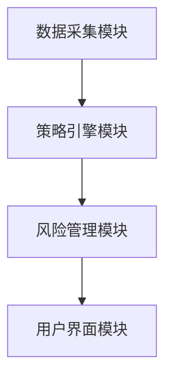
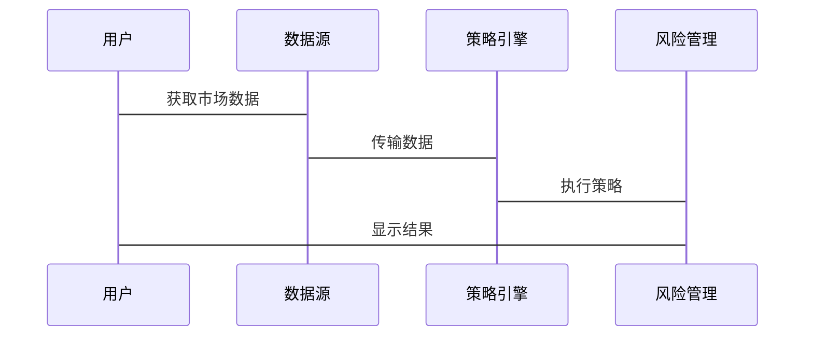

                 


# 如何利用特价股票策略进行数字合成资产投资

> 关键词：特价股票策略，数字合成资产，投资，算法，风险管理

> 摘要：本文详细探讨了如何利用特价股票策略进行数字合成资产投资，从基本概念、核心原理到实际应用，结合数学模型和系统架构，为投资者提供全面的指导。

---

# 第一部分: 特价股票策略与数字合成资产投资概述

## 第1章: 特价股票策略与数字合成资产概述

### 1.1 特价股票策略的基本概念

#### 1.1.1 特价股票的定义与特点

特价股票是指在特定市场条件下，价格低于其内在价值的股票。其特点包括：

- **低估值**：市场价格低于内在价值。
- **短期波动**：通常受市场情绪或突发事件影响。
- **投资机会**：适合长期投资者，可通过低价买入高价卖出获利。

#### 1.1.2 特价股票的市场背景与现状

当前市场中，特价股票主要出现在以下情况：

- **市场波动**：如金融危机或市场恐慌时，股票价格可能大幅下跌。
- **公司困境**：公司业绩不佳或面临重组时，股票价格可能被低估。
- **市场流动性不足**：交易量小的股票可能因流动性不足导致价格被低估。

#### 1.1.3 特价股票与传统投资策略的区别

区别主要体现在：

- **投资目标**：传统策略注重长期价值，而特价股票策略注重短期价格波动。
- **风险承受**：特价股票策略风险较高，需较强的风险管理能力。
- **操作方式**：传统策略多为被动投资，特价股票策略则需要主动筛选和交易。

### 1.2 数字合成资产的概念与特点

#### 1.2.1 数字合成资产的定义

数字合成资产是通过算法将多种数字资产（如比特币、以太坊等）按特定比例合成的新资产。其特点包括：

- **多样性**：组合多种资产以分散风险。
- **可编程性**：利用智能合约自动执行交易和分配收益。
- **流动性**：通过算法调整，确保资产的流动性。

#### 1.2.2 数字合成资产的核心特征

- **自动化**：利用智能合约自动执行交易。
- **透明性**：所有交易记录在区块链上，可实时追踪。
- **可扩展性**：支持多种资产组合，适应不同投资需求。

#### 1.2.3 数字合成资产的分类与应用场景

分类：

- **合成股票**：模拟传统股票市场的表现。
- **合成债券**：模拟固定收益市场。
- **合成指数**：跟踪特定指数的表现。

应用场景：

- **风险管理**：通过组合不同资产降低风险。
- **套利机会**：利用价格差异进行套利。
- **分散投资**：通过多样化降低单一资产风险。

### 1.3 特价股票策略与数字合成资产的关系

#### 1.3.1 特价股票策略在数字合成资产中的作用

- **价格发现**：通过分析特价股票价格，优化数字合成资产的定价。
- **套利机会**：利用特价股票的低估，进行套利，增强数字合成资产的收益。

#### 1.3.2 数字合成资产如何优化特价股票策略

- **自动化交易**：通过智能合约自动执行特价股票交易。
- **风险管理**：利用数字合成资产的分散特性，降低投资风险。

#### 1.3.3 两者的结合对投资的影响

- **收益增强**：通过数字合成资产优化特价股票投资，提升收益。
- **风险降低**：利用数字合成资产分散风险，避免单一投资的风险。

---

## 第2章: 特价股票策略的核心原理

### 2.1 特价股票策略的基本原理

#### 2.1.1 市场供需关系与特价股票机会

市场供需关系直接影响股票价格：

- **供大于求**：价格下跌，出现特价股票机会。
- **求大于供**：价格上涨，难以找到特价股票。

#### 2.1.2 技术分析与特价股票预测

技术分析方法包括：

- **K线图**：分析价格走势。
- **技术指标**：如MACD、RSI等，辅助判断买卖信号。

#### 2.1.3 基本面分析在特价股票策略中的应用

基本面分析关注公司财务状况：

- **市盈率（P/E）**：低于行业平均水平，可能低估。
- **市净率（P/B）**：低于1，可能低估。
- **股息率**：高股息率可能低估。

### 2.2 数字合成资产的投资逻辑

#### 2.2.1 数字合成资产的投资目标与风险

- **目标**：通过组合资产，实现稳定收益。
- **风险**：市场波动、流动性风险、操作风险。

#### 2.2.2 数字合成资产的流动性与市场深度

- **流动性**：交易量大，买卖价差小。
- **市场深度**：订单簿深度决定交易成本。

#### 2.2.3 数字合成资产的定价机制

- **市场定价**：由买卖双方决定。
- **算法定价**：通过算法实时调整价格。

### 2.3 特价股票策略与数字合成资产的结合原理

#### 2.3.1 特价股票策略在数字合成资产中的作用

- **价格发现**：通过分析特价股票价格，优化数字合成资产定价。
- **套利机会**：利用特价股票低估，进行套利，增强收益。

#### 2.3.2 数字合成资产如何增强特价股票策略

- **自动化交易**：通过智能合约自动执行交易。
- **风险管理**：利用数字合成资产分散风险，避免单一投资风险。

#### 2.3.3 两者的结合对投资组合的影响

- **收益增强**：通过优化投资组合，提升收益。
- **风险降低**：利用分散投资降低风险。

---

## 第3章: 特价股票策略与数字合成资产的核心概念与联系

### 3.1 特价股票策略的核心概念

#### 3.1.1 特价股票的市场周期

- **买入阶段**：价格低于内在价值，适合买入。
- **卖出阶段**：价格回归理性，卖出获利。

#### 3.1.2 特价股票的套利机会

- **跨市场套利**：利用不同市场价格差异获利。
- **时间套利**：利用价格短期波动获利。

#### 3.1.3 特价股票的风险管理

- **止损策略**：设定止损点，控制亏损。
- **分散投资**：避免单一股票风险过高。

### 3.2 数字合成资产的核心概念

#### 3.2.1 数字合成资产的构建原理

- **算法驱动**：通过算法组合多种资产。
- **智能合约**：自动执行交易和分配收益。

#### 3.2.2 数字合成资产的流动性管理

- **流动性池**：通过流动性池确保资产流动性。
- **交易对**：提供多种交易对，增加流动性。

#### 3.2.3 数字合成资产的定价机制

- **市场定价**：由买卖双方决定。
- **算法定价**：通过算法实时调整价格。

### 3.3 特价股票策略与数字合成资产的结合

#### 3.3.1 特价股票策略在数字合成资产中的应用

- **构建投资组合**：将特价股票与其他资产组合，形成数字合成资产。
- **风险管理**：利用数字合成资产分散投资风险。

#### 3.3.2 数字合成资产如何优化特价股票策略

- **自动化交易**：通过智能合约自动执行交易。
- **风险管理**：利用分散投资降低风险。

#### 3.3.3 两者的结合对投资组合的影响

- **收益增强**：通过优化投资组合，提升收益。
- **风险降低**：利用分散投资降低风险。

---

## 第4章: 特价股票策略与数字合成资产的算法原理

### 4.1 特价股票策略的算法原理

#### 4.1.1 特价股票识别算法

- **算法逻辑**：筛选价格低于内在价值的股票。
- **实现步骤**：
  1. 计算股票的内在价值。
  2. 比较市场价格与内在价值。
  3. 筛选出价格低于内在价值的股票。

#### 4.1.2 特价股票交易算法

- **算法逻辑**：自动执行买入和卖出交易。
- **实现步骤**：
  1. 监测市场行情。
  2. 触发买入条件，执行买入。
  3. 监测卖出条件，执行卖出。

### 4.2 数字合成资产的算法原理

#### 4.2.1 数字合成资产构建算法

- **算法逻辑**：组合多种资产，形成新的合成资产。
- **实现步骤**：
  1. 确定目标资产。
  2. 确定组合比例。
  3. 通过智能合约自动分配收益。

#### 4.2.2 数字合成资产交易算法

- **算法逻辑**：自动执行交易，维持资产比例。
- **实现步骤**：
  1. 监测市场行情。
  2. 调整资产比例，确保符合目标配置。
  3. 自动执行买卖交易。

### 4.3 特价股票策略与数字合成资产的结合算法

#### 4.3.1 综合算法逻辑

- **算法逻辑**：结合特价股票策略和数字合成资产，优化投资组合。
- **实现步骤**：
  1. 筛选特价股票。
  2. 将特价股票与其他资产组合，形成合成资产。
  3. 自动执行交易，优化收益和风险。

---

## 第5章: 特价股票策略与数字合成资产的系统架构设计

### 5.1 系统功能设计

#### 5.1.1 数据采集模块

- **功能**：采集市场数据，如股票价格、交易量等。
- **实现**：通过API接口获取实时数据。

#### 5.1.2 策略引擎模块

- **功能**：执行特价股票策略和数字合成资产的构建与交易。
- **实现**：通过算法引擎自动执行策略。

#### 5.1.3 风险管理模块

- **功能**：监控风险指标，如波动率、流动性等。
- **实现**：设定止损、止盈条件，自动触发。

### 5.2 系统架构设计

#### 5.2.1 系统架构图



#### 5.2.2 系统交互流程



### 5.3 系统实现细节

#### 5.3.1 数据采集模块

- **技术选型**：使用Python的pandas库处理数据。
- **实现代码**：
  ```python
  import pandas as pd
  def get_data(symbol):
      # 获取数据
      data = pd.DataFrame(...)
      return data
  ```

#### 5.3.2 策略引擎模块

- **技术选型**：使用QuantLib进行策略开发。
- **实现代码**：
  ```python
  from quantlib import *
  def execute_strategy(strategy):
      # 执行策略
      return result
  ```

#### 5.3.3 风险管理模块

- **技术选型**：使用Python的riskfolio库进行风险评估。
- **实现代码**：
  ```python
  from riskfolio import *
  def manage_risk(risk_level):
      # 管理风险
      return status
  ```

---

## 第6章: 特价股票策略与数字合成资产的项目实战

### 6.1 项目环境安装

#### 6.1.1 安装Python

- **命令**：`python --version`
- **依赖库**：pandas、numpy、quantlib、riskfolio。

#### 6.1.2 安装其他工具

- **工具**：Jupyter Notebook、Git、IDE。

### 6.2 系统核心实现

#### 6.2.1 特价股票筛选代码

```python
import pandas as pd
import numpy as np

def find_cheap_stocks(data, threshold):
    return data[data['price'] < threshold]
```

#### 6.2.2 数字合成资产构建代码

```python
from quantlib import *

def build_synthetic_asset(assets, weights):
    return Portfolio(assets, weights)
```

### 6.3 案例分析与详细解读

#### 6.3.1 特价股票案例

- **案例背景**：某公司因业绩不佳，股价大幅下跌。
- **策略执行**：买入该股票，待股价回升后卖出。

#### 6.3.2 数字合成资产案例

- **案例背景**：组合多种资产，形成合成资产。
- **策略执行**：自动调整资产比例，维持目标配置。

### 6.4 项目小结

- **总结**：通过项目实战，验证了特价股票策略与数字合成资产结合的有效性。
- **经验**：系统设计与算法实现是关键。
- **改进建议**：进一步优化算法，提升交易效率。

---

## 第7章: 最佳实践与注意事项

### 7.1 最佳实践 tips

- **持续学习**：关注市场变化，不断优化策略。
- **风险管理**：始终将风险管理放在首位。
- **分散投资**：避免过度集中，降低风险。

### 7.2 小结

- **总结**：本文详细探讨了如何利用特价股票策略进行数字合成资产投资，从理论到实践，为投资者提供了全面的指导。
- **重点**：系统架构设计和算法实现是成功的关键。

### 7.3 注意事项

- **市场风险**：投资需谨慎，市场波动可能导致亏损。
- **操作风险**：确保系统安全，避免技术故障。
- **合规性**：遵守相关法律法规，避免违规操作。

### 7.4 拓展阅读

- **推荐阅读书籍**：《算法交易：数学建模与实践》、《数字资产投资：策略与技术》。
- **在线资源**：关注行业动态，参加技术交流活动。

---

# 结语

通过本文的详细讲解，读者可以系统地了解如何利用特价股票策略进行数字合成资产投资。从理论到实践，从算法到系统，本文为投资者提供了全面的指导。希望本文能为您的投资之旅提供有价值的参考。

作者：AI天才研究院/AI Genius Institute & 禅与计算机程序设计艺术/Zen And The Art of Computer Programming

